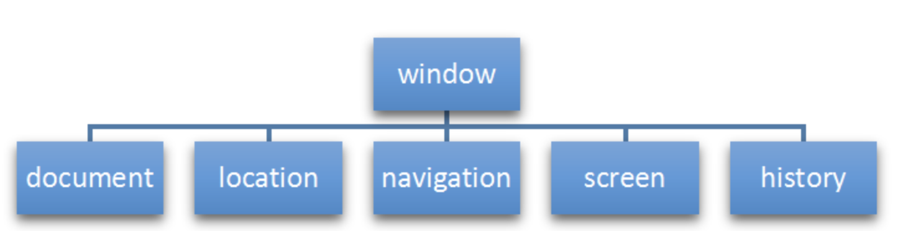
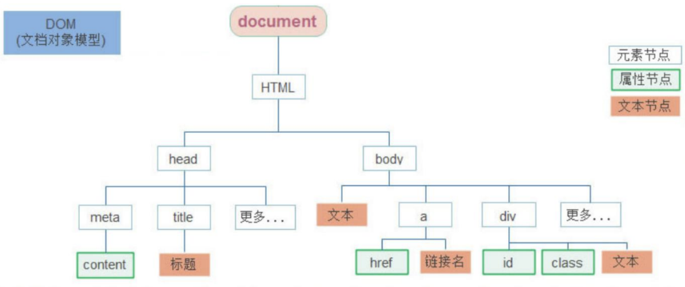

# JavaScript

| JS                 | 说明                                                         |
| ------------------ | ------------------------------------------------------------ |
| 解释型的脚本语言   | 不会产生编译出来的字节码文件，而是在程序的运行过程中对源文件逐行进行解释。 |
| 基于对象           | 基于对象的脚本语，能够实现封装，可以模拟继承，不支持多态。   |
| 弱类型语言         | 变量的数据类型由所赋的值决定<br />有明确的数据类型，但声明一个变量后它可以接收任何类型的数据，并且会在程序执行过程中根据上下文自动转换类型。 |
| 事件驱动的脚本语言 | 不需要经过Web服务器就可以对用户的输入做出响应。              |
| 跨平台             | 不依赖于操作系统，仅需要浏览器的支持。                       |

> ECMAScript 规范

```html
<!--向页面添加JavaScript-->
<script src="/js/demo01.js"></script>
```

| 属性  | 脚本调用策略                                     |
| ----- | ------------------------------------------------ |
| async | 异步，js和html一同加载；但无法控制脚本的运行次序 |
| defer | 按上下顺序控制脚本的运行次序                     |

# JS语法

## 变量

- JavaScript区分大小写，并使用Unicode字符集。

| 变量  | 说明                                                         |
| :---- | :----------------------------------------------------------- |
| var   | 声明一个变量，可选初始化一个值。                             |
| let   | 声明一个块作用域的局部变量，可选初始化一个值。               |
| const | 声明一个块作用域的只读常量，不允许重新赋值 ，声明的时候必须赋值（初始化） |

- 如果访问一个未声明的变量会导致抛出一个引用错误（ReferenceError）异常。
- 只声明而没有初始化的变量值为：undefined。

| 变量     | 作用域                                                     |
| -------- | ---------------------------------------------------------- |
| 全局变量 | 在函数之外声明的变量，可被当前文档中的任何其他代码所访问。 |
| 局部变量 | 在函数内部声明的变量，只能在当前函数的内部访问。           |

- 函数内部，如果变量没有声明而直接赋值（var)，相当于对同名的全局变量操作。

```js
let number = 1;
(function (){
    number = 33;
})();
alert(number); //33 全局变量number被更改
```

### var 变量提升

| 变量           | 说明                                                         |
| -------------- | ------------------------------------------------------------ |
| var            | 提升变量到代码块的顶部，初始值为undefined ，直到变量的声明代码处，才被赋予应有的赋值。<br />一个函数中所有的var语句应尽可能地放在接近函数顶部的地方，避免变量提升。 |
| let<br />const | 提升变量到代码块的顶部但是不会被赋予初始值。<br />在变量声明之前引用这个变量，将抛出引用错误ReferenceError，直到变量的声明代码处，才被赋予初始值。 |

```javascript
console.log(x === undefined); // true
var x = 3;

console.log(y); // ReferenceError
let y = 3;
```

### 解构赋值

| 解构赋值目标             | 说明                                                         |
| ------------------------ | ------------------------------------------------------------ |
| 可迭代对象<br />（数组） | 等号左边的参数少于右边：右边多出的会被忽略。<br />等号左边的参数多于右边：左边多出的参数值为undifind。 |
| 对象属性                 | 只有名称相对应的参数会被赋值，不匹配的参数值为undifind。     |

```javascript
//x,y分别被赋值1,2
let [x,y] = [1,2]
```

## 基本数据类型

| 类型      | 名称   | 说明                                                         |
| :-------- | :----- | :----------------------------------------------------------- |
| number    | 数值型 | Infinity 无穷<br>NaN 非数值                                  |
| string    | 字符串 | JavaScript不区分字符、字符串；<br>单引号、双引号作用相同。   |
| boolean   | 布尔型 | true：非零的数值，非空字符串，非空对象<br>false：零 NaN，空字符串，null，undefined |
| null      | 空     | number: 0 <br>boolean：false<br>typeof()返回object类型       |
| undefined | 未定义 | 变量未初始化时的默认为undefined                              |

```js
//返回变量数据类型
typeof(变量)
```

<table>
    <tr>
        <th>自动转换</th>
        <th>值</th>
        <th>boolean</th>
        <th>String</th>
        <th>number</th>
    </tr>
    <tr>
        <td rowspan="4">number</td>
        <td>0</td>
        <td rowspan="2">false</td>
        <td>"0"</td>
        <td rowspan="4"></td>
    </tr>
    <tr>
        <td>NaN</td>
        <td>"NaN"</td>
    </tr>
    <tr>
        <td>Infinity</td>
        <td rowspan="2">true</td>
        <td>"Inifinity"</td>
    </tr>
    <tr>
        <td>123</td>
        <td>"123"</td>
    </tr>
    <tr>
        <td rowspan="3">String</td>
        <td>"" 空字符串</td>
        <td>false</td>
        <td rowspan="3"></td>
        <td>0</td>
    </tr>
    <tr>
        <td>"abc" 非数值</td>
        <td rowspan="2">true</td>
        <td>NaN</td>
    </tr>
    <tr>
        <td>"123" 数值</td>
        <td>123</td>
    </tr>
    <tr>
        <td>null</td>
        <td></td>
        <td>false</td>
        <td>"null"</td>
        <td>NaN</td>
    </tr>
    <tr>
        <td>undefined</td>
        <td></td>
        <td>false</td>
        <td>"undefined"</td>
        <td>0</td>
    </tr>
</table>
<table>
    <tr>
        <th>强转转换目标</th>
        <th>方法</th>
    </tr>
    <tr>
        <td rowspan="2">String</td>
        <td>String()</td>
    </tr>
    <tr>
        <td>toString()</td>
    </tr>
    <tr>
        <td rowspan="2">number</td>
        <td>Number()</td>
    </tr>
    <tr>
        <td>parseInt()、parseFloat()</td>
    </tr>
    <tr>
        <td>boolean</td>
        <td>Boolean()</td>
    </tr>
</table>

```js
//string 按照字符串的字面值，转为数字；不是数字则转为NaN
var number = +"123"; //+转为数字
parseInt(str);

//boolean  true转为1，false转为0
var number = +true;
```

## 运算符、操作符 

| 运算符 | 含义       | 说明                             | 示例              |
| :----- | :--------- | -------------------------------- | ----------------- |
| `==`   | 等于       | 只根据表面值判断，不考虑数据类型 | "17"==17 //true   |
| `!=`   | 不等于     | 只根据表面值判断，不考虑数据类型 | "17"!=17 //false  |
| `===`  | 绝对等于   | 根据表面值和数据类型考虑         | "17"===17 //false |
| `!==`  | 绝对不等于 | 根据表面值和数据类型考虑         | "17"!==17 //true  |

| 操作符      | 说明                                                         | 示例                                                         |
| ----------- | ------------------------------------------------------------ | ------------------------------------------------------------ |
| in          | 是否为对象的属性名                                           | `let person = {name:"tom"};`<br>`"name" in person;`//true    |
| instanceof  | 是否为对象类的实例                                           | `let d = new Date();`<br>`d instanceof Date;`//true          |
| eval() 函数 | 传入非字符串：返回该值<br>传入字符串：作为JavaScript代码解析 | 返回最后一句表达式/语句的值；没有值则undefined<br>eval()内使用const/let声明的变量只在eval内作用<br>eval()内使用var变量作用域和eval()所在相同 |
| `?:`        | 三元操作符                                                   |                                                              |
| `??`        | 先定义：如果左侧为null/undefined，则返回右侧的值             | `null ?? 1`//返回1                                           |
| typeof      | 显示类型<br>null --> object<br>符号--> symbol                | `typeof 123`//"number"                                       |
| delete      | 删除对象的某个属性。<br />删除的元素仍然占用内存空间。       | `delete person.name;`//删除person对象的name属性<br>`delete arr[0];`//删除arr数组的第1个元素 |

- delete不会改变数组的元素个数， 数组中删除的元素的位置会被设置为 undefined，并且它的位置不会被重新分配。

## 流程控制

### 条件语句

#### if..else

```javascript
//如果需要在条件表达式中使用赋值，通常在赋值语句前后额外添加一对括号
if ((x = y)) {
}
```

#### switch

```javascript
switch (expression) {
   case label_1:
      statements_1
      [break;]
   case label_2:
      statements_2
      [break;]
   default:
      statements_def
      [break;]
}
```

### 循环

#### for、for..in、for..of

```javascript
for ([initialExpression]; [condition]; [incrementExpression]){
  statement
}
```

| 循环     | 遍历的结果     | 方式                                                         |
| :------- | -------------- | ------------------------------------------------------------ |
| for...in | 数组元素的下标 | 循环一个指定的变量来循环一个对象所有可枚举的属性 。          |
| for...of | 元素的值       | 循环可迭代对象，对值的每一个独特属性调用一次迭代。<br />Map类型：for..of每次循环输出一个数组`[key,value]`。 |

- 数组迭代是实时的，如果在迭代中修改数组中下一个元素的值，则迭代出的下个元素的值是修改后的。

```javascript
let arr = [3, 5, 7];
arr.foo = "hello"; 
//这里的foo严格意义上来说是数组的属性，而不是数组中的元素
//所以for..of不会输出foo属性对应的值，而是输出数组中的元素

for (let i in arr) {
    console.log(i); // 输出 "0", "1", "2", "foo"
}

for (let i of arr) {
    console.log(i); // 输出 "3", "5", "7"
    //注意 for...of 的输出没有出现 "hello"
}
```

#### while、do..while

- do..while：statement在检查条件之前会执行一次。

```javascript
do{
    statement
}while (condition);
```

```javascript
while (condition){
    statement
}
```

#### continue、break

| 关键字   | 说明                                                         |
| -------- | ------------------------------------------------------------ |
| continue | 不带label：终止当前 `while`、`do-while`、for这次的循环并且继续执行下一次循环。<br />带label：应用被 label 标识的循环语句。 |
| break    | 不带label：立即终止当前所在的 `while`、`do-while`、`for`、 `switch` 并把控制权交回这些结构后面的语句。<br />带label：终止指定的带标记（label）的语句。 |

```javascript
var num = 0;
outPoint:
for (var i = 0 ; i < 10 ; i++){
  for (var j = 0 ; j < 10 ; j++){
    if( i == 5 && j == 5 ){
      break outPoint; // 在 i = 5，j = 5 时，跳出所有循环，
                      // 返回到整个 outPoint 下方，继续执行
    }
    num++;
  }
}

alert(num); // 输出 55
```

## 异常处理

### throw

```javascript
throw new UserException("Value too high");
```

### try-catch-finally

```javascript
openMyFile();
try {
    writeMyFile(theData); //This may throw a error
}catch(e){
    handleError(e); // If we got a error we handle it
    console.log(e.name);
    console.log(e.message);
}finally {
    closeMyFile(); // always close the resource
}
```

### Error对象

| Error属性 | 说明                                               |
| :-------- | :------------------------------------------------- |
| name      | 提供了常规的错误类（如 'DOMException' 或 'Error'） |
| message   | 通常提供了一条从错误对象转换成字符串的简明信息。   |

```javascript
throw (new Error('The message'));
```

## 函数

- 定义函数：形参不需要数据类型，返回值也不需要定义类型，如果需要返回值，直接return相应的数据即可。

```javascript
function 函数名(参数1, 参数2,...) {
    ...语句;
  return 返回值;
}

var 变量 =  function (参数列表) {
   //执行语句
}
```

- 函数提升：只有函数声明会被提升到顶部，而函数表达式不会被提升。

```javascript
/* 函数声明 */

foo(); // "bar"

function foo() {
  console.log("bar");
}


/* 函数表达式 */

baz(); // 类型错误：baz 不是一个函数

var baz = function() {
  console.log("bar2");
};
```

| 调用函数         | 函数调用可以传递任意个数的参数（没有参数`~`超过列表的参数）。 |
| ---------------- | ------------------------------------------------------------ |
| 参数少于参数列表 | 其没有接收到传递值的参数会转为undifined。                    |
| 参数超过参数列表 | 多余的参数被传递，但不接收。                                 |

```javascript
//绑定函数变量
var 变量 = 函数名(参数列表);
//事件绑定
事件名 = "函数名()"
//直接调用
函数名(参数列表);
```

```javascript
var add = function (a,b){
    return a + b;
}

alert(add);  //返回函数体
alert(add(1,2,3)); //3 多余的参数不接收
alert(add(1)); //NaN
```

### 匿名函数

- 声明一个函数，相当于创建了一个函数对象，将这个对象的引用赋值给变量。

```javascript
var 变量 = function(参数1, 参数2) {
    ...语句;
  return 返回值;
};
```

### 立即函数

- 立即函数：立刻调用执行。

```js
(function (a, b) {
    console.log(a + b);
})(1, 2);
```

## 对象

### 自定义对象

- 自定义对象：属性/方法会被之后的同名属性/方法覆盖。

```javascript
//new构造对象
obj = new Object();

//声明对象
let person = {
    name: "Tom",
    age: 18,
    eat: function () {
        alert("eat food");
    },
    show : function () {
        alert(`hello ${this.age}岁的${this.name} !`);
    }
}

//动态添加属性
person.sex = "man";
person["father"] = "Mac";
//动态添加方法
person.say = function (word){
    console.log(`${word}`);
}

let students = [
    //匿名对象
    {name:'小明',age:"18",gender:"男",hometown:"河北省"},
    {name:'小红',age:"19",gender:"女",hometown:"福建省"},
    {name:'小刚',age:"17",gender:"男",hometown:"山东省"}
]
```

 ```javascript
//属性/方法访问
person.name;
person["name"];
 ```

```javascript
//?. 条件访问/调用

//当属性（右侧）为null或undefined时，不访问该属性，直接返回undefined
person?.name;
person?.[name];
//当调用者（左侧）为null或undefined时，不调用该函数，直接返回undefined
person?.(eat("apple"));
```

| this位置   | 指向                         |
| ---------- | ---------------------------- |
| 在函数外面 | window对象（当前浏览器窗口） |
| 在函数里面 | 调用函数的对象               |

### 系统对象

| 对象   | 说明         |
| :----- | :----------- |
| Date   | 日期时间处理 |
| Array  | 数组处理     |
| String | 字符串处理   |
| Math   | 数学处理     |
| Number | number       |

#### Array 数组

- Array数组是变长变类型的，下标从0开始。

> 数组的长度不固定。
> 数组存放的各元素的数据类型可以不一样。

```javascript
var 数组名 = new Array(元素列表);
var 数组名 = [元素列表];
```

| 方法                       | 说明                                             |
| :------------------------- | :----------------------------------------------- |
| push(value)                | 向数组中压入value值                              |
| splice(index,count,item..) | 删除元素并返回被删除元素。                       |
| reverse()                  | 数组元素反序                                     |
| join("分隔符")             | 数组元素拼接成字符串，每个元素之间以分隔符连接   |
| split("分隔符")            | 以分隔符将字符串拆分为数组                       |
| pop()                      | 弹出（删除）数组中的最后一个元素，同时返回该元素 |

```javascript
// 1.创建数组对象
var arr01 = new Array(1,2,3);
alert(arr01); //1,2,3

var arr = ["cat","dog","tiger"];
alert(arr); //cat,dog,tiger
alert(arr[0]); //cat

//数组的长度不固定
alert(arr.length); //3

//数组存放的各元素的数据类型可以不一样。
alert(arr[10] = "ten"); //ten
alert(arr.length); //11
alert(arr[9]); //undefined
```

#### String 字符串

```javascript
var 变量 = new String(""); 
var 变量 = ""
```

| 方法      | 说明                                             |
| :-------- | :----------------------------------------------- |
| charAt()  | 返回指定位置的字符，超过字符串长度的返回空格     |
| indexOf() | 检索字符串，返回第一个找到的下标，找不到则返回-1 |
| trim()    | 去除字符串前后两端的空白字符                     |

- 模板字符串：字符串使用反引号\`\`， \$\{\}内为引用的变量。

```js
let name = "Tom";
let str = `hello ${name}`; //hello Tom
```

#### RegExp 正则表达式 

```javascript
//正则表达式对象
var reg = /正则/
var reg = new RegExp("正则")
```

| RegExp | 说明               |
| ------ | ------------------ |
| test() | 判断是否匹配模式。 |

```javascript
/^\d{6,12}$/.test(passwdInput.value)
```

# 事件绑定

| 事件绑定方式                                      | 说明                         |
| ------------------------------------------------- | ---------------------------- |
| `<标签 事件="函数()">`                            | HTML标签中的事件属性进行绑定 |
| `document.getElementById("id属性").事件 = 函数()` | DOM的Element属性进行绑定     |

```javascript
document.getElementById("H1").onclick = function (){
    alert("点击成功");
}
```


# BOM 浏览器对象模型

- BOM（浏览器对象模型，Browser Object Model）：JavaScript将浏览器的各个组成部分封装为对象。

   

| 对象      | 说明           |
| :-------- | :------------- |
| Window    | 浏览器窗口对象 |
| History   | 历史记录对象   |
| Location  | 地址栏对象     |
| Navigator | 浏览器对象     |
| Screen    | 屏幕对象       |

## window 浏览器窗口对象

- 直接使用window对象，`window.`可以省略

| 常用属性  | 说明                            |
| :-------- | :------------------------------ |
| history   | 对 History 对象的只读引用。     |
| Navigator | 对 Navigator 对象的只读引用。   |
| Screen    | 对 Screen 对象的只读引用。      |
| location  | 用于窗口/框架的 Location 对象。 |

| 方法      | 说明                                                        |
| :-------- | :---------------------------------------------------------- |
| alert()   | 显示带有一段消息和一个确认按钮的警告框。                    |
| confirm() | 显示带有一段消息以及确认按钮和取消按钮的对话框。返回boolean |

### 定时器

| window方法    | 作用     | 清除定时的方法  |
| ------------- | -------- | --------------- |
| setTimeout()  | 超时调用 | clearTimeout()  |
| setInterval() | 周期循环 | clearInterval() |

```js
window.alert("Hello"); //window可以省略

//confirm 返回boolean，确定：true 取消：false。
if(confirm("是否确认删除"))
    alert("删除成功");
else
    alert("已取消");

//setTimeout(函数,毫秒) 执行一次
setTimeout(function (){
    alert("setTimeout 执行")
},1000);
var count = 0;

//setInterval(函数,毫秒) 循环执行
setInterval(function (){
    alert("setInterval 执行" + ++count);
},1000);
```


# DOM 文档对象模型

- DOM定义了访问HTML和xml文档的标准：W3C（万维网联盟）标准。

| W3C DOM部分 | 说明                         |
| ----------- | ---------------------------- |
| 核心 DOM    | 针对任何结构化文档的标准模型 |
| XML DOM     | 针对xml文档的标准模型        |
| HTML DOM    | 找到HTML文档的标准模型       |

 

| 核心DOM对象 | 节点 | 组成部分         |
| ----------- | ---- | ---------------- |
| Document    | 文档 | 整个文档         |
| Element     | 元素 | HTML标签         |
| Text        | 文本 | HTML标签内的文本 |
| Attr        | 属性 | HTML标签内的属性 |
| Comment     | 注释 | 注释             |

## Core DOM

| 访问节点Element                 | 说明                                     |
| :------------------------------ | :--------------------------------------- |
| getElementById("id")            | 根据id属性值获取，返回一个Element对象    |
| getElementsByName("name")       | 根据name属性值获取，返回Element对象数组  |
| getElementsByTagName("h1")      | 返回带有指定标签名的对象的集合           |
| getElementsByClassName("class") | 根据class属性值获取，返回Element对象数组 |
| querySelector("css选择器")      | 根据CSS选择器获取，返回第一个Element对象 |
| querySelectorAll("css选择器")   | 根据CSS选择器获取，返回Element对象集合   |

| 属性       | 说明                                                         |
| :--------- | :----------------------------------------------------------- |
| parentNode | 该节点的父节点                                               |
| firstChild | 首个子节点；如果没有，文本和属性节点返回空数组，而元素节点返回null |
| lasstChild | 最后一个字节点                                               |

| 操作节点属性值         | 说明       |
| :--------------------- | :--------- |
| getAttribute("属性名") | 获取属性值 |
| setAttribute("属性名") | 设置属性值 |

| 创建和增加属性                | 说明                                                         |
| :---------------------------- | :----------------------------------------------------------- |
| createElement(tagName)        | 按照给定的标签名创建一个新的元素节点                         |
| appendChild(nodeName)         | 向已存在节点列表的末尾添加新的节点                           |
| insertBefore(newNode,oldNode) | 向指定的节点之前插入一个新的节点                             |
| cloneNode(boolean)            | 复制某个指定的节点（true复制该节点及其字节点，false只复制当前节点） |

| 删除和替换节点                | 说明                       |
| :---------------------------- | :------------------------- |
| removeChild(node)             | 删除指定的节点             |
| replaceChild(newNode,oldNode) | 用其他的节点替换指定的节点 |

## HTML DOM
