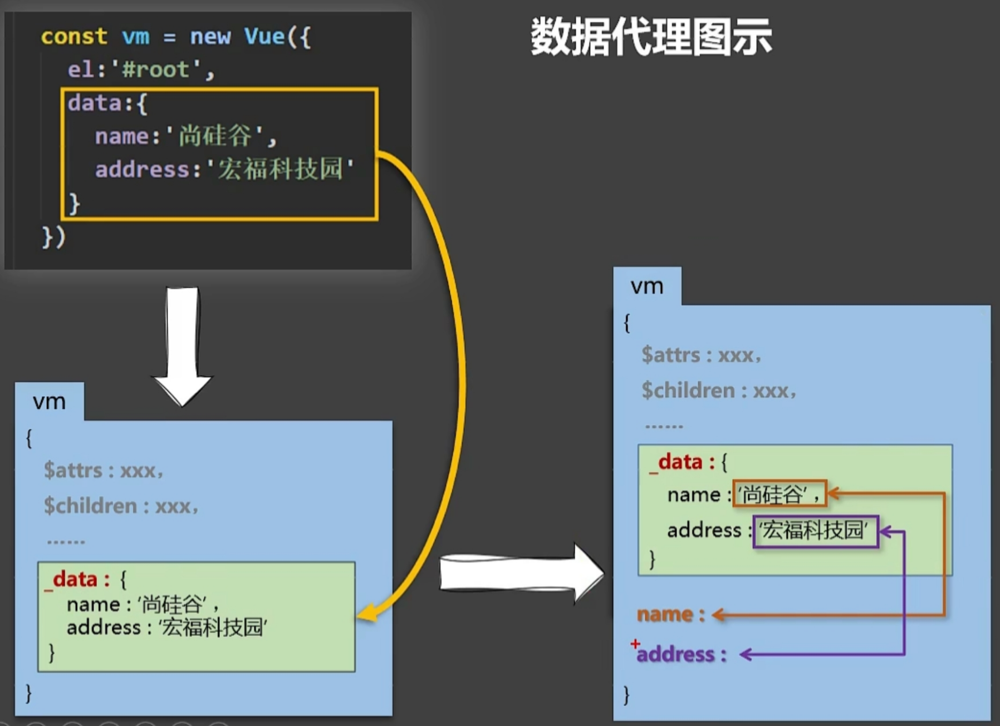
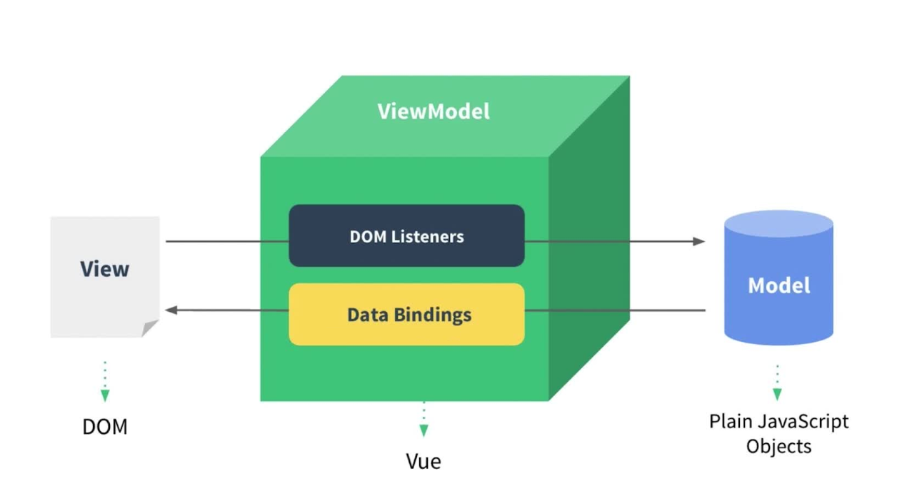
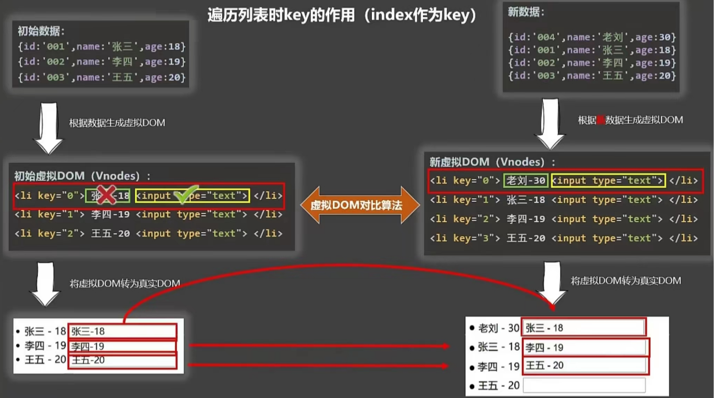
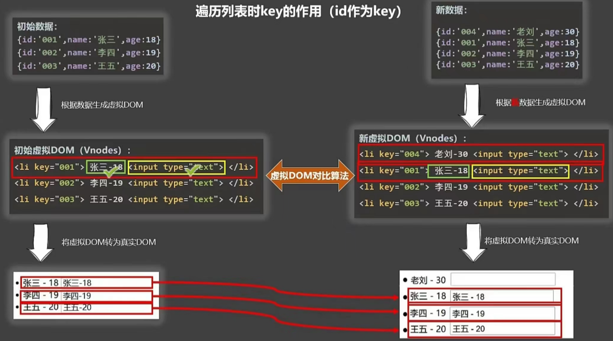

# Vue入门

## 项目结构

<table>
    <tr>
        <td width="200px">node_modules</td>
        <td colspan="2">vue项目的依赖库</td>
    </tr>
    <tr>
        <td width="200px">public</td>
        <td colspan="2">存放favicon.ico（页面图标）、其余不支持js的文件</td>
    </tr>
    <tr>
        <td rowspan="6">src</td>
        <td>assets</td>
        <td>资源目录，会被webpack构建</td>
    </tr>
    <tr>
        <td>components</td>
        <td>Vue组件目录</td>
    </tr>
    <tr>
        <td>router</td>
        <td>路由配置</td>
    </tr>
    <tr>
        <td>views</td>
        <td>页面目录</td>
    </tr>
    <tr>
        <td>App.vue</td>
        <td>根组件，所有页面都是在该组件下进行切换的</td>
    </tr>
    <tr>
        <td>main.js</td>
        <td>项目的入口文件，初始化Vue实例，并引入所需要的插件</td>
    </tr>
    <tr>
        <td>static</td>
        <td colspan="2">静态资源，不会被webpack构建，html、css、js、图片等</td>
    </tr>
    <tr>
        <td>build</td>
        <td colspan="2">构建脚本目录</td>
    </tr>
    <tr>
        <td>jsconfig.json</td>
        <td colspan="2"></td>
    </tr>
    <tr>
        <td>package.json</td>
        <td colspan="2">项目的依赖配置</td>
    </tr>
    <tr>
        <td>package-lock.json</td>
        <td colspan="2">记录更加详细的依赖库版本和库与库之间的关系</td>
    </tr>
    <tr>
        <td>Vue.config.js</td>
        <td colspan="2">Vue的配置文件</td>
    </tr>
    <tr>
        <td>babel.config.js</td>
        <td colspan="2">babel转码器的配置文件</td>
    </tr>
</table>


## Vue实例

| 容器与Vue实例的对应关系 | 情况                                                     |
| ----------------------- | -------------------------------------------------------- |
| 一个容器对一个Vue实例   | 正常使用，通常配合组件使用                               |
| 多个容器对一个Vue实例   | 排在前面的容器获得数据（data），而后面的容器不能获得数据 |
| 一个容器对多个Vue实例   | 不允许，一个容器只能被一个Vue实例接管                    |

```js
new Vue({
    el: '#login', 
    data: { // 1.对象式
        name: '李四'                  
    }
});

const v = new Vue({
    // el: '#login', 
    data(){ // 2.函数式，搭配组件时使用
        return{
            name:'李四'
        }
    }
});

// el 绑定的另一种方式
v.$mount('#login');
```

```html
<!DOCTYPE html>
<html lang="en">
    <head>
        <meta charset="UTF-8">
        <title>登录</title>
        <script type="application/javascript" th:src="@{/js/vue.js}"></script>
    </head>
    <body>
        
        <div id="login">
            <!-- {{field}} 插值语法（js表达式）
				1. a
				2. a + b
				3. sum(a, b)
				4. x === y ? 'a' : 'b'
			-->
            <!-- 指令语法
				v-bind: 绑定，可简写为 :
			-->
            <a v-bind:href="stu.url">你好，{{stu.name}}</a>
            <p>你好，{{name}}</p>
        </div>

        <script type="application/javascript">
            Vue.config.productionTip = false; // 阻止Vue在启动时生成生产提示

            //创建Vue实例 <Root>
            const v = new Vue({
                el: '#login', // el指定当前Vue服务的容器，可以通过css选择器来绑定
                data: { // 存储数据，一旦data内的数据改变，模板中的内容也更新
                    name: '李四'
                    stu: {
	                    name: '张三',
    	                url = 'http://localhost/home'                        
                    }
                }
            });
        </script>
    </body>
</html>
```

## Vue2与Vue3的核心区别

### Object.defineProperty()

```js
let person = {
    name: '张三',
    age: 18,
    address: '北京'
}

let sex = '男'

Object.defineProperty(person, 'sex', {
    // value: '男',
    // enumerable: true, // 默认是false，不被枚举
    // writable:true, // 默认是false，不可写（修改）
    // configurable: true, // 默认是false，不可配置（是否可以删除属性）

    // 数据代理
    get(){ // getter sex属性读取后，会触发get方法，返回sex变量
        return sex;
    },
    set(newVal){ // setter，sex属性修改后，会触发set方法，将newVal赋值给sex变量
        sex = newVal;
    }
})
```

 

# 模板语法

- Vue模板语法：

1. 插值语法 `{{field}}`：标签体；解析标签体内容，field为js表达式，且可以直接读取data内的所有属性
2. 指令语法 `v-bind:`等：标签属性；解析标签，包括标签属性、标签体内容、绑定事件等，js表达式的使用同插值语法

## 属性绑定

### 单向绑定 v-bind: 

### MVVM模型 v-model:

- 基于MVVM思想，实现数据的双向绑定

 

## 事件处理 v-on: @

```html
<div id="login">
<input type="submit" value="登录" v-on:click.stop.prevent="showMessage($event,$account)"/></td> 
<!--事件绑定可简写-->
<button @click="account++"></button>
</div>

<script type="application/javascript">
    Vue.config.productionTip = false; // 阻止Vue在启动时生成生产提示

    const vm = new Vue({
        el: '#login',
        data: {
            account: '1054'
        },
        methods: {
            showMessage(event, account) {
                alert('正在登录...');
            }
        }
    });
</script>
```

| 事件修饰符 | 说明                                                         |
| ---------- | ------------------------------------------------------------ |
| prevent    | 阻止默认事件                                                 |
| stop       | 阻止事件冒泡（在引起冒泡的标签处添加）                       |
| once       | 事件只触发一次                                               |
| capture    | 事件的捕获模式                                               |
| self       | 只有event.target是当前操作的元素时，才触发事件（在需要阻止冒泡的标签处添加） |
| passive    | 事件的默认行为立即执行，无需等待事件回调执行完毕             |

- 对于按键事件（keyup、keydown）Vue提供如下方案：

1. 按键别名：enter、delete、esc、space、tab（keydown）、up、down、left、right
2. 原始的key值绑定
3. 系统修饰符：ctrl、alt、shift、meta。（1）keyup：按下修饰键的同时再按下其他键（keyup.ctrl.y），释放其他键后触发；（2）keydown：正常触发。
4. 可以通过e.target.value获取对应的e.keyCode（不建议，即将移除）
5. 定制按键别名：Vue.config.keyCodes.自定义键名 = 键码

## 绑定样式 v-bind:

### 绑定class样式 :class

- :class：动态指定样式的类名（class）

```html
<!--字符串写法-->
<div class="basic" :class="tipsMessage" @click="showTips()"></div>
<!--相当于 class="basic tipsMessage"-->

<!--字符串数组写法-->
<div class="basic" :class="tipArr" @click="showTips()"></div>

<!--对象写法-->
<div class="basic" :class="tipObj" @click="showTips()"></div>

<script>
    const vm = new Vue({
        el: '#formContainer',
        data:{
            tipsMessage: 'tipsMessageHidden',
            tipArr: ['hidden','show','other'],
            tipObj: {
                hidden: false, //不使用hidden类名
                show:true, //使用show类名
                other:false
            }
        },
        methods:{
            showTips(){
                this.tipsMessage = 'tipsMessageShow';
            }
        }
    });
</script>
```

### 绑定style样式 :style

```html
<!--样式对象写法-->
<div id="test" class="basic" :style="styleObj"></div>

<!--对象数组写法-->
<div id="test" class="basic" :style="styleArr"></div>

<script>
    const vm = new Vue({
        el: '#test',
        data:{
            styleObj:{
                fontSize:'40px',
                color:'red',
                backgroudColor:'orange'
            },
            styleArr:[
                {
                    fontSize:'40px',
                    color:'red'
                },
                {
                    backgroudColor:'orange'
                }
            ]
        }
    });
</script>
```

## 条件渲染

### v-show=

- `v-show="boolean值"`：ture表示可视；false则不可视，实质上是`display:none`

```html
<p v-show="false">
    Hello
</p>
```

### v-if=、v-else-if=、v-else

- `v-if="boolean值"`：true表示该部分结构可用；false则不生成该部分结构，相当于从html文档中暂时删除

- `v-if=、v-else-if=、v-else`，若一起使用，则它们所在的标签必须是紧密相邻的，否则报错

```html
<div v-if="n === 1">n=1</div>
<div v-else-if="n === 2">n=2</div>
<div v-else>n=other</div>
```

### \<template>\</template\>

- \<template>\</template\>可以搭配`v-if=`使用，避免对css渲染的干扰；但不能和`v-show=`一起使用

## 列表渲染

### v-for=

- `v-for=`：遍历可遍历对象（数组、对象、字符串、指定次数等）

```html
<div id='test'>
    <ol>
        <li v-for="n in news" :key="n.id"></li>
        <!-- <li v-for="(n, i) in news" :key="i"></li> i为数组的下标-->
    </ol>
</div>

<script>
    const vm = new Vue({
        el: '#test',
        data:{
            news:[
                {id:'N1001',author:'作者',context:'内容',date:'日期'},
                {id:'N1002',author:'作者',context:'内容',date:'日期'}
            ]
        }
    });
</script>
```

### :key

- `:key`：虚拟DOM（Vnodes）的标识，而不会显示到html文档（真实DOM）；数据发生变化时，Vue根据新数据生成新的虚拟DOM并与旧的虚拟DOM对比（基于key）

1. 旧的虚拟DOM中找到与新的虚拟DOM相同的key；若虚拟DOM中的内容没变，则直接使用之前的真实DOM；若改变，则创建新的真实DOM，并替换原先的真实DOM
2. 旧的虚拟DOM中找不到与新的虚拟DOM相同的key，则创建新的真实DOM，随后渲染到页面

 

  

### 列表过滤与排序

- watch
- computer

```html
<div id="test">
    <input type="text" placeholder="过滤条件" v-model="keyWord"/>
    <button @click="sortType=0">原顺序</button>
    <button @click="sortType=-1">降序</button>
    <button @click="sortType=1">升序</button>
    <ol>
        <li v-for="p in filPersons" :key="p.id">{{ p.name }} - {{ p.age }}</li>
    </ol>
</div>

<script>
    const vue = new Vue({
        el: '#test',
        data: {
            keyWord: '', // 过滤条件
            persons: [
                {id: '1001', name: '张三', age: 18},
                {id: '1002', name: '李四', age: 22},
                {id: '1003', name: '王五', age: 20}
            ],
            sortType: 0 //0原顺序，-1降序，1升序
        },
        computed: {
            filPersons() {
                const tmpArr = this.persons.filter((p) => {
                    //执行过滤操作
                    return p;
                });

                if (this.sortType !== 0) {
                    tmpArr.sort((o1, o2) => {
                        return this.sortType === 1 ? o2.age - o1.age : o1.age - o2.age;
                    });
                }
                return tmpArr;
            }
        }
    });
</script>
```

# Vue属性

## 计算属性 computed

```js
new Vue({
    el: '#login',
    data: {
        firstName: '张',
        lastName: '三'
    },
    computed: {
        fullName: {
            get() { //get()调用时机：（1）初次读取该属性时；（2）所依赖的数据发生变化时
                return this.firstName + ' ' + this.lastName;
            },
            set(newVal) { // 若要修改数据则需要setter，通常不修改计算属性
                //通过setter改变firstName和lastName，而firstName和lastName改变触发getter
                let names = newVal.split(' ');
                if (names.length === 2) {
                    this.firstName = names[0];
                    this.lastName = names[1];
                }
            }
        },
        // 可简写（不需要setter时）
        //fullName() {
        //    return this.firstName + ' ' + this.lastName;
        //}
    }
});
```

## 监视属性（侦听属性） watch

```js
const vm = new Vue({
    el: '#login',
    data: {
        account: '',
    },
    watch: { //监视（普通属性和计算属性）
        account:{
            immutable:true, //初始化时调用一次handler
            // 绑定的属性的值改变时调用handler
            handler(newVal,oldVal){
                console.log(oldVal + '被修改为' + newVal);
            }
        }
    }
    
    // 简写 1. 
    // watch: { //监视（普通属性和计算属性）
    //     account(newVal,oldVal){
    //         console.log(oldVal + '被修改为' + newVal);
    //     }
    // }
});

// 简写 2.
vm.$watch('account', {
    immutable:true,
    handler(newVal,oldVal){
        console.log(oldVal + '被修改为' + newVal);
    },
})

// 简写 3.
vm.$watch('account',function(newVal,oldVal){
    console.log(oldVal + '被修改为' + newVal);
})
```

### 深度监视

```js
const vm = new Vue({
    el: '#login',
    data: {
        numbers: {
            a: 1,
            b: 2
        }
    },
    // watch: {
    //     'numbers.a':{ //监测多级结构中某个具体属性的变化，需要使用正确的写法（字符串）
    //         immutable:true,
    //         handler(newVal,oldVal){
    //             console.log(oldVal + '被修改为' + newVal);
    //         }
    //     }
    // }
    watch: {
        numbers: {
            deep: true, // 开启深度监测，监测多级结构中每个属性的变化，默认false
            handler(newVal, oldVal) { // 此处的newVal和oldVal都是numbers，而非numbers.a和numbers.b
                console.log(newVal, oldVal);
            }
        }
    }
});
```

### watch与computed

- watch可以完成异步操作，而computed不行。

## 普通函数与箭头函数的采用

1. 所有被Vue管理的函数，应该写成普通函数，此时，this指向Vue的实例。
2. 所有不被Vue管理的函数（定时器的回调函数等），应该写成箭头函数（即箭头函数的this从外层找），此时，this仍然指向Vue。定时器的回调函数的this原本应该是window，而箭头函数使得其从外层查找this，也就是Vue实例，所以该箭头函数内的this仍然指向Vue。

# 生命周期

- 生命周期的八个阶段：每触发一个生命周期事件，会自动执行一个生命周期方法

| 状态          | 阶段周期     |
| ------------- | ------------ |
| beforeCreate  | 创建前       |
| created       | 创建后       |
| beforeMount   | 载入前       |
| **mounted**   | **挂载完成** |
| beforeUpdate  | 更新前       |
| updated       | 更新后       |
| beforeDestory | 销毁前       |
| destoryed     | 销毁后       |

  

```html
<!DOCTYPE html>
<html lang="en">
<head>
    <meta charset="UTF-8">
    <title>Title</title>
</head>
<body>
<div id="app">

</div>


<script src="js/vue.js"></script>
<script>
    //1.创建Vue核心对象
    new Vue({
        el: "#app", //设置当前vue的作用范围
        mounted(){
            alert("加载完成")
        }
    })

</script>
</body>
</html>
```

