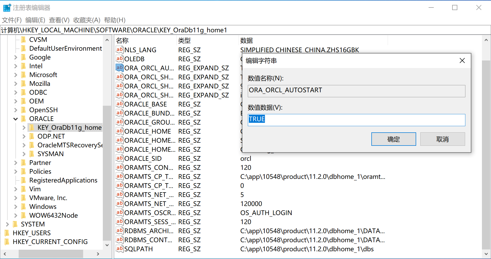
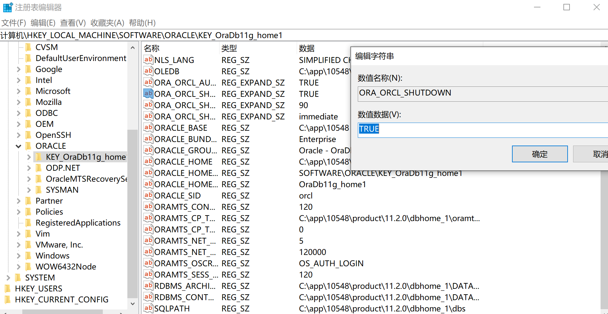
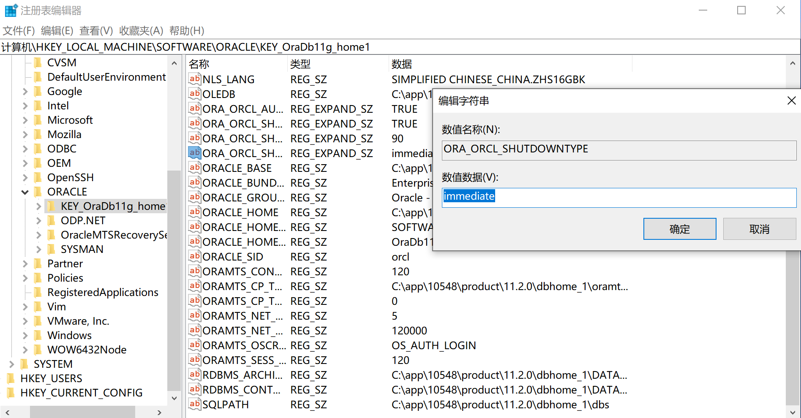

# 数据库管理

## 数据库启动/关闭

### 数据库启动

**Oracle数据库的启动经历三个阶段：**

1. 启动实例 (Start An Instance)
- 当启动一个实例时，Oracle会读取一个参数文件，这个文件可以是初始化参数文件（PFILE），也可以是服务器端参数文件(SPFILE)，通常，我们把两者都称为参数文件(Parameter File),
- Oracle根据参数文件(PFILE、SPFILE)中的参数，分配相应大小的一片内存区域叫系统全局区(SGA),然后启动一系列的后台进程（DBWR：数据库写入进程、LGWR：日志写入程序、CKPT：检查点进程、SMON：系统监控进程、PMON：进程监控进程、ARCH：归档进程等)。这些内存和进程合起来组成实例(Oracle Instance)。Oracle还依据参数文件(PFILE、SPFILE)进行其他一些设置（初始化参数）
   - **Oracle的内存和进程构成了实例**。一台机器上可以同时运行多个实例。每个实例都有自己的名字(SD)。实例是用来驱动数据库的，在RAC(Real Application Cluster,集群)环境中，多个实例可以同时驱动一个数据库。实例启动完成以后，数据库就处于**NOMOUNT状态**。在实例启动完成以后，数据库还没有和实例关联。这时候，数据库不可访问。这个阶段主要用于数据库的维护（如重建控制文件等）。
   - 参数文件(PFILE或者SPFILE)指定了控制文件(Control File)的位置。
2. 装载数据库 (Mount The Database)
- 在这个阶段中，Oracle根据参数文件(PFILE或者SPFILE)中的参数(CONTROL_FILES)找到控制文件(Control File)，然后打开控制文件。从控制文件中获得数据文件(Datafile)和重做日志文件(Redo Log File)的名字及位置。
- 这个时候，Oracle已经把实例(Instance)和数据库关联起来。对于普通用户来说，数据库还是不可访问。
- 处于MOUNT阶段的数据库，主要用于数据库的维护（如恢复数据库等）。
3. 打开数据库 (Open The Database)
- 当打开数据库的时候，Oracle打开数据文件(Datafiles)和重做日志文件(Redo Log File)。
- 这时候，数据库可以使用。普通用户可以登录数据库，并对数据库进行操作。

#### NOMOUNT 非装载状态（只启动实例）

1. 以SYSDBA的身份登录数据库

```
CONNECT sys/change_on_install AS SYSDBA;
```

2. 启动数据库到NOMOUNT状态

```
STARTUP NOMOUNT
```

```
SQL> STARTUP NOMOUNT
ORACLE 例程已经启动。

Total System Global Area 1720328192 bytes
Fixed Size                  2176448 bytes
Variable Size            1174407744 bytes
Database Buffers          536870912 bytes
Redo Buffers                6873088 bytes
```

#### MOUNT 装载状态（打开控制文件，读取数据文件和重做日志文件的名称和位置）

1. 以SYSDBA的身份登录数据库

```
CONNECT sys/change_on_install AS SYSDBA;
```

2. 启动数据库到MOUNT状态

```
STARTUP MOUNT
```

```
SQL> STARTUP MOUNT
ORACLE 例程已经启动。

Total System Global Area 1720328192 bytes
Fixed Size                  2176448 bytes
Variable Size            1174407744 bytes
Database Buffers          536870912 bytes
Redo Buffers                6873088 bytes
数据库装载完毕。
```

- 如果数据库处于NOMOUNT状态

```
ALTER DATABASE MOUNT;
```

#### OPEN 打开数据库

1. 以SYSDBA的身份登录数据库

```
CONNECT sys/change_on_install AS SYSDBA;
```

2. 启动数据库

```
STARTUP
```

```
SQL> STARTUP
ORACLE 例程已经启动。

Total System Global Area 1720328192 bytes
Fixed Size                  2176448 bytes
Variable Size            1174407744 bytes
Database Buffers          536870912 bytes
Redo Buffers                6873088 bytes
数据库装载完毕。
数据库已经打开。
```

- 如果数据库处于MOUNT状态

```
ALTER DATABASE OPEN;
```

- 如果数据库处于NOMOUNT状态

```
ALTER DATABASE MOUNT; 
ALTER DATABASE OPEN;
```

#### 重启数据库

1. 以SYSDBA的身份登录数据库

```
CONNECT sys/change_on_install AS SYSDBA;
```

2. 重启数据库

```
STARTUP FORCE;
```

- 会执行实例恢复的过程系统，正常运行的情况下，不推荐

#### 将数据库启动到只读模式

1. 以SYSDBA的身份登录数据库

```sql
CONNECT sys/change_on_install AS SYSDBA;
```

2. 以只读方式启动数据库

```sql
STARTUP OPEN READ ONLY;
```

3. V$DATABASE 检查数据库是否以只读方式打开

```sql
SELECT open_mode
FROM V$DATABASE;
```

#### Windows 自动启动/关闭

**1. 将Oracle的服务设置为自动启动**

 

**2. 编辑注册表**

1. 运行-->regedit命令
2. 进入HKEY_LOCAL_MACHINE\ORACLE\ORACLE_HOME_NAME
3. 将数据库设置成自动启动。 
    - 将参数ORA_SID_AUTOSTART设置为TRUE。ORA_SID_AUTOSTART=TRUE表示操作系统启动时，将自动启动Oracle数据库。
     
     
4. 把数据库设置成自动关闭。
    - 将参数ORA_SID_SHUTDOWN设置为TRUE。ORA_SID_SHUTDOWN=TRUE表示操作系统关闭时，将自动关闭Oracle数据库。
     
    - 将ORA_SID_SHUTDOWNTYPE设置成IMMEDIATE。ORA_SID_SHUTDOWNTYPE于设置数据库的关闭方式。
     

**3. 创建SPFILE(如果SPFILE不存在)**

**4. 重启Windows**

**5. 测试数据库是否能自动启动**

### 数据库关闭

#### 数据库关闭原理

**数据库启动要经历三个阶段，数据库关闭也要经历三个阶段。**

- 阶段一：关闭数据库(Close The Database);
   - 关闭数据库的时候，Oracle首先把SGA中的数据写到数据文件和重做日志文件中。
   - 然后，Oracle关闭所有的数据文件和重做日志文件。这时候，数据库已经不可访问。
   - 这个阶段完成以后，控制文件仍然处在打开状态。
- 阶段二：卸载数据库(Unmount The Database);
   - 数据库关闭完成以后，Oracle将分离数据库和实例之间的联系，这个阶段叫“卸载数据库”或者叫“UNMOUNT数据库”。
   - 这个阶段仅仅是卸载数据库，实例仍然存活在内存中。
- 阶段三：关闭实例(Shut Down The Instance)。
   - Oracle将从内存中移出SGA并终止正在运行的后台进程。
   - 至此，数据库关闭已经完成。

**数据库关闭有四种方式**：

- NORMAL
- IMMEDIATE
- TRANSACTIONAL
- ABORT

#### IMMEDIATE方式是数据库关闭使用频率最高的方式。

**以IMMEDIATE方式关闭数库时，会发生下面的事情：**

- 新的用户不能注册（登录）数据库。
- 未提交的事务将被回滚(Rolled Back)。
- Oracle不会等待所有的用户（连接）退出数据库。

**以IMMEDIATE方式关闭数据库具有以下特点：**

- 以IMMEDIATE方式关闭数据库不需要实例恢复(Instance Recovery)。
- `SHUTDOWN IMMEDIATE`是最安全的数据库关闭方式。
- 使用`SHUTDOWN IMMEDIATE`关闭数据库的过程比较慢。

**使用IMMEDIATE方式关闭数据库的过程说明如下。**

1. 以SYSDBA的身份登录数据库

```
CONNECT sys/change_on_install AS SYSDBA;
```

2. 以IMMEDIATE方式关闭数据库

```
SHUTDOWN IMMEDIATE;
```

#### ABORT方式是关闭数据库最快的方式。

**以ABORT方式关闭数据库时，会发生下面的事情：**

- 不允许启动新的连接(New Connections)和新的事务(New Transactions)。
- 客户端的SQL语句(Client SQL Statements)立刻中止。
- 未提交的事务不被回滚(RolIBack)。
- Oracle立刻中止所有连接（会话)。

**以ABORT方式关闭数据库具有以下特点：**

- 只有数据库出现问题的时候，才使用这种方式关闭数据库。
- 这是一种最不安全的关闭方式，数据库重启时需要实例恢复(Oracle后台进行)。
   - 不推荐使用这种方式关闭数据库。 

**以ABORT方式关闭数据库的过程说明如下。**

1. 以SYSDBA的身份登录数据库

```sql
CONNECT sys/change_on_install AS SYSDBA;
```

2. 以ABORT方式关闭数据库

```sql
SHUTDOWN ABORT;
```

#### NORMAL方式(默认)是关闭数据库最慢的方式

- 以NORMAL关闭数据库时，不需要实例恢复(Instance Recovery)。

**使用NORMAL方式关闭数据库时，有以下特点：**

- 允许新的用户注册（登录）数据库。
- 要等所有的用户自动退出Oracle以后，Oracle才关闭数据库。所以，如果数据库中存在一个用户，那么，Oracle就一直等待，直到该用户退出，Oracle才关闭数据库。
   - 如果使用NORMAL方式关闭数据库，也许有的数据库永远也不能关闭。 
   - `SHUTDOWN NORMAL`是最慢的一种数据库关闭方式。

**使用NORMAL方式关闭数据库的过程说明如下。**

1. 以SYSDBA的身份登录数据库

```sql
CONNECT sys/change_on_install AS SYSDBA;
```

2. 以NORMAL方式关闭数据库

```sql
SHUTDOWN NORMAL;
```

#### TRANSACTIONAL方式关闭数据库

**以TRANSACTIONAL方式关闭数据库时，会发生下面的事情：**

- 不允许新的用户注册（登录）数据库：
- 不允许建立新的事务(New Transactions):
- 所有的事务(Transactions)完成以后才关闭数据库；
- 一个用户（会话）执行完手里的事务(Transactions)后将被强行断开与数据库的联机。

**以这种方式关闭数据库有以下特点：**

- 这种关闭方式不会使客户端的数据丢失；
- 这种关闭方式不需要实例恢复(Instance Recovery);
- 使用SHUTDOWN TRANSACTIONAL命令关闭数据库的过程比较慢。

**使用TRANSACTIONAL方式关闭数据库的过程说明如下。**

1. 以SYSDBA的身份登录数据库

```
CONNECT sys/change_on_install AS SYSDBA;
```

2. 以TRANSACTIONAL方式关闭数据库

```
SHUTDOWN TRANSACTIONAL;
```

### 故障排除

**数据启动故障诊断由两个阶段组成：**

- 检查数据库
   - 警报日志文件(Alert Log)
   - 跟踪日志文件(Trace Log)）
- 检查操作系统
   - 操作系统的日志文件
   
#### 警报日志文件(Alert Log)

- 警报日志文件，用于记录数据库的重大活动和发生的错误
   - 特别注意的是，警报日志文件除了记录数据库中发生的错误外，还记录数据库中发生的重大事件。
- 警报日志文件按照时间的先后记录发生的事件。
- 警报日志文件的名字的格式是alertSID.log,其中，SID表示实例名(Instance)。
- 警报文件的位置由初始化参数BACKGROUND DUMP DEST指定。

**警报日志文件记录的内容如下：**

- 每次数据库启动(STARTUP)和关闭(SHUTDOWN)的详细信息。
- DBA执行的某些管理操作，如ALTER SYSTEM，ALTER DATABASE。
- 某些数据库错误，如Oracle的内部错误(ORA-600)，空间错误等。
- 共享服务器相关的信息和错误。
- 值是非默认值的初始化参数（Initialization Parameters)信息。
- 物化视图(Materialized View)自动刷新产生的错误。

#### 跟踪日志文件(Trace Log)

- 每个服务器进程和后台进程都写跟踪日志文件。
- 当一个后台进程检测到错误的时候，Oracle会把错误信息写到跟踪日志文件中。
- 跟踪信息被写到两个目录中，
    - 和后台进程(Background Processes)相关的信息被写到初始化参数DIAGNOSTIC_DEST指定目录 
    - 和服务器进程(Server Procee)相关的信息被写到初始化参数USER_DUMP_DEST指定的目录。
    
- 跟踪日志文件的名字在每种操作系统上会有所不同，但是，每个跟踪日志文件的名宇都包含进程的名字。
- 如果数据库长时间运行，跟踪日志文件会变得越来越大。手工清除跟踪日志文件，或限制跟踪日志文件的大小，
    - Oracle的初始化参数MAX_DUMP_FILE_SIZE用于限制跟踪日志文件的大小。
    - MAX_DUMP_FILE_SIZE的格式如下：`MAX_DUMP_FILE_SIZE = { 大小 [K | M] | UNLIMITED}`

#### 查看操作系统的日志文件

# 内存结构

## 内存体系结构

- Oracle数据库的进程结构主要包括用户进程、服务器进程、程序全局区、数据库实例

 

 

### User Process(用户进程)

- 管理Oracle客户端的用户登录。
- 当用户运行一个应用程序时，系统就为它建立一个用户进程。

### Server Process(服务器进程)

- 帮助Oracle客户端连接到服务端。
   - 服务器进程处理与之相连的用户进程的请求，它与用户进程相通信，为相连的用户进程的Oracle请求服务。

### PGA (Program Global Area,程序全局区)

**管理每次会话的SQL执行。** PGA是一块独占内存区域，Oracle进程以专有的方式用他来存放数据和控制信息，当Oracle进程启动时，PGA就有Oracle数据库创建。当用户进程连接到数据库并创建一个对应的会话时，Oracle服务进程会为这个用户专门设置一个PGA区，用来存储这个用户会话的相关内容。当这个用户会话终止时，系统终端释放这个PGA区所占用的内存。

**PGA由以下几个部分组成。**

- Private SQL Area:私有SQL区。
- Session Memory:会话记忆区。
- SQL Work Areas:SQL工作区。

| 部分   | 说明                                        |
| :----- | :----------------------------------------- |
| 排序区 | 主要关注，在必要时手动调整                    |
| 会话区 | -                                          |
| 堆栈区 | -                                          |
| 游标区 | 动态的区域，在游标打开时创建，游标关闭时释放。 |

#### 结构

##### 四个分区

###### 排序区

**存放排序操作产生的临时数据** 当用户对数据进行排序时，数据库将需要排序的数据保存到PGA程序缓冲区的一个排序区中，在这个排序区中对这些数据进行排序。如果排序的数据大小为M，则这个排序区必须至少有M的空间容纳这些数据，且在排序过程中还需要M的空间来保存排序后的数据。如果排序区空间不足，则会将部分数据使用硬盘来读写，排序的效率降低。

- 排序区的大小占据PGA的大部分空间，通过<mark>初始化参数SORT_AREA_SIZE</mark>调整大小。

###### 会话区

**保存会话具备的权限、角色、性能统计等。由数据库自我维护，会话结束时自动释放。** 当用户进程和数据库建立会话时，系统将这个用户的相关权限查询出来，然后保存在这个会话区。用户进程访问数据时，系统会核对会话区内的用户权限信息。

###### 堆栈区

**保存绑定变量、会话变量、SQL语句运行时的内存结构等信息。由数据库自我维护，会话结束时自动释放。**

###### 游标区

**动态的区域，在游标打开时创建，游标关闭时释放。** 当运行时使用CURSOR时，数据库在PGA中为其分配一块区域，关闭CURSOR时，释放该区域。在创建和释放时，会占用一定的系统资源，因此使用CURSOR执行效率较低，应尽量减少使用

- 可以通过限制游标的数量来提高数据库性能，初始化参数OPEN_CURSORS，控制用户可以同时打开的CURSOR数量。但是如果硬件能够支持，应该将这个参数设置宽松，避免用户频繁地打开关闭游标，对游标区频繁的创建释放，影响数据库性能。


##### Private SQL Area

- Private SQL Area 保存每个Session私有的信息，而Shared Pool中有一个Public SQL Areaa，保存SQL执行计划等共享信息。
- Sersion Process每执行一个SQL都需要申请一个Private SQL Area(Cursor)。Server Process在执行SQL语句之前，必须在Shared Pool中定位语句的Share SQL Area。在PGA中，也是如此。如果定位失败，服务器必须为其分配一个Private SQL Area，并初始化，这个过程消耗大量CPU资源。
- PGA中可以有多个Private SQL Area，Server Process也会使用重用算法，增大Private SQL Area的重用，一个大的PGA可以减少对Private SQL Area的置换，减少CPU开销。
  

**Private SQL Area分为Persistent Area和Run-Time Area.**

**Persistent Area**

- 存放绑定变量，数据类型转换等Cursor结构信息，Cursor关闭时，该区域释放。
- 当一个SQL语句执行后，Run-Time Area就被释放，而Private SQL Area可以被其他SQL语句重用，重用时必须初始化。

**Run-Time Area**

- 在SQL运行时使用，大小依赖于SQL语句操作方式，处理数据行数和每行记录大小。如果是DML语句，执行完就释放。如果是SELECT语句，在记录全部传给客户端或取消查询后才释放。

###### Private SQL Area寻找Cursor的过程

1. 是否存在某个OPEN CURSOR，是：执行，否：继续下一步。
2. 是否存在SESSION CACHED CURSOR，是：执行，否：继续下一步。
3. 是否存在HOLD CURSOR，是：执行，否：继续下一步。
4. OPEN CURSOR，继续下一步
5. 检索SQL AREA，继续下一步
6. 是否可重用判断，是：软解析，否：硬解析。

##### Work Area

- 对于复杂的查询，PGA的很大一部分被内存需要很大的操作分配给Work Area。
   - 基于排序的操作：ORDER BY、GROUP BY、ROLLUP、窗口函数，参数SORT_AREA_SIZE
   - Hash join，参数HASH_AREA_SIZE
   - Bitmap merge，参数BITMAP_MERGE_AREA_SIZE
   - Bitmap create，参数CREATE_BITMAP_AREA_SIZE
- 如果操作所处理的数据量大于Work Area的大小，则将输入的数据分为一些更小的数据片，使一些数据能够在内存中处理，而其他的则在临时表空间的磁盘上稍后处理。虽然不会将数据放在硬盘上处理，但是操作的复杂度和Work Area的大小成反比。大的Work Area，使一些特定的操作性能更佳，但同时也消耗更大的内存。

##### Session Memory

- Session Memory保存会话中的变量和其他与会话相关的信息。在共享服务器模式下，该Session Memory是共享的。

###### 会话信息查看

```sql
SELECT server "服务器模式"
      ,s.username "用户"
      ,osuser "操作系统用户"
      ,name "内存名称"
      ,ROUND(value/1024/1024,4) "占用内存MB"
      ,s.sid "会话ID"
      ,s.serial# "SESSION序列号"
      ,spid "操作系统进程ID"
FROM V$SESSION s
    ,V$SESSTAT st
    ,v$STATNAME sn
    ,v$PROCESS p
WHERE st.sid = s.sid
 AND st.statistic# = sn.statistic#
 AND sn.name LIKE 'session pga memory'
 AND p.addr = s.paddr
ORDER BY value DESC;
```

#### 设置

##### 自动PGA管理 PGA_AGGREGATE_TARGET

- 设值PGA_AGGREGATE_TARGET为非0值（为PGA开辟的总内存），则启用PGA自动管理，并忽略所有`*_AREA_SIZE`的设置。
- 默认为启用PGA的自动管理，Oracle根据SGA的20%来动态调整PGA中专用与Work Area部分的内存大小。

###### PGA_AGGREGATE_TARGET的设置

- PGA_AGGREGATE_TARGET设置为SGA的20%

```sql
ALTER SYSTEM SET PGA_AGGREGATE_TARGET=1200M SCOPE=BOTH;
```

**查看Oracle建议的PGA_AGGREGATE_TARGET的大小**

1. 查看所有会话的PGA占用情况

```sql
SELECT p.spid
      ,b.name
      ,s.program
      ,s.sid
      ,s.serial#
      ,s.osuser
      ,s.machine
FROM V$PROCESS p
    ,V$SESSION s
    ,V$BGPROCESS b
WHERE p.addr = s.paddr
 AND p.addr = b.paddr
UNION ALL
SELECT p.spid
      ,s.username
      ,s.program
      ,s.sid
      ,s.serial#
      ,s.osuser
      ,s.machine
FROM V$PROCESS p
    ,V$SESSION s
WHERE p.addr = s.paddr
 AND s.username IS NOT NULL;
```

2. 查看当前会话

```sql
SELECT s.username,s.sid,s.serial#
FROM V$LOCKED_OBJECT lo,DBA_OBJECTS ao,V$SESSION s
WHERE ao.object_id = lo.object_id
 AND lo.session_id = s.sid;
```

3. 查看某会话PGA占用情况

```sql
SELECT a.name, b.value 
FROM v$statname a, v$sesstat b 
WHERE a.statistic# = b.statistic# 
 AND b.sid = &sid 
 AND a.name like '%ga %' 
ORDER BY a.name;
```

**建议PGA大小**

```sql
select round(pga_target_for_estimate /(1024*1024)) "预测PGA_AGGREGATE_TARGET值M"
      ,estd_pga_cache_hit_percentage "Est.Cache Hit %"
      ,round(estd_extra_bytes_rw/(1024*1024)) "Est.ReadWrite(M)"
      ,estd_overalloc_count "Est.Over-Alloc" 
from v$pga_target_advice ;
```

- 或

```sql
SELECT 'PGA AGGREGATE Target' "条目"
      ,ROUND (pga_target_for_estimate / 1048576) "目标值(M)"
      ,estd_pga_cache_hit_percentage "相关缓存命中率"
      ,ROUND ( ( ( estd_extra_bytes_rw / DECODE ((b.BLOCKSIZE * i.avg_blocks_per_io),0,1, (b.BLOCKSIZE * i.avg_blocks_per_io)))* i.iotime)/100 ) "响应时间(秒)" 
FROM v$pga_target_advice
    ,(SELECT /*+AVG TIME TO DO AN IO TO TEMP TABLESPACE*/  
             AVG ( (readtim + writetim) / DECODE ((phyrds + phywrts), 0, 1, (phyrds + phywrts)) ) iotime
            ,AVG ( (phyblkrd + phyblkwrt)/ DECODE ((phyrds + phywrts), 0, 1, (phyrds + phywrts))) avg_blocks_per_io     
      FROM v$tempstat) i
    ,(SELECT /* temp ts block size */ VALUE BLOCKSIZE 
      FROM v$parameter 
      WHERE NAME = 'db_block_size') b;
```

##### 禁用自动PGA管理

**调整以下参数**

- BITMAP_MERGE_AREA_SIZE
- CREATE_BITMAP_AREA_SIZE
- HASH_AREA_SIZE
- SORT_AREA_SIZE

### UGA 用户全局区

- 在专用服务器模式下，进程和会话一对一，UGA被包含在PGA内。
- 在联机服务器模式下，进程和会话一对多，UGA不再属于PGA而是在Large Pool 中分配，当如果从Large Pool中分配失败，则使用Shared Pool分配。

### SID 数据库实例(Instance)

 

**数据库实例分为两个部分：SGA和Background Process(后台进程)。**

- 当在计算机服务器上启动Oracle数据库后，称服务器上启动了一个Oracle实例：
- Oracle实例是存取和控制数据库的软件机制，它包含系统全局区(SGA)和Oracle进程两部分：
    - SGA是系统为实例分配的一组共享内存缓冲区，用于存放数据库实例和控制信息，以实现对数据库中数据的治理和操作。

**进程**

- 一个进程执行一组操作，完成一个特定的任务
- 对Oracle数据库治理系统来说，<mark>进程由用户进程、服务器进程和后台进程</mark>所组成：
    - 当用户运行一个应用程序时，系统就为它建立一个用户进程。
    - 服务器进程处理与之相连的用户进程的请求，它与用户进程相通信，为相连的用户进程的Oace请求服务。
    - 为了提高系统性能，更好地实现多用户功能，Oracle还在系统后台启动一些后台进程用于数据库数据操作。

#### SGA(Systerm Global Area,系统全局区)

- SGA是Oracle为一个实例分配的一组共享内存缓冲区，它包含该实例的数据和控制信息：SGA在实例成功时被自动分配，当实例关闭时被收回。数据库的所有数据操作都要通过SGA来进行。

##### SGA操作

###### 查询SGA

```sql
SHOW SGA;
```

 

###### 调整SGA大小

```sql
ALTER SYSTEM
SET DB_CACHE_SIZE = 1500M SCOPE=BOTH;
```

- SCOPE参数：

| SCOPE参数     | 说明                        |
| :----------- | :------------------------- |
| SCOPE=BOTH   | 默认，内存和SPFILE都更改     |
| SCOPE=MEMORY | 仅仅更改内存，下次启动失效    |
| SCOPE=SPFILE | 仅仅更改SPFILE，下次启动生效 |

##### SGA构成

###### Shared Pool(共享池)

- 存放SQL语句、PL/SQL代码、数据字典、资源锁和其他控制信息。
- 由初始化参数SHARED_POOL_SIZE控制大小
- 它包含<mark>库缓冲区(Library Cache)、数据字典高速缓存区(Data Dictionary Cache)、结果高速缓存区(Result Cache)。</mark>

**Library Cache**

- 保存最近解析过的SQL语句、PL/SQL过程和包。Oracle在执行语句之前，先在Library Cache中搜索，如果存在已经解析的，则直接使用Library Cache中保存的解析结果和执行计划，而不必再次解析。
- 将每一条SQL语句分为可共享和不可共享。
  - 共享SQL区：存储最近执行的SQL语句、解析后的语法树、优化后的执行计划。Oracle在执行一条新语句时，会为其在共享SQL区中分配空间，分配的大小取决于SQL语句的复杂度。如果共享SQL区中没有空闲空间，则使用LRU算法释放被占用的空间。
  - 私有SQL区（共享模式时）：存储执行SQL语句时与每个会话或用户相关的私有信息。其他会话执行相同的SQL语句时，不会用到这些私有信息（如：绑定变量、环境、会话参数）。

**Data Dictionary Cache**

- 存储经常使用的数据字典信息，它为所有用户进程所共享。Oracle运行过程中进程访问该缓存以便解析SQL语句，确定操作对象的存在、权限等，如果不在Data Dictionary Cache中，则从保存数据字典信息的数据文件中将其读入Data Dictionary Cache。
- 保存的是一条一条的记录，而不是数据块信息。

**Result Cache**

- 存储SQL查询和PL/SQL函数的结果，包含SQL查询结果高速缓存和PL/SQL函数结果高速缓存。

**锁与其他控制结构** 存储Oracle例程内部操作所需信息，如锁、闩、寄存器值等。

**参数指定**

```sql
ALTER SYSTEM
SET SHARED_POOL_SIZE=1200M SCOPE=BOTH;
```

###### Database Buffer Source (数据库缓冲资源/块缓冲区)

- 存储从数据文件中读取的数据块，由<mark>初始化参数DB_CACHE_SIZE</mark>决定。
- 工作原理：<mark>LRU</mark>。查询时，Oracle先把从磁盘读取的数据放入内存供所有用户共享。插入和更新时，Oracle会先在该区中缓存数据，之后再批量写入磁盘。

**缓存块**

- 在Database Buffer Source中存放数据库中数据库块的复制，它由一组缓冲块所组成，这些缓冲块为所有与该实例相连接的用户进程所共享。
- 缓冲块的数目由初始化参数DB_BLOCK_BUFFERS确定，
- 缓冲块的大小由初始化参数DB_BLOCK_SIZE确定。
- 大的数据块可提高查询速度。它由DBWR操作

**分类**

1. <mark>**Dirty Buffers 脏缓存块**</mark>
   - 保存修改过的缓存块，即当一条SQL语句对某个缓存块中的数据进行修改之后，该缓存块就被标记为脏缓存块，被**DBWn进程**写入硬盘的数据文件。
2. **Pinned Buffers 命中缓存块**
   - 保存最近正在被访问的缓存块，始终保留在Database Buffers中。   
3. **Free Buffers 空闲缓存块**
   - 没有数据，等待数据写入。Oracle从数据文件读取数据之后，寻找Free Buffers以写入。

**管理**

1. **DIRTY列表** 保存已经被修改但还没有被写入数据文件的Dirty Buffers
2. **LRU列表** 保存所有的Buffers（包括还未移到DIRTY列表的Dirty Buffers、Pinned Buffers、Free Buffers）。当某个Buffers被访问之后，该Buffers就移到LRU列表的头部，其他Buffers则向尾部移动，放在最尾部的最先被移出。

###### Java Pool(Java池)

-  为JVM和基于Java的应用而开辟的内存空间。保存了JVM中特定会话的Java Code和数据。
- 由JAVA_POOL_SIZE控制大小。
- 在编译数据库中的Java代码和使用数据库中的Java资源对象时，会用到Java Pool，Java的类加载程序对每个加载的类会使用约8K的空间。系统跟踪运行过程中，动态加载的Java类也会使用到Java Pool。

###### Large Pool(大池)

- 可选。<mark>Large Pool起隔离作用</mark>，如果没有Large Pool，则（需要大量内存空间的）操作将占用Shared Pool，对Shared Pool造成一定的性能影响。

**需要大量内存的操作**

- 数据库备份和恢复，如RMAN
- 具有大量排序操作的SQL语句
- 并行化的数据库操作（并行查询），存放进程间的消息缓冲区
- 共享服务器下UGA在Large Pool分配（如果有Large Pool）

**LAGER_POOL_SIZE参数 设置Large Pool大小**

```sql
ALTER SYSTEM
SET LAGER_POOL_SIZE=20M SCOPE=BOTH;
```

###### Redo Log Buffer(日志缓冲区)  

- 服务进程从用户空间复制每条DML/DDL语句的REDO条目到REDO LOG BUFFER中，用于存放日志条目（记录对数据的改变）。当这块区域用完，**后台进程LGWR**把日志条目写到磁盘的联机日志文件中。
- Redo Log Buffer的大小由<mark>初始化参数LOG_BUFFER</mark>决定。对于长时间运行的事务，应该将Redo Log Buffer的大小尽量设大。
- 可以循环使用，服务进程复制新的REDO覆盖Redo Log Buffer中已经通过LGWR写入磁盘（ONLINE REDO LOG）的条目。

**LGWR执行写Redo Log Buffer到Online Redo Log的条件：**

1. 每3秒
2. 缓存达到1MB或1/3
3. COMMIT
4. DBWn将修改的缓存区写入磁盘时（如果相应的Redo Log Buffer未尚未写入磁盘）。

###### Stream Pool(流池缓存)

- 流池会用于缓存流进程在数据库间移动/复制数据时使用的队列消息。（如果没有流池，则是Shared Pool中至多10%的空间）
- 由Oracle Streams使用，加强对流的支持。一般由STREAM_POOL_SIZE控制。


###### Keep Buffer Cache(保持缓存)

- 保存Buffer Cache中存储的数据，使其尽可能时间长

###### Recycle Buffer Cache(回收缓存)

- 保存Buffer Cache中即将过期的数据

###### nK Block Size Buffer(非标准块缓存)

- 为与数据库默认数据块大小不同的数据块提供缓存，用来支持表空间的传输

#### 后台进程

##### SMON(系统监控进程)

- 负责完成自动实例恢复和回收分类(Sot)表空间

##### PMON(进程监控进程)

- 实现用户进程故障恢复、清理内存区和释放该进程所需资源等

##### DBWn(数据库写进程)

- 数据库缓冲区的治理进程。在它的治理下，数据库缓冲区中总保持有一定数量的自由缓冲块，以确保用户进程总能找到供其使用的自由缓冲块（数据库实例与物理文件的连接)
- 对于大多数情况下，一个DBW0就足够，可以通过DB_WRITER_PROCESS初始化参数修改，最多20个，DBW0~DBW9和DBWa~DBWj。主要取决于CPU来设置数量，对于单CPU而言，配置额外的DBWR进程对性能提高无用。
- 将Buffer Cache中的Dirty Buffer写入磁盘中。根据LRU从Buffer Cache的冷端批量写入Dirty Buffer，该操作是异步进行的。

**满足以下条件时，DBWn将Dirty Buffer写入磁盘**

1. 当Server Process扫描了一定数量的Buffer之后，没有找到Free Buffer。
2. DBWn周期性的写Buffer，使得checkpoint前移，即实例恢复是重做日志的起始位置前移，该位置由最早的Dirty Buffers决定。

##### LGWR(日志文件写进进程)

- 每个实例只有一个LGWR进程
- LGWR是日志缓冲区的治理进程，负责把日志缓冲区中的日志项写入磁盘中的日志文件上。当LGWR将日志缓冲区的重做条目写入日志文件，Server Process同时将新的条目复制到日志缓冲区，覆盖已经被LGWR写入日志文件的重做条目。
- LGWR同步地向一个日志组的多个镜像成员写入。如果其中一个成员文件损坏，则LGWR继续向其他成员文件写入，并将错误记录到LGWR进程的trace文件和 alert log文件。如果一个日志组的所有成员文件都损坏或日志组未归档而暂时不可用，则LGWR无法继续工作。
- **快速提交机制**当用户执行了COMMIT，LGWR将提交记录放进日志缓冲区，并将之与事务的重做条目一起立即写入磁盘，而相关的被修改的数据块（Dirty Buffer）要等待更高效的时机才写入磁盘。一个事务的提交记录及相关的重做条目将通过一个原子性的写操作记录到磁盘，这个单一事件决定了事务是否被成功提交。此时被修改的数据缓冲区还未写入磁盘，但Oracle已经返回事务提交成功。如果重做日志缓存区的空间不足，那么LGWR在事务提交（COMMIT）之前就会将重做日志条目写入磁盘，这样的重做日志条目只有在相关事务提交之后才能永久存储。
- 当一个用户提交一个事务时，这个事务就被赋予一个**系统改变号SCN**，记录在redo log中，故恢复操作可以在RAC、分布式数据上同步进行。
- **批量提交**：当一个事务的重做条目被写入磁盘时，在此期间处于等待提交的事务的重做条目可以被一起写入磁盘。

**执行LGWR写入的条件**

1. 每3秒写入一次
2. 当日志缓冲区使用了1/3
3. 当DBWR将Dirty Buffer写入磁盘，但需要的日志还未写入

###### 先写日志原则 write-ahead protocol

- 执行LGWR写入的条件3：当DBWR将Dirty Buffer写入磁盘，但需要的日志还未写入
- 在DBWn向磁盘写入Dirty Buffer时，所有与修改数据相关的重做记录都必须被写入日志文件，即：write-ahead protocol。如果DBWn发现存在没有写入的重做条目，则通知LGWR写入，并等待LGWR完成写入，才继续执行DBWn的写入。

##### CKPT(检查点进程)


##### ARCn(归档进程)

- 把已经填满的在线日志文件复制到一个指定的存储设备上。
- 仅当日志文件组开关(Switch)出现时，才进行ARCH操作。
- ARCH不是必需的，而只有当自动归档可使用或者当手工归档请求时才发出

##### RECO(恢复进程)

- 是在具有分布式选项时使用的一个进程，主要用于解决引用分布式事务时所出现的故障。
- 它只能在答应分布式事务的系统中出现

##### LCKn(封锁进程)

- 用于并行服务器系统，主要完成实例之间的封锁

## 内存工作机制

**1. 检查共享SQL区有无该会话发出的SQL语句**

- 如果有：<mark>Library Cache Hit</mark> 在该共享SQL区中执行该会话的SQL语句
- 如果无：<mark>Library Cache Miss</mark> 为该SQL语句分配共享SQL区，同时将该语句指定给这些SESSION的Private Area

**2. 检查Share Pool（共享服务器模式）或PGA（专用服务器模式）中的Dictionary Cache中有无要访问的表/视图信息**

- 若无：<mark>Rowcache Miss</mark> 将其读入Dictionary Cache

**3. 检查Database Buffer Cache 当前有无Dictionary Cache被 Library Cache Hit**

- 有：<mark>Data Buffer Hit</mark> 使用当前的缓存
- 无：<mark>Date Buffer Miss</mark> 为该数据请求新的缓存，并进行以下：
   -  <mark>**逻辑读**</mark>：搜索LRU List；发现Dirty Buffer 则写入Dirty List，并继续搜索；发现Free Buffer 则 将其分配给Session，同时移至MRU List；若未能搜索到Free Buffer，则触发DBWR进程，将一些Dirty Buffer写入磁盘，并将这部分释放为Free Buffer。

**4. 如果是DML操作，系统为其分配Redo Log Buffer，记录数据变更情况**

- 当Redo Log Buffer中无free buffer时，触发LGWR进程，将Redo Log Buffer中的部分数据写入Log File

# 逻辑结构

Oracle存储的逻辑结构由数据块（Data Block），区（Extent），段（Segment）和表空间（Tablespace）以及模式对象(Schema Object)组成

 

Oracle数据库在逻辑上是由多个表空间组成的，表空间在物理上包含一个或多个数据文件。而数据文件大小是块大小的整数倍；表空间中存储的对象称为段，比如数据段、索引段和回滚段。段由区组成，区是磁盘分配的最小单位。段的增大是通过增加区的个数来实现的。每个区的大小是数据块大小的整数倍，区的大小可以不相同，数据块是数据库中最小的IO单位，同时也是内存数据缓冲区的单位，以及数据文件存储空间单位。**块的大小由参数DB_BLOCK_SIZE**设置，其值应设置为操作系统块大小的整数倍。

## 数据块(Data Block)

- 数据块是最基本的存储单元，它是Oracle最小的存储单位（数据文件磁盘存储空间单元），也是数据库I/O的最小单元。
   - 一个数据库至少要有两个数据块 
- 数据块组成区，区组成段，段组成表空间，表空间组成数据库

**数据块的大小由DB_BLOCK_SIZE参数决定。**

- 一般数据块的尺寸为操作系统块的尺寸的整数倍（1、2、4等）。 
- 在创建数据库时可以指定，一般是4KB或8KB，**一旦指定后，不可更改**
- 只要在内存结构中存在8KB的缓存，在块大小为4KB的数据库中也可以指定创建块大小为8K的表空间。   

**块的结构**

- 块的头部信息区
  - 块头 
     - 包含块的一般信息，如：块的物理地址、块所属的段类型。
  - 表目录
     - 如果块中存储的数据是表数据，则在表目录中保存块中所包含的表的相关信息。 如：表的结构定义等。
  - 行目录 
     - 行记录的相关信息，如ROWID。 
- 块的存储区
  - 主要包含空闲空间和已经使用的空间，通过以下参数管理： 
  - PCTFREE参数
     - 指定块中必须保留的最小空闲空间比例。
     - 当块中的空闲存储空间减少到PCTFREE所设置的比例时，Oracle将块标记为不可用状态，新的数据行将不能被加入到这个块。 
  - PCTUSED参数
     - 指定一个比例，当块中已经使用的存储空间减少到这个比例以下时，这个块将会被重新标记为可用状态。 
  - 可以在表空间或段的级别指定这两个参数，段级别的设置优先级更高。 

## 区(Extent)

- 区是磁盘空间分配和回收的最小单位（分配单元），是两个或多个相邻的Oracle数据库组成。磁盘按区划分，每次至少分配一个区。
- 区(Extent)是数据库的一个逻辑存储单元，存储在段中，它由连续的数据块组成。数据块(Block)组成区，区组成段(Segment)。
   - 区是一段连续的存储空间。
   - 当段中的空间耗尽时，Oracle会分配一个新的区给这个段。
- 在创建具有独立段结构的数据库对象时，首先为这些对象创建一个“段”，并为该“段”分配一个“初始区”

**回收对象中未使用的区**

```sql
ALTER TABLE 表
DEALLOCATE UNUESD;
```

```sql
ALTER TABLE scott.employees
DEALLOCATE UNUSED;
```

## 段(Segment)

- 段是分配给某个逻辑结构的一组区，是存放数据的逻辑存储单元。

**表和段的关系**

- 表由段组成，一个表由一个或者多个段组成。普通表由一个段组成，分区表由多个段组成。
- 创建表的时候，其实质就是创建一个或者多个段。

 

**段的类型**

- 数据段(Data Segment)、
- 索引段(Index Segment)、
- 临时段(Temporary Segment).、
- 回滚段(Rollback Segment)


1. 数据段
- 用于存放数据。
- 一个单独的段可以存放下面的数据：
   - 一个普通表的数据
   - 分区表(Partition Table)中的一个分区
   - 聚簇表(Cluster Table)
- 创建表的时候，其实质就是创建一个或者多个段。创建数据段的时候，可以指定数据段的存储参数。
2. 索引段
- 索引段用于存放索引数据，每个非分区索引(Nonpartitioned Index)有一个单独的索引段。
- 可以使用`CREATE INDEX`命令创建索引，实质上是创建一个或者多个索引段。创建索引段的时候，可以指定索引段的存储参数。
3. 临时段
- 临时段用于存放临时数据。当进行查询的时候，Oracle会用到临时段。
- 临时段是Oracle自动创建和维护的。
- 临时段用于数据的排序(Sort)。只有内存不足的时候，Oracle才会用到临时段。
   - Oracle用到临时段，是数据库性能降低的一个征兆。所以，DBA应该想方设法尽量让排序在内存中进行。
- 在使用`CREATE USER`命令创建用户或者使用`ALTER USER`命令修改用户的属性时，可以利用子句`TEMPORARY TABLESPACE`为用户指定临时表空间。
   - 如果没有为用户指定临时表空间，Oracle会默认使用SYSTEM表空间（系统表空间）作为用户的临时表空间。
   - SYSTEM表空间主要用于存放数据字典，推荐每个用户使用非系统表空间作为临时表空间。
   - 所有分配的临时段属于用户SYS,不属于执行操作的用户。
4. 回滚段
- 回滚段用于保存回滚条目，Oracle将数据被修改以前的版本保存在回滚条目中，利用这些条目，用户可以撤销以前对数据的修改。
- 回滚条目还可以实现读一致性。

## 模式对象（Schema Object）

- 模式对象是一种应用，包括表、约束条件、聚簇、视图、索引、序列、同义词、哈希、存储过程、存储函数、触发器、包及数据库链等。
- 对数据库的操作基本可以归结为对数据对象的操作，对象也是一个逻辑结构，是建立于段之上的

## 表空间(Tablespace)

- 表空间是数据库中最大的逻辑单位，每一个表空间由一个或多个数据文件组成，一个数据文件只能与一个表空间相联系。
- 表空间用于存放数据库对象（如表、索引等）。一个数据库逻辑上由一个或多个表空间（tablespace）构成。
- 表空间具有在线(Online)和离线(Offline)属性，可以将除System以外的其他任何表空间设置为离线。
- 每个数据库都拥有一个系统表空间(SYSTEM Tablespace)和一个辅助表空间(SYSAUX Tablespace)。
    - 创建数据库的时候，Oracle会自动创建这两个表空间。

**数据库创建完后会有如下表空间：**

- System表空间；
   - 用于存储系统的数据字典表、程序系统单元、过程函数、包和触发器等，也可用于存储用户数据表、索引对象。
- Sysaux表空间；
- 撤销UNDO表空间：
- 临时Temporary表空间。

对于索引、表等数据库对象，虽然也存在于表空间所属的数据文件中，但这些对象本身不会指定要存放在哪个数据文件上，数据文件只与表空间关联。

**数据库中有以下类型的表空间**

- 永久表空间(Permanent Tablespaces，又叫常规表空间)
- 临时表空间(Temporary Tablespace)
- 回滚表空间(Undo Tablespace）。

**大文件表空间和小文件表空间**

- 在默认情况下，Oracle创建小文件表空间(Smallfile Tablespace)，小文件表空间是传统的表空间。系统表空间和辅助表空间是小文件表空间。
- 同时，Oracle还允许创建大文件表空间(Bigfile Tablespace)。大文件表空间是由单个很大的文件组成的表空间。

**表空间与数据文件的关系**

- 表空间是Oracle存储的逻辑结构，而数据文件是Oracle存储的物理结构。
- 表空间用于存放数据库对象，而这些对象实际上存放在数据文件中，数据文件是数据的物理载体。
- 表空间的尺寸是组成这个表空间的所有数据文件的尺寸之和。

### 表空间中区(Extent)的管理方式

**对于表空间中区的空间管理，Oracle有两种管理方式：**

- 字典管理(Dictionary Managed Tablespace)，通过数据字典对区进行管理。
- 本地管理(Locally Managed Tablespace)，通过位图对区进行管理。
    - 本地管理是Oracle推荐使用的区的管理方式。
    
#### 字典管理（Dictionary Managed Tablespaces)

- 如果使用字典管理，Oracle将使用数据字典来跟踪表空间中区的使用。
- 当分配一个新的区、使用一个区或者释放一个区的时候，Oracle都会更新数据字典`FET$与UET$`。通过数据字典来反映区的状态。
- 当更新数据字典时，会产生回滚信息，Oracle会存储这些回滚信息。这正是字典管理的表空间逐渐被淘汰的根源。

#### 本地管理(Locally Managed Tablespaces)

**EXTENT MANAGEMENT LOCAL**

- 本地管理表空间是Oracle推荐使用的方式，它通过本地表空间来管理区的使用。
- 表空间中的每个教据文件都有一个位图(Bitma即)，位图存放在数据文件头，位图中的每个位(bit)与一个或者一组数据块(B1ok)相对应。当分配一个区或者释放一个区的时候，Oracle将更新位图以反映这种改变。
- 特别注意的是，对于本地管理的表空间，Oracle不会更新数据字典，也不会产生回滚信息

### 索引段(Segment)的管理方式

当用户进行数据的插入、更新、删除的时候，段中数据块的空间会发生改变，块的状态也会发生改变。

**Oracle使用两种方式来管理这些块：**

- 段的手动管理(Manual Segment Space Management):
- 段的自动管理(Automatic Segment Space Management,ASSM)。

#### 段的手动管理

**SEGMENT SPACE MANAGEMENT MANUAL**

Oracle使用自由列表(Free List)来管理段中的块。自由列表列出了允许进行插入操作的数据块。

**Oracle通过PCT_FREE（PCTFREE)和PCT_USED(PCTUSED)两个参数来控制一个数据块是否允许插入数据。**

- 当对一个块进行INSERT或者UPDATE操作以后，Oracle会把这个块中剩余的自由空间和PCT_FREE进行对比，如果这个数据块中的自由空间小于PCT_FREE的设置，则Oracle将把这个块从自由列表中拿出来，表示这个块不再允许进行插入，但是，这个块中剩余空间允许更新操作；
- 当对一个块进行DELETE或者UPDATE操作以后，Oracle会把这个块中已使用的空间和PCT_USED进行对比，如果这个数据块中已经使用的空间小于PCT_USED的设置，则Oracle把这个块放回自由列表中，表示这个块允许数据的插入。因此，PCT_FREE涉及把块从自由列表中移出，PCT_USED涉及把块移到自由列表中。

#### 段的自动管理

**SEGMENT SPACE MANAGEMENT AUTO**

“段的自动管理”使用位图来管理段中的数据块。当块中的空间发生变化的时候，Oracle会更新位图，以反映这块是否允许数据的插入。位图使Oracle能够自动管理自由空间。

### 常规表空间管理

#### 创建表空间

```sql
CREATE TABLESPACE 表空间名
DATAFILE '数据文件完整路径.DBF'
SIZE 大小 K|M 
AUTOEXTEND ON NEXT 大小 K|M  --自动扩展
MAXSIZE UNLIMITED 
LOGGING EXTENT MANAGEMENT LOCAL  --表示本地管理的表空间
SEGMENT SPACE MANAGEMENT {AUTO | DEFAULT | MANUAL}; --使用段的自动管理
```

```sql
CREATE TABLESPACE mytest_tablespace
DATAFILE 'G:\mytest_tablespace\datafile_01.DBF'
SIZE 100M
AUTOEXTEND ON NEXT 50M
MAXSIZE UNLIMITED
LOGGING EXTENT MANAGEMENT LOCAL
SEGMENT SPACE MANAGEMENT AUTO
```

```sql
CREATE TABLESPACE mytest_tablespace_02
DATAFILE 'G:\mytest_tablespace_02\datafile_02_01.DBF'
SIZE 200M
AUTOEXTEND ON NEXT 50M
MAXSIZE UNLIMITED
LOGGING EXTENT MANAGEMENT LOCAL
SEGMENT SPACE MANAGEMENT MANUAL
```

#### 扩展表空间(扩展组成表空间的数据文件)

##### 手动增加(重新设置大小)表空间中的数据文件大小

```
ALTER DATABASE DATAFILE '数据文件路径' 
RESIZE 大小 K|M;
```

```
ALTER DATABASE DATAFILE 'G:\mytest_tablespace\datafile_01.DBF' 
RESIZE 300M
```

##### 把表空间中的数据文件设置为自动扩展

```
ALTER DATABASE DATAFILE '数据文件路径' 
AUTOEXTEND ON NEXT 大小 
MAXSIZE UMLIMITED
```

```
ALTER DATABASE DATAFILE 'G:\mytest_tablespace\datafile_01.DBF'
AUTOEXTEND ON NEXT 30M
MAXSIZE UNLIMITED
```

##### 往表空间中增加数据文件

```
ALTER TABLESPACE 表空间名 
ADD DATAFILE '数据文件路径' SIZE 大小 K|M
```

```
ALTER TABLESPACE mytest_tablespace
ADD DATAFILE 'G:\mytest_tablespace\datafile_02.DBF' SIZE 100M
```

#### 表空间离线

**表空间在线**

- 使表空间中的数据可以访问，
- 在数据库打开的状态下，SYSTEM表空间永远在线
   - Oracle需要访问存放在SYSTEM表空间内的数据字典 
   - SYSTEM表空间不能被离线。

**表空间离线**

- 使表空间中的数据不可访问
- 通常用于维护时，离线。

##### 使表空间离线

具有一定的风险。

```
ALTER TABLESPACE 表空间名 OFFLINE [NORMAL|TEMPORARY|IMMEDIATE];
```

**离线的三种方式**

1. NORMAL 常规的离线方式。会执行校验点，比较安全。
2. TEMPORARY 当数据文件有误时，使用
3. IMMEDIATE 离线数据文件，但是不会产生校验点，表空间重新在线时，需要执行恢复。

```
ALTER TABLESPACE mytest_tablespace OFFLINE;
```

##### 使表空间在线

```
ALTER TABLESPACE 表空间名 ONLINE;
```

```
ALTER TABLESPACE mytest_tablespace ONLINE;
```

#### 重命名表空间

- 不能重命名表空间SYSTEM和SYSAUX
- 如果表空间离线或者表空间中有数据文件离线，表空间不能被重命名。

```
ALTER TABLSPACE 表空间名
RENAME TO 新表空间名;
```

```
ALTER TABLESPACE mytest_tablespace_02
RENAME TO mytest_tablespace02;
```

#### 表空间的读写

**只读表空间(Read Only Tablespace)**

- 只读表空间，顾名思义，这个表空间只允许读，不允许修改。鉴于只读表空间的这种特性，只读表空间可以放在只读的设备上，如CD-ROM、WORM。
- 如果要想修改一个只读表空间，只能先把这个表空间的状态设成可读/写(Read/Write),接着对该表空间上的数据进行修改，修改完成后，再把该表空间改成只读(Read Only)。
- 由于只读表空间很少被修改，所以只读表空间不需要频繁备份。

##### 使表空间只读

```
ALTER TABLESPACE 表空间名 
READ ONLY;
```

```
ALTER TABLESPACE mytest_tablespace
READ ONLY;
```

##### 使表空间可读写

```
ALTER TABLESPACE 表空间名
READ WRITE;
```

```
ALTER TABLESPACE mytest_tablespace
READ WRITE;
```

#### 删除表空间

```
DROP TABLESPACE 表空间名
```

##### 表空间内有内容时

```
DROP TABLESPACE 表空间名
INCLUDING CONTENTS;
```

##### 删除表空间及其数据文件

```
DROP TABLESPACE 表空间名
INCLUDING CONTENTS AND DATAFILES;
```

```
DROP TABLESPACE mytest_tablespace02
INCLUDING CONTENTS AND DATAFILES;
```

#### 大文件表空间

##### 定义

**大文件表空间(Bigfile Tablespace)**

- 大文件表空间由一个单独很大的数据文件组成。大文件表空间使Oracle能够使用和管理超级大的文件。
- 在默认情况下，系统默认创建小文件表空间(Smallfile Tablespace)，小文件表空间(**SMALLFILE**)是传统的表空间类型。Oracle创建的SYSTEM表空间和SYSAUX表空间都是小文件表空间。

**使用大文件表空间有下面的优点。**

   - 使表空间的容量更大。
      - 使用大文件表空间（bigfile tablespace）可以显著地增强Oracle数据库的存储能力。一个小文件表空间（smallfile tablespace）最多可以包含1024个数据文件（datafile），而 一个大文件表空间中只包含一个文件，这个数据文件的最大容量是小数据文件的1024倍。这样看来，大文件表空间和小文件表空间的最大容量是相同的。但是由 于每个数据库最多使用64K个数据文件，因此使用大文件表空间时数据库中表空间的极限个数是使用小文件表空间时的1024倍，使用大文件表空间时的总数据 库容量比使用小文件表空间时高出三个数量级。换言之，当一个Oracle数据库使用大文件表空间，且使用最大的数据块容量时（32K），其总容量可以达到 8EB。（1EB =1024PB，1PB = 1024TB，1TB=1024GB）
   - 在超大型数据库中，简化数据文件的管理。使用大文件表空间，可以减小SGA的需求。同时，还可以减少控制文件的尺寸。
      -简化数据库的管理。
       - 当数据库文件由Oracle管理（Oracle-managed files），且使用大文件表空间（bigfile tablespace）时，数据文件对用户完全透明。换句话说，用户只须针对表空间（tablespace）执行管理操作，而无须关心处于底层的数据文件 （datafile）。使用大文件表空间，使表空间成为磁盘空间管理，备份，和恢复等操作的主要对象。使用大文件表空间，并与由Oracle管理数据库文件（Oracle-managed files）技术以及自动存储管理（Automatic Storage Management）技术相结合，就不再需要管理员手工创建新的数据文件（datafile）并维护众多数据库文件，因此简化了数据库文件管理工作。

- 只有本地管理的（locally managed），且段空间自动管理（automatic segmentspace  management）的表空间（tablespace）才能使用大文件表空间（bigfile tablespace）。 
    - 但是有两个例外：本地管理的撤销表空间（undo tablespace）和临时表空间（temporary tablespace），即使其段（segment）为手工管理（manually managed）
    

**使用大文件表空间时需要考虑的因素**

- 大文件表空间（bigfile tablespace）应该和自动存储管理（Automatic  Storage Management）或其他逻辑卷管理工具（logical volume manager）配合使用，这些工具应该能够支持动态扩展逻辑卷，也能支持striping（数据跨磁盘分布）或RAID。
- 应该避免在不支持striping的系统上使用大文件表空间，因为这将不利于并行执行（parallel execution）及 RMAN 的并行备份（backup parallelization）。
- 当表空间正在使用的磁盘组（disk group）可能没有足够的空间，且扩展表空间的唯一办法是向另一个磁盘组加入数据文件时，应避免使用大文件表空间。
- 不建议在不支持大文件的平台上使用大文件表空间，这会限制表空间（tablespace）的容量。参考相关的操作系统文档了解其支持的最大文件容量。
- 如果使用大文件表空间替代传统的表空间，数据库开启（open），checkpoints，以及 DBWR 进程的性能会得到提高。但是增大数据文件（datafile）容量可能会增加备份与恢复的时间

**特有的属性**

1. 每个大文件表空间只能包含一个数据文件。如果试图添加新的文件，则会报告 ORA-32771 错误
2. 只有自动段空间管理的 LMT (locally managed tablespaces ) 支持大文件表空间
3. 相对文件号(RELATIVE_FNO)为1024 ( 4096 on OS/390)
   - 因为大文件表空间只有一个数据文件，所以其相对文件号也是固定的:1024

##### 创建大文件表空间

```
CREATE BIGFILE TABLESPACE 表空间名  --BIGFILE指定创建的表空间是大文件表空间。 
DATAFILE '大数据文件路径' SIZE 大小;
```

```
CREATE BIGFILE TABLESPACE mytest_big_tablespace
DATAFILE 'G:\big_datafile_01.DBF' SIZE 100M;
```

##### 修改数据库默认的表空间类型：

``` 
ALTER DATABASE 
SET DEFAULT BIGFILE|SMALLFILE TABLESPACE;  --默认SMALLFILE表空间
```

#### 表空间的加密

```
ALTER TABLESPACE 表空间名
DATAFILE '数据文件路径' SIZE 大小
ENCRYPTION USING '加密算法'
DAFAULT STORAGE(ENCRYPT);
```

**加密算法**

- 3DES168
- AES128
- AES192
- AES256

#### 表和表空间的关系（查询表空间信息）

##### 列出数据库中的表空间

**数据字典DBA_TABLESPACES**

```
SELECT tablespace_name
FROM DBA_TABLESPACES;
```

##### 查询组成表空间的数据文件

**数据字典DBA_DATA_FILES**

```
SELECT file_name
FROM DBA_DATA_FILES
WHERE tablespace_name = '表空间名';
```

```
SELECT file_name
FROM DBA_DATA_FILES
WHERE tablespace_name = 'MYTEST_TABLESPACE';
```

##### 查询表空间的剩余空间

```
--统计所有表空间的空间使用情况
SELECT tbs 表空间名
      ,SUM(totalM) 总共大小M
      ,SUM(usedM) 已使用空间M
      ,SUM(remainedM) 剩余空间M
      ,TRUNC(SUM(usedM)/SUM(totalM)*100,1) 已使用百分比
      ,TRUNC(SUM(remainedM)/SUM(totalM)*100,1) 剩余百分比
FROM (
--查询每个表空间的空间使用情况
 SELECT b.file_id ID
       ,b.tablespace_name tbs
       ,b.file_name name
       ,b.bytes/1024/1024 totalM
       ,(b.bytes - SUM(NVL(a.bytes,0)))/1024/1024 usedM
       ,SUM(NVL(a.bytes,0))/1024/1024 remainedM
       ,SUM(NVL(a.bytes,0))/(b.bytes)*100 剩余百分比
       ,(100 - (SUM(NVL(a.bytes,0))/(b.bytes)*100)) 已使用百分比
 FROM DBA_FREE_SPACE a
     ,DBA_DATA_FILES b
 WHERE a.file_id = b.file_id
 GROUP BY b.tablespace_name
         ,b.file_name
         ,b.file_id
         ,b.bytes
 ORDER BY b.tablespace_name
)
GROUP BY tbs;
```

##### 查询创建表空间的代码

- 先设置显示

```
SET LONG 10000;
```

**软件包DBMS_METADATA**

```
SELECT DBMS_METADATA.GET_DDL('TABLESPACE','MYTEST_TABLESPACE')
FROM dual;
```


### 临时表空间

#### 概要

**临时表空间，存放临时数据的表空间：（包括以下临时数据）**

- 索引数据
- 临时表数据，临时索引数据
- 临时大对象（LOB）的信息

##### 排序段(Sort Segment)

- 临时表空间中含有排序段（ort Segment)，临时数据放在排序段中。
- 临时数据是进行排序时用到的一些数据，这些数据暂时存放在临时段中。
- 一个SQL语句可能会使用一个或者多个临时表空间。
- 临时表空间中不能创建永久性的数据库对象（如表、索引）。

- 一个排序段可以被多个排序操作所共享
   - 当执行第一次排序时，Oracle在临时表空间中创建排序段，该排序段不断扩展，直到能够容纳所有的排序数据。但数据库关闭时，临时段被释救。

**下面的SQL语句将会用到排序段（临时表空间）：**

- CREATE INDEX
- SELECT...ORDER BY
- SELECT DISTINCT...
- SELECT.GROUP BY
- SELECT...UNION
- SELECT.INTERSECT
- SELECT...MINUS

##### 临时数据文件(Temporary Datafiles)

**临时数据文件属于临时表空间。临时数据文件和常规的数据文件差不多，只是有下面的一些差异：**

- 临时数据文件总是被设置成NOLOGGING。
- 不能使临时数据文件只读。
- 不能使用ALTER DATABASE创建临时数据文件。
- 介质恢复(Media Recovery)不能恢复临时数据文件。
- 创建临时数据文件时，Oracle并不总是给它分配空间，直到需要使用这些空间。
- 临时数据文件的信息并不是存在于数据字典DBA_DATA_FILES或V$DATAFILE中。
   - 临时数据文件的信息存放在单独的数据字典DBA_TEMP_FILES和V$TEMPFILE中。

#### 创建临时表空间

```
CREATE TEMPORARY TABLESPACE 临时表空间名
TEMP FILE '路径'
SIZE 大小；
```

```
CREATE TEMPORARY TABLESPACE mytest_temp_tablespace_01
TEMPFILE 'F:\mytest_tablespace\mytest_temp_tablespace_01\mytest_tempfile_01_01'
SIZE 100M;
```

#### 查询信息

**视图DBA_TEMP FILES用于描述临时文件的信息**

```
SELECT tablespace_name
      ,file_name
      ,status
FROM DBA_TEMP_FILES
ORDER BY tablespace_name;
```

#### 默认临时表空间(Default Temporary Tablespace)

- 创建用户时，应该给用户指定一个临时表空间，用户的排序段存放在该表空间。
- 如果没有给用户指定临时表空间，Oracle会自动给这个用户指定一个临时表空间，这个临时表空间叫默认临时表空间(Default Temporary Tablespace）。
   - 如果系统表空间(SYSTEM Tablespace)是本地管理的(Locally Managed)，则必须定义一个默认临时表空间，**SYSTEM表空间不能作为默认临时表空间**；
   - 如果系统表空间是字典管型的(Dictionary Managed,则不必定义一个默认临时表空间，SYSTEM表空间可以作为默认临时表空间，但是，一旦用户使用SYSTEM表空间进行排序，Oae将会发出警告。
   - 从性能的角度考虑，不应该把SYSTEM表空间作为临时表空间。

##### 默认临时表空间的创建

创建数据库的时候，可以指定默认临时表空间。

##### 默认临时表空间的修改

数据库创建完成以后，我们也可以修改默认的临时表空间。

```
ALTER DATABASE DEFAULT TEMPORARY TABLESPACE 表空间名;
```

##### 查找默认临时表空间

```
SELECT property_name
      ,property_value
FROM DATABASE_PROPERTIES
WHERE property_name = 'DEFAULT_TEMP_TABLESPACE';
```

#### 表空间组

在Oracle11g以前，一个用户只能使用一个临时表空间，如果临时表空间不足，将导致排序错误。同时，单个表空间的机制影响数据库的性能。Oracle11g引入了表空间组，一个用户可以同时使用多个表空间，这样的益处不言而喻，尤其值得注意的是，它使在**多个临时表空间上的并行执行**成为现实。
述表空间组的使用。

##### 把临时表空间加入表空间组

- 如果该表空间组不存在，该语句隐含创建该表空间组。

```
ALTER TABLESPACE 临时表空间名 
TABLESPACE GROUP 表空间组名;
```

##### 查询表空间组的信息。

**数据字典DBA_TABLESPACE_GROUPS**

```
SELECT *
FROM DBA_TABLESPACE_GROUPS;
```

##### 把默认临时表空间改成表空间组。

```
ALTER DATABASE DEFAULT TEMPORARY TABLESPACE 表空间组名;
```

##### 把临时表空间从表空间组中删除。

```
ALTER TABLESPACE 临时表空间名 TABLESPACE GROUP '';
```

### 回滚表空间

- 回滚表空间是表空间的一种类型，用于存放回滚数据。

#### 概要

##### 回滚数据（Undo Data)

- 当用户修改数据的时候，Oracle会把数据修改以前的值保存起来，这样的数据叫回滚数据(Undo Data)。

**回滚数据有下面的用途：**

- 事务回滚(Transaction Undo),回滚未提交的事务
- 提供读一致性(Read Consistency)
- 数据库恢复(Database Recovery)
- 闪回查询(Flashback Query)

**回滚数据一直被保存在回滚段中，直到下面的情况出现：**

- 用户输入了ROLLBACK命令回滚了这个事务(Transaction)
- 用户输入了COMMIT命令提交了这个事务(Transaction)
- 用户（会话）被异常中止（事务被回滚）
- 用户正常退出Oracle登录（事务被提交）

**读一致性（Read Consistency)**

回滚数据为Oracle提供读一致性。当一个用户启动一个事务，对数据库进行修改，但数据未提交(Commit),而正在此时，另外一个用户查询刚才那个用户修改的数据，则Oracle会从回滚段中获得查询需要的数据。

 

**数据库恢复(Database Recovery)**

回滚数据是实例恢复(Instance Recovery)的重要组成部分。实例恢复是Oracle自动执行的。进行实例恢复时，Oracle应用重做日志文件中提交(Committed)的和未提交(Uncommitted)的事务，把数据库恢复到实例失败时的状态，最后，Oracle回滚未提交的事务，Oracle回滚的时候就会用到回滚段中的数据。

**闪回查询(Flashback Query)**

闪回查询是Oracle的新特性，它允许用户查询过去某个点（如时间点）表的状态。这项功能允许DBA把表恢复到过去的某个时间点。

**事务和回滚数据(Transactions and Undo Data)**

启动一个事务的时候，Oracle会把一个回滚段赋予这个事务。当数据被改变的时候，数据被改变以前的值将被复制到回滚段中，

**数据字典视图V$TRANSACTION**

- 查询回滚段被赋予的事务

##### 回滚段(Undo Segment)

- 回滚段是特殊的段，需要的时候，Oracle会自动创建回滚段。
- 与其他类型的段一样，回滚段由区组成，区由块组成。
- 回滚段会自动增长(Grow)和收缩(Shrink)。
- 回滚段与数据库中的数据段和索引段一样，都用于存放数据，只是回滚段存放的是回滚数据。
- 回滚段存放在一种特殊的表空间中，这种表空间叫“回滚表空间。
- 一个数据库可以有多个回滚表空间，但是只能有一个活动(Active)的回滚表空间。
- 回滚段存放一个或者多个表的回滚数据。
- 回滚段中的区是循环使用的，当回滚段中的一个区使用完成的时候，Oracle会使用已经存在的区或者分配一个新的区。当所有的区都使用完成的时候，如果第一个区没被其他活动事务所使用，Oracle会重新使用第一个区。

##### 回滚段的原理

事务T1开始写区E1，当E1写满的时候，Oracle检查下一个区，发现区E2上有活动的事务（即有未提交的数据）；Oracle继续检查下一个区，发现区E3是不活动的(数据已经提交)，Oracle把回滚数据写到E3中，当E3写满的时候，Orac1e对后续的区进行检查，发现E4、E5、E6中有活动事务，这几个区不能写，Omce又继续检查，发理一个空白的区E7,Oace开始往这个区中写回滚数据，当E7写满后，Oce继续检发现最后个区3是活动的，这时候，所有的区已经用完，OCe循环到区E引，如果区E1可用，Oracle会重用区E1,如果区E1不可用，Oracle只能给这个回滚段分配新的区（即再加一个E9）。

 

当用户输入DML (INSERT、UPDATE、DELETE)后，就开始了一个事务，Oracle把该事务和一个回滚段进行关联。Oracle将使用这个回滚段存放这个事务的回滚数据
对表中的任何数据的改变将被记录到回滚段中。

**当前活动的回滚段的信息，可以遍过查视图V$ROLLNAME获得。**

```
SELECT *
FROM V$ROLLNAME;
```

- 无论哪个用户使用回滚段，所有回滚段的拥有者都是用户SYS。
- 一个回滚段至少有两个区。
    - 因为至少要两个区才能实现回滚段的循环利用。
- 一个回滚段可以有许多区，对于数据块大小是8KB的表空间，一个回滚段默认情况下最多可有32765个区。

##### 回滚段的管理

回滚段有两种管理方式：手动回滚段管理(Manual Undo Management)和自动回滚段管理(Automatic Undo Management)。

**手动回滚段方式**

手动回滚段方式比较烦琐，许多工作都需要DBA手动完成，如手动创建回滚段，手动使回滚段在线(Online)。这些手动
的操作增加DBA的管理负担，使回滚段的管理变得更加复杂。手动回滚段管理正逐渐被Oracle所淘汰。

**自动回滚段管理**

自动回滚段管理(Automatic Undo Management)使DBA能够从繁重的工作中解脱出来。自动回滚段管理只需一个回滚表空间。回滚段的创建和释放等工作都由Oracle自动完成。

- 设置初始化参数UNDO_MANAGEMENT=AUTO,
- 并且通过初始化参数UNDO_TABLESPACE指定数据库使用哪个回滚表空间。

目前，自动回滚段管理方式已经得到广泛应用。

#### 回滚表空间(Undo Tablespace)

- 回滚表空间是一个特殊的表空间，回滚表空间只能用于存放回滚段。不能在回滚表空间创建其他数据库对象（如表、索引）。
- 每个数据库可有零个或者多个回滚表空间。但是，只能有一个活动的回滚表空间。
- SYSTEM回滚段是特殊的回滚段，它存在于SYSTEM表空间，SYSTEM回滚段用于回滚系统事务。
    - 非系统事务只能交由非系统回滚段来处理。
    - 因此，除了系统回滚表空间外，每个数据库应该另外创建一个回滚表空间。
    
#### 创建回滚表空间

```
CREATE UNDO TABLESPACE 回滚表空间名
DATAFILE '路径' 
SIZE 大小
REUSE --表示重用已经存在的数据文件
AUTOEXTEND ON; --打开自动扩展
```

```
CREATE UNDO TABLESPACE mytest_undo_tbs_01
DATAFILE 'F:\orcl\mytest_undo_tbs_01\undo_dat_01_01.DBF' 
SIZE 8M
REUSE 
AUTOEXTEND ON;
```

#### 启用回滚表空间自动管理

**1.创建回滚表空间**

```
CREATE UNDO TABLESPACE mytest_undo_tbs_02
DATAFILE 'F:\orcl\mytest_undo_tbs_02\undo_dat_02.DBF'
SIZE 10M
REUSE
AUTOEXTEND ON;
```

**2.关闭数据库**

```
SHUTDOWN IMMEDIATE
```


**3.创建PFILE（也可以使用SPFILE来操作）**

```
CREATE PFILE = 'F:\orcl\mytestpfile.ORA'
FROM SPFILE = 'C:\app\zjk10\product\11.2.0\dbhome_1\database\SPFILEORCL.ORA';
```

**4.修改新创建PFILE，增加两个参数**

- UNDO_MANAGEMENT= AUTO
- UNDO_TABLESPACE= 回滚表空间名

```
orcl.__db_cache_size=3087007744
orcl.__java_pool_size=16777216
orcl.__large_pool_size=16777216
orcl.__oracle_base='C:\app\zjk10'#ORACLE_BASE set from environment
orcl.__pga_aggregate_target=2650800128
orcl.__sga_target=3976200192
orcl.__shared_io_pool_size=0
orcl.__shared_pool_size=805306368
orcl.__streams_pool_size=0
*.audit_file_dest='C:\app\zjk10\admin\orcl\adump'
*.audit_trail='db'
*.compatible='11.2.0.0.0'
*.control_files='C:\app\zjk10\oradata\orcl\control01.ctl','C:\app\zjk10\flash_recovery_area\orcl\control02.ctl'
*.db_block_size=8192
*.db_domain=''
*.db_keep_cache_size=0
*.db_name='orcl'
*.db_recovery_file_dest='C:\app\zjk10\flash_recovery_area'
*.db_recovery_file_dest_size=4102029312
*.diagnostic_dest='C:\app\zjk10'
*.dispatchers='(PROTOCOL=TCP) (SERVICE=orclXDB)'
*.memory_target=6616514560
*.open_cursors=300
*.processes=150
*.remote_login_passwordfile='EXCLUSIVE'
*.undo_tablespace='UNDOTBS1'
```

- 修改后

```
orcl.__db_cache_size=3087007744
orcl.__java_pool_size=16777216
orcl.__large_pool_size=16777216
orcl.__oracle_base='C:\app\zjk10'#ORACLE_BASE set from environment
orcl.__pga_aggregate_target=2650800128
orcl.__sga_target=3976200192
orcl.__shared_io_pool_size=0
orcl.__shared_pool_size=805306368
orcl.__streams_pool_size=0
*.audit_file_dest='C:\app\zjk10\admin\orcl\adump'
*.audit_trail='db'
*.compatible='11.2.0.0.0'
*.control_files='C:\app\zjk10\oradata\orcl\control01.ctl','C:\app\zjk10\flash_recovery_area\orcl\control02.ctl'
*.db_block_size=8192
*.db_domain=''
*.db_keep_cache_size=0
*.db_name='orcl'
*.db_recovery_file_dest='C:\app\zjk10\flash_recovery_area'
*.db_recovery_file_dest_size=4102029312
*.diagnostic_dest='C:\app\zjk10'
*.dispatchers='(PROTOCOL=TCP) (SERVICE=orclXDB)'
*.memory_target=6616514560
*.open_cursors=300
*.processes=150
*.remote_login_passwordfile='EXCLUSIVE'
*.undo_tablespace='MYTEST_UNDO_TBS_02'
*.undo_management=AUTO
```

**5.使用创建的PFILE启动数据库**

```
STARTUP PFILE = 'F:\orcl\mytestpfile.ORA';
```

#### 删除回滚表空间

- 不能删除数据库正在使用的回滚表空间。只能将数据库切换到另外一个回滚表空间才能删除。

#### 往回滚表空间添加数据文件

```
ALTER TABLESPACE 回滚表空间名
ADD DATAFILE '数据文件路径'
SIZE 大小
AUTOEXTEND ON NEXT 大小
MAXSIZE UNLIMITED；
```

```
ALTER TABLESPACE mytest_undo_tbs_02
ADD DATAFILE 'F:\orcl\mytest_undo_tbs_02\mytest_undo_02_01.DBF'
SIZE 10M
AUTOEXTEND ON NEXT 1M
MAXSIZE UNLIMITED;
```

#### 切换数据库当前的回滚表空间

**查看正在使用的回滚表空间**

```
SHOW PARAMETER UNDO_TABLESPACE;
```

**切换当前正在使用的回滚表空间**

- 需要在使用SPFILE启动数据库的情况下使用
   - 否则：ORA-32001: 已请求写入 SPFILE, 但是没有正在使用的 SPFILE

```
ALTER SYSTEM
SET UNDO_TABLESPACE = 要切换的新回滚表空间
SCOPE = BOTH;  --表示此修改是永久有效的，且立即生效
```

#### 查询数据库中的回滚表空间

**数据字典DBA_TABLESPACES**

```
SELECT tablespace_name
FROM DBA_TABLESPACES
WHERE contents = 'UNDO';
```

# 物理结构

- Oracle数据库的物理结构由数据库的操作系统文件所决定，包含数据文件、重做日志文件、控制文件、参数文件、密码文件、归档日志文件、备份文件、告警日志文件、跟踪文件等；
   - 其中数据文件、重做日志文件、控制文件和参数文件是必需的，其他文件可选。

## 数据文件(Datafile)

- 数据文件是数据库的物理存储单位，用来存储数据库中的全部数据，例如数据库表中的数据和索引数据。通常为`*.DBF`格式

**数据文件的定义**

- 一个数据库有多个数据文件。每个数据文件都是一个操作系统文件。数据文件真正存放数据库的数据。[数据库中的表(Tables)/索引(Indexes)的数据，物理上存放在数据文件中。]
   - 一个数据文件由多个操作系统块(OSBlock)组成
   - 注：操作系统块和Oracle的数据块是两个概念。
   

**数据文件有下面的特征：**

- 一个数据文件只能属于一个数据库。
- 数据文件可以被设置成自动扩展。当该文件上的空间使用完以后，它可以根据需要自动扩展。
- 一个或者多个数据文件形成一个表空间（表空间是Oracle的逻辑结构）。
- 数据库的数据存储在表空间中，表空间可能某一个或者多个数据文件中。
    - 一个表空间可以由一个或多个数据文件组成，
    - 一个数据文件只能属于一个表空间。
    - 一旦数据文件被加入某个表空间后，就不能删除这个文件如果要删除某个数据文件，只能删除其所属的表空间才行。

用户查询一个表，如果这个表的数据不在内存中，Oracle会读取该表所在的数据文件，并把数据放到内存中。

### 使数据文件离线

数据文件离线(Datafile Offline)的原理和表空间离线的原理是相同的。

- 表空间离线时，表空间中所有的数据文件都离线。我们也可以使表空间中的单个数据文件离线。
- 离线的数据文件不可访问。
- 在非归档（模式下，不要轻易离线数据文件，在这种模式下离线数据文件是很危险的，这样离线的数据文件可能永远也不能重新在线(Online).


#### 在归档模式下（ARCHIVELOG）使数据文件离线

```
ALTER DATABASE DATAFILE '数据文件路径' OFFLINE
```

**注: 在非归档模式下使用该语句时：**

- ORA-01145: 除非启用了介质恢复, 否则不允许立即脱机


#### 在非归档模式下（NOARCHIVELOG）使数据文件离线

- 使用FOR DROP选项，离线的数据库文件将永远不能再次在线，

```
ALTER DATABASE DATAFILE '数据文件路径' OFFLINE FOR DROP;
```

### 使数据文件在线

- 在线的数据文件使该数据文件中的数据可以访问。

```
ALTER DATABASE DATAFILE '数据文件路径' ONLINE;
```

### 移动数据文件

**查询当前数据文件路径**

```
SELECT file_name
      ,tablespace_name
FROM DBA_DATA_FILES;
```

**使该数据文件离线**

```
ALTER DATABASE DATAFILE '数据文件路径' OFFLINE;
```

**修改该数据文件在控制文件中的信息**

```
ALTER TABLESPACE 表空间名
RENAME DATAFILE '旧的数据文件路径名'
TO '新的数据文件路径名';
```

**使该数据文件重新在线**

```
ALTER DATABASE DATAFILE '数据文件路径' ONLINE; 
```

### 删除数据文件

```
ALTER TABLESPACE 表空间名
DROP DATAFILE '数据文件路径';

--表空间只有一个数据文件时，该数据文件不能删除
ORA-03261: 表空间 MYTEST_TABLESPACE 只有一个文件
```

#### 删除临时文件

```
ALTER TABLESPACE 临时表空间名
DROP TEMPFILE '临时文件名';

ALTER DATABASE TEMPFILE '临时文件名' DROP
INCLUDING DATAFILES;
```

### 查询数据库中的数据文件

```
SELECT file#
      ,name
FROM V$DATAFILE;
```

## 重做日志文件(Redo Log File)

- 重做日志文件用于记录数据库所做的全部变更（如增加、删除、修改），以便在系统发生故障时，用它对数据库进行恢复。
    - 名字通常为`Log*.DBF`格式，如Log1GCC.dbf,
- 至少两组重做日志文件，Oracle以循环的方式来使用。

## 控制文件(Control File)

- 每个Oracle数据库都有相应的控制文件，它们是较小的二进制文件，
- 用于记录数据库的物理结构，如数据库名、数据库的数据文件和重做日志文件的名字和位置等信息，
- 用于打开、存取数据库。
- 名字通常为`Ctrl*.CTL`格式，

## 配置文件(Configuration File)

- 配置文件记录Oracle数据库运行时的一些重要参数，如数据块的大小，内存结构的配置等。
   - 名字通常为`init*.ORA`格式，
   
## 密码文件(Password File)

- 密码相关的数据存储。

## 参数文件(Parameter File)

- 参数相关的数据存储。

### 参数文件

**参数文件**

- Oracle把初始化参数及其值存放在一个文件中，我们把这个文件叫参数文件。
- 启动数据库时（严格地说，应该叫启动实例），Oracle会读取参数文件中的值，然后根据这些值对实例和数据库进行设置。
- PFILE和SPFILE是两种类型的参数文件，它们都用于启动数据库。启动数据库时，Oracle会读取这两个文件中的信息(Oracle一次只使用一个)，并进行相关的设置（如设置高速缓冲区的大小、指定控制文件的位置等)。PFILE、SPFILE内容相同，只是文件的格式不同而已。
    - PFILE(初始化参数文件)是文本文件，可以使用编辑器修改该文件的内容。
    - SPFILE(服务器参数文件)是二进制文件，不能使用编辑器直接修改它的内容，SPFILE的内容要通过Oracle的命令进行读写。
        - 在实例运行时，DBA可以动态修改SPFILE中的参数，因此，Oracle推荐使用SPFILE。

#### 初始化参数文件 PFILE

- PFLE是传统的参数文件。它是一个文本文件，用于存放初始化参数。一个初始化参数文件的样例如下所示：

```
db name='ZDB'
java pool size=4194304
job queue_processes=10
undo management='AUTO'
undo tablespace='UNDOTBS1'
user_dump_dest='D:\ORACLE\PRODUCT\10.2.0\ADMIN\ZDB\UDUMP
log buffer=11154944
lock sga=TRUE
...
```

- 参数文件的缺点是，在数据库运行时，DBA不能永久修改初始化参数的值。要想永久修改初始化参数的值，DBA需要先关闭数据库，对参数文件(PFLE)进行修改，然后用修改后的PFILE重新启动数据库。

#### 服务器参数文件 SPFILE

- SPFILE是一个位于数据库服务器上的二进制文件。和初始化参数文件(PFILE)一样，服务器参数文件也用于存放初始化参数，不同的是，在数据库运行的时候，DBA可以永久修改初始化参数的值。
- 服务器参数文件的默认名字及默认位置

|  操作系统   |        默认名字        |        默认路径        |
| :--------: | :-------------------: | :-------------------: |
| UNIX/Linux | spfileSORACLE_SID.ora |   $ORACLE_HOME/dbs    |
|  Windows   | spfileSORACLE_SID.ora | %ORACLE_HOME\database |

#### PFLE、SPFILE的相互转换

##### 根据SPFILE创建PFILE

- 为了备份初始化参数的设置，可以根据SPFILE生成PFILE(一个文本文件)。PFILE也可以用来启动数据库。
- 在Windows系统中，PFILE和SPFILE的默认路径通常是：
   - `C:\app\10548\product\11.2.0\dbhome_1\database\SPFILEORCL.ORA`

**根据SPFILE创建PFILE的语法如下所示：**

```
CREATE PFILE='PFILE的完整路径'
FROM SPFILE='SPFILE的完整路径';
```

- 要想执行这个命令，用户必须拥有SYSDBA或者SYSOPER权限。
- PFILE可以是任意名字

**创建PFILE过程说明如下。**

1. 以SYSDBA的身份登录数据库。

```
CONNECT sys/change_on_install AS SYSDBA;
```

2. 执行语句根据SPFILE创建PFILE的语法

```
CREATE PFILE='E:\MyPFILEORCL.ORA'
FROM SPFILE='C:\app\10548\product\11.2.0\dbhome_1\database\SPFILEORCL.ORA';
```

3. 检查新创建的PFILE的存在

##### 根据PFILE创建SPFILE

**语法**

```
CREATE PFILE='PFILE的完整路径'
FROM SPFILE='SPFILE的完整路径';
```

- SPFILE的名字通常满足格式：`SPFILE$ORACLE_SID.ORA`

**创建SPFILE过程说明如下。**

1. 以SYSDBA的身份登录数据库

```
CONNECT sys/change_on_install AS SYSDBA;
```

2. 关闭数据库

```
SHUTDOWN IMMEDIATE
```

3. 执行语句根据PFILE创建SPFILE

```
CREATE SPFILE='E:\MySPFILEORCL.ORA'
FROM PFILE='E:\MyPFILEORCL.ORA';
```

4. 检查新创建的SPFILE的存在 

5. 重新启动数据库

```
STARTUP
```

#### 使用参数文件启动数据库

##### 使用SPFILE启动数据库

1. 以SYSDBA的身份登录数据库

```
CONNECT sys/change_on_install AS SYSDBA;
```

2. 使用SPFILE启动数据库

```
STARTUP
```

##### 使用PFILE启动数据库

1. 以SYSDBA的身份登录数据库

```
CONNECT sys/change_on_install AS SYSDBA;
```

2. 使用PFILE启动数据库

```
STARTUP PFILE = 'E:\MyPFILEORCL.ORA';
```

### 初始化参数(Initialization Parameter)

**初始化参数**

- 数据库中有许多初始化参数(Initialization Parameter)，这些参数用于对整个数据库进行限制、对用户和进程进行限制、对数据库资源进行限制、对数据库的性能进行调整。
- 部分初始化参数如下所示：
    - DB_BLOCK_SIZE
    - DB_NAME
    - SESSIONS
    - CLUSTER_DATABASE
    - COMPATIBLE
    - ...

#### 显示初始化参数的值

- 要想查看初始化参数的设置，有两种方法：**用SHOW命令和查询视图V$PARAMETER**。

**显示所有初始化参数的值。**

```
方法1：
SELECT name,value
FROM V$PARAMETER
其中，name是参数的名字；value是参数的值。

方法2：
SHOW PARAMETERS
其中，PARAMETERS是关键字，表示显示所有参数的值。
```

**显示指定初始化参数的值。**

```
方法1：
SHOW PARAMETER 参数名
>方法2：
SELECT NAME,VALUE
FROM V$PARAMETER
WHERE name = '参数名';
```

#### 初始化参数的修改

**永久修改初始化参数**

为了对数据库进行限制或者调整数据库的性能，DBA需要永久修改初始化参数，则：

- 如果数据库使用的是初始化参数文件(PFILE),要想永久修改初始化参数文件的参数，
   - DBA需要经历关闭数据库→修改初始化参数文件(PFILE)中的参数→新启动数据库的过程。
- 如果数据库使用的是服务器参数文件(SPFILE),
   - DBA只需使用`ALTER SYSTEM SET...SCOPE=SPFILE命令`修改初始化参数，这个命令会更新初始化参数文(SPFILE)。

**临时更改初始化参数的值**

如果DBA只是想临时更改初始化参数的值，

- 可以使用`ALTER SYSTEM SET...SCOPE=MEMORY`命令，这种更改只对当前实例有效，也就是说，如果DBA重新启动实例，刚才的修改将会丢失。
- 用户也可以使用`ALTER SESSION命令`改变某些初始化参数值，但是这种改变仅限于本次会话。

## 耦合关系

- Oracle数据库的逻辑结构与物理结构的相互耦合连接可以达到数据存储持久化的目的。
   - 所谓持久化就是将数据物理地存储在磁盘上，不受关机或断电的影响。
   

 

- 一个用户可以使用一个或多个表空间，一个表空间也可以供多个用户使用。
- 用户和表空间没有隶属关系，表空间是一个用来管理数据存储的逻辑概念，表空间只是和数据文件发生关系，数据文件是物理的，
- 一个表空间可以包含多个数据文件，而一个数据文件只能隶属一个表空间。
- SID是Oracle实例的唯一名称标识，用户去访问数据库，实际上是向某一个Oracle实例发送请求，Oracle实例负责向数据库获取数据。
    - Oracle实例=内存结构(SGA)+后台进程(Background Process),
    - 所以Oracle实例是临时性的。
    - `STARTUP NOMOUNT`只启动实例
- 一个实例只能对应一个数据库，一个数据库可以使用多个实例、

 

**获取这些信息的SQL语句如下。**

- 查看Oracle数据库的库名SQL语句：

数据字典V$DATABASE

```
select name from v$database;
```

- 查看Oracle数据库的实例名SQL语句；

数据字典V$INSTANCE

```
select instance_name from v$instance;
```

- 查看Oracle数据库的域名SQL语句：

```
show parameter domain
```

- 查看Oracle数据库的全局名SQL语句

数据字典GLOBAL_NAME

```
select from global_name;
```
