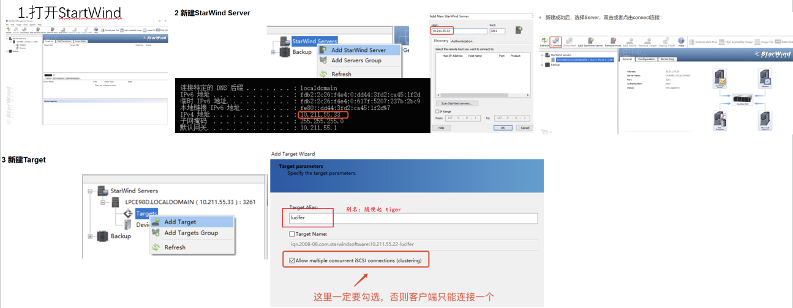
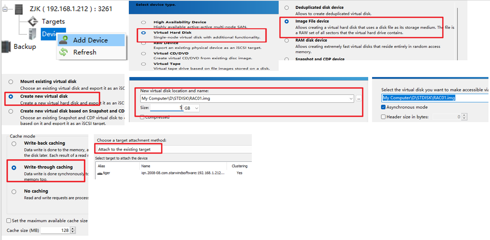
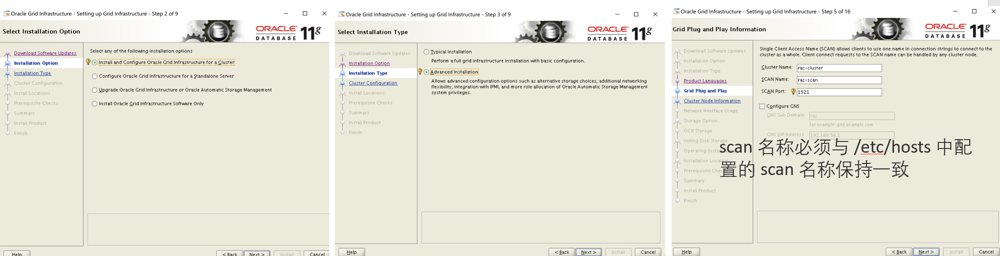

# 安装配置

## 预先准备

### 1. 配置yum源并安装依赖包（rac01&rac02）

```shell
mount /dev/cdrom /mnt
# 配置yum源
cat <<EOF>>/etc/yum.repos.d/local.repo
[local]
name=local
baseurl=file:///mnt
gpgcheck=0
enabled=1
EOF

# 安装依赖
yum groupinstall -y "Server with GUI"
yum install -y bc \
binutils \
compat-libcap1 \
compat-libstdc++-33 \
gcc \
gcc-c++ \
elfutils-libelf \
elfutils-libelf-devel \
glibc \
glibc-devel \
ksh \
libaio \
libaio-devel \
libgcc \
libstdc++ \
libstdc++-devel \
libxcb \
libX11 \
libXau \
libXi \
libXtst \
libXrender \
libXrender-devel \
make \
net-tools \
nfs-utils \
smartmontools \
sysstat \
e2fsprogs \
e2fsprogs-libs \
fontconfig-devel \
expect \
unzip \
openssh-clients \
readline* \
tigervnc* \
psmisc --skip-broken

# 删除ksh依赖
rpm -e ksh-20120801-142.el7.x86_64

# 手动上传安装
rpm -ivh compat-libstdc++-33-3.2.3-72.el7.x86_64.rpm
rpm -ivh pdksh-5.2.14-37.el5.x86_64.rpm

# 检查
rpm -q bc binutils compat-libcap1 compat-libstdc++-33 gcc gcc-c++ elfutils-libelf elfutils-libelf-devel glibc glibc-devel ksh libaio libaio-devel libgcc libstdc++ libstdc++-devel libxcb libX11 libXau libXi libXtst libXrender libXrender-devel make net-tools nfs-utils smartmontools sysstat e2fsprogs e2fsprogs-libs fontconfig-devel expect unzip openssh-clients readline | grep "not installed"
```

- package ksh is not installed
- 在Oracle 11g RAC的安装过程中，需要使用的是pdksh而不是ksh。这是因为Oracle 11g RAC安装过程中需要使用一些特定的命令，而这些命令在pdksh中才能够正常运行。

### 2. 网络配置

**rac1**

```shell
#配置Public IP
nmcli connection modify ens33 ipv4.addresses 192.168.56.10/24 ipv4.gateway 192.168.56.1 ipv4.method manual autoconnect yes
#配置Private IP
nmcli connection modify ens34 ipv4.addresses 172.0.0.1/24 ipv4.method manual autoconnect yes
#生效
nmcli connection up ens33
nmcli connection up ens34
```

**rac2**

```shell
#配置Public IP
nmcli connection modify ens33 ipv4.addresses 192.168.56.11/24 ipv4.gateway 192.168.56.1 ipv4.method manual autoconnect yes
#配置Private IP
nmcli connection modify ens34 ipv4.addresses 172.0.0.2/24 ipv4.method manual autoconnect yes
#生效
nmcli connection up ens33
nmcli connection up ens34
```

#####  VM虚拟网络编辑

 

**NAT模式下：**

- VMnet1的地址代表着主机的地址 如：192.168.113.1

- VMnet8的地址是分配给虚拟机的网络IP地址的子网，用于和主机互联 如：192.168.56.0

**修改rac1和rac2的虚拟桥接地址: virbr** --其实没啥用

```shell
# 临时的
ifconfig virbr0 192.168.113.1 netmask 255.255.255.0 broadcast 192.168.113.255

# 结果 
virbr0: flags=4099<UP,BROADCAST,MULTICAST>  mtu 1500
        inet 192.168.113.1  netmask 255.255.255.0  broadcast 192.168.113.255
        ether 52:54:00:ef:03:4e  txqueuelen 1000  (Ethernet)
        RX packets 0  bytes 0 (0.0 B)
        RX errors 0  dropped 0  overruns 0  frame 0
        TX packets 0  bytes 0 (0.0 B)
        TX errors 0  dropped 0 overruns 0  carrier 0  collisions 0

```

```shell
# 永久的
vi /etc/sysconfig/network-scripts/
```

### 3. 存储配置

#### StarWind使用

[一步步教你Windows配置ISCSI共享存储（StarWind） - 腾讯云开发者社区-腾讯云 (tencent.com)](https://cloud.tencent.com/developer/article/1863279)

##### 1. 配置服务端StarWind ISCSI

- 别名tiger

 

##### 2.添加Device存储盘

 

##### 3.Linux通过ISCSI连接共享存储

- 将Windows主机共享存储的IP地址固定：使用VMnet1的ip地址：192.168.113.1 或者新建一个Windows虚拟机：192.168.56.2

```shell
#iscsi识别共享存储
yum install -y iscsi-initiator-utils*
#输出targetname，192.168.1.212为iscsi共享存储设备IP地址 配置服务端StarWind ISCSI时查看的windows的IP地址
iscsiadm -m discovery -t st -p 192.168.56.2
#连接共享存储 192.168.56.2-tiger 为 IP-别名
iscsiadm -m node -T iqn.2008-08.com.starwindsoftware:192.168.56.2-tiger -p 192.168.56.2 -l
lsblk
```

- 如果连不上，将Windows的防火墙关闭即可。

### 4. hosts 文件配置

```shell
cat <<EOF>>/etc/hosts
#Public IP
192.168.56.10 rac01
192.168.56.11 rac02

#Private IP
172.0.0.1 rac01-priv
172.0.0.2 rac02-priv

#Vip IP
192.168.56.20 rac01-vip
192.168.56.21 rac02-vip

#Scan IP
192.168.56.110 rac-scan
EOF
```

### 5.防火墙配置

```shell
systemctl stop firewalld.service
systemctl disable firewalld.service
systemctl status firewalld.service
```

### 6. selinux 配置

```shell
#重启后生效
sed -i 's/SELINUX=enforcing/SELINUX=disabled/g' /etc/selinux/config
setenforce 0
#重启后检查
getenforce
```

### 7. 时间同步配置 勉强能用

- 安装ntp  [Linux离线安装NTP服务，无外网环境下配置本地时间同步](https://blog.csdn.net/DraGon_HooRay/article/details/117076187)

```shell
rpm -ivh autogen-libopts-5.18-5.el7.x86_64.rpm
rpm -ivh ntp-4.2.6p5-25.el7_3.2.x86_64.rpm
rpm -ivh ntpdate-4.2.6p5-25.el7_3.2.x86_64.rpm
```

```shell
systemctl status ntpd #查询ntp服务状态
systemctl start ntpd #启动
systemctl stop ntpd #停止
systemctl restart ntpd #重启
ntpq -p #查看ntp服务器与上层ntp的状态
```

#### rac1设置ntp服务器

- 修改/etc/ntp.conf中的部分内容如下：

```shell
# Hosts on local network are less restricted.
#restrict 192.168.1.0 mask 255.255.255.0 nomodify notrap
restrict 192.168.56.255 mask 255.255.255.0 nomodify notrap #集群所在网段的网关（Gateway），子网掩码（Genmask）
```

```shell
systemctl restart ntpd
```

#### rac2设置ntp客户端

- 修改/etc/ntp.conf中的部分内容如下：

```shell
# Permit all access over the loopback interface.  This could
# be tightened as well, but to do so would effect some of
# the administrative functions.
restrict 127.0.0.1
restrict ::1

# Hosts on local network are less restricted.
#restrict 192.168.1.0 mask 255.255.255.0 nomodify notrap

restrict 192.168.56.10 nomodify notrap noquery                         # rac1的IP地址

# Use public servers from the pool.ntp.org project.
# Please consider joining the pool (http://www.pool.ntp.org/join.html).
#server 0.rhel.pool.ntp.org iburst                                      # 这些注释
#server 1.rhel.pool.ntp.org iburst
#server 2.rhel.pool.ntp.org iburst
#server 3.rhel.pool.ntp.org iburst

server 192.168.56.10                                                    # rac1的IP地址
Fudge 192.168.56.10 stratum 10                                          # rac1的IP地址
```

```shell
systemctl restart ntpd
```

**检查是否可用**

```shell
ntpstat
ntpq -p
```

#### rac1和rac2全部设置开机启动

```shell
systemctl enable ntpd.service
```

- 禁用

```shell
#禁用chronyd
yum install -y chrony
timedatectl set-timezone Asia/Shanghai
systemctl stop chronyd.service
systemctl disable chronyd.service
#禁用ntpd
yum install -y ntpdate
```

- 配置计划任务，定时刷新系统时间：

```shell
#203.107.6.88为时间服务器IP，每天12点同步系统时间 即NTP http://www.ntp.org.cn/pool
cat <<EOF>>/var/spool/cron/root
00 12 * * * /usr/sbin/ntpdate -u 192.168.56.10 && /usr/sbin/hwclock -w
EOF
#查看计划任务
crontab -l
#手动执行
/usr/sbin/ntpdate -u 192.168.56.10 && /usr/sbin/hwclock -w
```

### 8. 关闭透明大页和 NUMA

- 关闭 `透明大页` 和 `numa` 的配置，需要重启主机生效

```shell
sed -i 's/quiet/quiet transparent_hugepage=never numa=off/' /etc/default/grub
grub2-mkconfig -o /boot/grub2/grub.cfg
#重启后检查是否生效
cat /sys/kernel/mm/transparent_hugepage/enabled
cat /proc/cmdline
```

```shell
# 结果
[root@rac01 ~]# cat /sys/kernel/mm/transparent_hugepage/enabled
always madvise [never]
[root@rac01 ~]# cat /proc/cmdline
BOOT_IMAGE=/vmlinuz-3.10.0-693.el7.x86_64 root=/dev/mapper/rhel-root ro rd.lvm.lv=rhel/root rd.lvm.lv=rhel/swap rhgb quiet transparent_hugepage=never numa=off
```

### 9.avahi-daemon 配置 仅仅是那些最小化安装的

```shell
yum install -y avahi*
systemctl stop avahi-daemon.socket
systemctl stop avahi-daemon.service
pgrep -f avahi-daemon | awk '{print "kill -9 "$2}'

#配置 NOZEROCONF：
cat <<EOF>>/etc/sysconfig/network
NOZEROCONF=yes
EOF

#检查
systemctl status avahi-daemon.socket
systemctl status avahi-daemon.service
```

### 10.系统参数配置

```shell
#配置参数文件的脚本：
memTotal=$(grep MemTotal /proc/meminfo | awk '{print $2}')
totalMemory=$((memTotal / 2048))
shmall=$((memTotal / 4))
if [ $shmall -lt 2097152 ]; then
    shmall=2097152
fi
shmmax=$((memTotal * 1024 - 1))
if [ "$shmmax" -lt 4294967295 ]; then
    shmmax=4294967295
fi
cat <<EOF>>/etc/sysctl.conf
fs.aio-max-nr = 1048576
fs.file-max = 6815744
kernel.shmall = $shmall
kernel.shmmax = $shmmax
kernel.shmmni = 4096
kernel.sem = 250 32000 100 128
net.ipv4.ip_local_port_range = 9000 65500
net.core.rmem_default = 262144
net.core.rmem_max = 4194304
net.core.wmem_default = 262144
net.core.wmem_max = 1048576
net.ipv4.conf.ens33.rp_filter = 1
net.ipv4.conf.ens34.rp_filter = 2
EOF
#生效
sysctl -p
```

### 11.系统资源限制配置

```shell
#配置limits.conf
cat <<EOF>>/etc/security/limits.conf
oracle soft nofile 1024
oracle hard nofile 65536
oracle soft stack 10240
oracle hard stack 32768
oracle soft nproc 2047
oracle hard nproc 16384
oracle hard memlock 134217728
oracle soft memlock 134217728

grid soft nofile 1024
grid hard nofile 65536
grid soft stack 10240
grid hard stack 32768
grid soft nproc 2047
grid hard nproc 16384
EOF
#配置pam.d/login
cat <<EOF>>/etc/pam.d/login
session required pam_limits.so 
session required /lib64/security/pam_limits.so
EOF
```

- 检查

```shell
[root@rac01 Downloads]# cat /etc/pam.d/login | grep -v "^$" | grep -v "^#"
auth [user_unknown=ignore success=ok ignore=ignore default=bad] pam_securetty.so
auth       substack     system-auth
auth       include      postlogin
account    required     pam_nologin.so
account    include      system-auth
password   include      system-auth
session    required     pam_selinux.so close
session    required     pam_loginuid.so
session    optional     pam_console.so
session    required     pam_selinux.so open
session    required     pam_namespace.so
session    optional     pam_keyinit.so force revoke
session    include      system-auth
session    include      postlogin
-session   optional     pam_ck_connector.so
session required pam_limits.so
session required /lib64/security/pam_limits.so
```

### 12.用户及组、目录创建

```shell
#组创建
/usr/sbin/groupadd -g 54321 oinstall
/usr/sbin/groupadd -g 54322 dba
/usr/sbin/groupadd -g 54323 oper
/usr/sbin/groupadd -g 54324 backupdba
/usr/sbin/groupadd -g 54325 dgdba
/usr/sbin/groupadd -g 54326 kmdba
/usr/sbin/groupadd -g 54327 asmdba
/usr/sbin/groupadd -g 54328 asmoper
/usr/sbin/groupadd -g 54329 asmadmin
/usr/sbin/groupadd -g 54330 racdba
#用户创建
/usr/sbin/useradd -u 11012 -g oinstall -G asmadmin,asmdba,asmoper,dba,racdba,oper grid
/usr/sbin/useradd -u 54321 -g oinstall -G asmdba,dba,backupdba,dgdba,kmdba,racdba,oper oracle
#修改用户密码为oracle
echo "oracle" |passwd oracle --stdin
echo "oracle" |passwd grid --stdin
#创建软件目录
mkdir -p /u01/app/11.2.0/grid
mkdir -p /u01/app/grid
mkdir -p /u01/app/oracle/product/11.2.0/db
mkdir -p /u01/app/oraInventory
mkdir -p /backup
mkdir -p /home/oracle/scripts
chown -R oracle:oinstall /backup
chown -R oracle:oinstall /home/oracle/scripts
chown -R grid:oinstall /u01
chown -R grid:oinstall /u01/app/grid
chown -R grid:oinstall /u01/app/11.2.0/grid
chown -R grid:oinstall /u01/app/oraInventory
chown -R oracle:oinstall /u01/app/oracle
chmod -R 775 /u01
```

### 13.环境变量配置

- profile 文件

#### **grid 用户：**

-  每个节点的 ORACLE_SID 不一样（+ASM1/+ASM2），需要自行修改！

```shell
cat <<EOF>>/home/grid/.bash_profile
###############OracleBegin#########################
umask 022
export TMP=/tmp
export TMPDIR=\$TMP
export NLS_LANG=AMERICAN_AMERICA.AL32UTF8
export ORACLE_BASE=/u01/app/grid
export ORACLE_HOME=/u01/app/11.2.0/grid
export ORACLE_TERM=xterm
export TNS_ADMIN=\$ORACLE_HOME/network/admin
export LD_LIBRARY_PATH=\$ORACLE_HOME/lib:/lib:/usr/lib
export ORACLE_SID=+ASM1
export PATH=/usr/sbin:\$PATH
export PATH=\$ORACLE_HOME/bin:\$ORACLE_HOME/OPatch:\$PATH
alias sas='sqlplus / as sysasm'
export PS1="[\`whoami\`@\`hostname\`:"'\$PWD]\$ '
EOF
```

#### **oracle 用户：**

- 每个节点的 ORACLE_HOSTNAME（rac01/rac02）和 ORACLE_SID（orcl1/orcl2）不一样，需要自行修改！

```shell
cat <<EOF>>/home/oracle/.bash_profile
###############OracleBegin#########################
umask 022
export TMP=/tmp
export TMPDIR=\$TMP
export NLS_LANG=AMERICAN_AMERICA.AL32UTF8
export ORACLE_BASE=/u01/app/oracle
export ORACLE_HOME=\$ORACLE_BASE/product/11.2.0/db
export ORACLE_HOSTNAME=rac01
export ORACLE_TERM=xterm
export TNS_ADMIN=\$ORACLE_HOME/network/admin
export LD_LIBRARY_PATH=\$ORACLE_HOME/lib:/lib:/usr/lib
export ORACLE_SID=orcl1
export PATH=/usr/sbin:\$PATH
export PATH=\$ORACLE_HOME/bin:\$ORACLE_HOME/OPatch:\$PATH
alias sas='sqlplus / as sysdba'
export PS1="[\`whoami\`@\`hostname\`:"'\$PWD]\$ '
###############OracleEnd#########################
EOF
```

### 14. 安装介质上传解压（rac01）

```shell
#创建安装介质存放目录
mkdir /soft
#上传安装介质到/soft目录
linux.x64_11gR2_database_1of2.zip
linux.x64_11gR2_database_2of2.zip
linux.x64_11gR2_grid.zip
#解压安装介质
cd /soft
unzip -q linux.x64_11gR2_database_1of2.zip
unzip -q linux.x64_11gR2_database_2of2.zip
unzip -q linux.x64_11gR2_grid.zip
#授权目录
chown -R oracle:oinstall /soft/database
chown -R grid:oinstall /soft/grid
#root用户下，cvuqdisk安装（rac01&rac02）
cd /soft/grid/rpm
rpm -ivh cvuqdisk-1.0.7-1.rpm   
#传输到节点二安装
scp cvuqdisk-1.0.7-1.rpm rac02:/tmp
# rac2安装：
cd /tmp
rpm -ivh /tmp/cvuqdisk-1.0.7-1.rpm 
```

## 安装Grid rac01 grid用户使用图形化界面安装

```shell
#应用环境变量
source ~/.bash_profile
#进入安装目录
cd /soft/grid
#执行安装程序开始安装，加上jar包防止弹窗不显示问题
./runInstaller -jreLoc /etc/alternatives/jre_1.8.0
```

 

- 点击 Add 添加节点二，pubile hostname 为 `rac02`，virtual hostname 为 `rac02-vip`，输入密码：`oracle`，点击 setup 开始互信。
- 点击Test测试互信：


