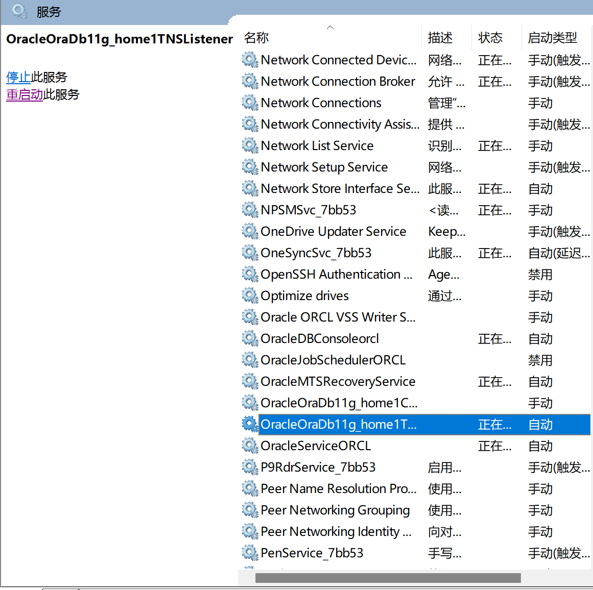

# 监听服务启动

```
# 启动监听服务
C:\WINDOWS\system32>lsnrctl start

LSNRCTL for 64-bit Windows: Version 11.2.0.1.0 - Production on 23-10月-2022 12:58:36

Copyright (c) 1991, 2010, Oracle.  All rights reserved.

启动tnslsnr: 请稍候...

Failed to open service <OracleOraDb11g_home1TNSListener>, error 1060.
TNSLSNR for 64-bit Windows: Version 11.2.0.1.0 - Production
系统参数文件为C:\app\zjk10\product\11.2.0\dbhome_1\network\admin\listener.ora
写入c:\app\zjk10\diag\tnslsnr\DESKTOP-HSVIOTH\listener\alert\log.xml的日志信息
监听: (DESCRIPTION=(ADDRESS=(PROTOCOL=ipc)(PIPENAME=\\.\pipe\EXTPROC1521ipc)))
监听: (DESCRIPTION=(ADDRESS=(PROTOCOL=tcp)(HOST=DESKTOP-HSVIOTH)(PORT=1521)))

正在连接到 (DESCRIPTION=(ADDRESS=(PROTOCOL=IPC)(KEY=EXTPROC1521)))
LISTENER 的 STATUS
------------------------
别名                      LISTENER
版本                      TNSLSNR for 64-bit Windows: Version 11.2.0.1.0 - Production
启动日期                  23-10月-2022 12:58:43
正常运行时间              0 天 0 小时 0 分 6 秒
跟踪级别                  off
安全性                    ON: Local OS Authentication
SNMP                      OFF
监听程序参数文件          C:\app\zjk10\product\11.2.0\dbhome_1\network\admin\listener.ora
监听程序日志文件          c:\app\zjk10\diag\tnslsnr\DESKTOP-HSVIOTH\listener\alert\log.xml
监听端点概要...
  (DESCRIPTION=(ADDRESS=(PROTOCOL=ipc)(PIPENAME=\\.\pipe\EXTPROC1521ipc)))
  (DESCRIPTION=(ADDRESS=(PROTOCOL=tcp)(HOST=DESKTOP-HSVIOTH)(PORT=1521)))
服务摘要..
服务 "CLRExtProc" 包含 1 个实例。
  实例 "CLRExtProc", 状态 UNKNOWN, 包含此服务的 1 个处理程序...
命令执行成功

C:\WINDOWS\system32>
```

- 然后再去服务里面就能找到了

 