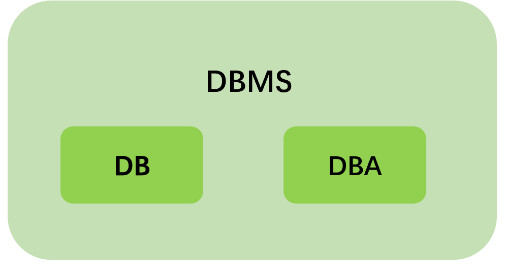
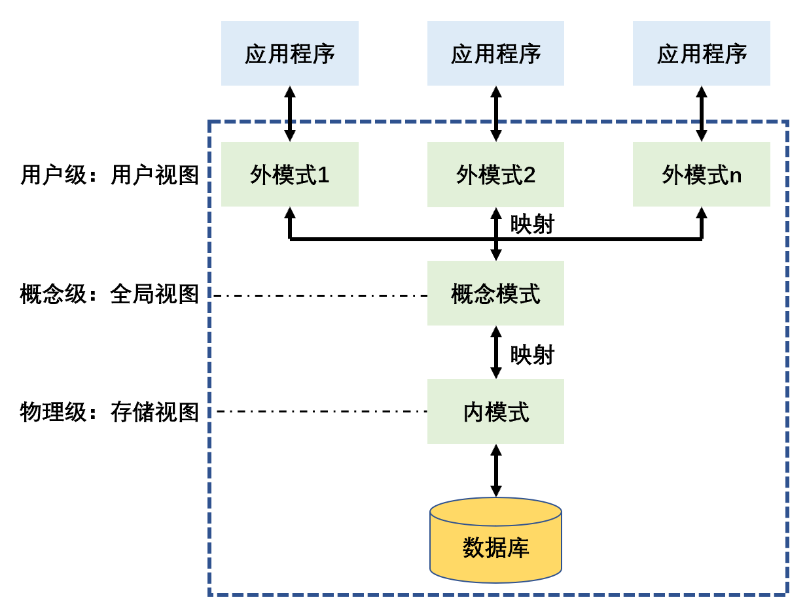
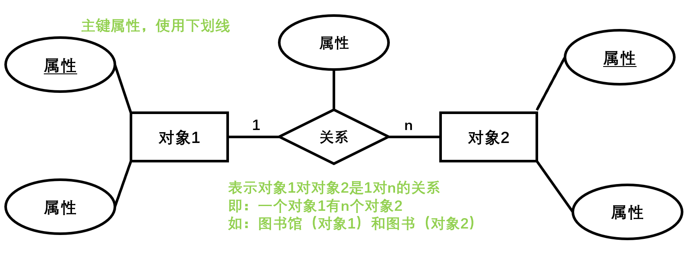
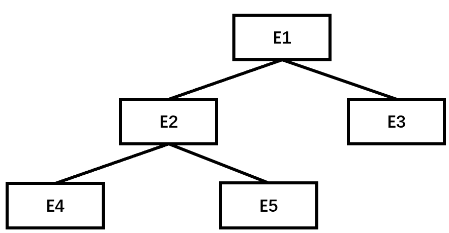
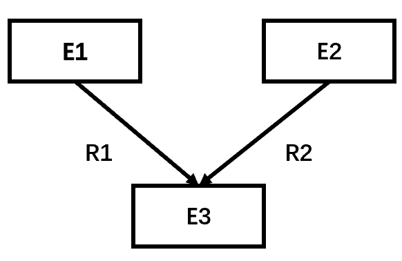

# 数据库系统概论

## 数据和数据管理

### 数据和信息

- **信息**是经过加工处理并对人类社会实践和生产活动产生决策影响的数据。
- **数据**是信息的载体，并非所有数据都是信息，只有经过加工处理之后具有新内容的数据才能成为信息。

### 数据处理和数据管理

- **数据处理**是指将数据转换成信息的过程，从大量、杂乱的数据中整理出对人们有意义的信息。
- **数据管理**是指数据的收集、组织、存储、检索、维护等操作，目的是提高数据的独立性，降低数据的冗余度，增强数据的共享性、安全性、完整性。

## 数据管理技术发展阶段

- 人工管理-->文件管理-->数据库系统管理

## 数据库系统

**数据库系统是一个计算机应用系统，是把有关计算机硬件系统、软件系统、数据库和相关人员组合起来为用户提供信息服务的系统**

### 组成

**DBMS包含DB、DBA**

 

### 三级模式结构

- 将数据库分为物理和逻辑两个层次。

 

#### 外模式、概念模式、内模式

| 模式                       | 说明                                                                                                                              |
| :------------------------- | :-------------------------------------------------------------------------------------------------------------------------------- |
| 概念模式（逻辑模式）         | 对应概念级，是对数据库中全部数据的逻辑结构和特征的总体描述；是所有用户的公共数据视图（全局视图）；由DDL语句来描述定义、体现数据库系统的整体观 |
| 外模式（子模式、用户模式）   | 通过外模式DDL或DML操作，反映数据库的用户观                                                                                           |
| 内模式（存储模式、物理模式） | 通过内模式DDL操作，描述数据在存储介质上的存储方式和物理结构，对应实际存储在外存储介质的数据库，反映数据库的存储观                           |

#### 三级模式的映射

- DBMS在三级模式之间通过了二级映射，保证数据库具有较高的物理独立性和逻辑独立性。

- **概念模式到内模式的映射**是唯一的，确定了数据的全局逻辑结构和存储结构之间的对应关系，确保了物理独立性。
- **外模式到概念模式的映射**；一个概念模式可以有多个外模式，每个外模式都存在一个外模式到概念模式的映射，保证数据与应用程序之间的逻辑独立性。

### 概念模型和逻辑模型

#### 概念模型

##### E-R图 

 

#### 逻辑模型

##### 层次模型

 

**树形结构**

1. 只有一个根结点
2. 其他结点有且仅有一个父结点

**特点**

- 各实体之间的联系通过指针来实现。
- 不能直接表示出多对多的实体关系，必须通过拆分为1对多的关系来间接表示。

##### 网状模型

 

**有向图**

1. 可以有多个根结点
2. 至少有一个结点有多于一个的父结点

**特点**

- 各实体之间的联系通过指针来实现。
- 容易实现多对多的实体关系。

##### 关系模型

**二维表**

- 每个二维表称为一个关系，每一行为元组，每一列为属性。
- 关系数据库就是一组关系的集合。

# 关系型数据库基本原理

## 关系模型和关系模式

**关系模型**由多个二维表（关系）组成。
**关系模式**用来描述关系。

### 关系模式

## 关系数据库基本概念

**关系**二维表
**元组**二维表的一行，对应一个实体对象
**属性**二维表的一列
**关键字**唯一区分元组的属性或属性组合
**外部关键字**；如：员工二维表中的部门号

## 关系代数的基本原理

## 关系的规范化理论

### 函数依赖

### 关系模式的范式

[举例](https://blog.csdn.net/wyh7280/article/details/83350722)

**第1范式 1NF**

- 如果关系R的所有属性都不能分解为更基本的数据项，即R的所有属性均满足原子特征，那么称R满足1NF。
- 还存在插入、删除、更新异常的现象

**第2范式 2NF**

- 如果关系R满足1NF，且R的所有非主属性都完全函数依赖于R的每一个候选关键属性，则R满足2NF。

**第3范式 3NF**

- 在2NF基础上，消除非主属性对键的传递依赖，则称它符合3NF。

**Boyce-Codd范式 BCNF范式**

