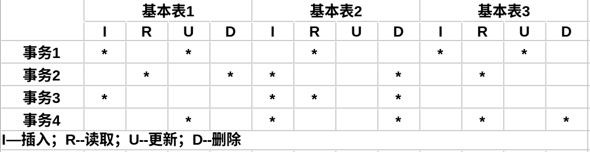
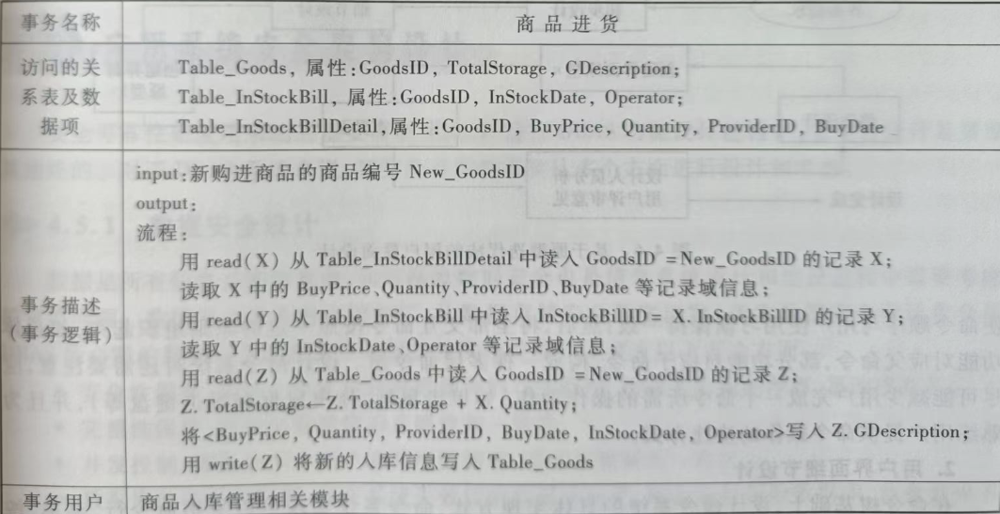
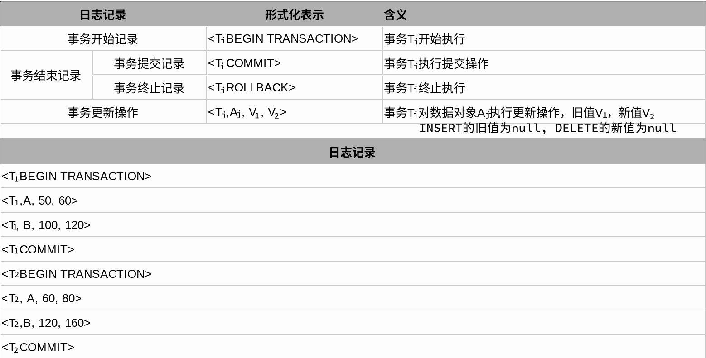

# DBAS生命周期模型

- DBAS（DataBase Application System，数据库应用系统）的生命周期由项目规划、需求分析、系统设计、实现与部署、运行与维护五个基本活动组成。

 

 

# 需求分析

- 需求分析阶段主要的任务是编写需求说明书、构建功能模型（DFD、IDEF0等）、收集各类应用域与问题域的报表等。

- DFD图和IDEF0图的比较：
1. DFD图强调数据流或顺序；而IDEF0图强调数据约束。
2. IDEF模型结构清楚，组成元素简单，更适合大型复杂系统的建模。

## [DFD 数据流图](../MIS/DFD.md)

## [IDEF0](../MIS/IDEF.md)

## [UML的用例模型](../UML/用例视图.md)

# 数据库结构设计

## 概念设计

- 概念设计面向现实世界，通常采用自底向上的方法，通过对需求分析阶段的文档（需求说明书、功能模型DFD/IDEF0等）的分析和理解，抽象出数据的结构、语义、数据之间的相互联系以及数据满足的约束条件，从而构建信息模型，编写数据库概念设计说明书。

### 实体/联系矩阵

- 实体/联系矩阵是标识实体集之间关系的简单方法，如果两个实体集之间存在联系（指的是直接联系），则在矩阵中它们的交叉位置上画叉；若不存在联系，则空白标注。

 

### 数据建模方法

#### [E-R 关系数据模型](./数据库设计与应用程序开发.md#E-R模型)

#### [IDEF1X 数据建模方法](../MIS/IDEF.md)

## 逻辑设计

 

## 物理设计

### 物理设计概述

- 数据库物理设计的目的是将数据的逻辑描述转换为实现技术规范，其目标是设计数据存储方案，以便提供足够好的性能并确保数据库数据的完整性、安全性和可恢复性。通常，<b>数据库物理设计并不包括文件和数据库的具体实现细节</b>，而是需要了解不同文件组织方式、索引技术及其使用方法。
- 数据库中的应用数据是以文件形式存储在外设存储介质上的，文件在逻辑上组织成记录的序列，文件中的每个逻辑记录被映射到某个特定的磁盘块上。而文件的逻辑记录与磁盘块间的映射关系是由操作系统或DBMS来管理的。
1. 文件的组织
2. 文件的结构
3. 文件的存取
4. 索引技术（Indexing）

### [索引 index](./索引.md)

### 物理设计内容

- 数据库物理设计主要包括以下环节，每个环节包含若干设计内容：数据库逻辑模式描述、文件组织与存取设计、数据分布设计、确定系统配置、物理模式评估。最终形成<b>数据库物理设计文档</b>。

#### 数据库逻辑模式描述

- 数据库物理设计需要根据数据库逻辑结构信息设计目标DBMS平台可支持的关系表（基本表）的模式信息，代表了所要开发的具体目标数据库的结构。
1. 面向目标数据库描述基本表和视图。不同的RDBMS提供的建立数据库及其数据库对象的语言各不相同（SQL Plus、PL/SQL）。
2. 设计基本表业务规则（完整性约束）。

#### DB文件组织与存取设计

- 根据事务数据访问特性分析结果，可以对基本表设计成更加有效的文件组织和索引方式。

##### 事务-基本表交叉引用矩阵

- 事务-基本表交叉引用矩阵，分析系统内（部分重要的）数据库事务对各个基本表的访问情况，确定事务访问了哪些基本表，对这些基本表执行何种操作，并进一步分析各操作涉及的基本表属性。

 

##### 事务的执行频率

1. 估计各事务的执行频率，并分析事务上的每个数据访问操作对各个基本表中的相关属性的操作频率。
2. 对每张基本表，汇总所有作用于该表上的各事务的操作频率信息，得到相关的数据访问估计信息。

##### 选择文件结构的原则

- 为基本表选择合适的文件结构的原则：
1. 如果数据库中的一个基本表中的数据量很少，并且插入、删除、更新等操作非常频繁，则该基本表可以采用<b>堆文件组织方式</b>。

2. <b>顺序文件</b>支持基于查找码的顺序访问，也支持快速的二分查找。

3. 如果用户查询是基于散列域值的等值匹配，特别是如果访问顺序是随机的，则<b>散列文件</b>比较合适。
   
   - 散列文件组织不适合的情况：
   1. 基于散列域值的非精确查询。
   2. 基于非散列域进行的查询。

4. <b>B-树和B+树</b>属于动态索引，是实际数据库系统中使用非常广泛的索引文件结构。适合于定义在大数据量基本表、基于查找码的等值查询、范围查询、模糊查询和部分查询。

5. 某些频繁执行且需要进行多表连接操作的查询，可以将这些基本表组织为<b>聚集文件</b>。

##### 设计存取路径以及建立索引的原则

- 设计存取路径的内容包括为数据库文件设计合理的物理存储位置和为基本表设计索引。
- 为基本表建立索引的原则：对于经常需要进行查询、连接、统计操作，且数据量大的基本表可考虑建立索引；而经常执行插入、删除、更新操作或小数据量的基本表应尽量避免建立索引。
- 对于基本表，可考虑在下面一些属性上建立索引：
1. 表的主码，大部分RDBMS会自动为主码建立唯一索引。
2. 在WHERE子句中引用率较高的属性。
3. 参与连接操作的属性。
4. 在ORDER BY子句、GROUP BY子句中出现的属性。
5. 在某一范围内频繁搜索的属性，但只有当使用索引的查询的结果不超过记录总数的20%时，索引才会有明显的效果。
6. 如果在WHERE子句中同时包含一个表中的多个属性，则可以考虑在这些属性上建立多属性索引。如果数据库文件需要频繁执行精确匹配查询，则可考虑建立散列索引；而B+树等有序索引更适合于范围查询。
7. 当一个属性有相对较多的不同值时，使用索引有明显的作用；当一个属性的不同值很少时，使用索引没有好处。
8. 对包含大量空值的属性建立索引时需要谨慎考虑，因为大多数的DBMS中的索引不引用具有空值的行，对空值的查找需要使用全表扫描来实现。

#### 数据分布设计

##### 不同类型数据的物理分布

- 不同类型数据的物理分布：各种数据在系统中的作用不同，使用的频率也不同，应根据实际使用情况存放在合适的物理介质，以优化系统I/O性能。
1. 数据库备份数据、日志文件备份数据用于故障恢复，使用频率低，而且数据量大，可以存储在磁带中。

2. 应用数据、索引和日志则使用频繁，要求的响应时间短，必须放在支持直接存取（Direct Access）的磁盘存储介质上。
- 当使用RAID等多磁盘存储系统时，可以将基本表和建立在表上的索引（以及其他可以独立的数据）分别放在不同的磁盘上。这样，存放数据和存放索引的磁盘驱动器并行工作，可以得到较快的文件读写速度。

##### 应用数据的划分与分布

- 可以将一些较大的基本表划分为若干分区，各分区数据分别存储在不同位置的磁盘上，并可采用不同的物理组织方式。
1. 根据数据的使用特征划分。频繁使用分区和非频繁使用分区。
2. 根据时间、地点属性划分。
3. 分布式数据库系统（Distributed DataBase System，DDBS）中的数据划分，原则是数据应靠近起使用者。
   1. 水平划分：将一张基本表划分为多张具有系统属性、结构完全相同的子表，子表包含的元组是基本表中元组的子集（可以有公共元组）。
   2. 垂直划分：将一张基本表划分为多张子表，每张子表包含的属性是原基本表的子集。

##### 派生属性数据分布

##### 关系模式的去规范化

#### 确定系统配置

#### 物理模式评估

# DBAS功能设计与实施

## 软件架构与设计过程

### 软件架构

- 软件体系结构（软件架构）= <code>{构件, 连接件, 约束}</code>，是一种可预制和可重构的软件框架结构。

<table>
    <tr>
        <td width="30%">构件 Component</td>
        <td width="70%">组成系统的具有一定独立功能的不同粒度的程序模块</td>
    </tr>
    <tr>
        <td>连接件 Connector</td>
        <td>将不同的构件连接起来，表示了构件之间的相互作用（通信、调用等）</td>
    </tr>
    <tr>
        <td>约束 Constraint</td>
        <td>一般为对象连接时的规则，或指明了构件连接的条件</td>
    </tr>
</table>

###  软件设计过程

<table>
    <tr>
        <td width="30%">总体结构设计 Architectural Design</td>
        <td width="70%">旨在确定组成软件系统的各主要部件及其相互间关系</td>
    </tr>
    <tr>
        <td>过程设计 Procedural Design</td>
        <td>完成对每一部件的过程化描述</td>
    </tr>
    <tr>
        <td>数据定义 Data Design</td>
        <td>定义了为实现软件所需要的数据结构</td>
    </tr>
</table>

- 从工程管理的角度，软件设计可分为概要设计和详细设计两大步骤。

## DBAS总体设计

- DBAS设计包括结构设计、过程设计、数据设计三个方面，依据自上而下、循序渐进、逐步求精的原则。

### DBAS体系结构设计

- 确定DBAS体系结构是指将系统从功能、层次/结构、地理分布等角度进行分解，划分为多个子系统，定义各子系统应实现的功能；设计系统的全局控制，明确各子系统间的交互和接口关系。

### DBAS软件总体设计

- DBAS软件包括操作系统、数据库管理系统、开发环境、中间件、应用软件（数据库事务和应用程序）。
- 应用软件总体设计从需求分析阶段得到的数据流图、事务规范、业务规则需求分析出发，得到的系统总体结构和分层模块结构可以用<b>模块结构图</b>来表示。
- 在应用软件总体之后的设计工作，数据库事务和应用程序的概要设计和详细设计，均属于数据库应用系统功能设计范畴。

#### [模块结构图](../MIS/模块结构图.md)

### 软硬件选型与配置设计

### 业务规则初步设计

- 数据库应用软件的动态行为体现为各个系统元素相互间的组合、控制和信息传递，可表示为一系列实现系统功能的业务流程和运行控制。这种动态行为实现了应用领域特定的业务规则。

#### [业务流程图 TFD](../MIS/TFD.md)

-  通常DBAS的各项作业活动具有逻辑上的先后关系，因此可表示成一个操作序列，并用业务流程图的形式展示。

## 功能概要设计

### DBAS软件4层架构

<table>
    <caption>DBAS软件4层架构</caption>
    <tr>
        <td rowspan="4" width="40%"></td>
        <td width="15%">表示层</td>
        <td width="45%"></td>
    </tr>
    <tr>
        <td>业务逻辑层</td>
        <td>高内聚、松耦合</td>
    </tr>
    <tr>
        <td>数据访问层</td>
        <td><b>事务概要设计</b>，采用面向数据流的程序设计方法（结构设计方法，SD方法），内容包括事务名称、事务所访问的关系表及关系属性、事务处理逻辑、事务用户（使用、启动、调用该事务的软件模块或系统）</td>
    </tr>
    <tr>
        <td>数据持久层</td>
        <td></td>
    </tr>
</table>

### 事务概要设计

 

- 根据事务概要设计的结果，检查关系表对数据库事务的支持性。

1. 对每一个事务，根据需求分析阶段的事务分析，列出该事务所访问的各个数据项。
2. 列出事务访问的数据项所在的关系表和对应的关系属性。
3. 如果事务访问的数据项同时出现在多个表中，检查这些关系表间的关联关系，如主码/外码关联。
4. 检查是否存在某些事务，这些事务所访问的一些数据项未出现在任何关系表中。对这些事务，需要重新修改数据库的概念模型或逻辑结构，或者重新设计事务，以保证DB能够支持所有的数据库事务。

## 功能详细设计

### 表示层详细设计

- 表示层详细设计主要是人机交互界面的设计，通常采用原型迭代法。

 

### 业务逻辑层详细设计

## 应用系统安全架构设计

### 数据安全设计

- 从数据存储安全角度出发：

1. 安全性保护
2. 完整性保护
3. 并发控制
4. 数据库的备份和恢复
5. 数据加密传输

#### 数据库的并发控制：封锁技术

- 封锁技术是在某一时间内禁止某一用户对数据对象做某些操作以避免产生数据不一致的问题，主要分为排它锁（x 锁）、共享锁（s锁）。

#####  死锁

- 避免死锁的原则：

1. 按同一顺序访问资源
2. 避免事务中的用户交互
3. 采用小事务模式，尽量缩短事务的长度，减少占有锁的时间
4. 使用绑定连接，是同一应用程序所打开的两个或多个连接可以相互合作。次级连接获得的任何锁可以像由主连接获得的锁那样持有，反之亦然。

#### 数据库的备份和恢复

1. 双机热备：基于Active/Standy方式的服务器热备。
2. 数据转储（数据备份）。
3. 数据加密存储。

#### 数据加密传输

- 常用的数据加密传输手段：数字安全证书、对称密钥加密、数字签名、数字信封。 

### 环境安全设计

1. 漏洞和补丁
2. 计算机病毒防护
3. 网络环境安全：防火墙、IDS（入侵检测系统）、网络隔离。
4. 物理环境安全

### 制度安全设计

- 制度安全设计通常是管理层面的，不是设计人员应该考虑的。

## DBAS实施

- DBAS的实施阶段主要包括：

1. 创建数据库
2. 装载数据
3. 编写与调试应用程序
4. 数据库试运行

 

# 数据库及数据库对象

- 数据库是存储数据及各种数据库对象的容器。

## 数据库文件

## 分区表

- 分区表是将表中的数据按<b>水平方式</b>划分成不同的子集，这些数据子集存储在数据库的一个或多个文件组中，而在逻辑上仍然是一个表。
- 通常，如果某个大型表同时满足如下条件，则适于创建分区表：

1. 包含（或将包含）以多种不同方式使用的大量数据。
2. 数据是分段的（时间、地区等类型的数据）。

## [索引](./索引.md)

### 索引视图（物化视图）

- 标准视图（虚拟表）的结果集并不永久地存储在数据库中，每次通过标准视图查询数据时，DBMS都会在内部将视图的定义替换为对基本表的查询语句。
- 物化视图（索引视图）是建有唯一聚集索引的视图。对视图创建唯一聚集索引后，视图的结果集将存储在数据库中。在对基本表的数据更改时，也会将这些更改反映到索引视图存储的数据中。

1. 如果很少更新基础数据，则索引视图的效果最佳；而如果经常更新数据，则需要考虑维护索引视图的成本。
2. 对于经常使用批处理方式定期更新的数据，可以在更新前删除索引视图，再在更新后重新建立索引视图。

- 索引视图通常不会提高以下查询类型的性能：

1. 具有大量写操作的OLTP系统。
2. 具有大量更新操作的数据库。
3. 不涉及聚合或连接的查询。
4.  <code>GROUP BY</code>列具有高基数度（列包含许多不同的值）的数据聚合。

# 安全管理

## 安全控制

<table>
    <tr>
        <td width="20%">安全性 Security</td>
        <td width="80%">保护数据以防止不合法用户故意造成的破坏</td>
    </tr>
    <tr>
        <td>完整性 Integrity</td>
        <td>保护数据以防止合法用户无意中造成的破坏</td>
    </tr>
</table>

- DBA（ DataBase Administrator，数据库管理员）负责数据库系统的安全，任何需要访问数据库的用户（组）都必须首先向DBA申请账户。DBMS中采用了一个加密表来保存用户的账户和密码信息。

 

## 存取控制

<table>
    <caption>DBMS的存取控制方式</caption>
    <tr>
        <td width="20%">自主存取控制 Discretionary Control</td>
        <td width="80%">用户对不同的数据对象具有不同的存取权限，而没有固定的关于哪些用户对哪些对象具有哪些存取权限的限制</td>
    </tr>
    <tr>
        <td>强制存取控制 Mandatory Control</td>
        <td>每个数据对象（客体）都被标以一定的密级，每个用户（主体）也都被授予一个许可级别。对于任意对象，只有具有合法许可证的用户才可以存取。具有分层的特点，相对较严格</td>
    </tr>
</table>

### 自主存取控制

- 自主存取控制通过授权机制来控制对敏感数据的访问。

- 权限类型：

1. 对DBMS进行维护的权限
2. 对数据库中的对象和数据进行操作的权限
   1. 语句权限：对数据库对象的操作权限，包括创建、输出、修改数据库对象
   2. 对象权限：对数据库数据的操作权限，包括对表、视图数据的增删改查权限，存储过程的执行权等。
3. 隐含权限：数据库对象拥有者自动具有所拥有对象的全部权限，这一点不能被更改。

- 用户分类：

1. 系统管理员：在数据库服务器上具有全部的权限，系统不会对其权限进行检验。
2. 数据库对象拥有者：创建数据库对象的用户具有该数据库对象的全部权限。
3. 普通用户：只拥有对数据库数据的操作权限。

### 强制存取控制

- 在强制存取控制中，DBMS将全部实体划分为主体和客体。主体是系统中的活动实体，而客体是受主体操纵的被动实体。对于主体和客体，DBMS为它们的每个实例指派一个敏感度标记（Label），主体被指派的是许可证级别（Clearance Level），而客体被指派的是密级（Classificaion Level）。

1. 仅当主体的许可正级别大于或等于客体的密级时，该主体才能读取相应的客体。
2. 仅当主体的许可证级别等于客体的密级时，主体才可以写相应的客体；禁止了高许可证级别的主体更新低密级的数据对象。在有些系统中，允许小于等于客体的密级的写入，也就是说，用户可以为写入的数据对象赋予高于自己的许可证级别的密级。这样，包括他自己也不能读取这个数据对象。

- 支持强制采取控制的DBMS也称为多级安全系统（Multi-Level Secure System）或可信系统（Trusted System）。

### 通用安全型分级模式

> 美国国防部颁布了“橘皮书”和“紫皮书”对强制存取控制作了全面的描述和定义，“橘皮书”定义了任意“可信橘色基”（Trusted Cimpution Base，TCB）应当遵从一系列安全性要求；而“紫皮书”则定义了这些要求在数据库系统中的相应解释。上述两份文献给出了通用安全性分级模式。

- 通用安全型分级模式共定义了D、C、B、A四类安全级别，从D类到A类级别依次增高。D类提供最小（Minimal）保护、C类提供自主（Discretionary）保护、B类提供强制（Mandatory）保护、A类提供验证（Verified）保护。

1. 自主保护。C类分为两个子类C1和C2，C1安全级别低于C2。每个子类都支持自主存取控制，即存取权限由数据对象的所有者决定。
   1. C1子类对所有权与存取权限加以区分，虽然它允许用户拥有自己的私有数据，但仍然支持共享数据的概念。
   2. C2子类还要求通过注册、审计及资源隔离以支持责任说明（Accountability）。
2. 强制保护。B类分为三个子类B1、B2、B3，B1安全级别最低，B3最高。
   1. B1 子类要求“标识化安全保护”，并要求每个数据对象都必须标以一定的密级，同时还要求安全策略的非形式化说明。
   2. B2子类要求安全策略的形式化（formal）说明，能识别并消除隐蔽通道（covert channel)。隐蔽通道的例子有：从合法查询的结果中推断出不合法查询的结果；通过合法的计算推断出敏感信息。
   3. B3子类要求支持审计和恢复以及指定安全管理者。
3. 验证保护。A类要求安全机制是可靠的且足够支持对指定的安全策略给出严格的数学证明。

## 审计跟踪

- 审计跟踪实质上是一种特殊的文件或数据库，系统在上面自动记录用户对常规数据的所有操作。不同系统中的审计跟踪与事务日志是否集成也不同。
- 典型的审计跟踪记录包含的信息如下：操作请求、操作终端、操作人、操作日前和时间、元组,属性和影响、旧值、新值。

## 统计数据库的安全性

- 统计数据库提供基于各种不同标准的统计信息或汇总数据（聚集类信息），但不允许查询单条信息。而在统计数据库中可能存在隐藏的信息通道（从合法的查询中推导出不合法的查询）。

## Oracle的安全管理

- Oracle的安全控制机制可分为数据库级、表级、行级、列级的安全控制。

# 数据库运行维护与优化

## 数据库运行维护基本工作

- 一般来说，维护工作主要包括：数据库的转储和恢复；数据库的安全性和完整性控制；数据库性能的监控分析和改进；数据库的重组和重构。
- 数据库的重新组织并不改变数据库原有设计的逻辑结构和物理结构，而数据库的重构会部分修改数据库的模式和内模式。

## 运行状态监控与分析

- 根据监控分析实现方法的不同，监控分析机制分为两种，由数据库系统建立的自动监控机制、由管理员手动实施的监控机制。
- 根据监控对象的不同，监控分析分为，对数据库架构体系的监控、对数据库性能的监控。

## 数据库存储空间管理

- 数据库的存储结构一般分为逻辑存储结构和物理存储结构，其物理存储结构决定了存储数据时数据文件所占用空间的大小以及分布。

 

- 在进行数据库设计时，还需要对数据所需使用的空间进行预测，预测出数据库中初始阶段要存放的数据量，并计算出数据库近两年所需要的空间。在实施阶段就必须以这些空间量为参数，在软硬件环境中为数据库预留出足的空间。

## 数据库性能优化

- 数据库性能优化一般可以从数据库运行环境、数据库参数调整、模式调整、数据库存储优化、查询优化方面考虑。

### 数据库运行环境与参数调整

### 模式调整与优化

- 规范化关系解决了数据维护的异常，并是冗余最小化，然而可能出现数据处理性能下降的问题。
- 而反规范化是将规范化关系转换为非规范化关系的过程，以满足特定的性能优化需要。

<table>
    <caption>反规范化的方式</caption>
    <tr>
        <td width="20%">增加派生性冗余列</td>
        <td width="80%">可以在查询时减少连接操作，避免使用聚合函数；以空间换时间</td>
    </tr>
    <tr>
        <td rowspan="3">增加冗余列</td>
        <td>在多个表中增加具有相同语义的列（非键字段），常用来在查询是避免连接操作。</td>
    </tr>
    <tr>
        <td>主码和外码在多表中的重复出现不属于冗余列</td>
    </tr>
    <tr>
        <td>前提条件是要保证冗余列及其对于数据的一致性</td>
    </tr>
    <tr>
        <td>重新组表</td>
        <td>需要考虑当相关表中的数据变化时，刷新表P的代价</td>
    </tr>
    <tr>
        <td>分割表</td>
        <td>表分割具有水平分割、垂直分割两种方式</td>
    </tr>
    <tr>
        <td>新增汇总表</td>
        <td>将频繁使用的统计操作的中间结果或最终解雇存储在汇总表中</td>
    </tr>
</table>

### 存储优化

#### 物化视图

- 物化视图是包括一个查询结果的数据库对象（可由系统定期刷新其中的数据），物化视图不是在使用时才读取的，而是预先计算并保存表连接或聚集等耗时较多的查询结果。

1. 适合于多个数据量较大的表进行连接操作及分布式数据库中需要进行分布在多站点的表进行连接操作时使用。
2. 物化视图还可以进行远程数据的本地复制（作为快照），主要由于实施数据库间的同步。

#### 聚集

- 聚集（Cluster）是物理存储表中数据的可选择的方法。一个聚集是一组表，可将经常一起使用的具有<b>同一公共列值</b>的多个表中的数据行存储在一起，由它们的公共列构成聚集码。
- 聚集码（Cluster Key）是多表中相关的列，在将记录插入聚集的表中之前，必须要为聚集对象建立一个聚集索引（Cluster Index），且按聚集码进行索引；对于聚集中的多个表，聚集值只存储一次。
- 聚集表的插入、更新、删除性能较差。

### 查询优化

1. 合理使用索引
2. 避免或简化排序
3. 消除对大型表数据的顺序存取
4. 避免复杂的正则表达式
5. 使用临时表加速查询
6. 用排序取代非顺序磁盘存取
7. 不充分的连接条件
8. 存储过程的使用
9. 不要随意使用游标
10. 事务处理

# 故障管理

## 故障的类型与解决

- 在数据库系统中大致存在四类故障，事务（内部的）故障、系统故障、介质故障、计算机病毒故障。

### 事务故障

- 事务内部的故障分为与预期的、非预期的。表明事务没有提交或撤销就结束了，数据库可能处于不准确状态。此时，恢复程序必须强行执行回滚事务，利用日志文件撤销其对数据库的修改。
- 事务故障是由系统自动完成的，对用户透明。

### 系统故障

- 系统故障（软故障）是指数据在运行过程中，由于硬件故障、数据库软件及操作系统的漏洞、突然停电等情况，导致系统停止运转，所有正在运行的事务以非正常方式终止，需要系统重启动的一类故障。这类故障影响正在运行的所有事务。

1. 系统故障将导致易失性存储器内容的丢失，而非易失性存储器内容仍然完好。因此，当发生系统故障时，由于数据库系统会将部分数据缓冲在内存中，一些尚未完成的事务可能已经修改了数据库，还有可能一些已完成的事务的结果尚在内存，没有来得及写回数据库中，从而造成数据库中的数据可能处于不正确的状态。
2. 在计算机系统重新启动后，对于未完成的事务可能已经写入数据库的内容，<b>回滚所有未完成的事务</b>写的结果，以保证数据库中数据的一致性；对于已完成的事务可能部分或全部留在缓冲区的结果，需要<b>重做所有已提交的事务</b>，以将数据库真正恢复到一致状态。

### 介质故障

- 介质故障（硬故障）主要指数据库在运行过程中，由于物理上的情况（现实环境，如火灾、磁盘损坏等），使得数据库中的数据部分或全部丢失的一类故障。

1. 介质故障可能导致物理存储设备损坏，使数据库文件及数据全部丢失。所以，虽然它比前几类故障发生的可能性小，但破坏性最大。
2. 介质故障的容灾对策采用两种方式，一种是软件容错，一种是硬件容错。

<table>
    <caption>介质故障的容灾对策</caption>
    <tr>
        <td rowspan="2" width="10%">软件容错</td>
        <td colspan="2">使用数据库备份及事务日志文件，通过恢复技术，恢复数据库到备份结束时的状态。</td>
    </tr>
    <tr>
        <td colspan="2">对于重要的数据，软件容错有其局限性。如果介质故障真的导致数据库物理存储设备损坏、事务日志文件丢失，那么采用软件容错几乎不能达到数据库的完全恢复，只能恢复到备份数据库后的某个时间点</td>
    </tr>
    <tr>
        <td rowspan="4">硬件容错</td>
        <td colspan="2">硬件容错可以保证介质故障下的数据库能够完全恢复</td>
    </tr>
    <tr>
        <td width="15%" rowspan="2">双物理存储设备</td>
        <td width="75%">例如，双硬盘镜像，使两个硬盘存储内容相同，当一个硬盘出现介质故障时，另一个硬盘中的数据没有被破坏，从而达到数据库完全恢复的效果</td>
    </tr>
    <tr>
        <td>在较高级别的硬件容错方案中需要使用专用的存储设备，由存储设备对其存储的内容实施同步，同时需要考虑将存储设备放置在异地，防止由于自然灾害导致两个存储同时损坏</td>
    </tr>
    <tr>
        <td>双数据库系统</td>
        <td>设计两套相同的数据库系统，通过数据库软件机制，同步变化数据，两套系统空间上有一定的距离，这样当发生自然灾害时，由于两套数据库系统具有空间距离，因此同时破坏两套系统的概率极低，这样就能达到数据库的完全安全</td>
    </tr>
</table>

### 计算机病毒故障

## 数据库恢复技术

- 恢复的基本原理在于数据的冗余。
- 数据库必须具备在故障发生时，能够利用存储在系统其他地方的冗余数据来重建数据中的受损/异常数据，将数据库从错误状态恢复到指定的一个正确状态。
- 在DBMS中，数据库恢复子系统通常占整个系统代码的10%以上。

1. 如何建立冗余数据？
2. 如何利用这些冗余数据实施数据库恢复？

- 最常用的恢复技术是，数据备份（数据转储）和日志文件。

### 数据转储（数据备份）

- 数据转储（数据备份）就是指DBA或数据库管理系统定期复制数据库，并将复制得到的数据存放到其他介质中的过程。保存到其他介质上的副本被称为后援副本或后备副本。
- 在不借助日志文件的情况下，数据库最多只能恢复到最后一次转储时的状态。要想恢复到故障之前的状态，需要结合日志文件进行分析，并参考执行故障之前的所有事务。

#### 静态转储和动态转储

<table>
    <tr>
        <td width="10%">静态转储</td>
        <td width="90%">在静态转储的过程中系统不能运行其他事务，转储前后系统必须处于一个一致性的状态</td>
    </tr>
    <tr>
        <td>动态转储</td>
        <td>允许转储操作和用户事务并发执行，允许转储前后系统的状态不一致，即允许转储期间存在数据更新操作</td>
    </tr>
</table>

- 如果引入日志文件（Log FIle）来记录转储期间各事务对数据库的修改活动记录，然后使用动态转储的备份副本加上日志文件就可以将数据库恢复到某一时刻的正确状态。

#### 数据转储机制

<table>
    <tr>
        <td width="10%">完全转储</td>
        <td width="40%">对数据库中所有数据进行转储</td>
        <td width="50%">转储需要最多的时间和空间；可以用作<b>故障恢复的基础</b>，故障恢复所需的时间最短，</td>
    </tr>
    <tr>
        <td>增量转储</td>
        <td>只复制<b>上次转储后</b>发生变化的文件或数据块</td>
        <td>转储需要最少的时间和空间；但只有搭配完全转储才能对数据库进行恢复，故障恢复所需的时间最长</td>
    </tr>
    <tr>
        <td>差量转储 差异转储</td>
        <td>对<b>最近一次数据库完全转储</b>以来发生的数据变化进行转储</td>
        <td>基于以上二者之间</td>
    </tr>
</table>

- 可以搭配多种转储机制，但不管何种搭配，都需要完全转储作为基础。例如，定期进行完全转储，而其余时间可以选择不转储、增量转储、差量转储等操作。

### 日志文件

#### 日志文件的具体作用

- 日志文件记录每个事务对数据库的修改操作。数据库系统在运行过程中，将所有事务的修改操作登记到日志文件中。

##### 事务故障恢复和系统故障恢复必须使用日志文件

<table>
    <caption>事务故障重做</caption>
    <tr>
        <th width="13.75%">UNDO(Ti)</th>
        <th width="35%">撤销事务Ti</th>
        <th rowspan="5" width="2.5%"></th>
        <th width="13.75%">REDO(Ti)</th>
        <th width="35%">重做事务Ti</th>
    </tr>
    <tr>
        <td colspan="2">1. 反向扫描日志文件，找到需要撤销的事务的更新操作</td>
        <td colspan="2">1. 正向扫描日志文件，找到需要重做的事务的更新操作</td>
    </tr>
    <Tr>
        <td colspan="2">2. 对事务Ti的更新操作执行逆操作（将日志文件中“更新前的值”写入）</td>
        <td colspan="2">2. 对事务Ti重新执行日志文件登记的操作（将日志文件中“更新后的值”写入）</td>
    </Tr>
    <tr>
        <td colspan="2">3. 继续反向查找该事务的其他更新操作，并执行相应的逆操作</td>
        <td colspan="2">3. 继续正向查找该事务的其他更新操作，并重新执行</td>
    </tr>
    <tr>
        <td colspan="2">4. 重复执行步骤3，直至遇到该事务的开始记录</td>
        <td colspan="2">4. 重复执行步骤3，直至遇到该事务的提交记录</td>
    </tr>
</table>
<table>
    <Caption>系统故障重做</Caption>
    <tr>
        <td width="5%">1.</td>
        <td width="95%">正向扫描日志文件，找到系统故障前发生的所有事务，如果该事务没有完成，将其事务标记加入撤销队列；如果该事务已经完成，则将其事务标记加入重做队列</td>
    </tr>
    <Tr>
        <td>2.</td>
        <td>对撤销队列中的所有事务做撤销操作UNDO</td>
    </Tr>
    <tr>
        <td>3.</td>
        <td>对重做队列中的所有事务做重做重做REDO</td>
    </tr>
</table>

##### 在动态转储方式中必须建立日志文件

- 在动态转储中，利用转储文件只能将数据库恢复到转储过程中的某个状态，且转储文件中的数据可能处于不一致状态。只有结合日志文件的使用，才能将数据恢复到一致状态或故障发生前的状态。

##### 在静态转储方式中，也可以使用日志文件

- 在静态转储方式中，当数据库毁坏后，可使用转储文件将数据库恢复到转储结束时刻的状态，然后利用日志文件，把已经完成的事务进行重做处理，对故障发生时尚未完成的事务进行撤销处理。

 

#### 日志文件的格式与内容

- 不同数据库系统使用的日志文件并不完全一致，日志文件主要有两种格式，以记录为单位的日志文件、以数据块为单位的日志文件。

##### 以记录为单位的日志文件

- 以记录为单位的日志文件内容包括每个事务的开始标记、每个事务的结束标记（包括事务提交记录或事务终止记录），以及每个事务的所有修改操作（标记和结束标记之间）。

 

##### 以数据块为单位的日志文件

- 以数据块为单位的日志文件将更新前的整个块和更新后的整个块全都放在了日志文件中，日志记录的内容只需包括事务标记和被更新的数据块，而不需要包括操作类型和操作对象等信息。

#### 登记日志文件的原则

- 为保证数据库是可恢复的，登记日志文件必须遵循两条原则：

1. 登记的次序严格按并行事务执行的时间次序。保证了事务对数据操作的可再现性和正确性。
2. 必须先写日志文件后写数据库。故障的发生是不可预料的，为了数据库的安全，必须先写日志；防止有完成事务因为没有被登记到日志中而无法恢复该事务。

#### 检查点

##### 检查点的意义

- 检查点最大限度地减少了数据库完全恢复时所必须执行的日志部分。
- 检查点记录：在日志文件中引入检查点记录，增加一个“<b>重新开始文件</b>”（用于记录各个检查记录在日志文件中的地址），并让恢复子系统在登录日志文件期间<b>动态地维护日志</b>。检查点记录包括如下内容：

1. 建立检查点时刻所有正在执行的事务清单。
2. 这些事务最近一个日志记录的地址。

##### 动态维护日志文件

- 动态维护日志文件的方法是周期性地执行如下操作：建立检查点、保存数据库状态。恢复子系统可以定期或不定期地建立检查点来保存数据库状态。

1. 将当前日志缓冲中的所有日志记录写入磁盘的日志文件上。
2. 在日志文件中写入一个检查点记录。
3. 将当前数据缓冲的所有数据记录写入磁盘的数据库中。
4. 把检查点记录在日志文件中的地址写入一个“重新开始文件”。

##### 基于检查点的恢复

- 系统出现故障时，恢复子系统将根据事务的不同状态采取不同的恢复策略：

1. 如果事务在故障发生时未完成，则应该予以撤销（UNDO）。
2. 如果事务在检查点之后才提交，它们对数据库所做的修改在故障发生时可能还在缓冲区中，尚未写入数据库，则应该进行重做（REDO）。
3. 如果事务在检查点之前已经提交，则不必执行REDO。

- 系统使用检查点的方法进行恢复的步骤：

1. 从“重新开始文件”中找到最后一个检查点记录在日志文件中的地址，由该地址在日志文件中欧找到最后一个检查点记录。
2. 由检查点记录得到检查点建立时刻所有正在执行的事务清单（ACTIVE-LIST），并建立两个事务队列（UNDO-LIST、REDO-LIST）。
   - UNDO-LIST：需要执行UNDO操作的事务集合。
   - REDO-LIST：需要执行REDO操作的事务集合
3. 将ACTIVITE-LIST暂时放入UNDO-LIST队列，REDO队列暂时为空。
4. 从检查点开始正向扫描日志文件，并进行以下操作，直到日志文件结束。
   1. 如果有新开始的事务Ti，则把 Ti暂时放入UNDO-LIST队列。
   2. 如果有提交的事务Tj，则把Tj从UNDO-LIST队列移到REDO-LIST队列。
5. 对UNDO-LIST中每个事务执行UNDO操作；对REDO-LIST中的每个事务执行REDO操作。

## 硬件容错方案

### RAID 磁盘阵列

#### RAID概述

- RAID（Redundant Array of Independent Disks，磁盘阵列）是由多块磁盘构成的一个整体，RAID系统可以连接在主机系统上，作为存储数据的介质，具有设备虚拟化的能力。主机系统只能通过一个子系统RAID控制器与这些磁盘构成的虚拟设备进行交互。

 

- RAID依靠其冗余技术，在个别驱动器失败的情况下，数据仍然维持可访问性。

<table>
    <caption>RAID的冗余技术</caption>
    <tr>
        <td width="10%">镜像冗余</td>
        <td width="90%">把所有的数据复制到其他的设备上或其他地方</td>
    </tr>
    <tr>
        <td>校验冗余</td>
        <td>通过对成员磁盘上的数据执行XOR操作得到其校验值，并存放到另外的校验磁盘上（非必须，校验数据和数据也可以是分散到整个阵列中）</td>
    </tr>
</table>

#### RAID的级别

<table>
    <tr>
        <td rowspan="3" width="15%">RAID0</td>
        <td width="85%">向RAID0写入数据时，RAID0将数据分成许多块，然后并行地将它们写到RAID0中的各个硬盘上；读出数据时，RAID0从各个硬盘上读取数据，把这些数据恢复为原来顺序后传给主机</td>
    </tr>
    <tr>
        <td>采用数据分块、并行传送方式，能够提高读写速度</td>
    </tr>
    <tr>
        <td>RAID0中存储空间没有冗余，对系统的可靠性没有任何提高，任一个硬盘介质出现故障时，数据将无法恢复</td>
    </tr>
    <tr>
        <td rowspan="3">RAID1 （ Mirror）</td>
        <td>RAID1中的硬盘分成相同的两组，互为镜像，当其中一块磁盘出现故障时，可以利用其镜像上的数据恢复，从而提高系统的容错能力</td>
    </tr>
    <Tr>
        <td>RAID1对数据的操作仍采用分块后并行传输方式，提高了读速度</td>
    </Tr>
    <tr>
        <td>磁盘的利用率低，冗余度为50%，并没有提供写速度（并行写入的都是相同的镜像数据）</td>
    </tr>
    <tr>
        <td rowspan="3">RAID5</td>
        <td>RAID5也采用数据分块并行传送的方法，但它在数据分块之后计算它们的奇偶校验和，然后把分块数据和奇偶校验信息一并写到硬盘阵列中，在写入时RAID5把奇偶校验信息交叉写到阵列中的每个硬盘上</td>
    </tr>
    <Tr>
        <Td>RAID5可以为系统提供数据安全保障，但保障程度要比RAID1低而磁盘空间利用率要比RAID1高 由于多个数据对应一个奇偶校验信息，RAID5的磁盘空间利用率要比RAID1高，存储成本相对较低</Td>
    </Tr>
    <tr>
        <td>RAID5具有和RAIDO相近似的数据读取速度，只是多了一个奇偶校验信息，写入数据的速度比对单个磁盘进行写入操作稍慢</td>
    </tr>
    <tr>
        <td rowspan="2">RAID10</td>
        <td>RAID0与RAID1的组合体，继承了RAIDO的快速和RAID1的安全</td>
    </tr>
    <Tr>
        <Td>RAID10的冗余度为50%，同时读写速度均提高</Td>
    </Tr>
</table>

#### 软RAID和硬RAID

- RAID从实现上一般可以分为软RAID和硬RAID两种：

<table>
    <tr>
        <td width="10%">软RAID</td>
        <td width="90%">由操作系统或操作系统内专用的软件实现的RAID</td>
    </tr>
    <tr>
        <td>硬RAID</td>
        <td>由专用的硬件设备实现的RAID</td>
    </tr>
</table>

- 在数据库系统的服务器上，一般选择使用硬 RAID，因为硬 RAID一般采用专用的硬件芯片，计算速度快，性能高，维护简单，当磁盘出现故障时可以在不停机的情况下方便更换。同时在高端的硬RAID中，一般带有专用的缓存芯片，可以将部分操作数据缓存在RAID卡的内存中，以提高读写速度。
- 在数据库系统的数据存储中，在成本可以承受的情况下，一般建议采用RAID10，同时建议采用带有缓存的硬RAID。

## 服务器容错技术

### Active-Standby模式

 

- Active-Standby模式：采用两台相同的服务器，两台服务器共享存储设备，其中一台服务运行数据库系统，数据库数据存储在存储设备中。两台服务器之间使用专用的网络（私网）进行检测，当运行服务器出现问题时，由备用服务器接管数据库。由于数据库数据存储在存储设备中，因此，在备用服务器接管数据库业务时，数据库数据保持一致状态。

- 服务器接管过程：公有网络为客户端和数据库服务器连接的网络，私有网络为两台数据库服务器之间检测状态的网络（<b>心跳检测</b>）。当运行服务器出现故障时，备用服务器将自身角色转换为运行服务器，接管原有运行服务器的资源（共享存储资源、服务器IP地址）。客户端无需做任何操作。<b>运行服务器和备用服务器之间的切换本质上是数据库重新启动的过程</b>，会中断所有的数据库连接。
- 脑裂：如果私有网络出现故障，导致备用服务器无法连接到运行服务器，那么备用服务器会认为运行服务器异常。于是，备用服务器会启动接管过程，强行接管服务器IP地址和共享存储（脑裂）。而当备用服务器接管相关资源后，主服务器转变为备用服务器后，又会重复上述过程。（因此，还需要保证有多余的检测方式来避免脑裂的发生）
- Active-Standby工作模式一般和数据库系统无关，数据库系统无需了解自身运行于什么模式中，适用性强；但对计算机资源较浪费。

### Oracle RAC架构

## 数据库镜像与数据库容灾

- 数据库镜像是根据DBA的要求，自动把整个数据库或其中的关键数据复制到另一个磁盘上。不同的磁盘上有不同的数据库服务器，服务器之间能够相互侦测彼此的运行状态，实现应用和数据的相互备份。在出现故障时，能够相互支援与接管。

### 数据库镜像的类型

#### 双机互备援模式

- 双机互备援模式的两台主机均为工作机，在正常情况下，二者均为信息系统提供支持，并互相监控对方的运行情况。当一台主机出现异常时，另一台主机会对其接管，这台主机的负载会有所增加。

- 工作机切换时机：

1. 系统软件或应用软件造服务器宕机。
2. 服务器没有宕机，但系统软件或应用软件工作不正常。
3. SCSI卡损坏，造成服务器与磁盘阵列无法存取数据。
4. 服务器内硬件损坏，造成服务器宕机。
5. 服务器不正常关机。

#### 双机热备份模式

- 双机热备份模式中的一台主机为工作机，而另一台为备份机。在系统正常运行的情况下，工作机为信息系统提供支持，备份机监视工作机的运行情况，工作机也会监视备份机是否正常。当工作机出现异常，备份机会主动接管；而当备份机出现异常，工作机会通知系统管理员解决。

### 数据库镜像的工作方式

- 在数据库镜像会话中，主体服务器和镜像服务器作为“伙伴”进行通信和协作。

<table>
    <tr>
        <td rowspan="2" width="15%">主体服务器</td>
        <td width="85%">拥有主体角色的伙伴，其数据库副本为当前的主体数据库</td>
    </tr>
    <tr>
        <td>如果数据库镜像部署在生产环境中，则主体数据库即为生产数据库</td>
    </tr>
    <tr>
        <td rowspan="2">镜像服务器</td>
        <td>拥有镜像角色的伙伴，其数据库副本为当前的镜像数据库</td>
    </tr>
    <tr>
        <td>在正常情况下，数据库镜像可以由用于并发操作。当用户对主数据库进行写操作时，需要对主数据库加上排它锁；而在该锁期间，其他用户虽然不可以对主数据库操作，但可以通过读镜像数据库来获得想要的数据</td>
    </tr>
</table>

- 角色切换：一旦出现介质故障，通常使用“角色切换”的过程来互换主体服务器和镜像服务器，镜像服务器将接管主体服务器角色，并使其数据库的副本在线以作为新的主体数据库，之前的主体数据库则作为镜像，不需要关闭系统和重装数据库。

# 备份和恢复数据库

- 备份是制作数据库的副本，包括数据库结构、对象和数据。主要目的是为了防止数据丢失。

<table>
    <caption>数据库系统的故障恢复类型</caption>
    <tr>
        <td width="15%">介质故障恢复 灾难性故障</td>
        <Td width="85%">还原最近的一个数据库副本，并利用备份日志重做（REDO）以提交事务的操作，使数据库还原到故障前的某个工作状态</Td>
    </tr>
    <tr>
        <td>非介质故障恢复 可修复性故障</td>
        <td>多数的DBMS对此类故障恢复的基本方法是由DBMS的某个进程在数据库出现启动后，根据检测到的数据库不一致情况，使用在线日志文件中的信息进行必要的REDO和UNDO操作来恢复数据库。一般不需要数据库的后备副本，其恢复工作是由DBMS自动完成的</td>
    </tr>
</table>

# 大规模数据库架构

## 分布式数据库 DDB

### 分布式数据库系统

- 分布式数据库系统是物理上分散、逻辑上集中的数据库系统。系统中的数据分布在物理位置不同的站点，由通信网络将这些站点连接起来，这些站点即具有独立处理的能力，也可以和其他站点协同工作。
- 分布式数据库是分布式数据库系统各站点上的数据库的逻辑集合
- C.J.Date提出了分布式数据库要达到的12个目标：

1. 本地自治、非集中式管理、高可用性——最基本的特征
2. 位置独立性、数据分片独立性、数据复制独立性——分布透明性
3. 分布式查询处理、分布式事务管理、硬件独立性、操作系统独立性、网络独立性、数据库管理系统独立性

### 数据分布策略

- 分布式数据库中数据分布策略可以从数据分片和数据分配两个角度来考虑，一般先数据分片，再数据分配。
- 数据分片按照一定规则将某一个全局关系划分为片断，数据分配则在此基础上将这些片断分配存储在各个场地上。由此可知，分片是对关系的操作，而分配则是对分片结果的操作。

#### 数据分片

- 数据分片：对某一个关系进行分片是将关系划分为多个片断，这些片断中包含足够的信息可以使关系重构。

<table>
    <tr>
        <td width="10%">水平分片</td>
        <td width="90%">在关系中从行的角度（元组）依据一定条件划分为不同的片断，关系中的每一行必须至少属于一个片断，以便在需要时可以重构关系</td>
    </tr>
    <tr>
        <td>垂直分片</td>
        <td>在关系中从列的角度（属性）依据一定条件分为不同的片断，各片断中应该包含关系的主码属性，以便通过连接方法恢复关系</td>
    </tr>
    <tr>
        <td>导出分片</td>
        <td>导出水平分片，分片的依据是其他关系属性的条件，而不是本关系属性的条件</td>
    </tr>
    <tr>
        <Td>混合分片</Td>
        <td>以上三种方式的混合</td>
    </tr>
</table>

#### 数据分配

- 数据分配是分布式数据库的特征，解决数据分配有以下几种方法。

<table>
    <tr>
        <td width="10%" rowspan="2">集中式</td>
        <td width="90%">所有数据片断都安排的一个场地上</td>
    </tr>
    <Tr>
        <td>便于控制，但数据过于集中，负载过重，易形瓶颈，可靠性较差</td>
    </Tr>
    <Tr>
        <td rowspan="2">分割式</td>
        <td>所有全局数据有且只有一份，它们被分割成若干片断，每个片断被分配在一个特定场地上</td>
    </Tr>
    <Tr>
        <td>对局部数据控制灵活，但对全局数据存取效率较低；</td>
    </Tr>
    <tr>
        <td rowspan="2">全复制式</td>
        <td>全局数据有多个副本，每个场地上都有一个完整的数据副本</td>
    </tr>
    <tr>
        <td>可靠性高，响应速度快，但数据冗余量大，同步维护复杂</td>
    </tr>
    <Tr>
        <td rowspan="2">混合式</td>
        <td>全局数据被分为若干个数据子集，每个子集被安排在一个或多个不同的场地上，但是每个场地未必保存所有数据</td>
    </Tr>
    <tr>
        <td>介于分割式和全复制式</td>
    </tr>
</table>

### 分布式数据库系统的体系结构

#### 分布式数据库的参考模式结构

 

<table>
    <tr>
        <td width="15%">全局外模式</td>
        <td width="85%">全局应用的用户视图，即终端用户看到的逻辑上是一个整体的表和视图等</td>
    </tr>
    <tr>
        <td>全局概念模式</td>
        <td>描述全体数据的逻辑结构和特征</td>
    </tr>
    <tr>
        <td>分片模式</td>
        <td>描述每个数据片断以及全局关系到片断的映像，是分布式数据库系统中全局数据的逻辑划分视图</td>
    </tr>
    <tr>
        <td>分配模式</td>
        <td>描述各片断到物理存放场地的映像</td>
    </tr>
    <tr>
        <td>局部概念模式</td>
        <td>描述全局关系在场地上存储的物理片断的逻辑结构以及特征</td>
    </tr>
    <tr>
        <td>局部内模式</td>
        <td>描述局部概念模式涉及的数据在本场地的物理存储</td>
    </tr>
</table>

#### 分布透明性

<table>
    <caption>分布透明性的级别</caption>
    <tr>
        <td width="12%">分片透明性</td>
        <td width="88%">最高级别的透明性，位于全局概念模式和分片模式之间。数据分片是对用户完全透明的</td>
    </tr>
    <tr>
        <td>位置透明性</td>
        <td>数据分片的分配位置对用户是透明的</td>
</tr>
    <tr>
        <td>局部数据模型透明性</td>
        <td>处于分片模式和局部概念模式之间，用户不需要了解各场地上数据库的数据模型。除此之外，用户需要了解全局数据的分片情况、各片断的副本复制情况、位置分配情况等</td>
    </tr>
</table>

#### 分布式数据库管理系统

- 分布式数据库管理系统是用于支持分布式数据库的创建、运行、管理和维护的一种数据库管理软件，能够对各个场地的软硬件资源进行管理，为用户提供数据接口。

 

<table>
    <tr>
        <td width="20%">GDBMS 全局数据库管理系统</td>
        <td width="80%">GDBMS是分布式数据库管理系统的核心，为终端用户提供分布透明性，协调全局事务在各个场地的执行，为全局应用提供支持</td>
    </tr>
    <tr>
        <td>GDD 全局数据字典</td>
        <td>GDD提供系统的各种描述、管理和控制信息</td>
    </tr>
    <tr>
        <td>LDBMS 局部数据库管理系统</td>
        <td>LDBMS负责创建和管理局部数据库，提供场地自治能力，执行全局应用以及全局查询的子查询</td>
    </tr>
    <tr>
        <td>CM 通信管理</td>
        <td>CM负责在各个场地之间传送数据和消息，为各场地的协同工作提供可靠通信</td>
    </tr>
</table>

### 分布式数据库的技术

#### 分布式查询

- 分布式查询优化主要考虑以下策略：

1. 操作执行的顺序。
2. 操作的执行算法（主要是连接操作和并操作）。
3. 不同场地间数据流动的顺序。

- 在分布式数据库的查询中，导致数据传输量大的主要原因是数据间的连接操作和并操作。因此，针对连接操作而广泛采用的优化策略包括：基于半连接的优化策略、基于连接的优化策略。

#### 分布式事务管理

- 分布式事务管理主要包括恢复控制和并发控制。由于在分布式数据库系统中的一个全局事务的完成需要多个场地共同参与，为了保持事务的原子性，参与事务执行的所有场地要么全部提交，要么全部撤销。

##### 恢复控制

- 分布式数据库系统的恢复控制采用的最典型的策略是<b>基于两阶段的提交协议</b>，该协议将场地的事务管理器分为协调者和参与者。

1. 协调者在第一阶段询问所有参与者事务是否可以提交， 参与者做出应答。
2. 在第二阶段协调者根据参与者的回答决定事务是否提交。
3. 协调者与参与者都在稳定的存储器中维护一份日志信息，当系统发生故障时，各场地利用各自有关的日志信息便可以执行恢复操作。

- 两阶段提交协议的主要缺点是，协调者发生故障时可能导致阻塞。由此提出<b>三阶段提交协议</b>，在某种前提条件下可以避免阻塞问题，但开销较大。

##### 并发控制

- 在大多数分布式系统中并发控制主要是基于<b>封锁协议</b>的，集中式数据库系统中的各种封锁协议都可以用于分布式系统，只需要改变锁管理器处理复制数据的方式。

## 并行数据库 PDB

### 并行数据库系统结构

- 并行数据库有多种体系结构，主要为以下4种： 共享内存结构（Shared Memory，SM）、共享磁盘结构（Shared Disk，SD）、无共享结构（Shared-Nothing，SN）、层次结构（Hierachical）。

 

### 数据划分与并行算法

#### 一维数据划分

- 一维数据划分是根据关系的某一个属性（划分属性）的值来划分整个关系，主要有以下几种划分方法：轮转法、散列划分、范围划分。

##### 轮转法

- 轮转法（Round-Robin）会顺序扫描整个关系，将元组依次划分到n个磁盘上，即元组ri分配到磁盘Di mod n，例如，元组r0分配到磁盘D0, ..., 元组rn-1 分配到Dn-1,元组rn 分配到磁盘D0。

1. 轮转法保证了元组在多个磁盘上平均分配，最多相差1。最适合于扫描整个关系的应用，在扫描时可以并行地从n个磁盘读取数据，负载均衡，充分发挥了并行性。
2. 但是对于点查询和范围查询的处理非常复杂，由于不知道所要查找的元组具体分布在哪个磁盘上，必须对所有磁盘都进行查找，明显降低了查询效率。

##### 散列划分

- 散列划分（Hash  Partitioning）使用一个值域为<code>{0, 1, 2, ..., n-1}</code>的散列函数，选取关系中的一个或多个属性作为划分属性，根据这个划分属性进行散列，如果散列函数返回i，就把这个元组分配到磁盘Di中。

1. 散列划分方法能够比轮转法更加适合于点查询，对于顺序扫描关系也是非常高效的。
2. 如果散列函数选的不合理，则可能会引起数据划分的不均衡，因此，选择一个优良的散列函数是该策略的关键。

##### 范围划分

- 范围划分（Range  Partitioning）按照关系中某个属性的取值范围将数据文件划分为n部分，分别存放到磁盘上。

1. 对于划分属性为整型的关系来讲，可以将属性值小于10的元组分配到磁盘0，将属性值大于10小于50的元组分配到磁盘1，将属性值大于100小于200的划分到磁盘2，依此类推，直至按范围将所有元组分配到n个磁盘上。
2. 利于范围查询以及点查询。但是，范围划分也可能会引起数据分布不均匀，导致并行处理能力下降。

#### 多维数据划分

- 一维数据划分方法都不能有效地支持非划分属性上具有选择谓词的查询。于是，提出了多维数据划分方法：CMD多维划分法、BERD多维划分法、MAGIC多维划分法等。

##### BERD

1. BERD划分方法将关系R的属性分为主划分属性和辅助划分属性，主划分属性只有一个（设为A）。
2. 首先依据主划分属性（A）进行范围划分。然后对每个次划分属性Bi，构造一个具有3个属性的辅助关系<code>RBi(B, TID, ProcID)</code>，RBi中的元组与R中的元组一一对应，其中TID为记录的元组标识符，ProcID为其实际存储结点。将RBi按属性Bi进行范围划分至各结点。
3. 如果用户提交一个基于辅助划分属性上的条件查询，查询处理器则首先利用辅助关系RBi确定元组所处的结点位置，然后令这些结点并行处理该查询。

#### 并行算法

##### 并行排序

1. 如果关系是按照<b>范围划分</b>的方法分配到各个磁盘之上，而且排序属性恰好为划分属性，那么就可以直接将各个划分中的数据串接起来，直接得到排序之后的关系。
2. 如果关系是以其他方式划分的，则可以用下面的方法之一来进行排序。
   1. 重新按排序属性进行范围划分，然后分别对每一个划分进行排序，最后将结果直接合并。
   2. <b>并行外排序归并算法</b>，每个处理器首先对本地数据进行排序，然后，系统对每个处理器上已排序的数据进行合并，得到最终排好序的关系。

##### 并行连接

###### 划分连接

- 对于等值连接和自然连接，可以将输入的两个关系划分到多个处理器中，然后在每个处理器上进行本地连接。

1. 假设有两个关系R和S进行等值连接，首先将R和S分别按照连接属性进行范围划分或散列划分。所选取的范围划分向量和散列函数必须相同，这样才能保证连接属性上相同范围的元组划分到同一处理器上。
2. 然后每一处理器分别进行本地连接，此时可以选用散列连接、归并连接或嵌套连接中的任一方法。

###### 分片-复制连接

- 分片-复制连接解决了“上述划分连接不适用于普遍的&theta;连接，可能具有不同连接属性的元组也可以匹配“。

- 分片-复制一般是分别将关系R和S划分为R0, R1, ..., Rn-1以及S0, S1, ..., Sm-1，对R和S可以采用任意划分技术，m和n可以不同，但必须保证有至少`m*n`个处理器，设为P0,0, P0,1, ..., P0,m-1, ..., P1,0, ... ,  Pn-1,m-1，处理器Pi,j负责计算Ri和Sj的连接，然后将连接结果合并即可。
- 特殊情况，当R和S相比，其中R要小得多的时候，可以不对R进行划分，只对S划分，然后直接将R复制到所有处理器与Si进行连接，最终合并得到结果。

###### 其他的关系操作

1. 选择（SELECT）：由于关系已经通过某种划分方法分散到各个处理器中，因此选择操作可以在所有处理器上并行执行。特殊情况，当选择具有某个属性值或某一范围属性值的元组时，如果关系采用了基于该属性的范围划分或散列划分，则可以只有一个或少数几个处理器参与选择。
2. 消除重复（DISTINCT）：消除重复可以嵌入到排序过程中，一旦发现重复就消除掉。因此，可以结合并行排序算法来实现消除重复的并行化。
3. 投影：不进行消除重复的投影可以在元组从磁盘读入时并行的进行，如果需要消除重复，则可以采用上述消除重复的方法，消除重复同时进行投影。
4. 聚集（GROUP BY）：聚集函数的并行化计算可以采取“先分后合”的方法。
   1. 对于聚集函数SUM，MIN，MAN，各结点先并行计算部分结果，然后再对各部分结果按同一聚集函数计算一次即可。
   2. 对于COUNT按聚集函数SUM对部分结果计算一次即可。
   3. 对于聚集函数AVG，在并行计算时保留AVG部分结果和COUNT的部分结果，然后计算出最终的AVG结果。

## 云计算数据库架构

### [云计算](../Computer/操作系统概述.md#云计算)

### 云数据库体系结构

 

## XML数据库

- XML数据库是XML文档及其部件的集合，并通过一个具有能力管理和控制这个文档集合本身及其所表示信息的系统来维护。并且是结构化数据和半结构化数据的存储库，开发人员可以对数据库中的XML文档进行查询、导出和指定格式的序列化。

<table>
    <tr>
        <td width="30%">XEDB（XML Enabled Database）</td>
        <td width="70%">在原有的数据库系统上扩充对XML数据的处理功能，使之能适应XML数据存储和查询的需要。一般的做法是在数据库系统之上增加<b>XML映射层</b>，这可以由数据库供应商提供，也可以由第三方厂商提供。映射层管理XML数据的存储和检索,但原始的XML元数据和结构可能会丢失，而且数据检索的结果不能保证是原始的XML形式</td>
    </tr>
    <tr>
        <td>NXD（Native XML Database）</td>
        <td>以自然的方式处理XML数据，以XML文档作为基本的逻辑存储单位，针对XML的数据存储和查询特点专门设计适用的数据模型和处理方法</td>
    </tr>
    <tr>
        <td>HXD（Hybrid XML Database）</td>
        <td>根据应用的需求，可以视其为XEDB或NXD数据库</td>
    </tr>
</table>

- 与传统数据库相比，XML数据库具有以下优势：

1. XML数据库能够对半结构化数据进行有效的存取和管理；而传统的关系数据库对于半结构化数据无法进行有效的管理。
2. XML数据库提供对标签和路径的操作；而传统数据库语言允许对数据元素的值进行操作，但不能对元素名称进行操作。
3. 当数据本身具有层次特征时，XML数据格式能够清晰表达数据的层次特征。
4. XML数据库适合管理复杂的数据集，如果是XML格式存储的信息，XML数据库利于文档存储和检索。
5. XML数据库能够存储和查询异种的文档结构。