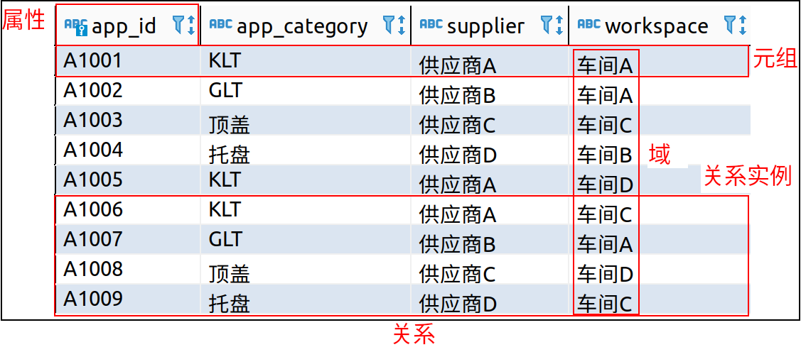

# 关系模型的术语

<table>
    <tr>
        <td width="30%">关系（relation）</td>
        <td width="15%">表（table）</td>
        <td width="55%">关系数据库由表的集合构成，每张表被赋予唯一的名称</td>
    </tr>
    <tr>
        <td>元组（tuple）</td>
        <td>行（row）</td>
        <td>表示表中的一组值之间的某种联系；关系是元组的集合</td>
    </tr>
    <tr>
        <td>属性（attribute）</td>
        <td>列（col）</td>
        <td></td>
    </tr>
    <tr>
        <td>关系实例（relation instance）</td>
        <td></td>
        <td>指代一个关系的特定实例，包含一组特定的行</td>
    </tr>
    <tr>
        <td>域（domain）</td>
        <td></td>
        <td>对于关系的每个属性都存在一个允许取值的集合（该属性的域）；对于所有关系r而言，r的所有属性的域都是原子的（atomic）</td>
    </tr>
    <tr>
        <td>空值（null value）</td>
        <td></td>
        <td>表示值未知或不存在</td>
    </tr>
</table>
 

# 模式与实例

<table>
    <tr>
        <td width="15%">数据库模式（databasse schema）</td>
        <td width="30%">数据库的逻辑设计</td>
        <td width="2%"></td>
        <td width="15%">关系模式（relation schema）</td>
        <td width="38%">类似于类型定义；一个关系模式由一个属性列表及各属性所对应的域组成</td>
    </tr>
    <tr>
        <td>数据库实例（database instance）</td>
        <td>在给定时刻数据库中数据的一个快照</td>
        <td></td>
        <td>关系实例（relation instance）</td>
        <td>类似于变量的值</td>
    </tr>
</table>

# 码 key

- 码（key）：一个元组的所有属性值必须能唯一标识元组，即必然存在超码。

<table>
    <tr>
        <td rowspan="2" width="25%"超码（superkey）</td>
        <td width="75%">一个或多个属性的集合，通过这些属性的组合可以在一个关系中唯一地标识出一个元组</td>
    </tr>
    <tr>
        <td>形式化地，令R表示关系r模式中的属性集合，R的一个子集K是r的一个超码。若元组t1和t2在r中，且t1≠t2，则t1K≠t2.K。</td>
    </tr>
    <tr>
        <td>候选码（candidate key）</td>
        <td>超码中可能存在无关紧要的属性，如果K是一个超码，则K的任意超集也是超码。而，如果K的任意真子集都不是超码，则K称为候选码（最小超码）</td>
    </tr>
    <tr>
        <td>主码（primary key）</td>
        <td>数据库设计者选中来作为在一个关系中区分不同元组的候选码，即主码约束（primary key constraint）</td>
    </tr>
</table>

  

## 外码

- 外码约束（foreign-key constraint）：从r1关系的A属性（集）到r2关系的主码B的外码约束表明，在任何数据库实例中，r1中每个元组对A的取值也必须是r2中某个元组对B的取值。A属性集被称为从r1引用r2的外码（foreign key）。r1被称为此外码约束的引用关系（referencing  key），r2被称为被引用关系（referenced  key）。
- 被引用属性集必须是被引用关系的主码，而更泛化的情况是引用完整性约束，放松了该要求。
- 引用完整性约束（referential integrity constraint）：要求引用关系中的任意元组在指定属性上出现的取值也必然出现在被引用关系中至少一个元组的指定属性上。当前大部分的数据库只实现了被引用属性集必须是被引用关系的主码的外码约束。

# 模式图

- 模式图（schema diagram）：一个带有主码和外码约束的数据库模式可以用模式图来表示。
- 主码属性用下划线标注，外码约束用从引用关系的外码属性指向被引用关系的主码属性的箭头来表示。

 

# 关系查询语言

- 查询语言（query language）：用户用来从数据库中请求获取信息的语言，比标准的程序设计语言的层次更高。查询语言分为命令式、函数式以及声明式的。

<table>
    <tr>
        <td width="30%">命令式查询语言 （imperative query language）</td>
        <td width="70%">用户指导系统在数据库上执行特定的运算序列以计算出所需的结果；这类语言通常由一个状态变量在计算的过程中被更新</td>
    </tr>
    <tr>
        <td rowspan="2">函数式查询语言 （functional query language）</td>
        <td>计算被表示为对函数的求值，这些函数可以在数据库中的数据上运行或在其他函数给出的结果上运行</td>
    </tr>
    <tr>
        <td>函数没有副作用，不更新程序的状态</td>
    </tr>
    <tr>
        <td>声明式查询语言 （declarative query language）</td>
        <td>用户只需描述所需信息，而不用给出获取该信息的具体步骤序列或函数调用，所需的信息通常使用某种形式的数学逻辑来描述</td>
    </tr>
</table>
