# 关系模型

## 术语

<table>
    <tr>
        <td width="30%">关系（relation）</td>
        <td width="15%">表（table）</td>
        <td width="55%">关系数据库由表的集合构成，每张表被赋予唯一的名称</td>
    </tr>
    <tr>
        <td>元组（tuple）</td>
        <td>行（row）</td>
        <td>表示表中的一组值之间的某种联系；关系是元组的集合</td>
    </tr>
    <tr>
        <td>属性（attribute）</td>
        <td>列（col）</td>
        <td></td>
    </tr>
    <tr>
        <td>关系实例（relation instance）</td>
        <td></td>
        <td>指代一个关系的特定实例，包含一组特定的行</td>
    </tr>
    <tr>
        <td>域（domain）</td>
        <td></td>
        <td>对于关系的每个属性都存在一个允许取值的集合（该属性的域）；对于所有关系r而言，r的所有属性的域都是原子的（atomic）</td>
    </tr>
    <tr>
        <td>空值（null value）</td>
        <td></td>
        <td>表示值未知或不存在</td>
    </tr>
</table>

 

## 模式与实例

<table>
    <tr>
        <td width="15%">数据库模式（databasse schema）</td>
        <td width="30%">数据库的逻辑设计</td>
        <td width="2%"></td>
        <td width="15%">关系模式（relation schema）</td>
        <td width="38%">类似于类型定义；一个关系模式由一个属性列表及各属性所对应的域组成</td>
    </tr>
    <tr>
        <td>数据库实例（database instance）</td>
        <td>在给定时刻数据库中数据的一个快照</td>
        <td></td>
        <td>关系实例（relation instance）</td>
        <td>类似于变量的值</td>
    </tr>
</table>

## 码 key

- 码（key）：一个元组的所有属性值必须能唯一标识元组，即必然存在超码。

<table>
    <tr>
        <td rowspan="2" width="25%">超码（superkey）</td>
        <td width="75%">一个或多个属性的集合，通过这些属性的组合可以在一个关系中唯一地标识出一个元组</td>
    </tr>
    <tr>
        <td>形式化地，令R表示关系r模式中的属性集合，R的一个子集K是r的一个超码。若元组t1和t2在r中，且t1&ne;t2，则t1K&ne;t2.K。</td>
    </tr>
    <tr>
        <td>候选码（candidate key）</td>
        <td>超码中可能存在无关紧要的属性，如果K是一个超码，则K的任意超集也是超码。而，如果K的任意真子集都不是超码，则K称为候选码（最小超码）</td>
    </tr>
    <tr>
        <td>主码（primary key）</td>
        <td>数据库设计者选中来作为在一个关系中区分不同元组的候选码，即主码约束（primary key constraint）</td>
    </tr>
</table>

  