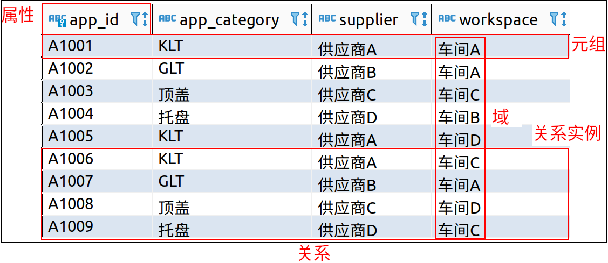

# 关系模型

## 术语

<table>
    <tr>
        <td width="30%">关系（relation）</td>
        <td width="15%">表（table）</td>
        <td width="55%">关系数据库由表的集合构成，每张表被赋予唯一的名称</td>
    </tr>
    <tr>
        <td>元组（tuple）</td>
        <td>行（row）</td>
        <td>表示表中的一组值之间的某种联系；关系是元组的集合</td>
    </tr>
    <tr>
        <td>属性（attribute）</td>
        <td>列（col）</td>
        <td></td>
    </tr>
    <tr>
        <td>关系实例（relation instance）</td>
        <td></td>
        <td>指代一个关系的特定实例，包含一组特定的行</td>
    </tr>
    <tr>
        <td>域（domain）</td>
        <td></td>
        <td>对于关系的每个属性都存在一个允许取值的集合（该属性的域）；对于所有关系r而言，r的所有属性的域都是原子的（atomic）</td>
    </tr>
    <tr>
        <td>空值（null value）</td>
        <td></td>
        <td>表示值未知或不存在</td>
    </tr>
</table>

 

## 模式与实例

<table>
    <tr>
        <td width="15%">数据库模式（databasse schema）</td>
        <td width="30%">数据库的逻辑设计</td>
        <td width="2%"></td>
        <td width="15%">关系模式（relation schema）</td>
        <td width="38%">类似于类型定义；一个关系模式由一个属性列表及各属性所对应的域组成</td>
    </tr>
    <tr>
        <td>数据库实例（database instance）</td>
        <td>在给定时刻数据库中数据的一个快照</td>
        <td></td>
        <td>关系实例（relation instance）</td>
        <td>类似于变量的值</td>
    </tr>
</table>

## 码 key

- 码（key）：一个元组的所有属性值必须能唯一标识元组，即必然存在超码。

<table>
    <tr>
        <td rowspan="2" width="25%">超码（superkey）</td>
        <td width="75%">一个或多个属性的集合，通过这些属性的组合可以在一个关系中唯一地标识出一个元组</td>
    </tr>
    <tr>
        <td>形式化地，令R表示关系r模式中的属性集合，R的一个子集K是r的一个超码。若元组t1和t2在r中，且t1&ne;t2，则t1K&ne;t2.K。</td>
    </tr>
    <tr>
        <td>候选码（candidate key）</td>
        <td>超码中可能存在无关紧要的属性，如果K是一个超码，则K的任意超集也是超码。而，如果K的任意真子集都不是超码，则K称为候选码（最小超码）</td>
    </tr>
    <tr>
        <td>主码（primary key）</td>
        <td>数据库设计者选中来作为在一个关系中区分不同元组的候选码，即主码约束（primary key constraint）</td>
    </tr>
</table>
  

### 外码

- 外码约束（foreign-key constraint）：从r1关系的A属性（集）到r2关系的主码B的外码约束表明，在任何数据库实例中，r1中每个元组对A的取值也必须是r2中某个元组对B的取值。A属性集被称为从r1引用r2的外码（foreign key）。r1被称为此外码约束的引用关系（referencing  key），r2被称为被引用关系（referenced  key）。
- 被引用属性集必须是被引用关系的主码，而更泛化的情况是引用完整性约束，放松了该要求。
- 引用完整性约束（referential integrity constraint）：要求引用关系中的任意元组在指定属性上出现的取值也必然出现在被引用关系中至少一个元组的指定属性上。当前大部分的数据库只实现了被引用属性集必须是被引用关系的主码的外码约束。

## 模式图

- 模式图（schema diagram）：一个带有主码和外码约束的数据库模式可以用模式图来表示。
- 主码属性用下划线标注，外码约束用从引用关系的外码属性指向被引用关系的主码属性的箭头来表示。

 

## 关系查询语言

- 查询语言（query language）：用户用来从数据库中请求获取信息的语言，比标准的程序设计语言的层次更高。查询语言分为命令式、函数式以及声明式的。

<table>
    <tr>
        <td width="30%">命令式查询语言 （imperative query language）</td>
        <td width="70%">用户指导系统在数据库上执行特定的运算序列以计算出所需的结果；这类语言通常由一个状态变量在计算的过程中被更新</td>
    </tr>
    <tr>
        <td rowspan="2">函数式查询语言 （functional query language）</td>
        <td>计算被表示为对函数的求值，这些函数可以在数据库中的数据上运行或在其他函数给出的结果上运行</td>
    </tr>
    <tr>
        <td>函数没有副作用，不更新程序的状态</td>
    </tr>
    <tr>
        <td>声明式查询语言 （declarative query language）</td>
        <td>用户只需描述所需信息，而不用给出获取该信息的具体步骤序列或函数调用，所需的信息通常使用某种形式的数学逻辑来描述</td>
    </tr>
</table>

# SQL

<table>
    <tr>
        <td width="35%">数据定义语言 （Data-Definition Language，DDL）</td>
        <td width="65%">SQL DDL提供定义关系模式、删除关系以及修改关系模式的命令</td>
    </tr>
    <tr>
        <td>数据操纵语言 （Data-Manipulation Language，DML）</td>
        <td>SQL DML提供从数据库中查询信息以及在数据库中插入元组、删除元组、修改元组的能力</td>
    </tr>
</table>

## DDL

<table>
    <tr>
        <td width="30%">完整性（integrity）</td>
        <td width="70%">SQL DDL包括定义完整性约束的命令，保存在数据库中的数据必须满足所定义的完整性约束。破坏完整性约束的更新是不允许的。</td>
    </tr>
    <tr>
        <td>视图定义（view definition）</td>
        <td>SQL DDL包括定义视图的命令</td>
    </tr>
    <tr>
        <td>事务控制（transaction control）</td>
        <td>SQL包括定义事务的开始点和结束点的命令</td>
    </tr>
    <tr>
        <td>嵌入式SQL（embedded SQL）</td>
        <td></td>
    </tr>
    <tr>
        <td>动态SQL（dynamic SQL）</td>
        <td></td>
    </tr>
    <tr>
        <td>授权（authorization）</td>
        <td>SQL DDL包括定义对更新和视图的访问权限的命令</td>
    </tr>
</table>

- SQL DDL不仅能够定义关系的集合，还能够定义有关每个关系的信息，包括每个更新的模式、每个属性的取值类型、完整性约束、为每个更新维护的索引集合、每个关系的安全性和权限信息、每个关系在磁盘上的物理存储结构。

### 基本类型

<table>
    <tr>
        <td width="20%" rowspan="2">char(n)</td>
        <td width="80%">具有用户指定长度n的固定长度的字符串（character）</td>
    </tr>
    <tr>
        <td>char类型会在字符串的内容长度未达到n时，追加适当的空格来补全以达到n长度；且在比较两个不同长度的char类型时，会在短值char后追加空格以使得长度相等</td>
    </tr>
    <tr>
        <td>varchar(n)</td>
        <td>具有用户指定的最大长度n的可变长度的字符串（character varying）</td>
    </tr>
    <tr>
        <td>int</td>
        <td>整数（依赖于机器的整数的有限子集），integer</td>
    </tr>
    <tr>
        <td>smallint</td>
        <td>小整数（依赖于机器的整数类型的子集）</td>
    </tr>
    <tr>
        <td>numeric(p,d)</td>
        <td>具有用户指定精度的定点数。该数有p为数学（加上一位符号位），并且小数点右边有p位中的d位数字</td>
    </tr>
    <tr>
        <td>real</td>
        <td rowspan="2">浮点数与双精度浮点数，精度依赖于机器</td>
    </tr>
    <tr>
        <td>double precision</td>
    </tr>
    <tr>
        <td>float(n)</td>
        <td>精度至少为n位数字的浮点数</td>
    </tr>
</table>

### 基本模式定义

# 形式化关系查询语言

## 关系代数

- 关系代数由一组运算组成，这些运算接受一个或两个关系作为输入（一元运算、二元运算），并生成一个新的关系作为它们的结果。

### 选择运算 &sigma;

- 选择运算（select）选出满足给定谓词的元组，&sigma;表示选择。

1. 谓词写在&sigma;的下标中，作为参数的关系写在&sigma;后的括号内。
2. 允许在选择谓词中使用=、&ne;、&lt;、&le;、&gt;、&ge;来进行比较。
3. 可以通过使用连接词and（&and;）、or（&or;）、not（&not;）将几个谓词组合成一个更长的谓词。

- &sigma;dep_name="Physics" &and; salary&ge;8500(instructor)：查询教师表（instructor）中属于物理系（dep_name="Physics"）且工资（salary）大于等于8500的教师。

### 投影运算 &Pi;

- 投影运算（project）是一种一元运算，返回它的参数关系，但滤掉了特定的属性。

- &Pi;表示投影，将希望出现在结果中的属性作为&Pi;的下标列出。

- &Pi;id,name,salary(instructor)：查询教师表（intructor）生成属性包括id、name、salary的投影。