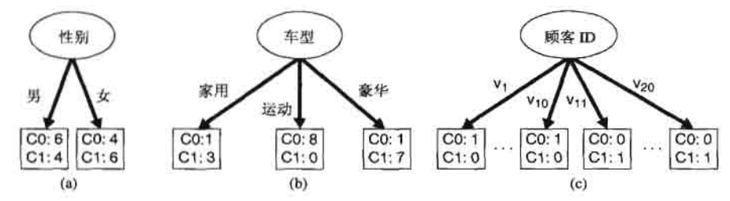
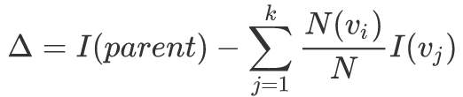
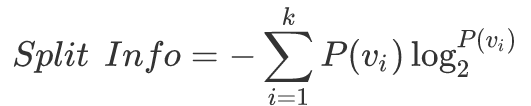

# 解决分类问题的一般方法

##  学习算法

- 学习算法（learning algorithm），分类法的例子包括决策树分类法、基于规则的分类法、神经网络、支持向量机和朴素贝叶斯分类法。

1. 首先需要一个训练集（training set），由类标号已知的记录组成。
2. 使用训练集建立分类模型，该模型随后将运用于检验集（test set）。检验集由类标号未知的记录组成。

  

## 混淆矩阵

<table>
    <tr>
        <td rowspan="2" colspan="2"></td>
        <td colspan="2">预测的类</td>
    </tr>
    <tr>
        <td>类=1、+</td>
        <td>类=0、-</td>
    </tr>
    <tr>
        <td width="10%" rowspan="2">实际的类</td>
        <td width="10%">类=1、+</td>
        <td width="20%">f11、f++、TP</td>
        <td width="20%">f10、f+-、FN</td>
    </tr>
    <tr>
        <td>类=0、-</td>
        <td>f01、f-+、FP</td>
        <td>f00、f--、TN</td>
    </tr>
</table>

 

 

<table>
    <tr>
        <td width="40%">真正率（True Positive Rate，TPR） 灵敏度（sensitivity）</td>
        <td width="60%">TPR=TP/(TP+EN)</td>
    </tr>
    <tr>
        <td>真负率（True Negative Rate，TNR） 特指度（specification）</td>
        <td>TNR=TN/(TN+FP)</td>
    </tr>
    <tr>
        <td>假正率 FPR</td>
        <td>FPR=FP/(FP+TN)</td>
    </tr>
    <tr>
        <td>假负率 FNR</td>
        <td>FNR=FN/(FN+TP)</td>
    </tr>
</table>

- 真正率是所有“正”中被判定为“真的正”的频率（无误的判正）；而假正率是所有“负”中被判定为“假的正”的频率（错误的判正）；以此类推。

# 决策树归纳

## 决策树的工作原理

- 决策树是一种由结点和有向边组成的层次结构。

<table>
    <caption>决策树的三种结点</caption>
    <tr>
        <th>结点类型</th>
        <th>入边数量</th>
        <th>出边数量</th>
    </tr>
    <tr>
        <td width="34%">根结点 root node</td>
        <td width="33%">0</td>
        <td width="33%">0~n</td>
    </tr>
    <tr>
        <td>内部结点 internal node</td>
        <td>1</td>
        <td>2~n</td>
    </tr>
    <tr>
        <td>叶结点 leaf node 终结点 terminal node</td>
        <td>1</td>
        <td>0</td>
    </tr>
</table>

 

- 决策树的特点：

1. <b>树状结构</b>，可以很好的对数据进行分类。
2. 决策树的根节点到叶节点的每一条路径都构建一条<b>规则</b>
3. 具有<b>互斥且完备</b>的特点，即每一个样本均被且只能被一条路径所覆盖
4. 只要提供的数据量足够庞大真实，通过<b>数据挖掘模式</b>，就可以构造决策树。

## 如何建立决策树

### [Hunt算法](../Algorithm/Hunt.md)

### 属性测试条件的表示方法

- 属性类型：标称、序数、连续（区间、比率）。
- 分割方式的数量：双向分割（二元划分）、多路分离。

<table>
    <tr>
        <th width="10%">属性类型</th>
        <th width="90%">分组方法</th>
    </tr>
    <tr>
        <td>标称</td>
        <td></td>
    </tr>
    <tr>
        <td>序数</td>
        <td>只要不违背序数属性值的<b>有序性</b>即可对属性值进行分组。例如，{small,lager}和{mediam}是不被允许的</td>
    </tr>
    <tr>
        <td rowspan="2">连续</td>
        <td>二元决策：测试条件可以是具有二元输出的比较测试（A&lt;v或A&ge;v）。必须考虑所有可能的划分点v，并从中选择产生最佳划分的点</td>
    </tr>
    <tr>
        <td>离散化以形成<b>有序</b>分类属性：测试条件可以是形如vi&le;A&lt;vi+1（i=1,...,k）输出的范围查询。必须考虑所有可能的连续值区间，并且在离散化后，尽可能给每个离散化区间赋予一个新的序数值，保持有序性</td>
    </tr>
</table>

### 选择最佳划分的度量：不纯性

 

- 设<code>p(i|t)</code>表示给定结点t中属于类i的记录所占的比例。选择最佳划分的度量通常是根据划分后子女结点不纯性的程度，不纯的程度越低，类发布就越倾斜（低不纯性）。

#### 单个结点不纯性的测量：Entropy、Gini、Classification error

  

- c是类的数量，且log20=0。

 

#### &Delta;增益：选择合适的划分条件

- 为了确定测试条件的效果，需要比较父结点（划分前）的不纯度和子结点（划分后）的不纯度，也就是<b>增益&Delta;（Gain）</b>，增益越大，说明划分的效果越好。

 

- <code>I(.)</code>是给定结点的不纯性度量，<code>N</code>是父结点上的记录总数，<code>k</code>是属性的个数，<Code>N(vj)</Code>是与子结点vj相关联的记录个数。
- 在意思上，也可以表示为 <code>&Delta; = I(parent) - E(parent)</code>

1. &Delta;也可以使用G（Gain，增益）表示
2. <code>E</code>（所有子结点不纯性的加权平均）和公式中的是等价的。

- 当选择熵（<a href="#Entropy">Entropy</a>）作为公式的不纯性度量（<code>I(.)</code>）时，熵的差也就是<b>信息增益 &Delta;info（information gain）</b>。
- 计算增益&Delta;可以用于构建决策树，也就是选择合适的条件（max&Delta;）的条件作为根结点，再以此为基础，向下延伸子结点。

#### 增益率

- <b>增益率（gain ratio）</b>

 

- 划分信息 ，<code>k</code>是划分的总数。

## 决策树归纳算法

## 决策树归纳的特点

# 模型的过分拟合

## 欠拟合和过拟合

<table>
    <tr>
        <td width="30%" rowspan="2">训练误差（training error）</td>
        <td width="70%">又称 再代入误差（resubstitution error）或 表现误差（apparent error）</td>
    </tr>
    <tr>
        <td>训练误差是在训练记录上的误分类比例</td>
    </tr>
    <tr>
        <td>泛化误差（generalization error）</td>
        <td>泛化误差模型在未知记录上的期望误差</td>
    </tr>
</table>

1. 一个好的分类模型必须具有低训练误差和低泛化误差。
2. 对训练数据拟合度过高的模型，其泛化误差可能比具有较高训练误差的模型高，也就是<b>模型的过分拟合</b>。

<table>
    <tr>
        <td width="30%" rowspan="4">模型拟合不足 （model underfitting，欠拟合）</td>
        <td colspan="2">当决策树很小时，训练和检验误差都很大</td>
    </tr>
    <tr>
        <td colspan="2">根本原因是特征维度过少，模型过于简单，导致拟合的函数无法满足训练集，误差较大;</td>
    </tr>
    <tr>
        <td rowspan="2">解决方法</td>
        <td>增加特征维度</td>
    </tr>
    <tr>
        <td>增加训练数据</td>
    </tr>
    <tr>
        <td rowspan="4">模型过分拟合 （model overfitting，过拟合）</td>
        <td colspan="2">一旦树的规模变得太大，即使训练误差还在继续降低，但检验误差开始增大</td>
    </tr>
    <tr>
        <td colspan="2">根本原因是特征维度过多，模型假设过于复杂，参数过多，训练数据过少，噪声过多，导致拟合的函数完美的预测训练集，但对新数据的测试集预测结果差。过度的拟合了训练数据，而没有考虑到泛化能力。</td>
    </tr>
    <tr>
        <td rowspan="2" width="15%">解决方法</td>
        <td width="55%">减少特征维度</td>
    </tr>
    <tr>
        <td>正则化，降低参数值</td>
    </tr>
</table>

## 泛化误差的估计

### 奥卡姆剃刀

- 奥卡姆剃刀（Occam's razor）（节俭原则，principle of parsimony）：给定的两个具有相同泛化误差的模型，较简单的模型 比 较复杂的模型 更可取。
- 因为，复杂模型中的附加成分很大程度上是完全对偶然的拟合。

## 处理过分拟合

### 预修剪

- 预修剪（先剪枝、提前停止规则）的树增长算法在产生完全拟合整个训练集的完全增长的决策树<b>之前</b>就停止决策树的生长。
- 预修剪可以避免产生过分拟合训练数据的过于复杂的子树，但需要选取合适的<b>阈值</b>。阈值可以是决策树的最大层次、增益等指标。

1. 阈值过高，导致拟合不足的模型（欠拟合）。
2. 阈值过低，不能充分解决<q>过拟合</q>的问题。

- 节点的典型停止条件：

1. 如果所有样本属于同一个类，则停止。
2. 如果所有属性值都相同，则停止。

- 更多限制性条件：

1. 如果样本数量小于用户指定的阈值，则停止。
2. 如果样本的类分布与可用功能无关，则停止。
3. 如果扩展当前节点不能改善不纯度度量（如Gini系数或信息增益），则停止。

### 后修剪

- 后修剪（后剪枝）在决策树增长到最大规模后，按照自底向上的方式修剪<b>完全增长的决策树</b>。如果修剪后的泛化误差得到改善，则通常有以下两种修剪方法：

1. 用新的叶节点替换子树，该叶节点的类标号由子树下记录的多数类确定。
2. 用子树中最常用的分支替代子树。

# 评估分类器的性能

## 保持方法

- 在保持方法（Holdout，留出法）中，将标记的原始数据划分成两个不相交的集合（训练集和检验集）。

1. 用于训练的被标记样本较少，建立的模型不如所有被标记样本建立的模型好。
2. 模型可能高度依赖于训练集和检验集的构成。
3. 训练集和检验集不再是相互独立的，因为训练集和检验集来源于同一个数据集。

## 随机二次抽样

- 随机二次抽样（random subsampling）通过多次重复保持方法来改进对分类器性能的估计。
- 设 acci是第i次迭代的模型准确率，总准确率是。

## 交叉验证 

- 

