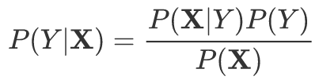
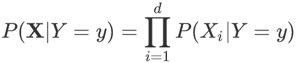
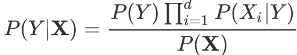
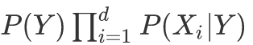
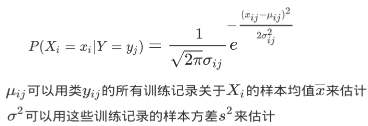

# 基于规则的分类器

# 贝叶斯分类器

## 贝叶斯定理与贝叶斯分类器

- 贝叶斯定理（Bayes theorem）是一种把类的先验知识和从数据中收集的新证据相结合的统计原理，主要有两种贝叶斯分类器的实现：朴素贝叶斯、贝叶斯信念网络。

- 设<b>X</b>表示属性集，Y表示类变量。如果类变量和属性之间的关系不确定，那么可以将<b>X</b>和Y看作随机变量。

<table>
    <tr>
        <td width="10%">P(Y|<b>X</b>)</td>
        <td width="25%">Y的后验概率 （posterior probability）</td>
        <td width="70%">P(Y|<b>X</b>)通过概率的方式来捕捉<b>X</b>和Y之间的关系</td>
    </tr>
    <tr>
        <td>P(Y)</td>
        <td>Y的先验概率 （prior probability）</td>
        <td></td>
    </tr>
    <tr>
        <td>P(<b>X</b>|Y)</td>
        <td>类条件概率 （class-conditional）</td>
        <td></td>
    </tr>
</table>

 

## 朴素贝叶斯分类器

- 给定类标号y，朴素贝叶斯分类器在估计类条件概率 P(<b>X</b>|Y) 时，假设属性之间条件独立，每个属性集<code><b>X</b>={X1, ... , Xd}</code>包含d个属性。

 

1. 条件独立性 。
2. <b>朴素贝叶斯分类器的工作方式</b>：对每个类Y计算后验概率，只要找出最大的即可，就归到那一类。

- 朴素贝叶斯分类法有两种方法来估计连续属性的条件概率。

1. [离散化](./数据与探索数据.md#连续属性离散化)。
2. 假设连续变量服从某种概率分布，然后使用训练数据估计分布的参数。<b>高通分布</b>通常被用来表示连续属性的类条件概率分布。该分布有两个参数：均值&mu;和方差&sigma;2。对每个类yj，属性Xi的类条件概率等于：

  

