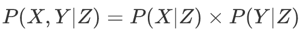

# 基于规则的分类器

# 贝叶斯分类器

## 贝叶斯定理与贝叶斯分类器

- 贝叶斯定理（Bayes theorem）是一种把类的先验知识和从数据中收集的新证据相结合的统计原理，主要有两种贝叶斯分类器的实现：朴素贝叶斯、贝叶斯信念网络。

- 设<b>X</b>表示属性集，Y表示类变量。如果类变量和属性之间的关系不确定，那么可以将<b>X</b>和Y看作随机变量。

<table>
    <tr>
        <td width="10%">P(Y|<b>X</b>)</td>
        <td width="25%">Y的后验概率 （posterior probability）</td>
        <td width="70%">P(Y|<b>X</b>)通过概率的方式来捕捉<b>X</b>和Y之间的关系</td>
    </tr>
    <tr>
        <td>P(Y)</td>
        <td>Y的先验概率 （prior probability）</td>
        <td></td>
    </tr>
    <tr>
        <td>P(<b>X</b>|Y)</td>
        <td>类条件概率 （class-conditional）</td>
        <td></td>
    </tr>
</table>

 

## 朴素贝叶斯分类器

- 给定类标号y，朴素贝叶斯分类器在估计类条件概率 P(<b>X</b>|Y) 时，假设属性之间条件独立，每个属性集<code><b>X</b>={X1, ... , Xd}</code>包含d个属性。

 

1. 条件独立性 。
2. <b>朴素贝叶斯分类器的工作方式</b>：对每个类Y计算后验概率，只要找出最大的即可，就归到那一类。
3. 注意项：<code>P(Y=y)</code>切记不可遗漏。

- 朴素贝叶斯分类法有两种方法来估计连续属性的条件概率。

1. [离散化](./数据与探索数据.md#连续属性离散化)。
2. 假设连续变量服从某种概率分布，然后使用训练数据估计分布的参数。<b>高斯分布</b>通常被用来表示连续属性的类条件概率分布。该分布有两个参数：均值&mu;和方差&sigma;2。对每个类yj，属性Xi的类条件概率等于：

  

# 组合方法

## 组合方法概述

- 组合（ensemble）或分类器组合（classifier combination）方法通过聚集多个分类器的预测来提高分类准确率。组合方法由训练数据构建一组基分类器（base classifier），然后通过对每个基分类器的预测进行投票来进行分类。

- 构建组合分类器的方法：

1. 通过处理训练数据集：装袋（bagging）和提升（boosting）。
2. 通过处理输入特征：随机森林（Random forest）。
3. 通过处理类标号：错误-纠正输出编码（error-correcting output coding）。
4. 通过处理学习算法：注入随机性。

## 装袋

- 装袋（bagging）（自助聚集，boot strap aggregation）是一种根据均匀概率分布从数据集中重复抽样（有返回）的技术。

1. 装袋有助于减低训练数据的随机波动导致的误差。
2. 装袋并不侧重于训练数据集中的任何特定实例。在用于噪声数据时，装袋不太受过分拟合的影响。

## 提升

- 提升（boosting）是一个迭代的过程，用来自适应地改变训练样本的分布，使得基分类器聚焦在那些很难分类的样本上，即更多地关注先前错误分类的记录。

1. 提升给每个训练样本赋一个权值，并可以在每一轮提升过程结束时，自动地调整权值。
2. 增加被错误分类的样本的权值，减小被正确分类的样本的权值。

## 随机森林

- 随机森林（Random Forest）组合多棵决策树做出的预测（投票方式），其中每棵树都是基于随机向量的一个独立集合的值产生的。