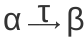

# DBAS开发方法

# E-R模型

## 数据库设计过程概述

### 设计阶段

<table>
    <tr>
        <td width="15%">最初阶段</td>
        <td width="20%">用户需求规格说明</td>
        <td width="65%">完整地描述未来数据库用户的数据需求</td>
    </tr>
    <tr>
        <td rowspan="3">概念设计阶段 （conceptual-design）</td>
        <td>概念模式</td>
        <td>概念模式明确规定了数据库中表示的实体、实体的属性、实体之间的联系，以及实体和联系上的约束</td>
    </tr>
    <tr>
        <td>E-R图</td>
        <td>通常该阶段会导致实体-联系图（E-R图）的构建，提供对模式的图形化支持</td>
    </tr>
    <tr>
        <td>功能需求规格说明 （specification of functional requirement）</td>
        <td>企业的功能需求，用户描述将在数据上执行的各类操作（事务）；设计者检查模式以确保其满足功能需求</td>
    </tr>
    <tr>
        <td>逻辑设计阶段 （logical-design phase）</td>
        <td>关系数据模型</td>
        <td>设计者将高层概念模式映射到将被使用的数据库系统具体实现的数据模型，通常是关系数据模型。通常包括将采用实体-联系模型定义的概念模式映射到关系模式</td>
    </tr>
    <tr>
        <td>物理设计阶段 （physical-design phase）</td>
        <td></td>
        <td>数据库的物理特性被具体说明</td>
    </tr>
</table>

### 设计选择

1. 冗余：信息的冗余表达最大的问题是，如果对一条信息进行了更新却没有更新其全部的拷贝，那么这条信息的拷贝将会不一致。
2. 不完整

## 实体-联系模型（E-R数据模型）

- 实体-联系模型（E-R数据模型）通过允许定义代表数据库全局逻辑的企业模式（enterprise schema）来方便数据库的设计。
- E-R数据模型采用了三个基本概念：实体集、联系集、属性；一种相关联的图形表示：E-R图（E-R diagram）。

<table>
    <tr>
        <td width="20%"><a href="#实体集">实体集</a> （entity set）</td>
        <td width="40%">共享相同性质或属性的、具有相同类型的实体的集合</td>
        <td width="40%">矩形，第一部分表示实体集名称，第二部分表示实体集所有属性的名称（仅在第一次出现时列出该部分即可），后续再次出现相同的实体集，则应该只保留第一部分</td>
    </tr>
    <tr>
        <td><a href="#联系集">联系集</a> （relationship set）</td>
        <td>相同类型的联系的集合</td>
        <td>菱形，通过线条连接到多个不同的实体集</td>
    </tr>
    <tr>
        <td><a href="#属性">属性</a> （attribute）</td>
        <td>实体集中每个成员所拥有的描述性性质</td>
        <td></td>
    </tr>
</table>

 

### 实体集

- 实体（entity）：一个实体是现实中可区别于所有其他对象（唯一性）的一个“事物”或“对象”（具体、抽象）。每个实体有一组性质，并且某些性质集合的值必须唯一地标识一个实体。实体通过一组[属性](#属性)来表示。
- 实体集（entity set）：共享相同性质或属性的、具有相同类型的实体的集合。

- 实体集的外延（extension）：属于实体集的实体的实际集合。如大学中教师的实际集合构成了instructor实体集的外延。

### 联系集

- 联系（relationship）：多个实体间的相互关联。

- 联系集（relationship set）：相同类型联系的集合。
- 联系实例（relationship instance）：E-R模式中的一个联系实例表示在所建模的现实企业中被命名的实体之间的一种关联。
- 联系集是在n&ge;2个（可能相同的）实体集上的数学关系。如果E1,E2,...,En为实体集，那么联系集R是<code>{(e1,e2,...en)|e1&isin;E1,e2&isin;E2,...,en&isin;En}</code>的一个子集，其中（e1,e2,...,en）是一个联系实例。
- 实体集之间的关联被称为参与（participate），即实体集E1,E2,...,En参与联系集R。实体在联系中扮演的功能被称为实体的角色（role），在E-R图中实体集和联系集之间的连线上标注出角色。

1. 如果参与一个联系集的实体集是互异的，则角色通常是隐含的且并不指定。
2. 如果同样的实体集以不同的角色多次参与一个联系集，则有必要使用显式的角色名来指明实体是如何参与联系实例的，此类联系集也被称为递归的联系集（recursive）。

- 描述性属性（descriptive attribute）：联系也可以具有多个被称为描述性属性的属性。在E-R图中使用未分割的矩形来表示，使用虚线将该矩形与表示该联系集的菱形相连接。

 

- 联系集的度（degree）：参与联系集的实体集的数目。二元联系集（binary relationship set）的度为2，三元联系集（ternary relationship set）的度为3。

### 属性

- 属性（attribute）是实体集中每个成员所拥有的描述性性质。为实体集设计一个属性表明数据库存储关于该实体集中每个实体的类似信息，每个实体在他的每个属性都有一个值。

- 域（domain）或 值集（value set）：对于每个属性都有一个可取值的集合，称为该属性的域或值集。

<table>
    <tr>
        <td width="30%">简单属性（simple）</td>
        <td width="70%">不能被划分为子部分的属性</td>
    </tr>
    <tr>
        <td rowspan="2">复合属性（composite）</td>
        <td>可以被划分为子部分（其他属性）的属性，如电话号码可以被划分为区域号等部分</td>
    </tr>
    <tr>
        <td>若用户希望在一些场景中引用整个属性，而在另外的场景中仅引用属性的一部分，则可以选择采用复合属性</td>
    </tr>
    <tr>
        <td></td>
        <td></td>
    </tr>
    <tr>
        <td>单值属性（single-valued）</td>
        <td>一个属性只对应一个值</td>    </tr>
    <tr>
        <td>多值属性（multivalued）</td>
        <td>一个属性可能对应于一组值（0..n）</td>
    </tr>
    <tr>
        <td></td>
        <td></td>
    </tr>
    <tr>
        <td>派生属性（derived attribute）</td>
        <td>该类属性的值可以从其他相关属性或实体的值派生出来。派生属性的值并不存储，而是在需要时被计算出来</td>
    </tr>
    <tr>
        <td>基属性（base）</td>
        <td>存储的属性（stored），用于计算出派生属性的值</td>
    </tr>
</table>

 

### 映射基数

- 映射基数（mapping cardinality，基数比率）表示一个实体能通过一个联系集关联的另一些实体的数量，可用于指定关于现实世界中允许哪些联系的约束。
- 对于实体集A和B之间的二元联系集R来说，映射基数必然是以下情况之一：一对一、一对多、多对一、多对多。

#### 有向线段或无向线段

- 在E-R图表示法中，通过在联系集和相关实体集之间绘制有向线段或无向线段来指明联系上的基数约束。

 

<table>
    <tr>
        <td width="10%">全部参与</td>
        <td width="80%">如果实体集E中的每个实体都必须参与到联系集R中的至少一个联系中，那么实体集E在联系集R中的参与就是全部的</td>
        <td width="10%">双线</td>
    </tr>
    <tr>
        <td>部分参与</td>
        <td>如果实体集E中的一些实体可能不参与到联系集R中的联系中，那么实体集E在联系集R中的参与就是部分的</td>
        <td>单线</td>
    </tr>
</table>

 

#### l..h

- 在E-R图中提供了描述更复杂的约束的方式，即限制了每个实体参与联系集中的联系的次数的约束。在线段上可以有一个关联的最小和最大基数，用`l..h`的形式表示，`l`表示最小基数、`h`表示最大基数。

1. 最小值为1表示实体集全部参与联系集，即实体集中的每个实体在该联系集中的至少一个联系中出现。
2. 最大值为1表示实体至多参与一个联系；而最大值为`*`则表示没有限制。

 

### 主码

#### 实体集

- [关系模式](./关系语言.md#码)中的超码、候选码、主码的概念适用于实体集。

#### 联系集

- 联系集主码的构成依赖于与联系集R相关联的属性集合。联系集的主码是那些没有被来自联系集R的箭头指向的、参与实体集Ei主码的并集。

##### 二元联系集

- 二元联系集主码的选择取决于联系集的映射基数。若存在联系集R涉及实体集E1 E2,..,En，实体集Ei的主码为primary-key(Ei)，则：

<table>
    <tr>
        <th>情况</th>
        <th>联系集的主码</th>
    </tr>
    <tr>
        <td width="10%">多对多</td>
        <td width="90%">primary-key(E1)&cup;primary-key(E2)&cup;..&cup;primary-key(En)</td>
    </tr>
    <tr>
        <td>一对多 多对一</td>
        <td>“多”方的主码是最小的超码，并作为联系集的主码</td>
    </tr>
    <tr>
        <td>一对一</td>
        <td>任一参与实体集的主码都构成最小超码，并可任意选择一个作为联系集的主码</td>
    </tr>
</table>

##### 非二元联系集

- 对于非二元联系集，如果不存在基数约束，那么其唯一的候选码就是primary-key(E1)&cup;primary-key(E2)&cup;..&cup;primary-key(En)。
- 对于非二元联系集，如果存在基数约束，假设实体集E1、E2、E3、E4之间有联系集R，并且只有指向实体集E3和E4的边带箭头（多箭头的情况），那么具有两种不同的正确解释，需要通过函数依赖（functional dependency）来指定，或使用实体集替代非二元联系集（一个非二元联系集总是可以用一组不同的二元联系集来替代）：

1. 来自E1、E2的一个特定实体组合可以和至多一个来自E3、E4的实体组合相关联。因此，联系R的主码可以用E1和E2的主码的并集来构造。
2. 来自E1、E2、E3的一个特定实体组合至多可以和一个来自E4的实体组合相关联，并且来自E1、E2、E4的一个特定实体组合至多可以和一个来自E3的实体组合相关联。那么，E1、E2、E3的主码的并集构成一个候选码，E1、E2、E4的主码的并集也构成一个候选码。

#### 弱实体集

- 弱实体集（weak entity set）存在依赖于标识性实体集（identifying entity set），标识性实体集被称为拥有它所标识的弱实体集。通过使用标识性实体集的主码以及被称为分辨符属性（discriminator attribute）的额外属性来唯一地标识弱实体（作为弱实体集的主码），而不是将主码与弱实体集相关联。非弱实体集的实体集被称为强实体集（strong entity set）。
- 标识性联系（identifying relationship）是将弱实体集与标识性实体集相关联的联系，是从弱实体集到标识性实体集的多对一联系，并且弱实体集在联系中的参与是全部的。标识性联系不应该有任何描述性属性。
- 弱实体集可以参与除标识性联系之外的其他联系。弱实体集可以作为属主参与与一个弱实体集的标识性联系。一个弱实体集也可能与不止一个标识性实体集相关联。
- 在E-R图中，通过双边框的矩形描述弱实体集，其分辨符被加上虚的下划线。标识性联系使用双边框的菱形来表示。

 

## 从实体集删除冗余属性

- 将实体集中的实体和另一个实体集中的实体的关联统一看成联系，通过联系集来实现，而不是作为它们的一个属性（导致冗余），从而使得逻辑关系明确，并有助于避免过早的假设基数约束。

## 将E-R图转换为关系模式

- 在数据库设计中，对于每个实体集以及每个联系集，都有唯一的关系模式与之对应。
- 一个关系模式是一个属性集，但并非所有属性集都是模式。

### 强实体集

- 对于从强实体集转换而来的模式，强实体集的主码就作为所得到的模式的主码。每个元组都对应于实体集中的一个特定实体。

<table>
    <tr>
        <th>复杂属性</th>
        <th>表示方式</th>
    </tr>
    <tr>
        <td width="10%">复合属性</td>
        <td width="90%">为每个成员属性创建一个单独的属性，而不是为复合属性创建</td>
    </tr>
    <tr>
        <td>多值属性</td>
        <td>构建新的关系模式来存放。对于一个多值属性M，构建关系模式R，R具有一个对应于M的属性A，以及对应于M所在实体集或联系集的主码的属性。此外，在R上建立外码约束，R中根据实体集主码生成的属性必须引用根据实体集生成的关系</td>
    </tr>
    <tr>
        <td>派生属性</td>
        <td>表示为存储过程、函数或方法</td>
    </tr>
</table>

### 弱实体集

- 对于从弱实体集转换而来的模式R，R的主码由其强实体集（标识性实体集）的主码与弱实体集的分辨符组成。此外，在R上建立外码约束，确保对于表示弱实体的每个元组，都有一个表示对应强实体的元组与之对应。

### 联系集

- 联系集R的主码属性也被用于关系模式R的主码属性。此外，对于联系集R所关联的每个实体集Ei，从关系模式R创建外码约束，从Ei导出的R的属性引用表示Ei的关系模式的主码。
- 对于同个实体集多次参与同一个联系集，其与该联系相关联的角色标识被用作属性的名称。

### 模式的冗余

- 一般而言，连接弱实体集与标识性实体集（强实体集）的联系集的模式是冗余的。

### 模式的合并

- 合并后模式的主码是其模式中融入了联系集模式的那个实体集的主码。
- 在一对一联系的情况下，联系集的关系模式可以根参与联系的任何一个实体集的模式进行合并。
- 对于全部参与，可以将实体集和其全部参与的联系集合并为单个模式，属性由这两个模式的属性的并集组成；对于部分参与，可以通过使用空值来进行模式合并。

## 扩展的E-R特性

# 关系数据库设计

## 良构的关系模式

### 分解

- 对于信息重复问题（“非良构的”），一般来说，可能必须将表现出信息重复的模式分解为几个较小的模式。并非所有的模式分解都是有益的。
- 令R为关系模式，R1和R2构成R的分解，即在属性集上R=R1&cup;R2。如果用R1和R2去替代R时没有信息丢失，则称该分解为无损分解。如果关系r(R)的一个实例所包含的信息无法表示，而必须使用r1(R1)和r2(R2)的实例来表示，则为有损分解（拥有更多的元组，却拥有更少的信息）。

<table>
    <tr>
        <td width="30%">有损分解 （lossy decomposition）</td>
        <td width="30%">造成信息丢失的分解</td>
        <td width="40%">r&sub;&Pi;R1(r) &bowtie;&Pi;R2(r)</td>
    </tr>
    <tr>
        <td>无损分解 （lossless decomposition）</td>
        <td>没有信息丢失的分解</td>
        <td>&Pi;R1(r) &bowtie;&Pi;R2(r)=r</td>
    </tr>
</table>

### 规范化理论

- 规范化（normalization）：用于设计关系数据库的方法是使用一个通常称为规范化的过程。其目标是生成一组关系模式，允许我们存储信息并避免不必要的冗余，以及轻松地检索信息。

1. 确定一个给定的关系模式是否为“良构的”（范式）。通常使用函数依赖（functional dependency）来判断一个关系模式是否符合一种理想的范式。
2. 如果一个给定的关系模式不是“良构的”，则将其无损分解成许多较小的关系模式，使得每个模式都满足适当的范式。

## 函数依赖理论

### 函数依赖

- 合法实例（legal instance）：一个数据库对真实事件中的一组实体和联系进行建模，在真实世界中的数据通常存在各种约束（规则）。一个关系的满足所有这种真实世界约束的实例被称为该关系的合法实例；在一个数据库的合法实例中所有关系实例都是合法实例。
- 符号惯例：

1. 使用小写的希腊字母（&alpha;、&beta;等）来表示[属性集](#属性集)；使用大写的罗马字母来表示关系模式。
2. 当属性集是一个超码时，可能使用K来表示它。使用术语“K是R的一个超码”。
3. 对关系使用小写的名称。
4. 使用符号`r(R)`来表示模式R是对于关系r而言的，或者说具有模式R的关系r。既是指关系，也是其模式。
5. 在函数依赖的考虑上，使用的是数学意义的“=”，而不是SQL的三值逻辑含义的“=”，即假设没有空值。

#### 超码 &alpha;&rarr;&beta;

- 给定r(R)，R的一个子集K是r(R)的[超码](./关系语言.md#超码)的条件是，在r(R)的任意合法实例中，对于r的实例中的所有元组对t1和t2总满足：<code>若t1&ne;t2，则t1[K]&ne;t2[K]</code>。

- 对于关系模式r(R)，令&alpha;&sube;R且&beta;&sube;R

1. 给定r(R)的一个实例，如果对于该实例中的所有元组对t1和t2，使得若t1[&alpha;]=t2[&alpha;]，则t1[&beta;]=t2[&beta;]也成立，那么称该实例满足函数依赖&alpha;&rarr;&beta;（&alpha;函数决定&beta;）（functionally determine）。
2. 如果r(R)的每个合法实例都满足函数依赖&alpha;&rarr;&beta;，则称该函数依赖在模式r(R)上成立。
3. 如果函数依赖K&rarr;R在r(R)上成立，则K是r(R)的一个超码。

#### 平凡的函数依赖

- 平凡的（trival）函数依赖：被所有关系满足的函数依赖。一般来说，如果&beta;&sube;&alpha;，则形如&alpha;&rarr;&beta;的函数依赖是平凡的。
- 一个关系的实例可能满足的某些函数依赖并不需要在该关系的模式上成立。

#### 无损分解 &alpha;&rarr;&beta;

- R1和R2构成R的一个无损分解的条件是，以下函数依赖中至少有一个是在F+中的：

1. R1&cap;R2&rarr;R1
2. R1&cap;R2&rarr;R2

### 函数依赖集F的闭包 F+

- 逻辑蕴涵（logically imply）：给定一个模式上的函数依赖集F，可以证明其他特定的函数依赖在该模式上也是成立的，则称这种函数依赖被F所逻辑蕴涵。也就是说，给定一个模式r(R)，如果关系r(R)的每一个满足F的实例也满足f，则R上的函数依赖f被R上的函数依赖集F所逻辑蕴涵。

- 函数依赖集F的闭包（closure）：使用符号<code>F+</code>来表示。能够从给定的集合F推导出的所有函数依赖的集合；或者说，F的闭包是被F所逻辑蕴涵的所有函数依赖的集合。F+包含F中所有的函数依赖。
- 给定在关系r(R)上成立的一个函数依赖集F，有可能推断出其他特定的函数依赖也一定在该关系上成立。

#### 阿姆斯特朗公理

- 阿姆斯特朗公理（Armstrong's axitom）：用来寻找被逻辑蕴涵的函数依赖，可以找出对于给定F的F+中的全部依赖。

<table>
    <tr>
        <td wdith="30%">自反律（reflexivity rule）</td>
        <td width="70%">若&alpha;为一个属性集且&beta;&sube;&alpha;，则&alpha;&rarr;&beta;成立</td>
    </tr>
    <tr>
        <td>增补律（augmentation rule）</td>
        <td>若&alpha;&rarr;&beta;成立且&gamma;为一个属性集，则&gamma;&alpha;&rarr;&gamma;&beta;成立</td>
    </tr>
    <tr>
        <td>传递律（transitivity rule）</td>
        <td>若&alpha;&rarr;&beta;成立且&beta;&rarr;&gamma;成立，则&alpha;&rarr;&gamma;成立</td>
    </tr>
</table>

- 阿姆斯特朗公理是有效的，不会产生任何不正确的函数依赖。这些规则是完备的，对于一个给定的函数依赖集F，这些规则允许产生全部F+。
- 从阿姆斯特朗公理中可推导出以下有效的规则：

<table>
    <tr>
        <td wdith="35%">合并律（union rule）</td>
        <td width="65%">若&alpha;&rarr;&beta;成立且&alpha;&rarr;&gamma;成立，则&alpha;&rarr;&beta;&gamma;成立</td>
    </tr>
    <tr>
        <td>分解律（decomposition）</td>
        <td>若&alpha;&rarr;&beta;&gamma;成立，则&alpha;&rarr;&beta;成立且&alpha;&rarr;&gamma;成立</td>
    </tr>
    <tr>
        <td>伪传递律（preudotransitivity rule）</td>
        <td>若&alpha;&rarr;&beta;成立且&gamma;&beta;&rarr;&delta;成立，则&alpha;&gamma;&rarr;&delta;成立</td>
    </tr>
</table>

#### 属性集的闭包 &alpha;+

- 令&alpha;为一个属性集，将函数依赖集F下被&alpha;决定的所有属性的集合称为F下&alpha;的闭包，即 &alpha;+。

#### 无关属性

- 假设在一个关系模式上有一个函数依赖集F，每当用户在该关系上执行更新时，数据库系统必须确保此更新不破坏任何函数依赖。即，F中的所有函数依赖在新的数据库状态下仍然被满足。如果更新违背了集合F中的任意函数依赖，则系统必须回滚该更新。可以通过测试与给定函数依赖集具有相同闭包的一个简化集来减小花费在违反检测方面的开销。

- 无关属性（extraneous attribute）：去除函数依赖的一个属性而不改变该函数依赖的闭包，则称该属性是无关的。

- 如果去除的不是无关属性，则可能导致以下两种情况：

1. 从一个函数依赖的左侧删除一个属性，可以使其成为更强的约束。如，AB&rarr;CD，若删除了B，则可能得到更强的A&rarr;CD，因为A&rarr;CD逻辑蕴涵AB&rarr;CD。
2. 从一个函数依赖的右侧删除一个属性，可以使其成为更弱的约束。如，AB&rarr;CD，若CD删除了D属性，则可能仅使用AB&rarr;C无法推出AB&rarr;D。

- 对无关属性的形式化定义：给定一个函数依赖集F以及F中的函数依赖&alpha;&rarr;&beta;

1. 从左侧移除，如果A&isin;&alpha;并且F[逻辑蕴涵](#逻辑蕴涵)(F&minus;\{&alpha;&rarr;&beta;\})&cup;\{(&alpha;&minus;A)&rarr;&beta;\}，则属性A在&alpha;中是无关的。
2. 从右侧移除，如果A&isin;&beta;并且函数依赖集(F&minus;\{&alpha;&rarr;&beta;\})&cup;{&alpha;&rarr;(&beta;&minus;A)\}逻辑蕴涵F，则属性A在&beta;中是无关的。

- 检验一个属性是否无关的有效方式：令R为一个关系模式，且F是在R上成立的给定函数依赖集，考虑&alpha;&rarr;&beta;的一个属性A，根据以下两种情况来检验A是否无关

<table>
    <tr>
        <td width="20%">A&isin;&alpha;（左侧移除）</td>
        <td width="80%">令&gamma;=&alpha;&minus;{A}，检查&gamma;&rarr;&beta;是否可以由F推出。计算F下的闭包&gamma;+，如果&gamma;+包含&beta;中的所有属性，则A在&alpha;中是无关的</td>
    </tr>
    <tr>
        <td>A&isin;&beta;（右侧移除）</td>
        <td>F'=(F-{&alpha;&rarr;&beta;})&cup;{&alpha;&rarr;(&beta;&minus;A)}。计算F'下的闭包&alpha;+，如果&alpha;+包含A，则A在&beta;中是无关的</td>
    </tr>
</table>

#### 正则覆盖 Fc

- F的正则覆盖（canonical cover）Fc是这样的一个依赖集，F逻辑蕴涵Fc中的所有依赖，并且Fc逻辑蕴涵F中的所有依赖。即，验证是否满足Fc等价于验证是否满足F。此外Fc必须具备如下性质：

1. Fc中任何函数依赖都不包含无关属性。
2. Fc中每个函数依赖的左侧都是唯一的。即，在Fc中不存在&alpha;1=&alpha;2的情况下的&alpha;1&rarr;&beta;1且&alpha;2&rarr;&beta;2。

<pre>
<code>Fc=F
repeat
	使用合并律将Fc中任何形如&alpha;1&rarr;&beta;1和&alpha;1&rarr;&beta;2的依赖替换为&alpha;1&rarr;&beta;1&beta;2
	在Fc中寻找一个函数依赖&alpha;&rarr;&beta;，该函数依赖要么在&alpha;中要么在&beta;中具有一个无关属性
	如果找到一个无关属性（使用Fc来检验无关属性，而不是F），则将它从Fc中的&alpha;&rarr;&beta;中删除
until(Fc不再改变)</code>
</pre>

- 对于一个给定的F，可以存在多个可能的Fc，且任何这样的Fc都是同等可接受的。从某种意义上，Fc是最小的，不含任何无关属性，并且合并了具有相同左侧的函数依赖。

#### 保持依赖

- 令F为模式R上的一个依赖集，并令R1, R2, ..., Rn为R的一个分解。F对Ri的限定是F+中只包含Ri中属性的所有函数依赖的集合Fi。
- 保持依赖的分解（dependency-preserving decomposition）：令F'=F1&cup;F2&cup;...&cup;Fn，F'是模式R上的一个函数依赖集，通常F'&ne;F。如果F'+=F+，则F中的每个依赖都被F'逻辑蕴涵，且如果证明F'是被满足的，则也就证明了F是被满足的。称具有性质F'+=F+的分解为保持依赖的分解。

<pre><code>result=&alpha;
repeat
    for each 分解后的Ri
        t=(result&cap;R1)+&cap;Ri
        result=result &cup; t
until(result没有变化)</code></pre>

## 范式

### 1NF

- E-R模型允许实体集和联系集的属性具有某种程度的子结构；而在关系模型中，属性不具有任何子结构。
- 1NF（First Normal Form，第一范式）：如果一个域的元素被认为是不可再分的单元，则称这个域是原子的（atomic）。如果一个关系模式R的所有属性的域都是原子的，则称R属于1NF。
- 对于值为类似于标识号（“CS-1001”）之类的域，即，值可以拆分为多种结构的（CS-计算机科学系，1001-编号），只要数据库应用没有尝试将标识号拆开并将标识号的一部分解析为另一个意思，就仍然将该域视为原子的。

### 3NF

- 3NF（Third Normal Form，第三范式）允许存在左侧不是超码的特定的非平凡函数依赖。
- 关系模式R是关于函数依赖集F的第三范式的条件是，对于F+中所有形如&alpha;&rarr;&beta;的函数依赖（其中&alpha;&sube;R且&beta;&sube;R），以下至少有一项成立：

1. &alpha;&rarr;&beta;是一个平凡的函数依赖。
2. &alpha;是R的一个超码。
3. &beta;&rarr;&alpha;中的每个属性A都被包含于R的一个候选码中。（并不是要求单个候选码包含所有每个属性A，而是每个属性A被包含在某个候选码即可）

#### BCNF 和 3NF 的比较

- 应用函数依赖进行数据库设计的目标是：

1. BCNF
2. 无损性
3. 依赖保持性

<table>
    <tr>
        <td width="10%" rowspan="2">BCNF</td>
        <td width="90%">BCNF是比3NF更严格的范式，任何满足BCNF的模式也满足3NF</td>
    </tr>
    <tr>
        <td>BCNF是非保持依赖的，不允许在没有连接的情况下实施这种函数依赖</td>
    </tr>
    <tr>
        <td rowspan="2">3NF</td>
        <td>总可以在不牺牲无损性或依赖保持性的前提下得到3NF的设计</td>
    </tr>
    <tr>
        <td>3NF可能不得不用空值来表示数据项之间的某些可能有意义的联系，并且存在信息重复的问题</td>
    </tr>
</table>

- 虽然在分解并非保持依赖的情况下，对函数依赖的检查可能会用到连接，但如果数据库支持物化视图（只有数据库系统支持物化视图上的主码约束或唯一性约束时），原则上可以通过将连接结果存储为物化视图的方式来降低成本。

#### 3NF分解算法

<pre><code>令Fc为F的一个正则覆盖;
i:=0;
for each Fc中的函数依赖&alpha;&rarr;&beta;
    i:=i+1;
    Ri:=&alpha;&beta;
if 没有一个模式Rj(j=1,2,...,i)包含R的一个候选码 then
    i:=i+1;
    Ri:=R的任一候选码;
/*可选地删除冗余关系*/
repeat
    if 任意模式Rj包含于另一个模式Rk中 then
        /*删除Rj*/
        Rj:=Ri;
        i:=i-1;
until 不再有可以被删除的Rj
return(R1,R2,...,Ri)</code></pre>

#### 3NF合成算法

- 3NF合成算法（3NF synthesis algorithm）通过为正则覆盖中的每个依赖显式地构造一个模式而确保了依赖的保持性，保证至少有一个模式包含了被分解模式的候选码。该算法接受一个依赖集合，并每次添加一个模式，而不是对初始的模式反复地分解。算法的结果不唯一（一个函数依赖集可能有多个正则覆盖），可能会分解一个属于3NF的模式，但其结果一定是属于3NF的。

### BCNF

- BCNF（Boyce-Codd Normal Form，Boyce-Codd范式）：消除了基于函数依赖能够发现的所有冗余，尽管可能存在其他类型的冗余。

- 关于函数依赖集F的关系模式R属于BCNF的条件是，对于F+中所有形如&alpha;&rarr;&beta;的函数依赖（其中&alpha;&sube;R且&beta;&sube;R），以下至少有一项成立：

1. &alpha;&rarr;&beta;是平凡的函数依赖（&beta;&sube;&alpha;）。
2. &alpha;是模式R的一个超码（&alpha;&rarr;R在R上成立）。

- 一个数据库设计属于BCNF的条件是，构成该设计的关系模式集中的每个模式都属于BCNF。

- 对于不属于BCNF的模式进行分解的通用规则，在分解一个不属于BCNF的模式时，可能会有一个或多个结果模式不属于BCNF，则继续进一步的分解，使得最终结果为一个BCNF模式的集合。令R为不属于BCNF的一个模式，那么存在至少一个非平凡的函数依赖&alpha;&rarr;&beta;，使得&alpha;不是R的超码。可以使用以下两个模式来取代R：

1. (&alpha;&cup;&beta;)
2. (R&minus;(&beta;&minus;&alpha;))

#### BCNF检测

- 对于函数依赖集F的关系模式R是否满足BCNF的验证方法：

1. 对于一个函数依赖&alpha;&rarr;&beta;是否满足BCNF，验证&alpha;+是否包含R的所有属性（&alpha;是否为R的超码）
2. 对于一个关系模式R是否满足BCNF，验证F中的依赖是否满足BCNF即可，可以不去验证F+（该方法不适用于被分解的关系模式）
3. 为了检查R分解后的一个关系模式Ri是否属于BCNF。对于Ri中的每个子集&alpha;，检查&alpha;+（F下&alpha;的属性闭包）要么不包含Ri&minus;&alpha;的任何属性，要么包含Ri的所有属性。如果Ri中的某个属性集&alpha;违背了该条件，则&alpha;&rarr;(&alpha;+&minus;&alpha;)&cap;Ri。

#### BCNF分解算法

<pre><code>result:={R};
done:=false;
while(not done) do
    if(在result中存在一个模式Ri不属于BCNF)
        then begin
            令&alpha;&rarr;&beta;在Ri上成立的一个非平凡函数依赖，使得&alpha;+并不包含Ri，并且&alpha;&cap;&beta;=&empty;;
            result:=(result&minus;Ri)&cup;(Ri&minus;&beta;)&cup;(&alpha;, &beta;)
        end
    else done:=true;</code></pre>

### 4NF

#### 多值依赖

- 多值依赖（multivalued dependency）并不排除特定元组的存在，而是要求具有特定形式的其他元组存在于关系中。

<table>
    <tr>
        <td>函数依赖</td>
        <td>相等产生依赖（equality-generating dependency）</td>
    </tr>
    <tr>
        <td>多值依赖</td>
        <td>元组产生依赖（tuple-generating dependency）</td>
    </tr>
</table>

- 令r(R)为一个关系模式，并令&alpha;&sube;R且&beta;&sube;R。多值依赖&alpha;&rarr;&rarr;&beta;在R上成立的条件是：在关系r(R)的任意合法实例中，对于r中满足t1[a]=t2的所有元组对t1和t2，在r中都存在元组t3和t4，使得：
    - t1[&alpha;]=t2[&alpha;]=t3[&alpha;]=t4[&alpha;]
    - t3[&beta;]=t1[&beta;]
    - t3[R&minus;&beta;]=t2[R&minus;&beta;]
    - t4[&beta;]=t2[&beta;]
    - t4[R&minus;&beta;]=t1[R&minus;&beta;]

<table>
    <tr>
        <th width="10%"></th>
        <th width="30%">&alpha;</th>
        <th width="30%">&beta;</th>
        <th width="30%">R&minus;&alpha;&minus;&beta;</th>
    </tr>
    <tr>
        <th>t1</th>
        <td>a1 ... ai</td>
        <td>ai+1 ... aj</td>
        <td>aj+1 ... an</td>
    </tr>
    <tr>
        <th>t2</th>
        <td>a1 ... ai</td>
        <td>bi+1 ... bj</td>
        <td>bj+1 ... bn</td>
    </tr>
    <tr>
        <th>t3</th>
        <td>a1 ... ai</td>
        <td>ai+1 ... aj</td>
        <td>bj+1 ... bn</td>
    </tr>
    <tr>
        <th>t4</th>
        <td>a1 ... ai</td>
        <td>bi+1 ... bj</td>
        <td>aj+1 ... an</td>
    </tr>
</table>

- 多值依赖&alpha;&rarr;&rarr;&beta;指的是&alpha;和&beta;之间的联系独立与&alpha;和R&minus;&beta;之间的联系。
- 平凡的多值依赖：若模式R上的所有关系都满足多值依赖&alpha;&rarr;&rarr;&beta;，则&alpha;&rarr;&rarr;&beta;在模式R上是平凡的多值依赖。因此，如果&beta;&sube;&alpha;或&beta;&cup;&alpha;=R，则&alpha;&rarr;&rarr;&beta;是平凡的。
- 若一个关系r不满足一个给定的多值依赖，则可以通过向r中增加元组的方式来构造出一个确实满足多值依赖的关系r'。
- 令D表示一个函数依赖和多值依赖的集合，D的闭包D+是由D逻辑蕴涵的所有函数依赖和多值依赖的集合。
- 根据多值依赖的定义，对于&alpha;, &beta;&sube;R，可推导出以下规则：

1. 若&alpha;&rarr;&beta;，则&alpha;&rarr;&rarr;&beta;。即，每一个函数依赖也是一个多值依赖。
2. 若&alpha;&rarr;&rarr;&beta;，则&alpha;&rarr;&rarr;R&minus;&alpha;&minus;&beta;。

#### 4NF

- 4NF（Fourth Normal Form，第四范式）：利用多值依赖定义的范式，比BCNF更严格。每个4NF模式都属于BCNF，而存在不属于4NF的BCNF模式。
- 一个关系模式R是关于一个函数依赖和多值依赖的集合D的第四范式的条件是：对于D+中所有形如&alpha;&rarr;&rarr;&beta;的多值依赖（其中，&alpha;&sube;R且&beta;&sube;R），至少有以下之一成立：

1. &alpha;&rarr;&rarr;&beta;是一个平凡的多值依赖。
2. &alpha;是R的一个超码。

- 一个数据库设计属于4NF的条件是，构成该设计的关系模式集合中的每个模式都属于4NF。
- 令R为一个关系模式，并且令R1, R2, ..., Rn为R的一个分解。为了验证一个关系模式Ri是否属于4NF，需要找到在每个Ri上成立的多值依赖是什么。对于既有函数依赖又有多值依赖的集合D，D在Ri上的限定是集合Di，包含：

1. D+中只含Ri中属性的所有函数依赖。
2. 所有形如&alpha;&rarr;&rarr;&beta;&cap;Ri的多值依赖，其中&alpha;&sube;Ri且&alpha;&rarr;&rarr;&beta;属于D+。

#### 4NF分解

<pre><code>result:={R};
done:=false;
计算D+;给定模式Ri，令Di表示D+在Ri上的限定
while(not done) do
    if (在result中存在一个模式Ri;，它对于Di来说不属于4NF) 
      then begin
            令&alpha;&rarr;&rarr;&beta;为Ri上的一个非平凡多值依赖
            使得&alpha;&rarr;Ri不属于Di，并且&alpha;&cap;&beta;=&empty;
            result:=(result&minus;Ri)&cup;(Ri&minus;&beta;)&cup;(&alpha;, &beta;);
        end
    else done:=true;</code></pre>

- 令r(R)为一个关系模式，并令D为R上的函数依赖和多值依赖的集合。令r1(R1)和r2(R2)为R的一个分解。当且仅当下面的多值依赖中至少有一个属于D+，这个分解是R的无损分解：

1. R1&cap;R2&rarr;&rarr;R1
2. R1&cap;R2&rarr;&rarr;R2

##### 嵌入多值依赖

- 嵌入多值依赖（embedded multicalued dependency）：一个多值依赖有可能仅在给定模式的一个真子集上成立，而无法再该给定模式上表达这个多值依赖。

### PJNF

- PJNF（Project-Join Normal Form，投影-连接范式，第五范式）

#### 连接依赖

- 连接依赖（join dependency）

### DKNF

- DKNF（Domain-Key Normal Form，域-码范式）

## 数据库设计过程

- 给定关系模式r(R)，并且对它进行规范化。可以采用以下几种方式来得到r(R)的模式：

1. r(R)可以是由E-R图向关系模式集转换时所生成的。
2. r(R)可以是包含所有有意义的属性的单个关系模式，然后由规范化过程将R分解成一些更小的模式。
3. r(R)可以是对关系即席设计的结果，然后检验它是否满足一种期望的范式。

### E-R模型和规范化

- 关系数据库的泛关系方法：从一种假设开始，假定存在单个关系模式包含所有有意义的属性，该单个模式定义了用户和应用程序如何与数据库进行交互。

### 属性和联系的密码

- 唯一角色假设（unique-role assumption）：数据库设计的一个期望的特性是唯一角色假设，意味着每个属性名在数据库中只有唯一的含义，也就是说，不能使用同一个属性名在不同的模式中表示不同的东西。
- 虽然对不相容的属性保持名称的区别是好的设计，但如果不同关系的属性具有相同的含义，则使用相同的属性名可能也是好的设计。
- 习惯上将主码属性列在前面。
- 在大型数据库模式中，联系集（以及由此导出的模式）常常以相关实体集名称的拼接来命名，可能带有连字符或下划线。
- 对于命名实体集，使用单数或复数形式都是可以的，只要在所有实体集之间都一致地使用该习惯即可（统一单数或统一复数形式）。

### 去规范化

- 去规范化（denormalization）：把一个规范化的模式变成非规范化的过程，设计者通过使用去规范化来调整系统的性能以支持响应时间苛刻的操作。（牺牲空间来换取时间）
- 大部分的数据库都提供了物化视图（将结果存储在数据库中的视图，且当视图中使用的关系被更新时也相应更新），以保持在使用规范化模式的基础上，通过物化视图获取类似于去规范化的效果。

### 交叉表

- 交叉表（crosstab）：一个属性的每一个值作为一列。

## 时态数据建模

### 时态数据

- 时态数据（temporal data）是具有关联的时间区间的数据，时间区间内的数据是有效的（valid）。
- 一种常用的方法是忽略时态的变化来设计整个数据库（E-R设计和关系设计），之后再决定对哪些关系进行时态变化跟踪。将开始时间和结束时间作为属性添加到每个这样的关系中来增加有效时间的信息。
- SQL:2011标准增加了对时态数据的支持，允许声明现有的属性来指定一个元组的有效时间区间。如`period of validtime(start, end)`。
- SQL:2011标准 `[start, end)`：时间区间左侧是闭的，右侧是开的。即元组在start时间是有效的，而在end时间内是无效的。这样，允许一个元组的开始时间与另一个元组的结束时间相同，而不会重叠。

### 时态函数依赖

- 时态函数依赖（temporal functional dependency）：在某个特定时刻成立的函数依赖。使用数据快照（snapshot）来表示特定时刻的数据值。
- 形式化地，时态函数依赖在关系模式r(R)上成立的条件是，对于r(R)的所有合法实例，r的所有快照都满足函数依赖&alpha;&rarr;&beta;。

### 时态主码

- 时态主码（temporal primary key）：一个时态关系的原始主码无法再唯一地标识一个元组。主码约束的时态版本必须确保：如果任何两个元组具有相同的主码值，则它们的有效时间区间不会重叠。
- 形式化地，如果r.A是关系r的时态主码，那么只要r中的两个元组t1和t2使得t1.A=t2.A，则它们的有效时间区间t1和t2必然不会重叠。
- SQL:2011标准同样支持时态主码。如使用扩展的`primary key(course_id, validtime without overlaps)`。

### 时态外码

- 时态外码（temporal foreign-key）不仅要确保引用关系中的每个元组（如r）在被引用关系中具有匹配的元组（如s），而且还要考虑它们的时间区间。但并不要求s中的匹配元组具有完全相同的时间间隔，不要求s中的单个元组具有包含r时间区间的时间区间；允许r元组的时间区间被一个或多个s元组覆盖。
- 形式化地，从r.A到s.B的时态外码约束确保了以下内容：对于r中具有有效时间区间（l, u）的每个元组t，在s中存在一个或多个元组构成的一个子集st，使得每个元组si&isin;st都有si.B&isin;t.A，并且保证所有si的时间区间的并集包含(l, u)。
- SQL:2011还支持时态外码约束，允许随引用关系属性以及被引用关系属性一起指定一个周期（period）。
- 某些不直接支持实体主码约束的数据库允许使用变通的方法来强制实施此类约束。

### 时态连接

- 时态连接（temporal join）：在连接结果中一个元组的有效时间被定义为派生该元组的输入元组的有效时间的交集。如果有效时间并不相交，则从结果中丢弃该元组。