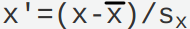

# 数据挖掘概述

- 数据：训练集、测试集
- 数据形态：表格、图片、音频、文本

<table>
    <tr>
        <td rowspan="5" width="10%">数据挖掘<br/ >任务</td>
        <td rowspan="2" width="20%">预测（predictive modeling）</td>
        <td width="20%">分类（classfication）</td>
        <td rowspan="2" width="50%">目标是根据其他属性的值，预测特定属性的值</td>
    </tr>
    <tr>
        <td>回归（regression）</td>
    </tr>
    <tr>
        <td rowspan="3">描述（description）</td>
        <td>关联分析（association analysis）</td>
        <td rowspan="3">目标是导出概括数据中潜在联系的模式（相关、趋势、聚类、轨迹、异常）</td>
    </tr>
    <tr>
        <td>聚类分析（cluster analysis）</td>
    </tr>
    <tr>
        <td>异常检测（anomaly detection）</td>
    </tr>
</table>

 

- 数据挖掘（Data Mining）就是从大量的、不完全的、有噪声的、模糊的、随机的数据中，提取隐含在其中的、人们事先不知道的，但又是潜在有用信息和知识的过程。

> 数据挖掘是在大型数据存储库中，自动地发现有用信息的过程。

- 数据挖掘是数据库中知识发现（KDD，knowledge discovery in datase）不可缺少的一部分，而KDD是将未加工的数据转换为有用信息的整个过程。

  

## 数据挖掘流程

 

<table>
    <tr>
        <td width="10%">第一阶段</td>
        <td width="10%">业务理解</td>
        <td width="80%">项目组甲方提出问题，初步了解项目</td>
    </tr>
    <tr>
        <td>第二阶段</td>
        <td>数据理解</td>
        <td>收集数据、熟悉数据、识别数据的质量问题</td>
    </tr>
    <tr>
        <td>第三阶段</td>
        <td>数据准备</td>
        <td>从收集来的数据集选择必要的属性，并按关联关系将它们连接成一个数据集，再进行数据清洗，即空值及异常值处理、离群值剔除、数据标准化等</td>
    </tr>
    <tr>
        <td>第四阶段</td>
        <td>数据建模</td>
        <td>从应用不同的数据挖掘技术，确定模型的最佳参数。如果初步分析发现模型的效果不太满意，需要再跳回数据准备阶段，甚至数据理解阶段</td>
    </tr>
    <tr>
        <td>第五阶段</td>
        <td>模型评估</td>
        <td>对建立的模型进行可靠性评估和合理性解释。未经评估的模型不可直接应用，因为所得模型只是通过己有的数据得出，对未来数据的预测能力要经过实践的检验</td>
    </tr>
    <tr>
        <td>第六阶段</td>
        <td>部署阶段</td>
        <td>根据评估后认为合理的模型，制定将其应用于实际工作的策略，形成应用部署报告</td>
    </tr>
</table>

# 数据

## 数据类型

- 数据集可以看做数据对象（记录、点、向量、模式、事件、案例、样本、观测、实体）的集合。数据对象用一组刻画对象基本特性的属性（变量、特性、字段、特征、维）描述。

- 属性类型的定义是累积的。对于标称、序数、区间属性合法的任何性质或操作，对于比率属性也是合法的。

<table>
    <tr>
        <th colspan="2">属性类型</th>
        <th width="30%">描述</th>
        <th width="20%">操作</th>
        <th width="30%">变换</th>
    </tr>
    <tr>
        <td width="15%" rowspan="2">分类的 （定性的）</td>
        <td width="5%">标称</td>
        <td>标称值只提供足够的信息以区分对象（=、≠）</td>
        <td>众数、熵、列联相关、χ2检验</td>
        <td>任何一对一变换</td>
    </tr>
    <tr>
        <td>序数</td>
        <td>序数值提供足够的信息确定对象的序（<、>）</td>
        <td>中值、百分位、秩相关、游程检验、符号检验</td>
        <td>值的保序变换，<code>新值=f(旧值)</code>，f是单调函数</td>
    </tr>
    <tr>
        <td rowspan="2">数值的 （定量的）</td>
        <td>区间</td>
        <td>对于区间属性，值之间的差是有意义的，即存在测量单位（+、-）</td>
        <td>均值、标准差、皮尔逊相关、t和F检验</td>
        <td><code>新值=a*旧值+b</code>，其中a、b是常数</td>
    </tr>
    <tr>
        <td>比率</td>
        <td>对于比率变量，差和比率都是有意义的（*、/）</td>
        <td>几何平均、调和平均、百分比变差</td>
        <td><code>新值=a*旧值</code></td>
    </tr>
</table>

<table>
    <tr>
        <td width="30%">离散的（discrete）</td>
        <td width="70%">离散属性具有有限个值或无限个可数个值。通常离散属性可以用整数变量表示</td>
    </tr>
    <tr>
        <td>连续的（continuous）</td>
        <td>连续属性是取实数值的属性。通常使用浮点变量表示</td>
    </tr>
</table>

### 数据集的类型

- 数据集的一般特性：维度、稀疏性、分辨率。

<table>
    <tr>
        <td width="25%">维度  dimensionality</td>
        <td width="75%">数据集的维度是数据集中的对象具有的属性数目。（维灾难、维归约）</td>
    </tr>
    <tr>
        <td>稀疏性 sparsity</td>
        <td>有些数据集，如具有非对称特征的数据集，一个对象的大部分属性上的值都为0，而非零项可能还不到1%</td>
    </tr>
    <tr>
        <td>分辨率 resolution</td>
        <td>不同的分辨率下数据的性质也不同</td>
    </tr>
</table>

<table>
    <tr>
        <td width="10%" rowspan="3">记录数据</td>
        <td width="30%">事务数据 transaction data</td>
        <td width="60%">每个记录（事务）涉及一系列的项。又称 购物篮数据（market basketydata）</td>
    </tr>
    <tr>
        <td>数据矩阵 data matrix</td>
        <td>可以用一个m×n的矩阵表示。又称 模式矩阵（pattern matrix）</td>
    </tr>
    <tr>
        <td>稀疏数据矩阵</td>
        <td>数据矩阵的特殊情况，如 文档-词矩阵（document-term matrix）</td>
    </tr>
    <tr>
        <td rowspan="2">基于图形的数据</td>
        <td colspan="2">带有对象之间联系的数据</td>
    </tr>
    <tr>
        <td colspan="2">具有图形对象的数据</td>
    </tr>
    <tr>
        <td rowspan="5">有序数据</td>
        <td>时序数据 sequential data</td>
        <td>时间数据（temporal data），每个记录包含一个与之相关联的时间</td>
    </tr>
    <tr>
        <td>序列数据 sequence data</td>
        <td>是一个数据集合，是各个实体的序列</td>
    </tr>
    <tr>
        <td>时间序列数据 time series data</td>
        <td>每个记录都是一个时间序列，即一段时间以来的测量序列。时间自相关（temporal autocorrelating），如果两个测量的时间非常接近，则这些测量的值通常非常相似</td>
    </tr>
    <tr>
        <td>空间数据</td>
        <td>空间自相关性 spatial autocorrelation</td>
    </tr>
    <tr>
        <td>时空数据</td>
        <td></td>
    </tr>
</table>

## 数据质量

<table>
    <tr>
        <td width="30%">测量误差和数据收集错误</td>
        <td width="70%"></td>
    </tr>
    <tr>
        <td>噪声和伪像</td>
        <td>噪声引起原始数值的变形（distortion）</td>
    </tr>
    <tr>
        <td>精度、偏倚、准确率</td>
        <td></td>
    </tr>
    <tr>
        <td>离群点</td>
        <td>离群点（outlier）也称异常（anomalous）对象或异常值。离群点可以是合法的数据对象或值。有时离群点本身就是人们感兴趣的对象</td>
    </tr>
    <tr>
        <td rowspan="2">遗漏值</td>
        <td>（1）信息收集不全；（2）某些属性并不能用于所有对象</td>
    </tr>
    <tr>
        <td>（1）删除数据对象或属性；（2）估计遗落值；（3）在分析时忽略遗落值</td>
    </tr>
    <tr>
        <td>不一致的值</td>
        <td></td>
    </tr>
    <tr>
        <td>重复数据</td>
        <td>去重复（deduplication）</td>
    </tr>
</table>

## 数据预处理

### 聚集

- 聚集（aggregation）将两个或多个对象合并成单个对象。

<table>
    <tr>
        <th>聚集的动机</th>
        <th>描述</th>
    </tr>
    <tr>
        <td width="20%">数据归约</td>
        <td width="80%">数据归约导致的较小数据集只需要较少的内存和处理时间</td>
    </tr>
    <tr>
        <td>尺度变换</td>
        <td>通过高层而不是底层数据视图，聚集起到了范围或标度转换的作用</td>
    </tr>
    <tr>
        <td>数据性质更稳定</td>
        <td>对象或属性群的行为通常比单个对象或属性的行为更加稳定，聚集量具有较小的变异性</td>
    </tr>
</table>

### 抽样

- 抽样被用作数据选择的主要技术。

<table>
    <tr>
        <td width="10%">统计学</td>
        <td width="90%">统计学使用抽样是因为<b>得到</b>感兴趣的整个数据集的费用太高、太费时间</td>
    </tr>
    <tr>
        <td>数据挖掘</td>
        <td>数据挖掘使用抽样是因为<b>处理</b>所有的数据的费用太高、太费时间</td>
    </tr>
</table>

<table>
    <tr>
        <td width="15%" rowspan="2">简单随机抽样</td>
        <td width="85%">无放回抽样</td>
    </tr>
    <tr>
        <td>有放回抽样</td>
    </tr>
    <tr>
        <td>分层抽样 stratified sampling</td>
        <td>每种类型的对象数量相差很大时使用。尽管每组的大小不同，但是从每组存取的对象个数相同；或者说，从每一组抽取的对象数量正比于该组的大小</td>
    </tr>
</table>

- 抽样与信息损失：较大样本容量增大了样本具有代表性的概率，但也抵消了抽样带来的许多好处；反过来，较小容量的样本，可能丢失模式、或检测出错误的模式。

### 维归约

1. 维归约可以删除不相关的特征并降低噪声。

2. 维归约可以更容易让数据可视化。

3. 维归约降低了数据挖掘算法的时间和内存需求。
- 维归约的线性代数技术：主成分分析（PCA，Principal Components Analysis）、奇异值分解（SVD，Singular Value Decomposition）。

### 特征子集选择

- 特征子集选择：仅使用特征的一个子集。

<table>
    <tr>
        <td width="15%">冗余特征</td>
        <td width="85%">冗余特征重复了包含在一个或多个其他属性中的许多或所有信息</td>
    </tr>
    <tr>
        <td>不相关特征</td>
        <td>不相关特征包含对于手头的数据挖掘任务几乎完全没有的信息</td>
    </tr>
</table>

- 有三个标准的特征选择方法：嵌入、过滤、包装。

### 特征创建

- 特征创建：通常可以由原来的属性创建新的属性集，更有效地捕获数据集中的重要信息。

<table>
    <tr>
        <td width="20%">特征提取</td>
        <td width="80%"></td>
    </tr>
    <tr>
        <td>映射数据到新的空间</td>
        <td></td>
    </tr>
    <tr>
        <td>特征构造</td>
        <td></td>
    </tr>
</table>

### 离散化和二元化

#### 连续属性离散化

- 用于分类的离散化方法之间的根本区别在于使用类信息（监督，supervised），不使用类信息（非监督，unsupervised）。

##### 非监督离散化

<table>
    <tr>
        <td width="25%">等宽（equal width）</td>
        <td width="75%">将属性的值域划分成具有相同宽度的区间</td>
    </tr>
    <tr>
        <td>等频率（equal frequency） 等深（equal depth）</td>
        <td>将相同数量的对象放进每个区间</td>
    </tr>
    <tr>
        <td>K均值聚类</td>
        <td>划分为K类，每类均值相等</td>
    </tr>
</table>

##### 监督离散化

- 监督离散化（unsupervised）通常使用基于熵（entropy）的方法。如果一个区间中的值类出现的频率相等（该区间尽可能不纯），则其熵最大。通常选取具有最大熵的区间，重复分割此过程，直到区间的个数达到用户指定的个数或者满足终止条件。

### 变量变换

- 变量变换（variale transformation）对于每个对象，变换都作用于该对象的变量值。

<table>
    <tr>
        <td width="15%">简单函数</td>
        <td width="85%"></td>
    </tr>
    <tr>
        <td rowspan="2">标准化 规范化</td>
        <td>的方式来映射到<code>[0,1]</code></td>
    </tr>
    <tr>
        <td>均值和标准差首离群点影响很大；可以用中位数和绝对标准差来分别替代</td>
    </tr>
</table>

## 相似性和相异性

### 简单属性的相似度和相异度

<table>
    <caption>简单属性的相似度和相异度</caption>
    <tr>
        <th width="10%">属性类型</th>
        <th width="45%">相异度</th>
        <th width="45%">相似度</th>
    </tr>
    <tr>
        <th>标称的</th>
        <td></td>
        <td></td>
    </tr>
    <tr>
        <th>序数的</th>
        <td> 值映射到整数0到n-1，其中n是值的个数</td>
        <td></td>
    </tr>
    <tr>
        <th>区间的 比率的</th>
        <td></td>
        <td></td>
    </tr>
</table>

### 数据对象之间的相异度

#### 欧几里得距离

- 欧几里得距离（Euclidean distance）：一维、二维、三维或高维空间中两个点x和y之间的欧几里得距离d由如下公式定义。

- `n`是维数，<code>xk</code>和<code>yk</code>分别是x和y的第k个属性值（分量）。
- 通过欧几里得距离的计算，生成了对应的距离矩阵（distance matrix）。

 

#### 闵可夫斯基距离

- 闵可夫斯基距离（Minkowski distance）

<table>
    <tr>
        <th width="10%">r参数</th>
        <th width="90%">意义</th>
    </tr>
    <tr>
        <td>r=1</td>
        <td>L1范式、城市街区距离、曼哈顿距离、出租车距离、汉明距离</td>
    </tr>
    <tr>
        <td>r=2</td>
        <td>L2范式</td>，可视为对欧几里得距离的推广
    </tr>
    <tr>
        <td>r=∞</td>
        <td>L∞范式、Lmax范式、上确界距离</td>
    </tr>
</table>

- 汉明距离（Hamming distance）是两个具有二元属性的对象（两个二元向量）之间不同的二进制位个数。

 

 

### 数据对象之间的相似度

#### 邻近性度量

##### 二元数据的相似性度量

- 相似系数（similaroty coefficient）：两个仅包含二元属性的对象之间的相似性度量也称为相似系数，并且通常在0和1之间取值，值为1表示两个对象完全相似，而值为0表示对象一点也不相似。
- 设x和y是两个对象，都由n个二元属性组成，则可以生成四个量（频率）（它们之间是互斥的）：

 

###### SMC

- SMC（简单匹配系数，Simple Matching Coefficient）：

 

###### Jaccard系数

- Jaccard系数（Jaccard Coefficient）处理仅包含非对称的二元属性的对象，通常用符号`J`表示。
- 给定一种情况，未被顾客购买的商品数（0，<code>f00</code>）远大于被其购买的商品数（1）。该情况下，导致SMC这样的相似性度量将会判定所有的事务都是类似的（都未被顾客购买），而这是不应该的。因此，需要使用剔除了不感兴趣的干扰的Jaccard系数来处理。

 

##### 余弦相似度

- 余弦相似度（cosine similarity）是文档（向量）相似度最常用的度量之一。

 

- 其中，`·`表示向量点积，<code>x·y=&sum;nk=1xkyk</code>，`||x||`是向量x的长度，

 

- 在`x'`和`y'`中，x和y被它们的长度除，将它们规范化成具有长度1。意味着在计算相似度时，余弦相似度不考虑两个数据对象的量值。（当量值是重要的时，欧几里得距离可能是更好的方式）

##### 相关性

- 两个具有二元变量或连续变量的数据对象之间的相关性是对象属性之间线性联系的度量。两个数据对象x和y之间的皮尔森相关（Pearson's correlation）系数由如下公式定义。

 

# 探索数据

## 汇总统计

- 汇总统计（summary statistcs）

<table>
    <tr>
        <th width="20%">统计参数</th>
        <th width="15%">数据集</th>
        <th width="65%">意义</th>
    </tr>
    <tr>
        <td>频率</td>
        <td rowspan="2">无序的、分类的 离散数据</td>
        <td></td>
    </tr>
    <tr>
        <td>众数 mode</td>
        <td>具有最高频率的值</td>
    </tr>
    <tr>
        <td>百分位数 percentile</td>
        <td>有序数据</td>
        <td>给定一个有序的或连续的属性x和0与100之间的数p，第p个百分位数xp是一个x值，使得x的p%的观测值小于xp</td>
    </tr>
    <tr>
        <td>均值 mean</td>
        <td rowspan="2">位置度量 连续数据</td>
        <td>对于离群值很敏感 </td>
    </tr>
    <tr>
        <td>中位数 median</td>
        <td></td>
    </tr>
    <tr>
        <td>极差 range</td>
        <td rowspan="5">散布度量 连续数据</td>
        <td></td>
    </tr>
    <tr>
        <td>方差 variance 标准差 standard deviation</td>
        <td>对离群点特别敏感 </td>
    </tr>
    <tr>
        <td>绝对平均偏差 AAD</td>
        <td>absolute deviation </td>
    </tr>
    <tr>
        <td>中位数绝对偏差 MAD</td>
        <td>median absolute deviation </td>
    </tr>
    <tr>
        <td>四分位数极差 IQR</td>
        <td>interquartile range </td>
    </tr>
</table>

## 可视化

### 可视化的一般概念

1. 表示：将数据映射到图形元素
2. 安排：视觉元素在显示器中的位置
3. 选择：删除或不突出某些对象和数据

### 可视化技术

#### 少量属性的可视化

<table>
    <tr>
        <td width="20%" rowspan="3">直方图 histogram</td>
        <td width="80%"><b>单个变量</b>的值的分布（单一属性）</td>
    </tr>
    <tr>
        <td>将可能的值分散到箱中，并显示落入每个箱中的对象数，显示属性值的分布</td>
    </tr>
    <tr>
        <td>每个条形的面积正比于落在区间的值（对象）的个数；条形的高度正比于落在对应箱中的值</td>
    </tr>
    <tr>
        <td colspan="2">二维直方图 tow-dimensional histogram</td>
    </tr>
    <tr>
        <td rowspan="3">盒状图 box plot</td>
        <td>显示一维数值属性分布的方法，可比较<b>多个属性</b>、多个变量的值的分布</td>
    </tr>
    <tr>
        <td>盒的下端和上端分别指示第25和第75个百分位数，而盒中的线指示第50个百分位数的值，底部和顶部的尾线分别指示第10和90个百分位数，离群值用“+”显示</td>
    </tr>
    <tr>
        <td>盒子长度反映数据分布稀疏情况；盒子越短，则数据越集中</td>
    </tr>
    <tr>
        <td rowspan="2">散布图 scatter plot</td>
        <td>散布图使用数据对象两个属性的值作为x和y坐标值，每个数据对象都作为平面上的一个点绘制（假定属性值是整数或实数）</td>
    </tr>
    <tr>
        <td>散布图矩阵（scatter plot matrix），图形化地显示两个属性之间的关系（相关性）</td>
    </tr>
</table>

#### 可视化的时间空间数据

<table>
    <tr>
        <td width="20%" rowspan="2">等高线图 contour plot</td>
        <td width="80%">对于某些三维数据，两个属性指示平面上的位置，而第三个属性具有连续值（如 温度、海拔等）</td>
    </tr>
    <tr>
        <td>等高线图将平面划分成一些区域，区域中的第三个属性的值近似相等，同一等高线上的点具有相等的值</td>
    </tr>
    <tr>
        <td rowspan="2">曲面图 surface plot</td>
        <td>曲面图的第三个属性用来指示高出前两个属性定义的平面的高度，要求至少某个范围内，对于前两个属性值的所有组合，第三个属性的值都有定义</td>
    </tr>
    <tr>
        <td>曲面图通常用来描述数学函数，或变化相对光滑的物理曲面</td>
    </tr>
</table>

#### 可视化高维数据

<table>
    <tr>
        <td width="20%">矩阵</td>
        <td width="80%">将数据矩阵的每个元素与图像值中的一个像素相关联，像素的亮度和颜色由矩阵对应元素的值决定（如 标准差、相关度等）</td>
    </tr>
    <tr>
        <td rowspan="2">平行坐标系 parallel coordinates</td>
        <td>平行坐标系不同的坐标轴是平行的，而不是正交的；对象用线而不是用点表示</td>
    </tr>
    <tr>
        <td>该图中模式的检测可能取决于坐标轴的序，需要安排坐标轴，以得到具有较少交叉的坐标轴序列</td>
    </tr>
    <tr>
        <td>星形坐标 start coordinates</td>
        <td></td>
    </tr>
    <tr>
        <td>Chernoff face</td>
        <td></td>
    </tr>
</table>

### ACCENT原则

- ACCENT原则：

<table>
    <tr>
        <td width="30%">理解 Apprehension</td>
        <td width="70%">正确察觉变量之间的关系的能力</td>
    </tr>
    <tr>
        <td>清晰性 Clarity</td>
        <td>突出显示重要元素或关系</td>
    </tr>
    <tr>
        <td>一致性 Consistency</td>
        <td></td>
    </tr>
    <tr>
        <td>有效性 Efficiency</td>
        <td>尽可能简单的方法描述复杂关系的能力</td>
    </tr>
    <tr>
        <td>必要性 Necessity</td>
        <td></td>
    </tr>
    <tr>
        <td>真实性 Truthfulness</td>
        <td></td>
    </tr>
</table>

## OLAP和多维数据分析

- OLAP（联机分析处理）系统

## 多维数据：一般情况

- 用表形式表示的数据集创建多维数据表示的过程：首先确定用作纬的分类属性以及用作分析目标的定量属性，然后将表的每一行（对象）映射到多维数组的一个单元。单元的下标由被选作纬的属性的值指定，而单元的值是目标属性的值，假定没有被数据定义的单元的值是0。

1. 纬是分类属性（离散）。纬的属性值充当对应于该属性的纬的数组下标，而属性值得个数是纬的大小。
2. 目标量（target quantity）是连续的。属性值的每个组合（对象）定义了多维数组的一个单元。每个单元的内容代表一个目标量（目标变量或属性）的值。

## 分析多维数据

<table>
    <tr>
        <td width="20%" rowspan="2">切片 slicing 切块 dicing</td>
        <td width="80%">切片是通过对一个或多个维<b>指定特定的值</b>，从整个多维数组中选择一组单元</td>
    </tr>
    <tr>
        <td>切块涉及通过<b>指定属性值区间</b>选择单元子集，等价于由整个数组定义子数组</td>
    </tr>
    <tr>
        <td>上卷 roll up 下钻 roll down</td>
        <td>属性的层次结构使得上卷和下钻的应用，聚集（上卷）、分解（下卷）</td>
    </tr>
</table>

# 分类：基本概念、决策树与模型评估

## 解决分类问题的一般方法

###  学习算法

- 学习算法（learning algorithm），分类法的例子包括决策树分类法、基于规则的分类法、神经网络、支持向量机和朴素贝叶斯分类法。

1. 首先需要一个训练集（training set），由类标号已知的记录组成。
2. 使用训练集建立分类模型，该模型随后将运用于检验集（test set）。检验集由类标号未知的记录组成。

  

### 混淆矩阵

<table>
    <tr>
        <td rowspan="2" colspan="2"></td>
        <td colspan="2">预测的类</td>
    </tr>
    <tr>
        <td>类=1、+</td>
        <td>类=0、-</td>
    </tr>
    <tr>
        <td width="10%" rowspan="2">实际的类</td>
        <td width="10%">类=1、+</td>
        <td width="20%">f11、f++、TP</td>
        <td width="20%">f10、f+-、FN</td>
    </tr>
    <tr>
        <td>类=0、-</td>
        <td>f01、f-+、FP</td>
        <td>f00、f--、TN</td>
    </tr>
</table>

 

 

<table>
    <tr>
        <td width="40%">真正率（True Positive Rate，TPR） 灵敏度（sensitivity）</td>
        <td width="60%">TPR=TP/(TP+EN)</td>
    </tr>
    <tr>
        <td>真负率（True Negative Rate，TNR） 特指度（specification）</td>
        <td>TNR=TN/(TN+FP)</td>
    </tr>
    <tr>
        <td>假正率 FPR</td>
        <td>FPR=FP/(FP+TN)</td>
    </tr>
    <tr>
        <td>假负率 FNR</td>
        <td>FNR=FN/(FN+TP)</td>
    </tr>
</table>
## 决策树归纳

### 决策树的工作原理

- 决策树是一种由结点和有向边组成的层次结构。

<table>
    <caption>决策树的三种结点</caption>
    <tr>
        <th>结点类型</th>
        <th>入边数量</th>
        <th>出边数量</th>
    </tr>
    <tr>
        <td width="34%">根结点 root node</td>
        <td width="33%">0</td>
        <td width="33%">0~n</td>
    </tr>
    <tr>
        <td>内部结点 internal node</td>
        <td>1</td>
        <td>2~n</td>
    </tr>
    <tr>
        <td>叶结点 leaf node 终结点 terminal node</td>
        <td>1</td>
        <td>0</td>
    </tr>
</table>

 

- 决策树的特点：

1. <b>树状结构</b>，可以很好的对数据进行分类。
2. 决策树的根节点到叶节点的每一条路径都构建一条<b>规则</b>
3. 具有<b>互斥且完备</b>的特点，即每一个样本均被且只能被一条路径所覆盖
4. 只要提供的数据量足够庞大真实，通过<b>数据挖掘模式</b>，就可以构造决策树。

### 如何建立决策树

#### [Hunt算法](../Algorithm/Hunt.md)

#### 属性测试条件的表示方法

- 属性类型：标称、序数、连续（区间、比率）。
- 分割方式的数量：双向分割（二元划分）、多路分离。

<table>
    <tr>
        <th width="10%">属性类型</th>
        <th width="90%">分组方法</th>
    </tr>
    <tr>
        <td>标称</td>
        <td></td>
    </tr>
    <tr>
        <td>序数</td>
        <td>只要不违背序数属性值的<b>有序性</b>即可对属性值进行分组。例如，{small,lager}和{mediam}是不被允许的</td>
    </tr>
    <tr>
        <td rowspan="2">连续</td>
        <td>二元决策：测试条件可以是具有二元输出的比较测试（A&lt;v或A&ge;v）。必须考虑所有可能的划分点v，并从中选择产生最佳划分的点</td>
    </tr>
    <tr>
        <td>离散化以形成<b>有序</b>分类属性：测试条件可以是形如vi&le;A&lt;vi+1（i=1,...,k）输出的范围查询。必须考虑所有可能的连续值区间，并且在离散化后，尽可能给每个离散化区间赋予一个新的序数值，保持有序性</td>
    </tr>
</table>

#### 选择最佳划分的度量：不纯性

 

- 设<code>p(i|t)</code>表示给定结点t中属于类i的记录所占的比例。选择最佳划分的度量通常是根据划分后子女结点不纯性的程度，不纯的程度越低，类发布就越倾斜（低不纯性）。

##### 单个结点不纯性的测量：Entropy、Gini、Classification error

  

- c是类的数量，且log20=0。

 

##### &Delta;增益：选择合适的划分条件

- 为了确定测试条件的效果，需要比较父结点（划分前）的不纯度和子结点（划分后）的不纯度，也就是<b>增益&Delta;（Gain）</b>，增益越大，说明划分的效果越好。

 

- <code>I(.)</code>是给定结点的不纯性度量，<code>N</code>是父结点上的记录总数，<code>k</code>是属性的个数，<Code>N(vj)</Code>是与子结点vj相关联的记录个数。
- 在意思上，也可以表示为 <code>&Delta; = I(parent) - E(parent)</code>

1. &Delta;也可以使用G（Gain，增益）表示
2. <code>E</code>（所有子结点不纯性的加权平均）和公式中的是等价的。

- 当选择熵（<a href="#Entropy">Entropy</a>）作为公式的不纯性度量（<code>I(.)</code>）时，熵的差也就是<b>信息增益 &Delta;info（information gain）</b>。
- 计算增益&Delta;可以用于构建决策树，也就是选择合适的条件（max&Delta;）的条件作为根结点，再以此为基础，向下延伸子结点。

##### 增益率

- <b>增益率（gain ratio）</b>

 

- 划分信息 ，<code>k</code>是划分的总数。

### 决策树归纳算法

### 决策树归纳的特点

## 模型的过分拟合

### 欠拟合和过拟合

<table>
    <tr>
        <td width="30%" rowspan="2">训练误差（training error）</td>
        <td width="70%">又称 再代入误差（resubstitution error）或 表现误差（apparent error）</td>
    </tr>
    <tr>
        <td>训练误差是在训练记录上的误分类比例</td>
    </tr>
    <tr>
        <td>泛化误差（generalization error）</td>
        <td>泛化误差模型在未知记录上的期望误差</td>
    </tr>
</table>

1. 一个好的分类模型必须具有低训练误差和低泛化误差。
2. 对训练数据拟合度过高的模型，其泛化误差可能比具有较高训练误差的模型高，也就是<b>模型的过分拟合</b>。

<table>
    <tr>
        <td width="30%" rowspan="4">模型拟合不足 （model underfitting，欠拟合）</td>
        <td colspan="2">当决策树很小时，训练和检验误差都很大</td>
    </tr>
    <tr>
        <td colspan="2">根本原因是特征维度过少，模型过于简单，导致拟合的函数无法满足训练集，误差较大;</td>
    </tr>
    <tr>
        <td rowspan="2">解决方法</td>
        <td>增加特征维度</td>
    </tr>
    <tr>
        <td>增加训练数据</td>
    </tr>
    <tr>
        <td rowspan="4">模型过分拟合 （model overfitting，过拟合）</td>
        <td colspan="2">一旦树的规模变得太大，即使训练误差还在继续降低，但检验误差开始增大</td>
    </tr>
    <tr>
        <td colspan="2">根本原因是特征维度过多，模型假设过于复杂，参数过多，训练数据过少，噪声过多，导致拟合的函数完美的预测训练集，但对新数据的测试集预测结果差。过度的拟合了训练数据，而没有考虑到泛化能力。</td>
    </tr>
    <tr>
        <td rowspan="2" width="15%">解决方法</td>
        <td width="55%">减少特征维度</td>
    </tr>
    <tr>
        <td>正则化，降低参数值</td>
    </tr>
</table>

### 奥卡姆剃刀

- 奥卡姆剃刀（Occam's razor）（节俭原则，principle of parsimony）：给定的两个具有相同泛化误差的模型，较简单的模型 比 较复杂的模型 更可取。
- 因为，复杂模型中的附加成分很大程度上是完全对偶然的拟合。

### 处理过分拟合

#### 预修剪

- 预修剪（先剪枝、提前停止规则）的树增长算法在产生完全拟合整个训练集的完全增长的决策树<b>之前</b>就停止决策树的生长。
- 预修剪可以避免产生过分拟合训练数据的过于复杂的子树，但需要选取合适的<b>阈值</b>。阈值可以是决策树的最大层次、增益等指标。

1. 阈值过高，导致拟合不足的模型（欠拟合）。
2. 阈值过低，不能充分解决<q>过拟合</q>的问题。

- 节点的典型停止条件：

1. 如果所有样本属于同一个类，则停止。
2. 如果所有属性值都相同，则停止。

- 更多限制性条件：

1. 如果样本数量小于用户指定的阈值，则停止。
2. 如果样本的类分布与可用功能无关，则停止。
3. 如果扩展当前节点不能改善不纯度度量（如Gini系数或信息增益），则停止。

#### 后修剪

- 后修剪（后剪枝）在决策树增长到最大规模后，按照自底向上的方式修剪<b>完全增长的决策树</b>。如果修剪后的泛化误差得到改善，则通常有以下两种修剪方法：

1. 用新的叶节点替换子树，该叶节点的类标号由子树下记录的多数类确定。
2. 用子树中最常用的分支替代子树。