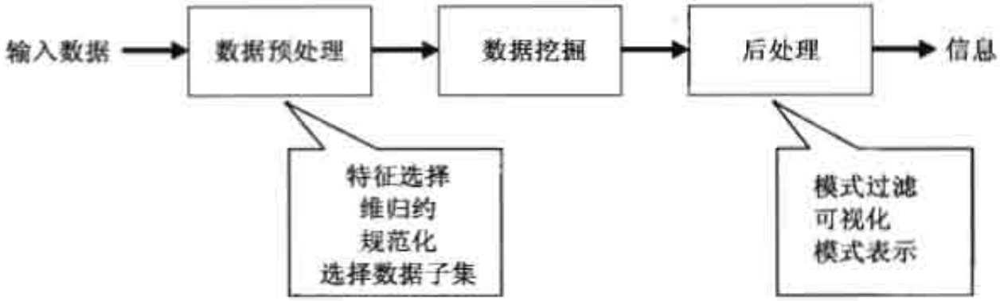

# 数据挖掘概述

- 数据：训练集、测试集
- 数据形态：表格、图片、音频、文本

<table>
    <tr>
        <td rowspan="5" width="10%">数据挖掘<br/ >任务</td>
        <td rowspan="2" width="20%">预测（predictive modeling）</td>
        <td width="20%">分类（classfication）</td>
        <td rowspan="2" width="50%">目标是根据其他属性的值，预测特定属性的值</td>
    </tr>
    <tr>
        <td>回归（regression）</td>
    </tr>
    <tr>
        <td rowspan="3">描述（description）</td>
        <td>关联分析（association analysis）</td>
        <td rowspan="3">目标是导出概括数据中潜在联系的模式（相关、趋势、聚类、轨迹、异常）</td>
    </tr>
    <tr>
        <td>聚类分析（cluster analysis）</td>
    </tr>
    <tr>
        <td>异常检测（anomaly detection）</td>
    </tr>
</table>
 

- 数据挖掘（Data Mining）就是从大量的、不完全的、有噪声的、模糊的、随机的数据中，提取隐含在其中的、人们事先不知道的，但又是潜在有用信息和知识的过程。

> 数据挖掘是在大型数据存储库中，自动地发现有用信息的过程。

- 数据挖掘是数据库中知识发现（KDD，knowledge discovery in datase）不可缺少的一部分，而KDD是将未加工的数据转换为有用信息的整个过程。

  

# 数据挖掘流程

 

<table>
    <tr>
        <td width="10%">第一阶段</td>
        <td width="10%">业务理解</td>
        <td width="80%">项目组甲方提出问题，初步了解项目</td>
    </tr>
    <tr>
        <td>第二阶段</td>
        <td>数据理解</td>
        <td>收集数据、熟悉数据、识别数据的质量问题</td>
    </tr>
    <tr>
        <td>第三阶段</td>
        <td>数据准备</td>
        <td>从收集来的数据集选择必要的属性，并按关联关系将它们连接成一个数据集，再进行数据清洗，即空值及异常值处理、离群值剔除、数据标准化等</td>
    </tr>
    <tr>
        <td>第四阶段</td>
        <td>数据建模</td>
        <td>从应用不同的数据挖掘技术，确定模型的最佳参数。如果初步分析发现模型的效果不太满意，需要再跳回数据准备阶段，甚至数据理解阶段</td>
    </tr>
    <tr>
        <td>第五阶段</td>
        <td>模型评估</td>
        <td>对建立的模型进行可靠性评估和合理性解释。未经评估的模型不可直接应用，因为所得模型只是通过己有的数据得出，对未来数据的预测能力要经过实践的检验</td>
    </tr>
    <tr>
        <td>第六阶段</td>
        <td>部署阶段</td>
        <td>根据评估后认为合理的模型，制定将其应用于实际工作的策略，形成应用部署报告</td>
    </tr>
</table>