# 数据结构

## 线性结构

- 线性表（线性结构）：数据元素之间存在一对一的线性关系，包括数组、队列、链表、栈。

| 对比   |                     顺序表（数组）                      |                     链表                     |
| ------ | :-----------------------------------------------------: | :------------------------------------------: |
| 存储   |                        顺序存储                         |                   链式存储                   |
| 连续性 | 顺序表中的存储元素是连续的 <br />（一组连续的内存单位） |        链表中的存储元素不一定是连续的        |
| 元素   |                            -                            | 元素节点中存放数据元素以及相邻元素的地址信息 |

- 非线性结构：二维数组、多维数组、广义表、树、图。

### 数组 Array

- 数组（顺序表）：用一段地址连续的存储单元依次存储线性表的数据元素。

> 内存的碎片化问题。

- 设顺序表的每个元素占用m个存储单元，则第$a_i$个元素的存储地址为：（与第$a_1$个元素的存储位置关系）

$$
LOC(a_i) = LOC(a_1) + ( a_i - a_1 ) * m
$$

- 随机存取结构：只要确定了顺序表的起始地址（基地址），计算任意一个元素的存储地址的时间是相同的。

#### 稀疏数组

- 一个数组中大部分元素为０，或同一个值时（大多数的数据是重复的、无意义的），应该转换为稀疏数组。

- 稀疏数组记录数组一共有几行几列，有多少个不同的值，并把具有不同值的元素的行、列、值记录在一个小规模的数组。

  


### 链表 Link

- 链表：链式存储，以节点的方式存储，用一组任意的存储单元存放线性表，链表的各个节点不一定是连续存储，逻辑次序和物理次序不一定相同。

> **静态链表、动态链表**
>
> - 静态链表：数组存放链表。
> - 动态链表：额外创建expend()方法，动态扩展数组长度。

#### 单向链表

 

| 节点域 | 存储               |
| ------ | ------------------ |
| data   | 数据               |
| next   | 下一个节点的引用。 |

| 节点   | 说明                                                         |
| ------ | ------------------------------------------------------------ |
| 头节点 | 保存头引用。<br />第一个元素节点之前附加一个类型相同的节点。 |
| 头引用 | 指向头节点的存储地址。                                       |
| 尾节点 | 保存尾标志，最后一个节点。                                   |
| 尾标志 | 终端节点的引用域为空。                                       |

#### 双向链表

 

- 双向链表能够快速确定链表中的前驱节点（保存前驱节点的引用），可以实现当前节点的自我删除，适合频繁的插入删除操作。

> 单向链表需要上一个节点的配合才能实现删除当前节点。

#### 循环链表（约瑟夫环）

- 循环链表：将单链表的终端节点的引用域由空改为指向头节点引用，使得链表头尾相接。

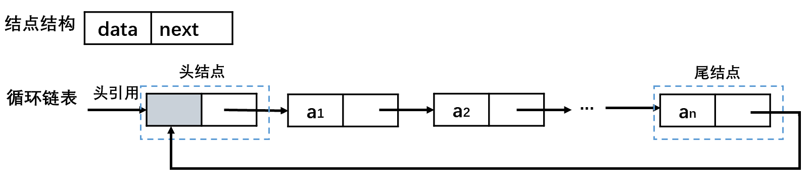 

> **Josephu 约瑟夫环**
> 设编号为1，2，… ，n的n个人围坐一圈，约定编号为k（1<=k<=n）的人从1开始报数，数到m 的那个人出列，它的下一位又从1开始报数，数到m的那个人又出列，依次类推，直到所有人出列为止，由此产生一个出队编号的序列。
### 栈 Stack

- 栈（Stack）：限制线性表中元素的插入和删除只能在线性表的同一端进行。先进后出（FILO）、后进先出（LIFO）。

| 结构           | 说明           |
| -------------- | -------------- |
| 栈顶（Top）    | 允许插入和删除 |
| 栈底（Bottom） | 固定           |


| 方法   | 操作           |
| ------ | -------------- |
| peek() | 查看栈顶元素   |
| pop()  | 弹出栈顶元素   |
| push() | 向栈中压入元素 |

> 顺序栈 SequentialStack
> 链栈 LinkedStack

#### 双端栈

 

- 两个顺序栈使用一个数组的两端分别存储（顺序栈单向延申）。栈一的栈顶top1为该数组的0下标开始，每次top1++存放新的元素。栈二的栈顶top2为该数组的length-1下标开始，每次top2--存放新的元素 。`top1 == top2 - 1`时，栈满。
- 两个栈相向增长，减少对数组空间的浪费，减少发生上溢的概率：最好一个栈增长时，另一个栈缩短。

```java
public class BothStack {
    char[] bothStack = new char[20];
    int top1 = 0; //stack1的栈顶
    int top2 = bothStack.length - 1; //stack2的栈顶

    public BothStack(int length) {
        bothStack = new char[length];
        this.top1 = 0; //stack1的栈顶
        this.top2 = bothStack.length - 1; //stack2的栈顶
    }

    public void push(char value, int type) {
        //判断是否栈满
        if (top1 == top2 - 1) {
            throw new RuntimeException("栈满");
        }

        //按不同的栈操作
        if (type == 1) {
            bothStack[top1++] = value;
        } else if (type == 2) {
            bothStack[top2--] = value;
        } else {
            throw new RuntimeException("未选择正确的栈");
        }
    }

    public char pop(int type) {
        //按不同的栈操作
        if (type == 1) {
            if (top1 == 0) {
                throw new RuntimeException("stack1栈空");
            }
            return bothStack[--top1];
        } else if (type == 2) {
            if (top1 == bothStack.length - 1) {
                throw new RuntimeException("stack2栈空");
            }
            return bothStack[++top2];
        } else {
            throw new RuntimeException("未选择正确的栈");
        }
    }
}
```

### 队列 Queue

- 队列：先入先出（FIFO）。

| 结构          | 说明                 |
| ------------- | -------------------- |
| 队头（front） | 队头元素的前一个位置 |
| 队尾（rear）  | 队尾元素位置         |

#### 顺序存储结构

##### 顺序队列

> 如果将队头固定在数组下标为0的位置：
>
> - 入队：对数组进行追加，T(n) = O(1)。
> - 出队：对数组下标为0的元素删除，T(n) = O(n)：需要向前移动n-1个元素。

 

- 顺序队列：rear、front属性的增长没有可逆的。

```java
public class ArrayQueue {
    private int maxSize; // 表示数组的最大容量
    private int front; // 队列头
    private int rear; // 队列尾
    private int[] arr; // 模拟队列

    // 创建队列的构造器
    public ArrayQueue(int maxSize) {
        this.maxSize = maxSize;
        arr = new int[maxSize];
        front = -1; // 指向队列头的前一个位置
        rear = -1; // 指向队列最后一个数据
    }

    // 判断队列是否满
    public boolean isFull() {
        return rear == maxSize - 1;
    }

    // 判断队列是否为空
    public boolean isEmpty() {
        return rear == front;
    }

    // 添加数据到队列
    public void addQueue(int value) {
        if (isFull()) {
            System.out.println("队列满！！！");
            return;
        }
        rear++; // rear后移
        arr[rear] = value;
    }

    // 获取队列的数据，出队列
    public int getQueue() {
        // 判断队列是否空
        if (isEmpty()) {
            // 通过抛出异常
            throw new RuntimeException("队列为空");
        }
        // front后移
        return arr[++front];
    }

    // 遍历
    public void showQueue() {
        if (isEmpty()) {
            System.out.println("队列空！！！");
            return;
        }
        for (int i : arr) {
            System.out.printf("arr[%d]=%d\n", i, arr[i]);
        }
    }

    // 显示队列的头，并不取出
    public int headQueue() {
        if (isEmpty()) {
            throw new RuntimeException("队列空！！！");
        }
        return arr[front];
    }
}
```

##### 循环队列

| 指针  | 说明                                       |
| ----- | ------------------------------------------ |
| front | 队头，初始值=0                             |
| rear  | 队尾，空出一个空间做为约定，rear的初始值=0 |

- 队满：$(rear+1) \% M = front \% M$。

- 队空：$rear==front$。

- 队中有效数据的个数：$(rear+M-front) \% M$。

- 循环增长：对rear和front的取模操作，解决假溢出。

  - `rear = (rear + 1) % maxSize;`

  - `front = (front + 1) % maxSize;`

> 假溢出：数组空间发生上溢，但数组的低端还有空闲空间。

```java
//使用数组模拟队列
public class CircleArrayQueue {
    private int M; // 表示数组的最大容量
    private int front; // 队列头
    private int rear; // 队列尾
    private int[] arr; // 模拟队列

    // 判断队列是否满
    public boolean isFull() {
        return (rear + 1) % M == front % M;
    }

    // 判断队列是否为空
    public boolean isEmpty() {
        return rear == front;
    }

    // 添加数据到队列
    public void addQueue(int value) {
        if (isFull()) {
            System.out.println("队列满！！！");
            return;
        }
        
        arr[rear] = value;
        // 将rear后移 考虑取模，防止数组越界
        rear = (rear + 1) % M;
    }

    // 获取队列的数据，出队列
    public int getQueue() {
        // 判断队列是否空
        if (isEmpty()) {
            // 通过抛出异常
            throw new RuntimeException("队列为空");
        }
        
        int value = arr[front];
        // front 后移
        front = (front + 1) % M;
        return value;
    }

    // 遍历 从front开始遍历
    public void showQueue() {
        if (isEmpty()) {
            System.out.println("队列空！！！");
            return;
        }

        // 求出当前队列有序数据的个数 (rear + M -front) % M
        // 在经过多次使用后，front的值很可能以及超过M，所以需要取模 int i = front % M
        for (int i = front % M; i < front + ((rear + M - front) % M); i++) {
            System.out.printf("arr[%d]=%d\n", i, arr[i]);
        }
    }

    // 显示队列的头，并不取出
    public int headQueue() {
        if (isEmpty()) {
            throw new RuntimeException("队列空！！！");
        }
        return arr[front];
    }
}
```

#### 链式存储结构

- 无序添加的单向链表。

 

```java
public class LinkedQueue<T> {

    private Node front; //队头
    private Node rear; //队尾

    public LinkedQueue() {
        front = rear = new Node();
    }

    /**
     * 判断队列空
     *
     * @return true-空
     */
    public boolean isEmpty() {
        return rear == front;
    }

    /**
     * 入队
     *
     * @param element 结点的数值域data
     */
    public void enQueue(T element) {
        Node node = new Node(element);
        rear.setNext(node);
        rear = node;
    }

    /**
     * 出队
     *
     * @return 出队结点的数值域data
     */
    public T deQueue() {
        if (isEmpty()) {
            throw new RuntimeException("队列空");
        }
        Node<T> headNode = front.getNext();
        front.setNext(headNode.getNext());
        if (headNode.getNext() == null)
            rear = front;
        return headNode.getData();
    }

    /**
     * 查看队头
     * @return 队头结点的数值域data
     */
    public T getHead() {
        if (isEmpty())
            throw new RuntimeException("队列空");
        Node<T> head = front.getNext();
        return head.getData();
    }
    
    class Node<T> {
        private T data;
        private Node next;

        public Node() {

        }

        public Node(T data) {
            this.data = data;
        }

        public T getData() {
            return data;
        }

        public void setData(T data) {
            this.data = data;
        }

        public Node getNext() {
            return next;
        }

        public void setNext(Node next) {
            this.next = next;
        }
    }
}
```

#### 双端队列

- 双端队列：允许在队列的两端进行插入和删除操作。

> 二进一出队列：允许在两端插入，但只允许在一端删除。
>
> 一进二出队列：只允许在一端插入，允许在两端删除。

## 散列结构

### 集合

### 映射

### BitMap

## 树

- 树是n个结点的有限集合。

1. 树有且只有一个根结点（一个结点也可以是树）。
2. 每个结点只有一个父结点。
3. 一个结点可以有多个子结点（子树）。

| 术语       | 说明                                                         |
| ---------- | ------------------------------------------------------------ |
| 度         | 结点的度：某结点拥有子树的个数。<br />树的度：各结点度的最大值。 |
| 结点       | 叶子结点（终端结点）：度为0的结点。 <br />分支结点：度不为0的结点。 |
|            | 孩子结点：某结点的子树的根结点。 <br />双亲结点。 <br />兄弟结点：具有同一个双亲的孩子结点。 |
| 祖先、子孙 | 若从结点x到结点y存在一条路径，则：<br />结点x是结点y的祖先；<br />结点y是结点x的子孙。 |
| 路径       | 路径长度：路径上经过的边数。                                 |
| 结点的层数 | 根结点的层数为1。                                            |
| 树的深度   | 树中所有结点的最大层数。                                     |
| 树的宽度   | 树中每一层结点个数的最大值。                                 |

1. 树中的结点数等于所有结点的度数加1。任意一棵树，若结点数量为n，则边的数量为n-1。
2. 度为m的树中第i层上至多有$m^{(i − 1)}$个结点（i >= 1）。
3. 高度为h的m叉树至多有$ \frac{(m^h-1)}{(m-1)}$个结点。
4. 具有n个结点的m叉树的最小高度为$\log^{n(m−1)+1}_m$。

### 结点结构

#### 双亲表示法

- 双亲表示法：假设以一组连续空间存储树的结点，同时在每个结点中，附设一个指示器指示其双亲结点到链表中的位置。

| 结构            | 说明                                                         |
| --------------- | ------------------------------------------------------------ |
| Node[] nodeList | 存储的连续空间，存放树的结点                                 |
| Node node       | 树结点<br />data：数据域<br />parent：指针域，指向该结点的双亲在nodeList中的下标 |

 

#### 孩子表示法

- 孩子表示法：把每个结点的孩子结点排列起来，以单链表作存储结构，则n个结点有n个孩子链表，如果是叶子结点则此单链表为空。然后n个头指针又组成一个线性表，采用顺序存储结构，存放进一个一维数组中。

| 结构                      | 说明                                                         |
| ------------------------- | ------------------------------------------------------------ |
| 表头数组 Head[] childList | 存放表头结点                                                 |
| 表头结点 Head             | data：数据域，存放孩子结点的数据信息 <br />firstChild：头指针域，指向存储该结点的孩子结点的头指针 |
| 孩子结点 Child            | child：孩子链表的孩子结点（表头数组中的索引）<br />next：指向该结点的下一个孩子结点的指针 |

  

#### 孩子兄弟表示法

 

### 二叉树

- 二叉树是有序树，有左右子树之分，一个结点最多有两个子结点。

| 二叉树     | 图示                                                         |
| ---------- | ------------------------------------------------------------ |
| 斜树       |  |
| 满二叉树   |  |
| 完全二叉树 |  |


1. 非空二叉树上的叶子结点（度为0）数等于度为2的结点数加1：$n_0 = n_2 + 1$。

> 设n为树的总结点数，$n_0$为度为0的结点数，$n_1$为度为1的结点数，$n_2$为度为2的结点数
> $$
> \begin{matrix}
> 结点：& n = n_0 + n_1 + n_2 \\
> 分支：& n - 1 = n_1 + 2 \times n_2
> \end{matrix}
> $$
> 分支：
>
> - 从进入的角度：只有根结点没有入边，故分支数为 n - 1。
> - 从出发的角度：度为2的结点发出2条分支，故$2n_2$；度为1的结点发出1条分支，故$n_1$。

2. 非空二叉树上第k层上至多有 $2^{k-1}，( k \ge 1 )$ 个结点。
3. 深度为k的二叉树至多有$2^k - 1，( k \ge 1 )$个结点。 

>- 至多：假设该树为满二叉树。
>
>- 二叉树第1层：只有一个根结点。

**满二叉树**

- 所有分支结点都存在左子树和右子树，且所有的叶子节点都处于最底层。（只有度为0和2的结点）满二叉树的每层都含有最多的结点，若高度为h，则有$2^h-1$个结点。
- 对满二叉树按层序编号，从根结点（编号1）自上而下，自左向右。对于编号为i的结点：若有双亲，则其双亲编号$\frac{i}{2}$；若有左孩子，则左孩子编号$2i$；若有右孩子，则右孩子编号$2i+1$。

**完全二叉树**

- 对一棵具有n个结点的二叉树按层序编号，编号为i的结点与（该二叉树同样深度的）满二叉树中编号为i的结点在二叉树中的位置完全相同。
1. 深度为k的完全二叉树在第k-1层是满二叉树。（$满二叉树 \subseteq 完全二叉树$
2. 叶子结点只可能在层次最大的两层上出现，且最大层次中的叶子结点都集中在该层左侧连续的位置。
3. 若有度为1的结点，则只可能有一个，且该结点只有左孩子而无右孩子。 
4. 按层序编号后，如果编号为i的结点为叶子结点或其只有左孩子，则编号大于i的结点均为叶子结点。
5. 若n为奇数，则每个分支结点都有左孩子和右孩子；若n为偶数，则编号最大（$\frac{n}{2}$）的分支结点只有左孩子，没有右孩子。

6. 具有n( n > 0 )个结点的完全二叉树的深度为$\lfloor \log_{2}^{n} \rfloor + 1$。

> 设具有n个结点的完全二叉树的深度为k：
> $$
> \begin{matrix}
> & 2^{k-1} \le n \lt 2^k \\
> 取对数：& k-1 \le \log_2^n \lt k \\
> 即：& \log_2^n \lt k \le \log_2^n + 1
> &
> \end{matrix}
> $$

7. 对完全二叉树按层序编号，对结点i则有以下关系:
   1. i > 1：结点i的双亲的编号为$\lfloor \frac{i}{2} \rfloor$，否则该结点为根结点。
      - i为偶数：双亲的左孩子。
      - i为奇数：双亲的右孩子。
   2. $2i \le n$：结点i 的左孩子编号为$2i$,，否则无左孩子。
   3. $2i+1 \le n$：结点i的右孩子编号为$2i + 1$，否则无右孩子。

 

> 

#### 二叉树遍历

| 遍历方式     | 说明                                                         |
| ------------ | ------------------------------------------------------------ |
| 先序遍历 DLR |  |
| 中序遍历 LDR |  |
| 后序遍历 LRD |  |
| 层次遍历     |  |

```java
void DLRTree(BinarySortTreeNode node) {
    if (node != null) {
        treeNodeData(node);//输出
        DLRTree(node.left);
        DLRTree(node.right);
    }
}

void LDRTree(BinarySortTreeNode node) {
    if (node != null) {
        LDRTree(node.left);
        treeNodeData(node);//输出
        LDRTree(node.right);
    }
}

void LRDTree(BinarySortTreeNode node) {
    if (node != null) {
        LRDTree(node.left);
        LRDTree(node.right);
        treeNodeData(node);//输出
    }
}

public void levelTree(BinarySortTreeNode node) {
    //需要使用队列辅助
    BinarySortTreeNode curNode;
    BinarySortTreeNode[] nodeQuery = new BinarySortTreeNode[MAXLEN];
    int head = 0, tail = 0;

    //先判断树是否为空
    if (node != null) {
        tail = (tail + 1) % MAXLEN;
        nodeQuery[tail] = node;
    }
    while (head != tail) {
        head = (head + 1) % MAXLEN;
        curNode = nodeQuery[head];

        treeNodeData(curNode);//输出

        //如果当前结点存在子树
        if (curNode.left != null) {
            tail = (tail + 1) % MAXLEN;
            nodeQuery[tail] = curNode.left;
        }
        if (curNode.right != null) {
            tail = (tail + 1) % MAXLEN;
            nodeQuery[tail] = curNode.right;
        }
    }
}
```

##### 二叉树的确定

- 先序排列（DLR）、后序排列（LRD）：确定各层级的根结点。
- 中序排列（LDR）：确定结点的左右子树之分。

> 求先序序列( ABCDEFGHI)和中序序列( BCAEDGHFI）所确定的二叉树：
>
> 1. 图a：
>
>    1. 由先序遍历：确定第一层的根结点为A；
>
>    2. 在1.1的基础上，由中序遍历确定BC为A的左子树一侧，而EDGHFI为A的右子树一侧。
>
>     
>
> 2. 图b：
>
>    1. 在图a的基础上，由先序遍历确定：
>       - B是A的左子树、即C的双亲结点。
>       - D是A的右子树、即EFGHI的双亲/祖先结点。
>    2. 在2.1的基础上，由中序遍历确定：
>       - C是B的右子树。
>       - E是D的左子树，GHFI在D的右子树一侧。
>
>    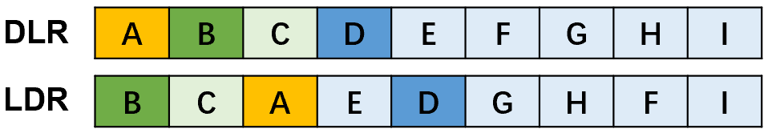 
>
> 3. 图c：
>
>    1. 在图b的基础上，由先序遍历确定：
>       - F是D的右子树、即GHI的双亲/祖先结点。
>    2. 在3.1的基础上，由中序遍历确定：
>       - GH在F的左子树一侧。
>       - I是F的右子树。
>
>     
>
>    3. 最后确定H是G的右子树。
>
> 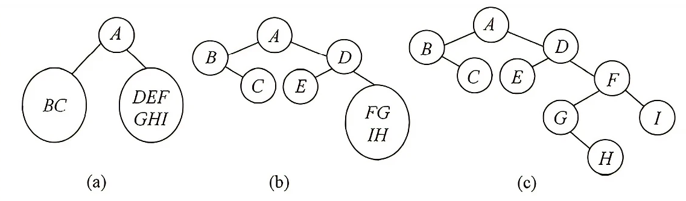 

### 森林

- 森林是m棵互不相交的树的集合。

**树转为二叉树**

1. 为树中的所有相邻的兄弟结点之间加线。
2. 保留根结点和第一个子结点的连线，去除根结点与其他子结点的连线。
3. 层次调整：
   - 树的前序遍历等于二叉树的前序遍历
   - 树的后序遍历等于二叉树的中序遍历

**森林转二叉树**

1. 将森林的每棵树转为二叉树。
2. 第一棵二叉树保持不变，从第二棵二叉树开始，移除将后一棵二叉树的根结点作为前一棵二叉树的根结点的右子树。
3. 层次调整：
   - 森林的前序遍历等于二叉树的前序遍历
   - 森林的后序遍历等于二叉树的中序遍历

- 森林中树的兄弟结点--->二叉树中父结点的左孩子的右孩子结点、或左孩子的孩子的孩子结点。

**二叉树转树/森林**

1. 若该结点是其父结点的左结点，则将其右结点、右结点的子右结点……与其父结点相连。
2. 删除二叉树中所有的父结点与右结点的连线。
3. 层次调整。

### 二叉排序树

- 从任意结点开始，左子树结点值总比右子树值要小（`左子树结点值<根结点值<右子树结点值`），中序遍历（LDR）可以得到一组有序（从小到大）的数值。

### 平衡二叉树

- 平衡二叉树上任一结点的左子树和右子树的深度之差不超过1。
- 平衡因子BF：将二叉树上结点的左子树深度减去右子树深度的值。只要二叉树上有一个结点的平衡因子的绝对值大于1，则该二叉树就是不平衡的

#### 最小不平衡子树

- 在平衡二叉树的构造过程中以距离插入结点最近的且平衡因子绝对值大于1的结点为根的子树。

- 扁担原理：将根结点（支撑点）从A改为B。

```java
Node temp = root; //暂存A结点
root = root.left; //将B结点（A结点的左子树）设为根结点
temp.left = root.right; //将A结点的左子树设为B结点的右子树
root.right = temp; //将A结点设为B结点的右子树
```

| 平衡调整 | 说明                                                         |
| -------- | ------------------------------------------------------------ |
| LL型     | 新插入的结点在结点A的左子树的左子树上。<br /> |
| RR型     |  |
| LR型     | 两次旋转操作，先左旋转后右旋转。先将A结点的左孩子B的右子树的根结点C向左上旋转提升到B结点的位置（即进行一次RR平衡旋转(左单旋转)），然后再把该C结点向右上旋转提升到A结点的位置（即进行一次LL平衡旋转(右单旋转)）。<br /> |
| RL型     | 两次旋转操作，先右旋转后左旋转。先将A结点的右孩子B的左子树的根结点C向右上旋转提升到B结点的位置（即进行一次LL平衡旋转(右单旋转)），然后再把该C结点向左上旋转提升到A结点的位置（即进行一次RR平衡旋转(左单旋转)）。<br /> |

### 最优二叉树（哈夫曼树）

- 二叉树的带权路径长度WPL：从根结点到各个叶子结点的路径长度与相应叶子结点权值的乘积之和：

$$
WPL = \sum_{i=1}^nw_il_i
$$

- 哈夫曼树：带权路径长度最小的二叉树。
   - 使权值越大的叶子结点越靠近根结点，且不存在度为1的结点。 

1. 由给定的n个权值的{$w_1,w_2,_w_3,...,w_n$}，构成n棵只有根结点的二叉树集合F={$T_1,T_2,..,T_n$}，其中每棵二叉树$T_i$中只有一个带权为$w_i$的根结点，其左右子树均为空。
2. 在二叉树集合F中选取两棵根结点的值最小的树，作为左右子树以构造一棵新的二叉树，新二叉树的根结点的权值为这两棵二叉树的权值之和。
3. 在二叉树集合F中删除这两棵二叉树，并将新得到的二叉树加入到集合F中。
4. 重复2、3步，直至集合F中只剩下一棵二叉树，即为哈夫曼树。

```java
public class HuffmanTree {
    private HuffmanTreeNode root;
    List<HuffmanTreeNode> nodes;

    public HuffmanTree() {
        this.nodes = null;
    }

    public HuffmanTree(List<HuffmanTreeNode> nodes) {
        this.nodes = nodes;
    }

    public void createTree() {
        Queue<HuffmanTreeNode> queue = new PriorityQueue<>(new Comparator<HuffmanTreeNode>() {
            @Override
            public int compare(HuffmanTreeNode o1, HuffmanTreeNode o2) {
                return o1.value - o2.value;
            }
        });
        queue.addAll(nodes);

        while (!queue.isEmpty()) {
            HuffmanTreeNode n1 = queue.poll();
            HuffmanTreeNode n2 = queue.poll();
            HuffmanTreeNode parent = new HuffmanTreeNode(n1.value + n2.value, n1, n2);
            if (queue.isEmpty()) {
                root = parent;
                return;
            }
            queue.add(parent);
        }
    }

    public int getWeight() {
        Queue<HuffmanTreeNode> queue = new ArrayDeque<>();
        queue.add(root);
        int weight = 0;
        while (!queue.isEmpty()) {
            HuffmanTreeNode curNode = queue.poll();
            if (curNode.left != null) {
                curNode.left.deep = curNode.deep + 1;
                curNode.right.deep = curNode.deep + 1;
                queue.add(curNode.left);
                queue.add(curNode.right);
            } else {
                weight += curNode.deep * curNode.value;
            }
        }
        return weight;
    }
}

class HuffmanTreeNode {
    int value;
    HuffmanTreeNode left;
    HuffmanTreeNode right;
    int deep;

    public HuffmanTreeNode(int value) {
        this.value = value;
        this.deep = 0;
    }

    public HuffmanTreeNode(int value, HuffmanTreeNode left, HuffmanTreeNode right) {
        this.value = value;
        this.left = left;
        this.right = right;
    }
}
```

#### 哈夫曼编码

- 哈夫曼编码：通过数据出现的频率来分配权重，并由该权重来构建哈夫曼树。
  - 0和1究竟是表示左子树还是右子树没有明确规定。左、右孩子结点的顺序是任意的，所以构造出的哈夫曼树并不唯一，但各哈夫曼树的带权路径长度WPL相同且为最优。此外，如有若干权值相同的结点，则构造出的哈夫曼树更可能不同，但WPL必然相同且是最优的。


>有一段文字内容为“ BADCADFEED”要网络传输给别人：
>
>1. 如果使用二进制数据表示：
>
> 
>
>- 这样按照固定长度编码编码后就是“001000011010000011101100100011“，按每3位来译码。
>
>2. 使用哈夫曼树时：
>
>- 假设六个字母的频率为A 27,B 8,C 15,D 15,E 30,F 5；按权值百分比来分配，并重新按照赫夫曼树来规划它们。
>- 左图为构造赫夫曼树的过程的权值显示。右图为将权值左分支改为0，右分支改为1后的赫夫曼树
>
> 
>
>- 原编码二进制串: 000011000011101100100011 (共 30个字符)
>- 新编码二进制串: 10100101010111100(共25个字符)
>- 数据被压缩，节省了空间。

- 前缀编码：不等长编码必须满足任一个字符的编码都不是另一个字符的编码的前缀。
  - 可以得出一个小结论：哈夫曼编码的字符在哈夫曼树中的位置只能是叶子结点、叶子结点一定代表哈夫曼编码的字符。即：$n_0 = 哈夫曼编码的字符数$。

> 非法的哈夫曼编码：不满足前缀编码的：{ 0, 00, 01, 10, 11}。
>
>  
>
> - 其中：0代表的字符是00、01的字符编码的前缀，故不满足前缀编码。

```java
package tree;

import java.util.PriorityQueue;

public class HuffmanCode {

    public static void main(String[] args) {
        HuffmanCode huffmanCode = new HuffmanCode();
        PriorityQueue<Node> queue = new PriorityQueue<>();
        queue.add(new Node(15, 'D'));
        queue.add(new Node(27, 'A'));
        queue.add(new Node(5, 'F'));
        queue.add(new Node(8, 'B'));
        queue.add(new Node(15, 'C'));
        queue.add(new Node(30, 'E'));
        huffmanCode.init(queue);
        huffmanCode.DLR(huffmanCode.root);

    }

    Node root;

    /**
     * 依据传入PriorityQueue的Data的weight值来创建哈夫曼树
     *
     * @param queue 创建哈夫曼树的结点
     */
    public void init(PriorityQueue<Node> queue) {
        //只要queue非空就继续添加
        while (!queue.isEmpty()) {
            Node left = queue.poll();
            Node right = queue.poll();
            //父结点
            Node parent = new Node(left, right, left.weight + right.weight);
            //如果队列中没有结点
            if (queue.isEmpty()) {
                root = parent;
                return;
            }
            //将当前的父结点加入到Queue中重新排序
            queue.add(parent);
        }
    }

    public void DLR(Node node) {
        if (node != null) {
            System.out.print(node.characteristic);
            DLR(node.left);
            DLR(node.right);
        }
    }

    //将哈夫曼树变为二进制串
//    public String unCoding() {
        //1.获得编码的顺序
        //2.
//    }
}

class Node implements Comparable {
    Node left;
    Node right;
    int weight; //频率百分比 权值
    char characteristic;

    public Node() {
    }

    public Node(Node left, Node right, int weight) {
        this.left = left;
        this.right = right;
        this.weight = weight;
    }

    public Node(int weight, char characteristic) {
        this.weight = weight;
        this.characteristic = characteristic;
    }

    @Override
    public int compareTo(Object o) {
        if (!(o instanceof Node))
            throw new RuntimeException("不是同一个类型");

        Node node = (Node) o;
        return this.weight - node.weight;
    }
}
```

### 字典树（前缀树）

- 字典树（Trie树、前缀树）利用字符串的公共前缀来减少查询时间，最大限度地减少无谓的字符串比较，查询效率比哈希树高。首先看单词的第一个字母是不是在字典的第一层。如果不在，说明字典树里没有该单词；如果在，就在该字母的孩子结点里找是不是有单词的第二个字母，没有说明没有该单词，有的话用同样的方法继续查找。

> 典型用于统计、排序、和保存大量字符串，经常被搜索引擎系统用于文本词频统计。

1. 根结点不包含字符，除了根结点每个结点都只包含一个字符。（为了能够包括所有字符串）
2. 从根结点到目标结点所经过的所有字符都串起来目标结点对应的字符串。
3. 每个结点的子结点字符不同，使得每个单词、字符都是唯一的。

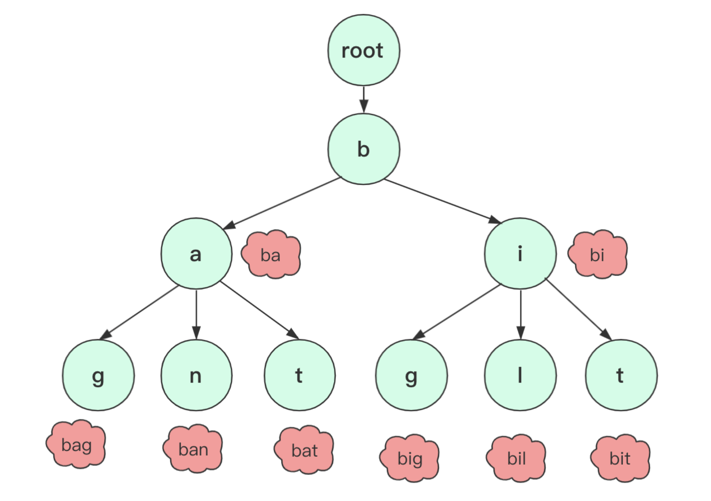 


```java
class Trie {
    private TrieNode root;

    public Trie() {
        root = new TrieNode();
        root.worldEnd = false;
    }

    public void insert(String word) {
        TrieNode node = root;
        for (int i = 0; i < word.length(); i++) {
            Character character = word.charAt(i);
            //如果当前结点没有包含相关的后缀，则设置并获取该字符
            if (!node.childdren.containsKey(character)) {
                node.childdren.put(character, new TrieNode());
            }
            node = node.childdren.get(character);
        }
        node.worldEnd = true;
    }

    //全词匹配
    public boolean search(String word) {
        TrieNode node = root;
        boolean found = true;
        for (int i = 0; i < word.length(); i++) {
            Character character = word.charAt(i);
            if (!node.childdren.containsKey(character)) {
                return false;
            }
            node = node.childdren.get(character);
        }
        return found && node.worldEnd;
    }

    //前缀匹配
    public boolean starWith(String prefix) {
        TrieNode node = root;
        boolean found = true;
        for (int i = 0; i < prefix.length(); i++) {
            Character character = prefix.charAt(i);
            if (!node.childdren.containsKey(character)) {
                return false;
            }
            node = node.childdren.get(character);
        }
        return found;
    }
}

class TrieNode {
    Map<Character, TrieNode> childdren;
    boolean worldEnd;

    public TrieNode() {
        childdren = new HashMap<>();
        worldEnd = false;
    }
}
```

### 线索二叉树

### B树

#### B-tree

#### B+tree

#### B*tree

### 红黑树

## 图

- 图(Graph)是由 **顶点的有穷非空集合V ( G )** 和顶点之间 **边的集合E ( G )** 组成：G = ( V , E ) 。

> G表示图，V是图G中顶点的集合，E是图G中边的集合。

| 结构   | 说明                 |
| ------ | -------------------- |
| 顶点 V |                      |
| 边 E   | 边可以有方向（关系） |
| 路径   | 一组顶点和边的组合   |

| 图的类型 | 说明                                                         |
| -------- | ------------------------------------------------------------ |
| 有向图   | 边是有方向的，E中的元素是有序的<br /> |
| 无向图   | 边是没有方向的，E中的元素是无序的                            |

| 图类型 | 说明                                                         |
| ------ | ------------------------------------------------------------ |
| 简单图 | 不存在重复边<br />不存在顶点到自身的边                       |
| 多重图 | 图中某两个结点之间的边数多于一条<br />允许顶点通过同一条边和自己关联（即存在自环和平行）<br />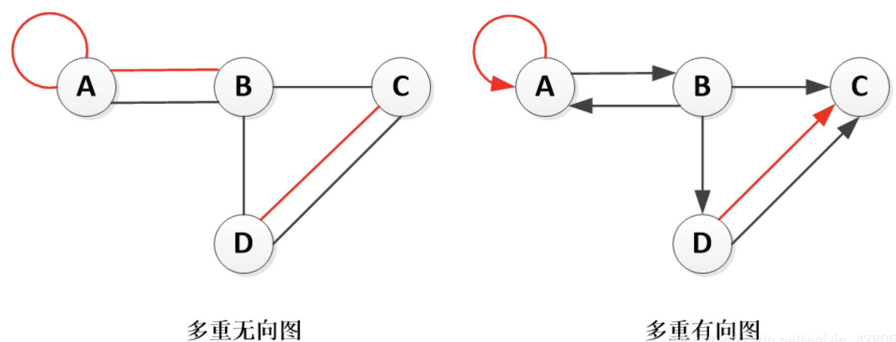 |

| 完全图<br />（简单完全图） | 说明                                                         |
| -------------------------- | ------------------------------------------------------------ |
| 无向完全图                 | 任意两个顶点之间都存在边。<br />n个顶点，$\frac{n(n-1)}{2}$条边。 |
| 有向完全图                 | 任意两个顶点之间都存在互为相反的两条弧。<br />n个顶点，$n(n-1)$条边。<br /> |

- 子图：设G(V,E)、G'(V',E')，V'是V的子集，E'是E的子集，则G'是G的子图。并非V和E的任何子集都能构成G的子图，有可能不是图，即E的子集中的某些边关联的顶点可能不在这个V的子集中。
- 若有满足V(G')=V(G)，则称该子图为G的生成子图。

| 图相关     | 说明                                                         |
| ---------- | ------------------------------------------------------------ |
| 邻接、依附 | 对于任意两个顶点$v_i、v_j$，若存在边$(v_i，v_j)$<br />无向图，顶点$v_i、v_j$互为邻接点（adjacent）。<br />有向图，顶点$v_i$邻接到顶点$v_j$（顶点$v_j$是顶点$v_i$的邻接点），且弧$<v_i，v_j>$依附于顶点$v_i、v_j$。 |
| 度         | 无向图，顶点v的度：依附于该顶点的边的条数（$TD(v)_{无向图} = 2E$）。 |
| 入度、出度 | 有向图，入度(弧头)：以顶点v为终点的有向边的数目：$ID(v)$。 出度(弧尾)：以顶点v为起点的有向边的数目：$OD(v)$。<br /> |
| 权、网     | 权重：在一个图中，每条边都可以标上具有某种含义的数值。<br />网：带权图。 |
| 路径       | 顶点Vp到顶点Vq之间的一条路径：（$ V_p,V_{i1},...,V_{im},V_{q} $）。<br />路径长度：路径上边的数目。<br />简单路径：在路径序列中，顶点不重复出现的路径。 |
| 回路（环） | 第一个顶点和最后一个顶点相同的路径。<br />若一个图有n个顶点，并且有大于n-1条边，则此图一定有环。<br />简单回路：除第一个顶点和最后一个顶点外，其余顶点不重复出现的回路。 |
| 距离       | 从顶点u出发到顶点v的最短路径的长度。<br />若从u到v根本不存在路径，则记该距离为无穷。 |

> 有向树：一个顶点的入度为0，其余顶点的入度均为1的有向图。

- 稀疏图的判断条件：$|E| < |V|\log_2^{|V|}$。

| 连通                     |                                                              |
| ------------------------ | ------------------------------------------------------------ |
| 连通图<br />（无向图）   | 连通：无向图中，若从顶点v到顶点w有路径存在。 <br />连通图：若图G中任意两个顶点都是连通的，则称图G为连通图，否则称为非连通图。若一个图有n个顶点，并且边数小于n − 1，则此图必是非连通图。<br />连通分量：极大连通子图是无向图的连通分量，要求该连通子图包含其所有的边。<br />极小连通子图：既要保持图连通又要使得边数最少的子图。<br /> |
| 强连通图<br />（有向图） | 强连通：有向图中，若从顶点v到顶点w、从顶点w到顶点v都有路径存在。<br />强连通图：图中任意两个顶点都是强连通的。<br />强连通分量：有向图的极大强连通子图。 |

| 连通子图                       | 说明                                                         |
| ------------------------------ | ------------------------------------------------------------ |
| 极大连通子图<br />（连通分量） | 1. 连通图只有一个极大连通子图，就是它本身。<br/>2. 非连通图有多个极大连通子图。<br/>   - 非连通图的极大连通子图叫做连通分量，每个分量都是一个连通图。<br/>3. 如果此时加入任何一个不在 图的点集 中的点都会导致它不再连通。 |
| 极小连通子图<br />（生成树）   | 1. 连通图的生成树是包含图中全部顶点的一个极小连通子图，而同一个连通图可以有不同的生成树。（极小连通子图只存在于连通图中）（只要能连通图的所有顶点而又不产生回路的任何子图都是它的生成树）<br/>2. 若图中顶点数为n，则它的生成树含有n-1条边，若砍去它的一条边，则会变成非连通图，若加上一条边则会形成一个回路。<br />3. 生成森林：在非连通图中，连通分量的生成树构成了非连通图的生成森林。 |

### 图的实现

#### 邻接表

- 边表：对图G中的每个顶点V建立一个单链表，第i个单链表中的结点表示依附于顶点$V_i$的边。
  - 出边表：对于有向图：是以$V_i$为尾的弧。

| 结点       | 域                                                           |
| ---------- | ------------------------------------------------------------ |
| 顶点表结点 | data：顶点域 <br />firstarc：指向第一条邻接边的指针域        |
| 边表结点   | adjvex：邻接点域<br />nextarc：指向下一条邻接边的指针域 <br />weight：权值信息的数据域 |

 

 

1. 所需的存储空间：（稀疏图：采用邻接表以节省存储空间）
   - 无向图：$O(|V|+2|E|)$。
   - 有向图：$O(∣V∣+∣E∣)$。
2. 找出顶点的所有邻边：
   - 邻接表：只需要读取该结点的邻接表。
   - 邻接矩阵：需要扫描一行，花费的时间为$O(n)$。

> 若要确定给定的两个顶点间是否存在边：
>
> - 邻接矩阵中可以立刻查到。
> - 邻接表中则需要在相应结点对应的边表中查找另一结点，效率较低。

3. 有向图的邻接表：求一个给定顶点的出度只需计算其邻接表中的结点个数，但求其顶点的入度则需要遍历全部的邻接表。
   - 逆邻接表：加速求解给定顶点的入度。
4. 图的邻接表表示并不唯一，因为在每个顶点对应的单链表中，各边结点的链接次序可以是任意的，它取决于建立邻接表的算法及边的输入次序。

```java
/**
 * 1. 定义一个Node[] 数组，用来存放这几条链表
 * 2. 每个链表的头存放在该数组中，并且链表中的每一个结点均是表示和头结点存在边（而不是路径）
**/
public class AdjacencyList {

    class VexNode {
        public char data; //数值
        public EdgeNode firstEdge = null; //边
    }

    class EdgeNode {
        public EdgeNode preEdge = null; //前一个边
        public EdgeNode nextEdge = null; //后一个边
        public VexNode vex = null; //终点

    }

    private VexNode[] list = new VexNode[5];

    public void init(int nodeNumber) {}
}
```

##### 十字链表

- 将邻接表（以入边连接）和逆邻接表（以出边连接）结合。

**结构为：**

- 顶点表结点结构为：数据域data、入边表头指针firstIn、出边表头指针firstOut
- 边表结点结构为：弧起点在顶点表的下标tailVex、弧终点在顶点表的下标headVex、入边表指针域headLink（指向终点相同的下一条边）、出边表指针域tailLink（指向启点相同的下一条边）、权值域weight（可选）

 

```java
public class CrossLinkedList {
    //顶点表结点
    class VexNode {
        int data;
        EdgeNode firstIn;
        EdgeNode firstOut;
    }

    //边表结点
    class EdgeNode {
        VexNode tailVex;
        VexNode headVex;
        EdgeNode headLink;
        EdgeNode tailLink;
        int weight = -1; //权值
    }

    VexNode[] list = null; //存放顶点的数组

    public void creat(int number) {}
}
```

##### 邻接多重表

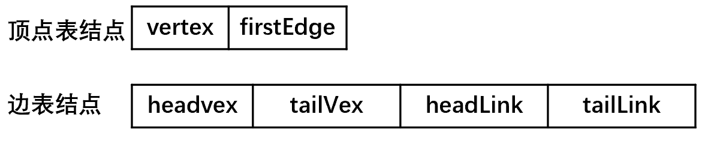 

 

```java
public class DoubelLinkedList {
    class VexNode {
        int data;
        EdgeNode firstOut;
    }

    class EdgeNode {
        VexNode headVex;
        VexNode tailVex;
        EdgeNode headLink;
        EdgeNode tailLink;
    }

    VexNode[] list = null;

    public void create(int number) {}
}
```

#### 邻接矩阵

- 邻接矩阵(Adjacency Matrix) ：一个一维数组存储图中顶点信息，一个二维数组(邻接矩阵)存储图中的边或弧的信息。

 

```java
class GraphMatrix {
    static final int MAXNUM = 20; //最大顶点数
    static final int MAXVALUE = 65535; //权值总和最大值
    char[] vertex = new char[MAXNUM];//保存顶点数据
    int graphType; //图的类型：0无向图，1有向图
    int vertexNum; //顶点数量
    int edgeNum; //边数量
    int[][] edgeWeight = new int[MAXNUM][MAXNUM];//保存顶点的边信息
    int[] isTrav = new int[MAXNUM];//遍历标识
}
```

##### 边集数组

| 边集数组（一维数组） | 说明                                                         |
| -------------------- | ------------------------------------------------------------ |
| 顶点数组             | 存储顶点的信息                                               |
| 边数组               | 存储边的信息<br />每个数据元素由一条边的起点下标(begin)、 终点下标(end)和权(weight)组成 |


 

##### 关联矩阵

### 图的遍历

| 图的表示 | 说明                                                         |
| -------- | ------------------------------------------------------------ |
| 邻接矩阵 | 图的邻接矩阵表示是唯一的<br />基于邻接矩阵的遍历所得到的DFS序列和BFS序列是唯一的。 |
| 邻接表   | 若边的输入次序不同，生成的邻接表也不同<br />基于邻接表的遍历所得到的DFS序列和BFS序列是不唯一的。 |

#### DFS 深度优先遍历

| DFS实现  |                                                              |
| -------- | ------------------------------------------------------------ |
| 邻接矩阵 | $T(n) = O(n^2)$：二维数组，要查找每个顶点的邻接点需要访问矩阵中的所有元素。<br />$S(n) = O(V)$ |
| 邻接表   | $T(n) = O(n+e)$：找邻接点所需的时间取决于顶点和边的数量。<br />$S(n) = O(V)$ |

- 深度优先搜索会产生一棵深度优先生成树：对连通图调用DFS才能产生深度优先生成树，否则产生的将是深度优先生成森林。

```
1. 首先访问图中某一起始顶点v，然后由v出发，访问与v邻接且未被访问的任一顶点w，再访问与w邻接且未被访问的任一顶点…重复上述过程。
2. 当不能再继续向下访问时，依次退回到最近被访问的顶点，若它还有邻接顶点未被访问过，则从该点开始继续上述搜索过程，直至图中所有顶点均被访问过为止。
```

```java
class GraphMatrix {
    static final int MAXNUM = 20; //最大顶点数
    static final int MAXVALUE = 65535; //权值总和最大值
    char[] vertex = new char[MAXNUM];//保存顶点
    int[][] edgeWeight = new int[MAXNUM][MAXNUM];//保存边信息
    int graphType; //图的类型：0无向图，1有向图
    int vertexNum; //顶点数量
    int edgeNum; //边数量
    int[] isTrav = new int[MAXNUM];//遍历标识
}

/**
    * 深度遍历
    *
    * @param graphMatrix
    * @param n           从第n个结点开始
    */
public static void deepTraOne(GraphMatrix graphMatrix, int n) {
    //清除之前遍历的标识
    for (int i = 0; i < graphMatrix.vertexNum; i++) {
        graphMatrix.isTrav[i] = 0;
    }

    graphMatrix.isTrav[n] = 1; //标记该顶点已处理
    System.out.printf("->%c", graphMatrix.vertex[n]);

    //处理结点
    for (int i = 0; i < graphMatrix.vertexNum; i++) {
        if (graphMatrix.edgeWeight[n][i] != GraphMatrix.MAXVALUE && graphMatrix.isTrav[n] == 0) {
            deepTraOne(graphMatrix, i);
        }
    }
}

/**
    * 深度优先遍历
    *
    * @param graphMatrix
    */
public static void deepTraGraph(GraphMatrix graphMatrix) {
    //清除之前遍历的标识
    for (int i = 0; i < graphMatrix.vertexNum; i++) {
        graphMatrix.isTrav[i] = 0;
    }

    System.out.print("深度优先遍历结点：");
    for (int i = 0; i < graphMatrix.vertexNum; i++) {
        if (graphMatrix.isTrav[i] == 0) {
            deepTraOne(graphMatrix, i); //调用深度遍历
        }
    }
    System.out.println();
}
```

#### BFS 广度优先遍历

| BFS实现  | 分层查找，辅助队列记忆正在访问的顶点的下一个顶点             |
| -------- | ------------------------------------------------------------ |
| 邻接表   | $T(n) = O(n+e)$、$S(n) = O(n)$<br />每个顶点均需搜索一次、或入队一次， 在搜索任一顶点的邻接点时，每条边至少访问一次。 |
| 邻接矩阵 | $T(n) = O(n^2)$<br />查找每个顶点的邻接点所需的时间为$O(n)$。 |

```java
class Graph {
    int vexNumber = 10; //默认10个顶点
    int[] vex = new int[vexNumber]; //顶点
    int[][] edge = new int[vexNumber][vexNumber];//边 z表示无权值（初始值）
    int z = Integer.MAX_VALUE; //无权值的表示
    boolean[] isTraced = new boolean[vexNumber]; //标识遍历过的
}
//对于邻接表
public static void bfs(Graphic graph){
    Queue<int> queue = new Queue<>();
    //初始化
    for(int i = 0; i < graph.isTraced.lenth; i++){  
        graph.isTraced[i] = fasle;
    }
    for(int i =0; i < graph.vexNumber; i++){
        if(!graph.isTraced[i]){
            graph.isTraced[i] = true;//标识为处理
            queque.add(graph.vex[i]);
        }
    }
}
```

### 查询模式

| 查询模式 | 说明                                                         |
| -------- | ------------------------------------------------------------ |
| 离散查询 | 面向元数据的查询。                                           |
| 关联查询 | 从某个顶点（或多个顶点）出发，通过对边、点以及各自的属性来过滤，返回相关联的数据集。 |

> 元数据：具有唯一ID定位的最小颗粒。在图中通常认为顶点和边是元数据。

#### 最小生成树

- 最小生成树：极小的连通子图，生成的树形不唯一（e>n-1），但权值之和一定是最小值。
- 假设G(V, E)是一个带权连通无向图，U是顶点集V的一个非空子集。若$(u,v)$是一条具有最小权值的边，其中$u \in U，v \in V-U$，则必存在一棵包含边$(u, v)$的最小生成树。

##### Kruskal算法

| 算法 | Kruskal                                                      |
| ---- | ------------------------------------------------------------ |
| 思想 | Kruskal算法调度的单位是边（边集数组）：所有边能小则小。<br />并查集（不相交集合）判断两点是否在同一集合。 |
| T(n) | 对n个顶点，e条边的图：$T(n)=O(e\log_2^e)$，适用于求稀疏网的最小生成树。 |
| 图解 | 将连通网中所有的边按照权值大小做升序排序，从权值最小的边开始选择，只要此边不和已选择的边一起构成环路，就可以选择它组成最小生成树。<br />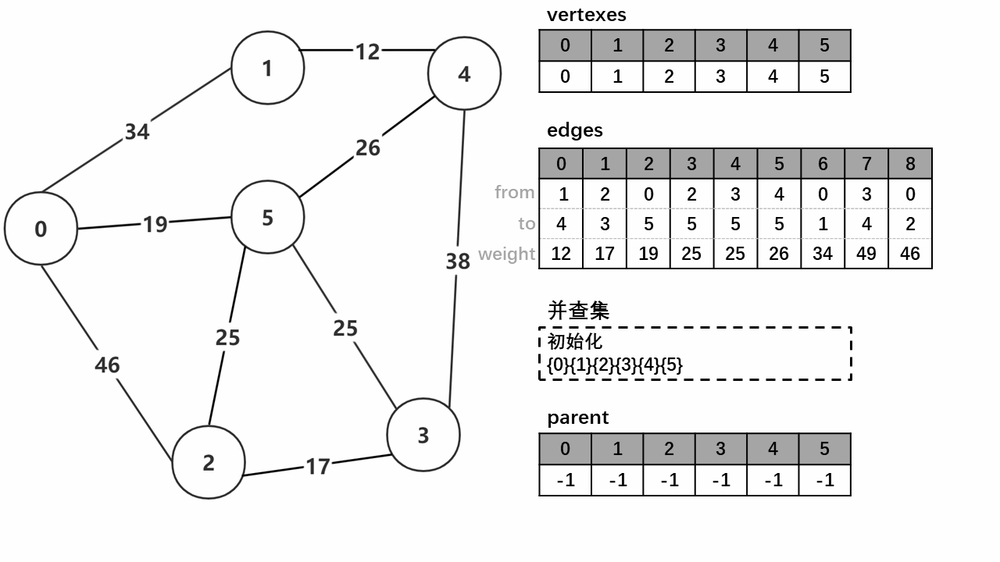 |

```java
/**
     * 打印输出最小生成树
     *
     * @param vertexes 顶点数组
     * @param edges    边集数组
     */
public static void kruskal(int[] vertexes, EdgeArrayNode[] edges) {
    int from, to;
    int[] parent = new int[vertexes.length];
    for (int i = 0; i < vertexes.length; i++) {
        parent[i] = -1;
    }

    for (int i = 0, j = 0; j < edges.length && i < edges.length; i++) {
        EdgeArrayNode node = edges[i];
        from = findRoot(parent, node.getFrom());
        to = findRoot(parent, node.getTo());
        if (from != to) {
            System.out.printf("第%d条边：%d-%d：%d\n",
                              j, vertexes[node.getFrom()], vertexes[node.getTo()], node.getWeight());
            parent[to] = from;
            j++;
        }
    }
}

/**
     * 获取该顶点对应子树的根结点
     *
     * @param parent      顶点的父结点数组
     * @param vertexIndex 顶点下标
     * @return 根结点
     */
private static int findRoot(int[] parent, int vertexIndex) {
    int root = vertexIndex;
    while (parent[root] > -1) {
        root = parent[root];
    }
    return root;

}
```

##### Prim算法

| 算法   | Prim                                                         |
| ------ | ------------------------------------------------------------ |
| 思想   | 从已知扩散寻找最小。                                         |
| T(n)   | $T(n)=O(n^2)$                                                |
| 生成树 | $G=(V,E)$，最小生成树：$T=\{U,TE\}$，初始状态：$U=\{v\}(v \in V)、TE=\{\}$。<br /> |
| 图解   |                |

| 结构               | 说明                 |
| ------------------ | -------------------- |
| int[] adjVexes     | 当前最短边邻接点数组 |
| int[] lowCostEdges | 当前最短边数组       |

```java
/**
     * 输出打印最小生成树
     *
     * @param startVexIndex 作为起始点的顶点位置
     * @param adjMatrix     邻接矩阵
     * @param vexes         顶点数组
     **/
public static void prim(int startVexIndex, int[][] adjMatrix, int[] vexes) {
    int VEX_NUMBER = vexes.length;
    int[] adjVexes = new int[VEX_NUMBER];
    int[] lowCostEdges = new int[VEX_NUMBER];

    //初始化
    for (int i = 0; i < VEX_NUMBER; i++) {
        lowCostEdges[i] = adjMatrix[startVexIndex][i];
        adjVexes[i] = startVexIndex;
    }

    for (int i = 1; i < VEX_NUMBER; i++) {
        int minIndex = getMin(lowCostEdges); //获取最短边邻接点
        //输出打印最小生成树的边
        System.out.printf("第%d条边：%d--%d：%d\n",
                          i, adjVexes[minIndex], vexes[minIndex], lowCostEdges[minIndex]);
        lowCostEdges[minIndex] = 0; //minIndex加入U

        for (int j = 0; j < VEX_NUMBER; j++) {
            //如果有更小的边，则替换之。
            if (adjMatrix[j][minIndex] < lowCostEdges[j]) {
                lowCostEdges[j] = adjMatrix[j][minIndex];
                adjVexes[j] = minIndex;
            }
        }
    }
}

/**
     * 返回边数组中权值最小的边的邻接点的位置
     *
     * @param edges 边数组
     * @return index 边数组下标对应其在顶点数组中的顶点的位置
     **/
public static int getMin(int[] edges) {
    int min = Integer.MAX_VALUE;
    int index = -1;
    for (int i = 0; i < edges.length; i++) {
        if (edges[i] == 0) //在U内的跳过
            continue;
        if (min > edges[i]) {
            min = edges[i];
            index = i;
        }
    }
    return index;
}
```

#### 最短路径

##### Dijkstra算法

- Dijkstra算法：固定一个顶点作为源结点，然后找到该顶点到图中所有其它结点的最短路径，产生一个最短路径树。每次取出未访问结点中距离最小的，用该结点更新其他结点的距离。

> 绝大多数的Dijkstra 算法不能有效处理带有负权边的图。

> Dijkstra：求单源最短路径，每计算一个点需要对这个点从新更新距离。
>
> Prim：直接找已知点的邻边最小加入，不用更新距离。

##### Floyd算法

| 算法 | Floyd                                                        |
| ---- | ------------------------------------------------------------ |
| 思想 | 以每个点为中转站，刷新所有入度和出度的距离。                 |
| 说明 | 遍历每一个顶点-->遍历点的每一个入度-->遍历点的出度。 <br />如果以该点为中转站的距离更短，就刷新距离。 |
| 图解 |  |

```
1. 以A为中转站，刷新所有出度和入度的距离：有BD两点既是A的入度也是A的出度
   - BA + AD > BD
   - DA + AB > DB
   - 因此不刷新距离，A点不作为BD两点的中转站
2. 以B为中转站，刷新所有入度和出度的距离：有ADC三点的出入度。
   - AB + BC < AC (AC为Z无穷大)：
   - 故刷新距离为：将AB+BC的值赋给AC：distance[0][2] = distance[0][1] + distance[1][2]
   - 刷新最短路径：AC的距离引入中转站B：path[0][2] = 1 (1代表B在graph的下标)
   - AB + BD > AD 
   - 故刷新距离为：将AB+BD的值赋给AD：distance[0][3] = distance[0][1] + distance[1][3]
   - 刷新最短路径：AD的距离引入中转站B：path[0][3] = 1
   - 以此类推。。。
```

```java
int[][] distance;//存放每个点到其他点的最短距离
int[][] path;//存储每个点到其他点的最短距离的路径（存放中转站）

public void floyd(int[][] graph) {
    final int Z = Integer.MAX_VALUE;
    //初始化
    distance = graph;
    path = new int[graph.length][graph.length];
    for (int i = 0; i < graph.length; i++) {
        for (int j = 0; j < graph.length; j++) {
            path[i][j] = j;
        }
    }
    //对每个点设置中转站测试
    for (int i = 0; i < graph.length; i++) {
        //出度
        for (int j = 0; j < graph.length; j++) {
            //入度
            for (int k = 0; k < graph[j].length; k++) {
                if (graph[j][i] != Z && graph[i][k] != Z) {
                    int newDistance = graph[j][k] + graph[i][k];
                    if (newDistance < graph[j][k]) {
                        //刷新距离
                        graph[j][k] = newDistance;
                        //刷新路径
                        path[j][k] = i;
                    }
                }
            }
        }
    }
}
```

#### K邻查询 K-Hop

- K-Hop：从某个顶点出发，查找和该顶点最短路径距离为K跳的所有不重复的顶点集合。

### 有向无环图 DAG

- 一个有向无环图可以有一个或多个拓扑排序序列。

#### AOV网

- AOV网：顶点表示活动，弧表示活动之间的优先关系（依赖关系）的有向无环图。

##### 拓扑排序 TopSort

- 拓扑排序用来判断AOV网中是否存在回路。

> **拓扑序列**：用来排序具有依赖关系的任务。
>
> -  满足偏序关系的顶点序列（具有依赖关系的一组任务）：若从顶点Vi到顶点Vj有一条路径，则在顶点序列中Vi必在Vj之前。（如工业流程中：在作业A之前必须要完成作业B，以此类推）

```
1. 从AOV网中选择一个没有前驱的顶点（入度为0的顶点）并且输出。
2. 从AOV网中删去该顶点，并且删除所有以该顶点为尾（出度）的弧。
3. 重复以上，直到全部顶点被输出（没有回路）、或AOV网不存在没有前驱的点（存在回路）。
```

| 存储结构（邻接表） | 说明                                                         |
| ------------------ | ------------------------------------------------------------ |
| Vex[] vexList      | 顶点表                                                       |
| vexNum             | 顶点数量                                                     |
| Vex                | value：数据域<br />firstEdge：边集链表<br />in ：入度域（计算顶点中的入度，如果为0则加入到拓扑排序操作中）。 |
| Edge               | nextVex：入度顶点<br />next：指针域，指向另一条边            |

```
1. 栈stack初始化，计数器count初始化
2. 扫描顶点表vexList，将入度为0的顶点压栈
3. 当栈非空时，循环
   1. curVex=栈顶元素出栈；输出栈顶curVex；count++
   2. 对顶点curVex的每条边edge的nextVex执行：
      1. 将nextVex中的入度减1
      2. 如果该nextVex中的入度为0则入栈
4. if(count < vexNum) 输出有回路的信息
```


#### AOE网

- AOE网：表示工程的带权有向图中，用顶点表示事件、有向边表示活动、边上的权值表示完成该活动的开销（如完成活动所需的时间）。
  - 源点：入度为0的顶点，整个工程的开始点。
  - 终点（汇点）：出度为0的顶点，整个过程的结束点。


- 只有在进入某顶点的所有活动都结束，该顶点代表的事件才能发生。
- 只有在某顶点所代表的事件发生后，从该顶点出发的各活动才能开始。

> 一个具有5个活动（边）、4个事件（顶点）的AOE网：
>
> - 顶点v0~v4分别表示一个事件。
> - 弧`<v0,v1>,<v0,v2>,<v1,v2>,<v1,v3>,<v2,v3>`分别表示一个活动。
>
> 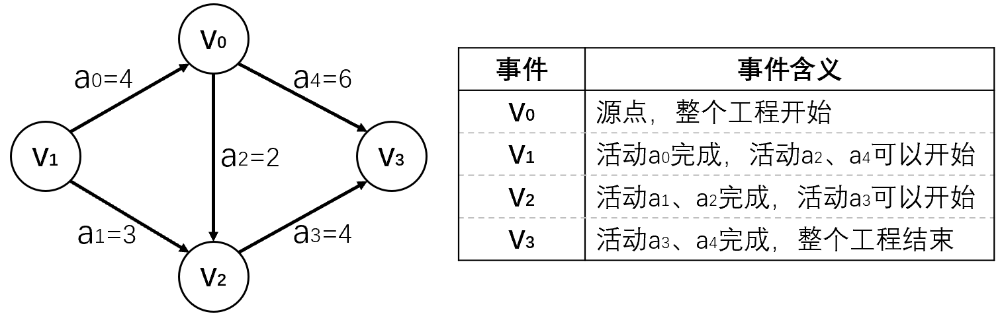

##### 关键路径

| 概念     | 说明                                                         |
| -------- | ------------------------------------------------------------ |
| 关键路径 | 从源点到汇点具有最大长度的路径（关键活动所在的路径）。       |
| 关键活动 | 在关键路径上的活动（边）（`el[i] = ee[i]的活动`）。<br />活动的时间余量：`el[i] - ee[i]`。 |
| 路径长度 | 路径上各个活动所持续的时间之和。                             |

| 发生时间 | 事件                                                         | 活动                         |
| -------- | ------------------------------------------------------------ | ---------------------------- |
| 最早     | `ve[0] = 0`<br />`ve[k] = max{ve[j] + len<vj,vk>}，(<vj,vk>∈p[k])` | `ee[i] = ve[k]`              |
| 最晚     | `vl[k] = vl[j] - len<vk,vj>`                                 | `el[i] = vl[j] - len<vk,vj>` |

> 只有事件vk发生，从vk出发的活动`<vk,vj>`才能开始。

```
//对于有n个顶点，e条弧的有向带权图。
1. 令ve[0]=0，按拓扑序列求其余各顶点的最早发生时间ve[i]
2. 如果得到的拓扑序列中顶点个数小于AOE网中的顶点数，则说明网中存在回路，不能求关键路径，算法终止；否则执行步骤3.
3. 令vl[n-1] = ve[n-1]，按逆拓扑有效求其余各顶点的最迟发生时间vl[i]
4. 求每条边的最早开始时间ee[i]和最迟开始时间el[i]
5. 若某条边ai满足条件ee[i]=el[i]，则a[i]为关键活动
```

# 算法

## 复杂度分析

- 算法：有限的操作序列。

- 算法的五大特性：有穷性、确定性、可行性、输入、输出。

- 好算法的目标要求：正确性、可读性、健壮性、高效率、低存储量。

| 算法复杂度           | 说明                   |
| -------------------- | ---------------------- |
| 时间复杂度<br />T(n) | 执行语句的总步数       |
| 空间复杂度<br />O(n) | 算法所需存储空间的量度 |

| 渐近符号 | 说明 |
| -------- | ---- |
| Θ        |      |
| O        |      |
| ω        |      |
| o        |      |

## 查找算法

**平均查找长度**
$$
ALG=\sum^n_{i=1}P_iC_i
$$

> 二分查找的平均查找长度：长度为12的有序表采用顺序存储结构，在等概率的条件下：
>
>  
>
> - 查找成功：
>
> $$
> (1*2 + 2*2 + 3 * 4 + 4*5) \div 12 = \frac{37}{12}
> $$
>
> - 查找失败：
>
> $$
> (3 * 3 + 4 * 10) \div 13  = \frac{49}{13}
> $$

### 顺序查找

```java
public static int search(int arr[],int data){
    for(int i = 0;i < arr.length;i++){
        if(arr[i] == data){
            return i;
        }
    }
    return -1;
}
```

### 二分查找

- 二分查找要求有序的线性结构，需要先排序。

```java
public static int search(int[] arr, int data, int start, int end) {
    //先进行排序
    Arrays.sort(arr);
    int mid;
    while (start <= end) {
        mid = (start + end) / 2;
        if(arr[mid]==data){
            return mid;
        }else if (arr[mid] > data){
            end = mid -1;
        } else {
            start = mid +1;
        }
    }
    return -1;
}
```

## 排序算法  

| 排序算法 | 平均时间复杂度 | 最好           | 最坏           | 空间复杂度   | 稳定性 |
| -------- | -------------- | -------------- | -------------- | ------------ | ------ |
| 冒泡排序 | $O(n^2)$       | $O(n)$         | $O(n^2)$       | $O(1)$       | 稳定   |
| 快速排序 | $O(n\log_2^n)$ | $O(n\log_2^n)$ | $O(n^2)$       | $O(log_2^n)$ | 不稳定 |
| 插入排序 | $O(n^2)$       | $O(n)$         | $O(n^2)$       | $O(1)$       | 稳定   |
| 希尔排序 | $O(n^{1.3})$   | $O(n)$         | $O(n\log_2^n)$ | $O(1)$       | 不稳定 |
| 选择排序 | $O(n^2)$       | $O(n^2)$       | $O(n^2)$       | $O(1)$       | 不稳定 |
| 堆排序   | $O(n\log_2^n)$ | $O(n\log_2^n)$ | $O(n\log_2^n)$ | $O(1)$       | 不稳定 |
| 归并排序 | $O(n\log_2^n)$ | $O(n\log_2^n)$ | $O(n\log_2^n)$ | $O(n)$       | 稳定   |
| 桶排序   | $O(n+k)$       | $O(n+k)$       | $O(n+k)$       | $O(n+k)$     | 稳定   |
| 计数排序 | $O(n+k)$       | $O(n+k)$       | $O(n+k)$       | $O(k)$       | 稳定   |
| 基数排序 | $O(nk)$        | $O(nk)$        | $O(nk)$        | $O(n+k)$     | 稳定   |

### 交换类

#### 冒泡排序

| 排序                 | 冒泡排序                                                     |
| -------------------- | ------------------------------------------------------------ |
| 思想                 | 从前往后把大元素往后调（或 从后向前把小元素往前调）,最后一个数只能换一次位置。 |
| 时间复杂度<br />T(n) | 平均：$O(n^2)$<br />最好：$O(n)$<br />最坏：$O(n^2)$         |
| 空间复杂度<br />O(n) | $O(1)$                                                       |
| 稳定性               | 稳定                                                         |
| 图解                 |    |

```java
public void bubblingSort(double[] arr) {
    for (int i = 0; i < arr.length; i++) {
        for (int j = 0; j < i; j++) {
            if (arr[j] > arr[j + 1]) {
                double temp = arr[j];
                arr[j] = arr[j + 1];
                arr[j + 1] = temp;
            }
        }
    }
    for (int i = 0; i < arr.length; i++) {
        System.out.println(arr[i]);
    }
}
```

#### 快速排序

| 排序                 | 快速排序                                                     |
| -------------------- | ------------------------------------------------------------ |
| 思想                 | 1. 将序列变成两个部分：序列左边全部小于一个数，序列右面全部大于一个数。<br />2. 递归，将左、右序列各自排序。 |
| 时间复杂度<br />T(n) | 平均：$O(n\log_2^n)$<br />最好：$O(n\log_2^n)$<br />最坏：$O(n^2)$ |
| 空间复杂度<br />O(n) | $O(log_2^n)$                                                 |
| 稳定性               | 不稳定                                                       |
| 图解                 |                                                              |

```java
public static void quick(int[] arr, int left, int right) {
    //选择排序的范围 下标
    int low = left;
    int high = right;

    //判断是否到达停止条件，是否越界
    if (low > high) {
        return;
    }

    int point = arr[low]; //额外空间，要求左边都小于他，同时右边都大于

    //完成一轮大小互换：将小于point的都放在左边，大于的放在右边
    while (low < high) {
        //找到的第一个小于point的则退出循环，并将该数覆盖arr[low]，即目前point所在的位置。
        //否则继续查找。
        while (low < high && arr[high] >= point) {
            high--;
        }
        arr[low] = arr[high];
        //找到的第一个大于point的则退出循环，并将该数覆盖arr[high]（此时的arr[high]在被覆盖前已经覆盖了之前的arr[low]）。
        //否则继续查找。
        while (low < high && arr[low] <= point) {
            low++;
        }
        arr[high] = arr[low];
    }

    //重置
    arr[low] = point;

    //将一轮大小互换之后的，继续按point分段再次排序，直到达到停止条件。 
    quick(arr, left, low - 1);
    quick(arr, low + 1, right);
}
```

### 插入类

#### 直接插入排序

| 排序                 | 直接插入排序                                                 |
| -------------------- | ------------------------------------------------------------ |
| 思想                 | 选取当前位置（该位置前的都有序）插入到前面合适的位置。<br />循环不变式。 |
| 时间复杂度<br />T(n) | 平均：$O(n^2)$<br />最好：$O(n)$<br />最坏：$O(n^2)$         |
| 空间复杂度<br />O(n) | $O(1)$                                                       |
| 稳定性               | 稳定                                                         |
| 图解                 |  |

```java
public static void directInsert(int[] arr) {
    int temp = 0;
    for (int i = 0; i < arr.length; i++) { //排序的位置
        temp = arr[i];
        for (int j = i - 1; j >= 0; j--) { //一轮排序
            if (arr[j] > temp) {
                arr[j + 1] = arr[i];
                arr[j] = temp;
            } else {
                break;
            }
        }
    }
}
```

#### 希尔排序

| 排序                 | 希尔排序                                                     |
| -------------------- | ------------------------------------------------------------ |
| 思想                 | 首先将序列非线性分割，按照某个数取模，各组分别进行直接插入排序。<br />每次插入都会使得序列变得更加有序，代价越来越小。<br />数据量和有序性：使得序列前后之间小的尽量在前面，大的尽量在后面，进行若干次的分组别计算，最后一组即是一趟完整的直接插入排序。 |
| 时间复杂度<br />T(n) | 平均：$O(n^{1.3})$<br />最好：$O(n)$<br />最坏：$O(n\log_2^n)$ |
| 空间复杂度<br />O(n) | $O(1)$                                                       |
| 稳定性               | 不稳定                                                       |
| 图解                 |  |

```java
public class HillTest {
    public static void hill(int[] arr) {
        for (int i = arr.length; i >= 1; i /= 2) { //分组排序
            for (int j = i; j < arr.length; j++) { 
                for (int k = j - i; k >= 0; k -= i) { //k和i之间保证始终相差i的倍数
                    if (arr[k] > arr[i]) {
                        int temp = arr[i];
                        arr[i] = arr[k];
                        arr[k] = temp;
                    }
                }
            }
        }
    }
}
```

### 选择类

#### 简单选择排序

| 排序                 | 简单选择排序                                                 |
| -------------------- | ------------------------------------------------------------ |
| 思想                 | 1. 首先在未排序序列中找到最小（大）元素，存放到排序序列的起始位置。<br/>2. 再从剩余未排序元素中继续寻找最小（大）元素，放到已排序序列的末尾。<br/>3. 以此类推，直到所有元素均排序完毕。 |
| 时间复杂度<br />T(n) | 平均：$O(n^2)$<br />最好：$O(n^2)$<br />最坏：$O(n^2)$       |
| 空间复杂度<br />O(n) | $O(1)$                                                       |
| 稳定性               | 不稳定                                                       |
| 图解                 |                                                              |

```java
public static void selectSort(int[] arr) {
    for (int i = 0; i < arr.length; i++) {
        int minIndex = i; //最小值相应的索引
        for (int j = i + 1; j < arr.length; j++) {
            if (arr[j] < arr[minIndex]) {
                minIndex = j;
            }
        }
        if (minIndex != i) {
            int temp = arr[minIndex];
            arr[minIndex] = arr[i];
            arr[i] = temp;
        }
    }
}
```

#### 堆排序

> | 堆     | 说明                                                   |
> | ------ | ------------------------------------------------------ |
> | 大根堆 | 堆的最大值在根节点，所有节点的值都大于其孩子节点的值。 |
> | 小根堆 | 堆的最小值在根节点，所有节点的值都小于其孩子节点的值。 |
>
> 

| 排序                 | 堆排序                                                       |
| -------------------- | ------------------------------------------------------------ |
| 思想                 | 建堆，从下往上、从第一个非叶子节点开始判断交换下移。<br />下移的节点需要再次和其下移之后的节点判断交换下移，直到不下移。 |
| 时间复杂度<br />T(n) | 平均：$O(n\log_2^n)$<br />最好：$O(n\log_2^n)$<br />最坏：$O(n\log_2^n)$ |
| 空间复杂度<br />O(n) | $O(1)$                                                       |
| 稳定性               | 不稳定                                                       |
| 图解                 |       |

```java
public class HeadSortDemo {

    public static void shiftDown(int[] arr, int curIndex, int length) {
        //获取子结点的坐标
        int leftIndex = curIndex * 2 + 1;
        int rightIndex = curIndex * 2 + 2;
        //比较结点大小并交换：使得右子结点>左子结点>当前结点 小根堆
        //因为是使用数组储存，所以下标为0~length-1
        if (leftIndex >= length) {//判断是否超过范围，即当前结点是否为叶子结点
            return;
        } else if (rightIndex < length && arr[rightIndex] < arr[curIndex] && arr[rightIndex] < arr[leftIndex]) { //判断是否存在右子结点，以及比较结点大小
            int temp = arr[rightIndex];
            arr[rightIndex] = arr[curIndex];
            arr[curIndex] = temp;
            shiftDown(arr, rightIndex, length);
        } else if (arr[leftIndex] < arr[curIndex]) {
            int temp = arr[leftIndex];
            arr[leftIndex] = arr[curIndex];
            arr[curIndex] = temp;
            shiftDown(arr, leftIndex, length);
        }
    }

    public static void createHeap(int[] arr) {
        //排序为小根堆
        for (int i = arr.length / 2; i >= 0; i--) {
            //arr.length / 2 堆的非叶子结点数 = 堆的总长度 / 2
            shiftDown(arr, i, arr.length);
        }
    }

    public static void heapSort(int arr[]) {
        int[] tempArr = new int[arr.length]; //临时存放结果的空数组
        createHeap(arr);
        //将（小根堆）堆顶元素放入tempArr，依次将末尾元素置为堆顶
        for (int i = 0; i < arr.length; i++) {
            tempArr[i] = arr[0];
            arr[0] = arr[arr.length - 1 - i];
            shiftDown(arr, 0, arr.length - i);
        }
        //将排序好的结果放入arr中
        for (int i = 0; i < arr.length; i++) {
            arr[i] = tempArr[i];
        }
        System.out.println("堆排序：" + Arrays.toString(arr));
    }
}
```

### 归并排序

| 排序                 | 归并排序                                                     |
| -------------------- | ------------------------------------------------------------ |
| 思想                 | 基于分治进行归并：二路归并、多路归并。<br />非递归：局部—>整体。<br />递归：整体—>局部—>整体。 |
| 时间复杂度<br />T(n) | 平均：$O(n\log_2^n)$<br />最好：$O(n\log_2^n)$<br />最坏：$O(n\log_2^n)$ |
| 空间复杂度<br />O(n) | $O(n)$                                                       |
| 稳定性               | 稳定                                                         |
| 图解                 | 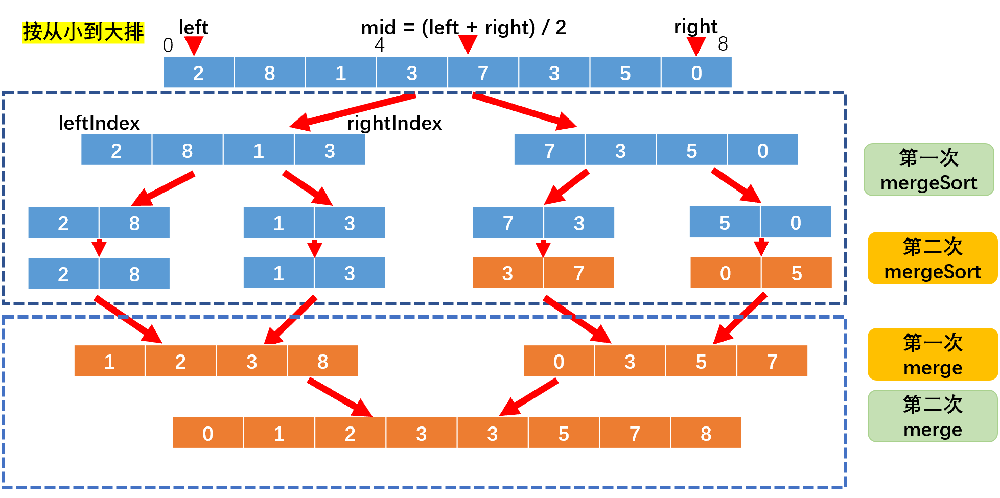 |

```java
public static void mergeSort(int[] arr, int left, int right) {
    int mid = (left + right) / 2; //分为左右两个区间进行分治
    if (left < right) {
        mergeSort(arr, left, mid); //处理左区间
        mergeSort(arr, mid + 1, right); //处理右区间
        merge(arr, left, mid, right); //合并
    }
}

public static void merge(int[] arr, int left, int mid, int right) {
    int leftIndex = left, rightIndex = mid + 1; //分别对mid左边和右边进行处理
    int[] tempArr = new int[right - left + 1]; //临时存放的空数组
    int tempIndex = 0;
    //进行排序，从小到大
    while (leftIndex <= mid && rightIndex <= right) {
        if (arr[leftIndex] <= arr[rightIndex]) {
            tempArr[tempIndex++] = arr[leftIndex++];
        } else {
            tempArr[tempIndex++] = arr[rightIndex++];
        }
    }
    //对剩下越界的分别进行赋值，加入到tempArr的末尾
    while (leftIndex <= mid) {
        tempArr[tempIndex++] = arr[leftIndex++];
    }
    while (rightIndex <= right) {
        tempArr[tempIndex++] = arr[rightIndex++];
    }
    //将排序好的tempArr重新赋值给arr相应下标范围
    for (int i = 0; i < tempIndex; i++) {
        arr[left + i] = tempArr[i];
    }
}
```

### 桶类

#### 桶排序

| 排序                 | 桶排序                                                       |
| -------------------- | ------------------------------------------------------------ |
| 思想                 | 空间换取时间，将待排序的序列分到若干个桶中，每个桶内的元素再进行个别排序。<br />1. 对排序元素进行整除，放入相应的桶中，选择的除数应尽量使各个桶内的元素数量均匀。<br/><br/>2. 对各个桶内部选择排序算法进行排序。<br/><br/>3. 按桶的顺序将各个排序之后的桶合并。 |
| 时间复杂度<br />T(n) | 平均：$O(n+k)$<br />最好：$O(n+k)$<br />最坏：$O(n+k)$       |
| 空间复杂度<br />O(n) | $O(n+k)$                                                     |
| 稳定性               | 稳定                                                         |
| 图解                 |  |

> 假设每个桶内部使用的排序算法为快速排序：
>
> - 每个桶内的时间复杂度：$T(n)=\frac{n}{m} \log_2^{\frac{n}{m}}$。
>
> - m个桶的总时间复杂度为`m * (n/m)log(n/m)`=`n (log n-log m)`.
> - 最终桶排序的时间复杂度为：`O(n)+O(n*(log n- log m))`=`O(n+n*(log n -log m))` 其中m为桶的个数。我们有时也会写成O(n+c),其中c=n*(log n -log m);

```java
public static void bucketSort(int[] arr) {
    List[] bukects = new ArrayList[5]; //使用5个桶 List
    //初始化桶
    for (int i = 0; i < bukects.length; i++) {
        bukects[i] = new ArrayList<Integer>();
    }
    //将待排序序列放入桶中
    for (int i = 0; i < arr.length; i++) {
        int index = arr[i] / 10; // 入桶的规则
        bukects[index].add(arr[i]);
    }
    //每个桶内部排序
    for (int i = 0; i < bukects.length; i++) {
        bukects[i].sort(null); //快排
        for (int j = 0; j < bukects[i].size(); j++) {
            System.out.println(bukects[i].get(j) + " ");
        }
    }
}
```

#### 计数排序

| 排序                 | 计数排序                                                     |
| -------------------- | ------------------------------------------------------------ |
| 思想                 | 牺牲空间换取时间<br />适用于数据范围波动不是很大，数据相对比较集中。 |
| 时间复杂度<br />T(n) | 平均：$Ο(n+k)$<br />最好：$Ο(n+k)$<br />最坏：$Ο(n+k)$       |
| 空间复杂度<br />O(n) | $O(k)$                                                       |
| 稳定性               | 稳定                                                         |
| 图解                 |    |

```java
public static void count(int[] arr) {
    //存放最小值和最大值
    int min = Integer.MAX_VALUE, max = Integer.MIN_VALUE;
    for (int i = 0; i < arr.length; i++) {
        if (arr[i] < min) {
            min = arr[i];
        }
        if (arr[i] > max) {
            max = arr[i];
        }

    }
    //桶内计数：count[] 内存放的是该数存在的次数
    int count[] = new int[max - min + 1]; //计算出桶的数量为：max - min + 1；对每个数放一个桶
    for (int i = 0; i < arr.length; i++) {
        count[arr[i] - min]++; //相应下标的数的个数增加
    }
    //将计数排序的放入arr原数组
    int index = 0; //放入arr时的下标
    for (int i = 0; i < count.length; i++) {
        while (count[i]-- > 0) { //存在1个以上的该数，则依次取出放入原数组arr
            arr[index++] = i + min; //
        }
    }
}
```

#### 基数排序（卡片排序）

| 排序                 | 基数排序                                                     |
| -------------------- | ------------------------------------------------------------ |
| 思想                 | 基数排序多次利用计数排序，并不是将一个整体分配到一个桶中，而是将自身拆分成一个个组成的元素，每个元素分别顺序分配放入桶中、顺序收集，并对每个位置都进行过分配、收集。<br />（基数排序并不需要交换，也不需要比较，就是多次分配、收集得到结果。 ）<br />保证和相同位进行比较：MSD（最高位优先 Most Significant Digit first）、LSD（最低位优先 Least Significant Digit first）。<br /> |
| 时间复杂度<br />T(n) | 平均：$O(nk)$<br />最好：$O(nk)$<br />最坏：$O(nk)$          |
| 空间复杂度<br />O(n) | $O(n+k)$                                                     |
| 稳定性               | 稳定                                                         |
| 图解                 |  |

## 贪心算法

- 局部最优解，即：整个问题的最优解一定由在贪心策略中存在的子问题的最优解得来的时候使用贪心算法。贪心算法不是对所有问题都能得到整体最优解，选择的贪心策略必须具备无后效性（某个状态以后的过程不会影响以前的状态，只与当前状态有关）。

1. 建立数学模型来描述问题。
2. 把求解的问题分成若干个子问题。
3. 对每一子问题求解，得到子问题的局部最优解。
4. 把子问题的解局部最优解合成原来解问题的一个解。

## 分治策略

| 分治策略步骤    | 说明                                         |
| --------------- | -------------------------------------------- |
| 分（Divide）    | 将问题划分为若干规模较小、形式相同的子问题。 |
| 治（Conquer）   | 递归求解，若问题规模够小，则直接求解。       |
| 合并（Combine） | 子问题的解构建原问题的解。                   |

> 最大子数组。

### 递归式

- 递归在于对子问题的处理。不在意具体操作，只关心初始条件、结束条件、上下层的变化关系。

> 递归式是自己调用自己，可以被栈替代。（递归利用栈实现，可能导致栈溢出）

| 复杂度计算 | 说明                                                         |
| ---------- | ------------------------------------------------------------ |
| 代入法     | 假定一个界                                                   |
| 递归树法   | 树的结点表示不同层次的递归调用代价                           |
| 主方法     | $T(n) = aT(n/b) + f(n)$<br />a个子问题、每个子问题的规模为原问题的1/b、分解和合并共花费f(n) |

## 概率算法

1. 将问题转化为相应的几何图形，其面积S，计算其占面积S的部分面积S1。
2. 向几何图形中随机散点，统计S和S1中的点数，从而得到结果。
3. 若未达到所需的精度，则继续执行步骤2的操作；到达则输出。

>1. 数值概率算法
>2. 蒙特卡罗算法
>3. 拉斯维加斯算法
>4. 舍伍德算法

### 蒙特卡罗Π算法

1. 均匀撒点：使用Math.random()获取`0~1`的伪随机数坐标[x,y]。
2. 区域判断：距离坐标原点的距离小于等于1，`x*x + y*y<=1`

```java
public static double getPI(int n) {
    double x, y; //坐标
    int sum = 0; //在区域内的次数
    for (int i = 0; i < n; i++) {
        x = Math.random();
        y = Math.random();
        //圆形公式：x^2 + y^2 = 1
        if (x * x + y * y <= 1) {
            sum++;
        }
    }
    //因为是1/4的扇形区域[0~1]，需要乘以4
    return 4.0 * sum / n;
}
```

# UML

- UML：可视化的面向对象的统一建模语言。

  - 软件开发过程中的分析设计阶段使用。

  - 支持面向对象。

  - 独立与软件的实现。


## 基本元素

### 结构事物 

- 结构事物：构成模型的静态部分，负责描述静态功能和客观元素。

- UML中一共定义了7种结构事物：类、接口、协作、用例、主动类、构件、节点。

#### 类 Class

- 类：完全对应于面向对象分析中的类，具有自己的属性和操作。 

#### 接口 Interface

- 接口：由一组对操作的定义组成，但不包括对操作的实现进行详细的描述。
- 接口描述一个类或构件的一个服务的操作集、元素的外部可见的操作。
- 接口往往依赖于实现接口的类或构件。

   

#### 协作 Collaboration

- 协作：对一个交互过程的定义，由一组共同工作以提供协作行为的角色和其他元素构成的一个整体。
  - 通常这些协作行为大于所有元素的行为的总和。

- 一个类可以参与到多个协作中，在协作中表现了系统构成模式的实现。

#### 用例 user case

- 用例：系统所提供的服务，定义了系统是如何被参与者使用的，描述参与者为了使用系统所提供的某一完整功能而与系统发生的一段对话。（对一组动作序列的抽象描述，即：行为事物）
  - 系统执行这些动作将产生一个对特定的参与者有价值而且可观察的结果。 


#### 主动类 active class

- 主动对象：主动类的对象，能够有自动的启动控制行为，其本身至少拥有一个进程或线程，每个主动对象都由它自己的事件驱动控制线程，控制线程与其他主动对象并行执行。
- 被动对象：被主动对象所调用的对象，被动地等待其他对象发出请求，该对象所描述的元素的行为和其他元素的行为并发。只在被调用时接受控制，当被动对象返回时将控制放弃。

#### 构件 component

- 构件定义了良好接口的物理实现单元，是系统中物理的、可替代的部件，遵循且提供一组接口的实现，每个构件体现了系统设计中特定类的实现。
  - 良好定义的构件不直接依赖于其他构件而依赖于构件所支持的接口，系统中的一个构件可以被支持正确接口的其他构件所替代。
  - 每个系统中都有不同类型的部署构件。


1. 将一个大系统分解成若干个小软件（子系统），有助于降低系统开发的复杂度。
2. 采用构件机制开发的系统，在系统需要修改时，更为容易。
3. 构件机制有助于提高复用水平，同时也是一种好的销售方法。  

#### 节点 node

- 节点 是系统在运行时切实存在的物理对象，表示某种可计算资源，这些资源往往具有一定的存储能力和处理能力。
- 一个构件集可以驻留在一个节点，也可以从一个节点迁移到另一个节点。
- 一个节点可以代表一个物理机或一个虚拟物理机。
- 节点在Rational Rose中分为：设备节点、处理节点。  

### 行为事物

- 行为事物：构成模型的动态部分，描述跨越时间和空间的行为。通常使用动词来表示。
- 行为事物分为：交互、状态机。

#### 交互

- 交互：特定的语境中，一组对象为共同完成一定任务而进行的一系列消息交换而组成的动作以及消息交换的过程中形成的消息机制。
- 交互包括：一组对象，连接对象间的消息、消息发出的动作形成的有序的序列和对象间的普通连接。

- 交互的可视化表示主要通过消息来表示：带有名字或内容的有向箭头。

  
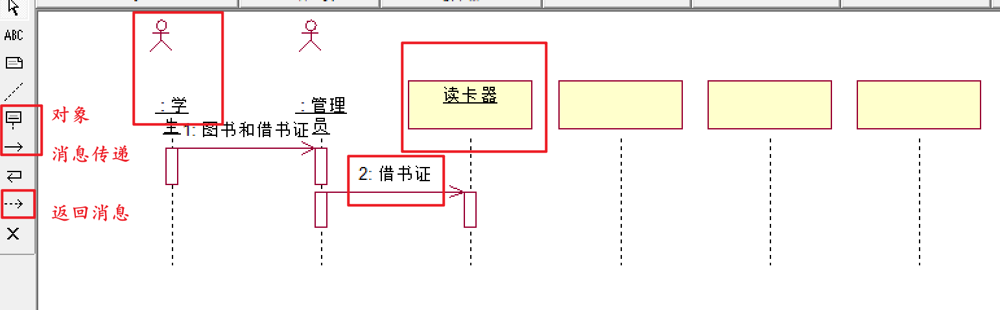  
  

#### 状态机

- 是一个类对象所有的**生命历程**模型，因此状态机可以用于描述一个对象在其生命周期内响应时间所经历的**状态序列**。
- 当对象探测到一个**外部事件**后，它依照当前的状态做出反应，这种反应包括执行一个相关动作或转换到一个新的状态中去。
- 单个类的状态变换或多个类之间的协作过程都可以使用状态机描述。

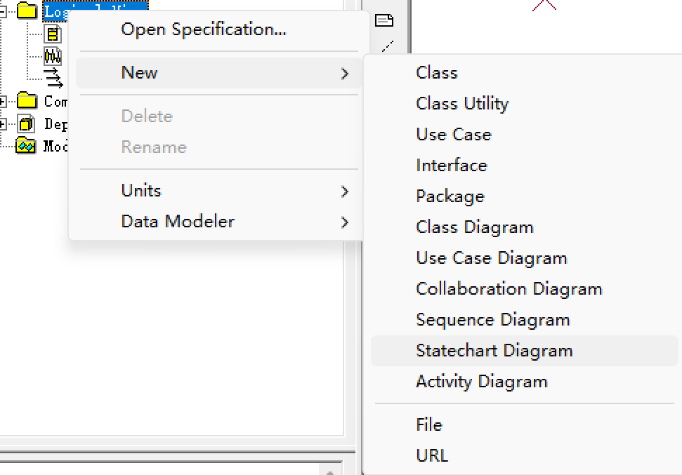  
  
  

### 分组事物

- 分组事物：UML对模型中的各种组成部分进行事物分组的一种机制。
- 目前只有一种分组事物：包。
- 包：描述拥有和管理模型内容的组织单元，任何元素都可以被包所拥有。   

### 注释事物

- 注释事物：UML模型的解释部分，依附于某个元素或一组建模元素，对该元素/该组建模元素进行约束或解释。

 

## 关系元素

- UML模型是由各种事物以及这些事物之间的各种关系构成的。
- 关系是指支配、协调各种模型元素存在并相互使用的规则。
- 主要包含四种关系：依赖、关联、泛化、实现。

### 依赖关系 dependency

- 依赖关系：两个事物之间的一种语义关系，当其中一个事物（独立事物）发生变化就会影响另外一个事物（依赖事物）的语义。

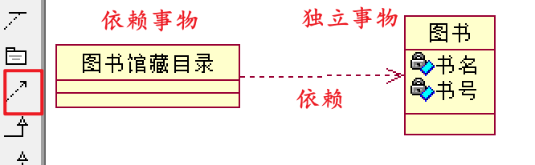 

### 关联关系  associate

- 关联关系：事物之间的结构关系。描述一组链（对象之间的连接）。
  - 聚合：描述整体和部分之间的结构关系。
  - 组成：描述整体和部分之间的结构关系，但部分不能脱离整体而独立存在。
  - 无方向的普通关联关系。

- 如果系统元素之间的关系不能明显地由其他关系来表示，则可以被抽象为关联关系。
- 当一个类“知道”另一个类时，可以使用关联关系来表示：
  - 车间内工人知道他车间的车间主任是谁。
  - 企鹅迁移时必须知道气候。

 

 

### 泛化关系 generalization

- 泛化关系是事物之间的一种特殊/一般关系，特殊元素（子元素）的对象可替代一般元素（父元素）的对象，即继承。

 

### 实现关系 realization

- 实现关系描述了一组操作的规约和一组对操作的具体实现之间的语义关系。
- 通常用于：接口和实现接口的类/构件之间、用例和实现用例的协作之间。

 

## 视图和图

- 视图：不是图，是表达系统某方面特征得UML建模构件的子集。
- 视图是由一个或多个图组成的对系统某个角度的抽象：在每一类视图中使用一种或两种特定的图来可视化地表示视图中的各种概念。
- 最常用的UML图包括：用例图、类图、序列图、状态图、活动图、构件图、部署图。

**视图模型分为3个视图域** 

- 结构分类：描述系统中的结构成员及其相互关系。
  - 类元包括：类、用例、构件、节点。类元是研究系统动态行为的基础。
  - 类元视图包括：静态视图、用例视图、物理视图（实现视图、部署视图）。
- 动态行为：描述系统随时间变化的行为。
  - 行为：从静态视图中抽取的瞬间值的变化来描述行为。
  - 动态行为视图包括：状态机视图、活动视图、交互视图。

- 模型管理：说明了模型的分层组织结构。
  - 包是模型的基本组织单元，特殊的包还包括模型和子系统。
  - 模型管理视图跨越了其他视图并根据系统开发和配置组织这些视图。

### 静态视图

- 静态视图的基本元素是类元和类元之间的关系，可视化表达的图主要是类图。
- 类元是描述事物的基本建模元素，包括：类、接口、数据类型等。

1. 静态视图是UML的基础，描绘客观现实世界的基本认知元素，是建立一个系统所需概念的集合。
2. 静态视图包括：类（对象数据结构、对数据的操作）。
3. 静态视图是构建其他动态视图的基础，将具体的数据操作使用离散的模型元素进行描述，说明交互作用的进行。

#### 类图 Class

- 类图描述系统的静态结构：定义系统中的类、描述类之间的关系、类的内部结构，在系统的整个生命周期中有效。

1. 为系统的词汇建模。
2. 模型化逻辑数据库模式。
3. 模型化简单的协作。

- 通常在用例视图Use Case View创建Class Diagram。

##### 类

- 类：一组具有相同属性、操作、关系和语义的事物的抽象。

###### 类的基本结构

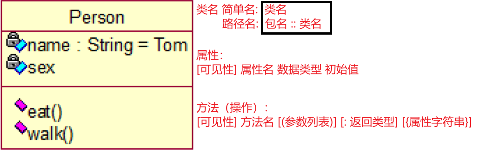 

####### 属性

 

####### 方法

 

####### 可见性

| 关键字       | 名称       | 符号 | 图标 | 语义                                          |
| ------------ | ---------- | ---- | ---- | --------------------------------------------- |
| public       | 公有类型   | `+`  |      | 允许在类的外部使用或查看该属性/操作           |
| protected    | 受保护类型 | `#`  |      | 子类允许访问父类中受保护类型的属性/操作       |
| private      | 私有类型   | `-`  |      | 只有类本身才能访问到属性/操作，外部一概不允许 |
| Implemention | 实现类型   |      |      | 属性/操作仅在被定义的包中可见                 |

####### 约束 Constriant

####### 职责 Responsibility

###### 类的类型

####### 实例化类 InstantiatedClass

####### 参数化类（模板类） ParameterizedClass

###### 类的构造型

- 实体类：保存永久信息的存储体。

- 控制类：负责协调其他类的构造，本身不完成任何业务功能。
- 边界类：位于系统与外界的交界处，包括所有的窗体、报表、打印机等硬件的接口以及其他系统的接口。

 

##### 关系

- 关系：角色、名称、多重性（1..n）。

- 由类与类之间的耦合度从弱到强：依赖 < 关联 < 聚合 < 组合 < 泛化 = 实现

> 企业由职能部门组成，每个职能部门由一个经理，0-2个副经理和1个以上的员工组成。每个职能部门承担多项工作任务或一项工作任务也可能由多个部门共同承担，工作任务可能是赢利、后勤保障、公关。一项工作任务需要使用一到多种资源，这些资源由设备、经费、技术方法组成。
>
>  

###### 依赖

- 提供者的某些变化会要求或指示依赖关系中客户的变化。

 

###### 关联

- 描述对象/实例之间的离散连接。
- 关联类：即是关联也是类，关联本身也有其特性需要描述时。
- 链：关联的一个实例，不独立于对象而存在，是所涉及对象的一个有序表，每个对象必须是关联中对应类的实例或此类后代的实例。

 

> 某系统需要创建三个类“课程”、“学生”和“书”。其中“课程”类含有一个私有属性“课程号”，一个公共操作“选择课程”。学生需要知道课程号，并调用操作“选择课程”才能完成选课。“书”类含有一个私有属性“书号”，一个公共操作“借书”。学生需要知道“书号”，并调用操作“借书”才能完成借阅。为了区分这两个关联的语义，将学生类在两个关联关系中的角色分别命名为“学员”和“借阅者”。将上述需求在ROSE中用类图表达出来。
>
>  

> 1名教师可以为多名学生指导论文，每名学生只能由1名教师指导论文。使用关联类和一般类表达。
>
> 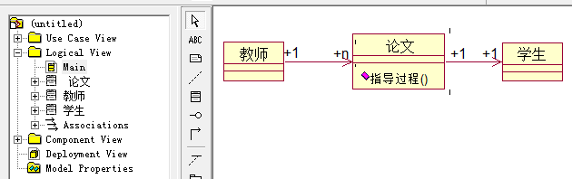 

> 学生可以是在校生或者毕业生。
> 助教必须是在校生。
> 一名助教指导一名学生。
> 教师和教授属于不同级别的教员。
> 一名教师助理可以协助一名教师或一名教授，一名教师最多只能有一名教师助理，一名教授最多可以有5名教师助理。
> 教师助理必须是毕业生。
>
> 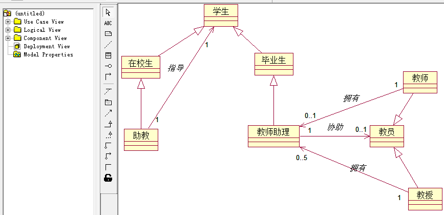 

####### 自返关联（递归关联）(一元关联)

- 一个对象类与本身的关联，即类内两个对象的关联。

> 


####### N元关联

- 在3个及以上的对象类之间发生的关联，N元关联的每个实例是被关联的类的对象的多元组。

###### 聚合 Aggregation 、组合 Composition

 

> 已知“机床”类和“抽风机” 类都有一组属性和操作描述其中的电动机，则可考虑把这些共同的属性和操作分离出来，设立一个“电动机”类，使之与原先的两个类构成整体-部分结构。将上述需求用ROSE绘制出来。
>
> 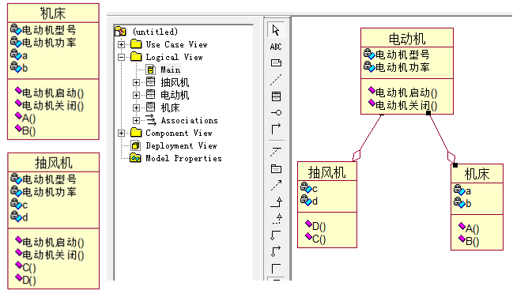 

**聚合和组合的区别**

- 相同点：描述部分和整体的关系。

- 聚合关系：成员对象（部分）的生命周期不取决于整体的生命周期：教师和学校。
- 组合关系：成员对象（部分）的生命关系取决于整体的生命周期：手和人体。

###### 泛化

- is a kind of ...：父类和子类。 

1. 可替代性
2. 多态操作
3. 继承

###### 实现

- 类和接口之间的实现关系。

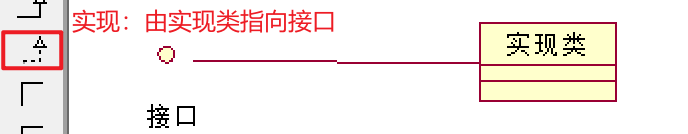 

**泛化和实现的关系**

- 泛化和实现关系都可以将一般描述和具体描述联系。
- 泛化：将同一语义层的元素连接，通常在同一模型内。
- 实现：将不同语义层的元素连接，通常在不同模型内。

#### 对象图

- 协作图来创建对象。
- 对象之间的关系只有链。

 

##### 发现对象

- 先松后紧：候选对象。

**1.问题域、系统边界、系统责任**

1. 人员
2. 组织
3. 物品
4. 抽象事物
5. 事件
6. 文件
7. 系统外人员
8. 系统责任

**2.审查、筛选**

1. 舍弃：是否提供了有用的属性操作。
2. 精简：
   - 对有多个操作，但是每个操作只有一个使用者的，分配到相应的使用者中合并。
3. 特殊结构-->子类：将不适用于所有对象的属性和操作分发给相应的子类。
4. 属性和操作相同的两个类：考虑合并为一个类
5. 属性和操作相似的两个类：一般-特殊结构或者部分-整体关系。

### 用例视图

- 用例视图：描述了系统的参与者和系统进行交互的功能，是参与者所有观察和使用到的系统功能的模型图。
  - 标识出系统中的用例和参与者之间的联系，并确定什么样的参与者执行了哪个用例。
  - 当用例视图出现在系统参与者面前时，用例视图捕获了系统、子系统和用户执行的动作行为，将系统描述为系统的参与者对系统有用功能的需求（用例）。
- 用例：用例是系统的一个功能单元，是系统参与者和系统之间进行的一次交互作用。
  - 系统与一个或多个参与者之间的一系列消息来描述系统的交互作用。
  - 系统参与者：可以是人、外部系统、外部子系统等。

#### 用例图 Use Case

- 用例图：由参与者（Actor）、用例（Use Case）依据他们之间的关系构成的用于描述系统功能的动态视图。描述系统提供的一个功能单元，表示用例的组织关系。主要用于需求分析阶段，帮助开发团队以一种可视化的方式理解系统的功能需求。

1. Use Case图是指系统的外部事物（参与者）与系统的交互，表达了系统的功能，即系统向用户所提供的服务。

2. Use Case图是后续的系统分析与设计工作的依据，也是系统测试的依据。

3. Use Case图对需求的描述规范化，较好地避免了表达地歧义性，便于用户和开发人员理解系统的需求，取得共识。 

>某电话公司决定开发一个管理所有客户信息的交互网络系统。系统功能（用例）如下：
>
>1. 浏览客户信息：任何使用Internet的网络用户都可以浏览电话公司所有的客户信息（包括姓名、住址、电话号码等）。
>2. 登录：电话公司授予每个客户一个帐号。拥有授权帐号的客户，可以使用系统提供的页面设置个人密码，并使用该帐号和密码向系统注册。
>3. 修改个人信息：客户登录后，可以对个人信息进行修改。
>4. 删除客户信息：管理员登录后，可以删除不再接受公司服务的客户的信息。
>
>

> 某“错误报告系统”包含以下功能：
>
> 1. 用户登录
> 2. 修改个人资料
> 3. 错误报告
> 4. 用邮件报告错误
> 5. 用短信报告错误
> 6. 保留登录信息
>
> 说明：用户修改个人资料或者进行错误报告时，都必须先进行用户登录；错误报告有两种方式，一种是用邮件、一种是用短信；用户登录时可以选择保存登录信息，以便下一次登录。使用ROSE实现以上说明。
>
> 

> 现有一个产品销售系统，其总体需求如下：
>
> 1. 销售员负责产品销售，每次产品销售时都需要完成支付、更新存货清单和登记销售记录，更新存货清单和登记销售记录时均可选择输出报告。
> 2. 完成支付有两种方式，信用卡支付或支票支付，两种支付方式都必须进行身份验证。
> 3. 管理员负责系统维护，需要时可选择输出报告。
>
> 根据上述需求，使用ROSE绘制出用例图。
>
> 

##### 参与者

- 参与者是指存在于系统外部并直接与系统进行交互的人、其他系统、设备、时间等。
- 每个参与者可以参与一个或多个用例，一个用例可以有多个参与者。 

**参与者之间的泛化关系**

- 参与者本质上也是类，参与者和参与者之间主要是泛化关系（继承）。
- 泛化关系：提取共同的用例，将用例都是共同的用例的参与者当作父类来继承。

###### 识别、确认参与者

**如何确定参与者**

- 负责支持或维护系统中信息的人。
- 与系统进行信息交换（包括数据信息和控制信息交换）的外部事物可以确定为参与者；包括：人、设备、第三方系统。
- 时间是否会触发某些事件。时间也可以是参与者。

**识别参与者： 以图书管理系统为例**

1. 系统开发以后，使用系统主要功能的对象。 （学生、教师）
2. 需要借助系统来完成日常工作的对象。 （图书管理员）
3. 系统需要从哪些对象（人或系统等）中获取数据。 （扫码枪、读卡器、学籍管理系统）
4. 系统会为哪些人或系统提供数据。 （借阅人员、学籍系统、图书管理员）
5. 系统会与哪些系统交互。包括计算机系统和计算机中的其他应用软件。其他系统可以分为两类：
   - 该系统要使用的系统 （E卡通系统）
   - 启动该系统的系统 （WindowsXP系统）
6. 系统是由谁来维护和管理的，以保证系统处于工作状态 （系统管理员）
7. 系统控制的硬件设备有哪些。 （扫码枪、读卡器）
8. 对本系统产生的结果感兴趣的对象。（馆长、图书供应商）

###### 参与者的分类

**主要参与者和次要参与者**

- 主要参与者：执行系统主要功能的参与者。
- 次要参与者：使用系统次要功能的参与者。

**发起参与者和参加参与者**

- 参与者发起了用例的执行过程，一个用例只有一个发起参与者，可以有若干个参加参与者。

##### 用例

- 用例是外部可见的系统功能、是参与者可以感受到的系统服务或功能单元。定义系统如何被参与者使用，描述参与者为使用系统所提供的某一完整功能而与系统之间发生的一段对话。
- 每个用例在其所属包里都有唯一的位置，往往是一个能准确描述功能的动词或者动名词短语。

**用例的特征**

1. 用例表明的是类，而不是某个具体的实例：描述的是它代表的功能的各个方面，包含了用例指向期间可能发生的各种情况。
2. 用例必须由某一个参与者触发激活后才能执行，即每个用例至少拥有一个参与者。
3. 用例是一个完整的描述：只有当所有的小用例都完成，并最终产生了返回给参与者的结果，才代表整个用例的完成。

###### 识别用例

1. 参与者会将哪些外部事件通知给系统。 （续借图书）
2. 系统中发生的哪些事件会通知参与者。 （图书超期）
3. 是否存在影响系统的外部事件。 （E通卡升级） 
4. 参与者希望系统提供哪些功能。
5. 参与者是否会读取、创建、修改、存储系统的某种信息。

###### 用例粒度

- 用例的粒度：用例所包含的系统服务或功能单元的多少。
  - 用例粒度越大、用例包含的功能越多、得到的用例数越少。

- 一般的做法是复杂系统的用例粒度大一些，简单系统的用例粒度小一些：如果用例数目过多会造成用例模型过大，用例之间的关系过于负责，导致后续的系统设计难度大大提高。

###### 用例规约

- 用例规范：对每一个用例的详细描述信息：

1. 简要说明：对用例名称、编号、相关参与者、作用和目的的简要说明。
2. 事件流：
   - 基本事件流（基本流）：用例的基本流程，用例正常运行时的场景。
   - 扩展事件流（备选流）：很少使用的逻辑路径，异常、错误情况下所执行的逻辑路径。
3. 前置条件：执行用例之前系统必须所处的状态。

> 要求用户有访问的权限或是要求某个用例必须先被执行等。

4. 后置条件：用例执行完毕之后系统可能处于的一组状态。

> 货品出库用例执行后、需要执行应付款处理用例。

5. 非功能性需求：可靠性、性能、可用性和可扩展性等。

> 法律或法规方面的需求、应用程序标准和所构建系统的质量属性等。

##### 用例间的关系

- 关系：带箭头和不带箭头；箭尾连接对话的主动发起者，箭头所指的是对话的被动接受者。   
  - 参与者可以是主动发起者和被动接收者。

| 对比   | 泛化                                                         | 扩展                                                         | 包含                                                         |
| ------ | ------------------------------------------------------------ | ------------------------------------------------------------ | ------------------------------------------------------------ |
| 构造型 |                                                              | `<<extend>>`                                                 | `<<include>>`                                                |
| 指向   |  |  | 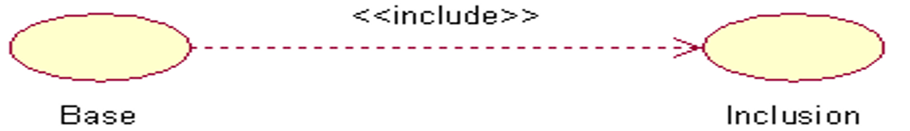 |
| 符号   | 空心箭头                                                     | 虚箭线                                                       | 虚箭线                                                       |
| 执行   |                                                              | 基用例执行，扩展用例不一定执行                               | 基用例执行，被包含用例必执行                                 |

###### 泛化

- 用户的泛化指的是一个父用例可以被特化形成多个子用例，而父用例和子用例之间的关系就是泛化关系。
- 在用例的泛化关系中，子用例继承了父用例所有的结构、行为和关系，子用例是父用例的一种特殊形式。
- 子用例还可以添加、覆盖、改变继承的行为。
- 在UML中用例的泛化关系通过一个三角箭头从子用例指向父用例来表示。

>  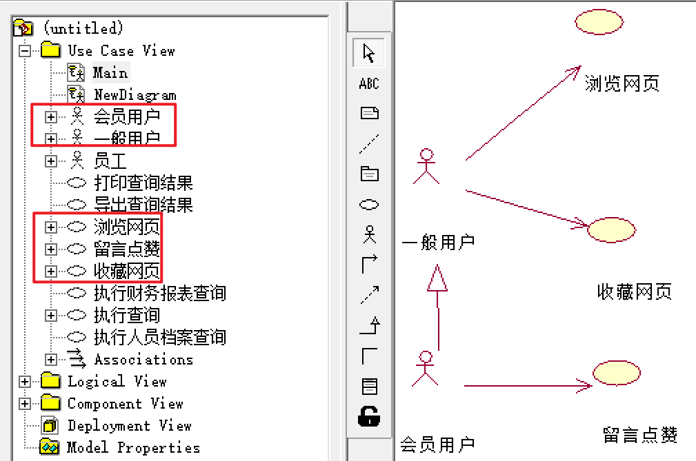 

###### 扩展

- 扩展：从扩展用例到基础用例的关系，添加对小概率事件的扩展，往往被用来处理异常或者构建灵活的系统框架。
  - 扩展用例：在一定条件下，把新的行为加入到已有的用例中，获得的新用例。
  - 基础用例：原有的用例。


> 员工需要使用“执行查询”功能，有时还需要“导出查询结果”或“打印查询结果”。
>
> 后期业务进一步发展，员工“执行查询”功能细分为“执行财务报表查询”和“执行人员档案查询”。
>
> 将以上需求用用例图表达出来。
>
>  

###### 包含

- 包含：一个用例的功能过多、事件流过于复杂时，将某一段事件流（多个用例用到同一段的行为）抽象成为一个被包含的用例。
- 基础用例的执行必然引起被包含用例的执行。

1. 避免在多个用例中重复描述一段行为。
2. 提高用例模型可维护性，复用用例中的公共行为。

> 共有“下订单”、“查供应商”、“查询产品”、“查订单目录”、“安排付款”、“付现金”、“付支票”7个用例。他们之 间的关系如下：
>
> - 下订单的过程中必需查供应商、查询产品并且安排付款，如果有需要的话，还可以查订单目录；
> - 付款的方式有两种，包括付现金和付支票。
>
> 从支持复用、简化用例的角度出发，使用ROSE设计用例图：
>
> 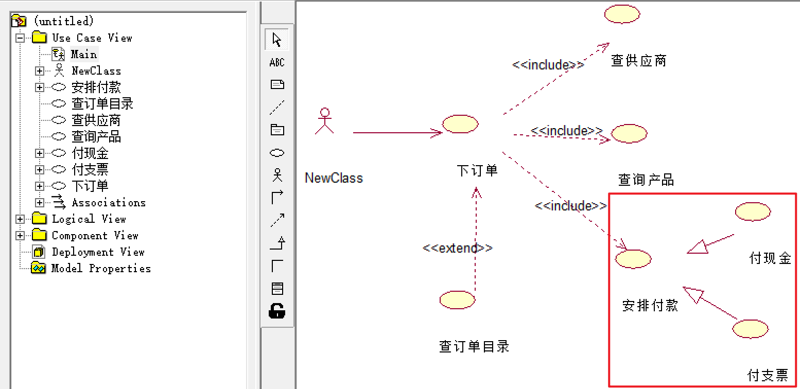

### 交互视图

- 交互视图：描述执行系统功能的各个角色之间相互传递信息的顺序关系，是描绘系统中各种角色或功能交互的模型，跨越多个对象的系统控制流程。

**交互视图的表示形式**

- 协作图：表示对象之间是如何协作完成一个功能的。

- 序列图：反映执行系统功能的各个角色之间传递消息的顺序关系。

**通过不同对象间的相互作用描述系统的行为**

- 以独立的对象为中心（状态机）：描述对象内部的深层次的行为。
- 以相互作用的一组对象为中心（交互视图）：描述一组对象的整体行为。

#### 协作图

#### 顺序图（序列图）

- 顺序图：对象之间随时间的交互，对象之间的通信过程。

1. 对用例中的基本流程和备选流程（用例）进行逻辑描述。
2. 将交互关系表示为一个二维图：
   - 纵向：时间轴，时间沿竖线向下延伸。
   - 横向：参与交互的对象。

- 作用：

1. 对对象之间的交互建模。
2. 业务人员：描述业务流程中对象的交互过程，更精确的描述业务需求。
3. 需求分析：细化用例的表达。
4. 技术人员：记录系统行为。

> 以下是合同管理员通过采购合同数据库增加一个采购合同的描述，用顺序图表示出来。
>
> 参与者“合同管理员”向对象“采购合同数据库”调用操作“增加采购合同”；
>
> 对象“采购合同数据库”创建一个对象“采购合同”；
>
> 对象“采购合同”返回一条消息，通知“采购合同数据库”，一个新的“采购合同”对象创建完毕；
>
> 对象“采购合同数据库”自调用操作“存入采购合同”，将新创建的采购合同对象存入采购合同数据库；
>
> 采购合同数据库返回消息，通知合同管理员，新合同已加入数据库。
>
> 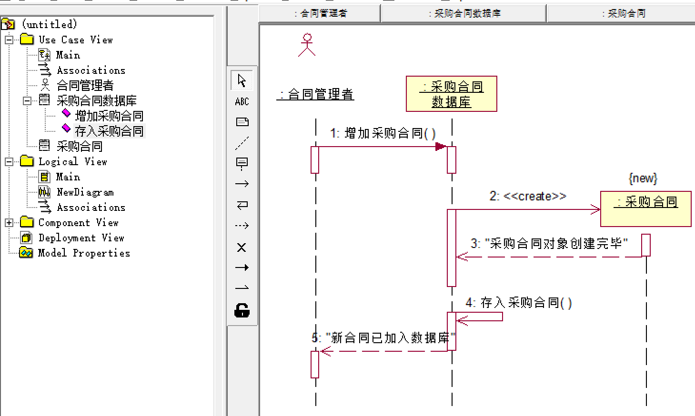

> 还书用例剧本：
>
> 1. 管理员在主界面中点击进入还书界面。
> 2. 主界面创建临时对象“还书界面”。
> 3. 管理员在还书界面中输入“图书编码和借书证号”，还书界面带着参数“图书编码”调用对象“借书记录表”的操作“查借书记录”，并返回消息借书记录。
> 4. 还书界面带着参数“借书证号”调用对象“借阅者信息表”的操作“查借阅者信息”，并返回消息借阅者信息。
> 5. 还书界面自调用操作“显示还书信息” 。
> 6. 管理员确认归还。
> 7. 还书界面分别调用对象“借书记录表”的操作“修改借书记录”，“图书信息表”的操作“图书信息表”的操作“修改图书状态”，“借阅者信息表”的操作“修改借阅者状态”。
> 8. 管理员关闭还书界面。
>
> - 参与者：管理员
> - 交互对象：主界面、还书界面、借阅者信息表、图书信息表、借书记录表
>
>  

##### 对象、生命线

- 对象：使用生命线进行表示，当对象存在时，生命线用一条虚线表示，此时对象不处于激活状态，当对象的过程处于激活状态时，生命线是一个双道线。
  - 可以是系统的参与者、任何有效的系统对象。
- 如果对象的开始位置位于顺序图的顶部，则表明该对象在顺序图开始交互时就已经存在了，如果对象的位置不在顶部，则表明该对象在交互的过程中被创建。
  - 主角：交互的发起对象，通常放在顺序图的最左端。

| 对象标记    | 说明                     |
| ----------- | ------------------------ |
| {new}       | 在执行期间被创建         |
| {destory}   | 在执行期间被销毁         |
| {transient} | 在执行期间被创建而后销毁 |

> 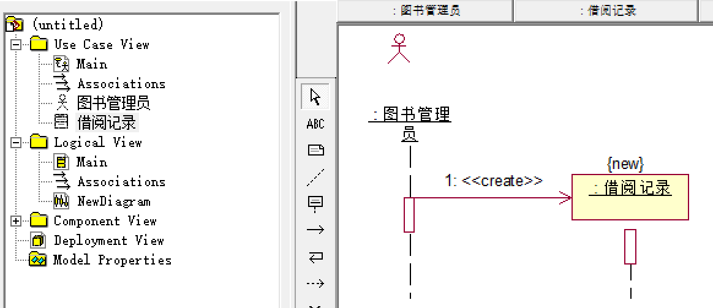 

- 生命线：对象存在的时段。
- 激活：对象接收到一个消息时，该对象中的一个程序启动的过程。
  - 当一个对象在激活期时，该对象处于激活状态，能够响应或发送消息，执行动作或活动。

 

##### 消息

- 消息：对象之间的交互和通信。
  - 从一个对象的生命线到另一个对象生命线的箭头，箭头以时间顺序在图中从上到下排列。

 

###### 约束

- `序号 [判断条件] *[循环] 返回值:=操作名/消息(参数列表) {约束条件}`
  - 序号一般自动给出。

>序号为1，如果n>1则循环调用fun1()方法10次，且需要在30秒内完成，参数为param，返回result
>
>- 则：1: [n>1] *[i==0,i<10,i++] result:=fun1(param){30秒内完成}

> 顺序图包含三个交互对象A、B、C，它们按以下次序进行交互。
>
> 1. A调用B的操作op1，B执行op1后返回消息return1给A；
> 2. B向C循环发送10次消息message1：B带着参数a自调用op1；
> 3. A在满足条件n>1的情况下向C发出消息message2。
>
> 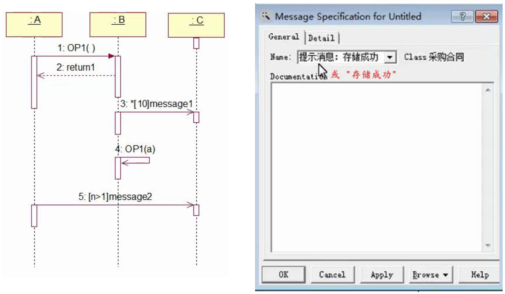 

> 通话管理”顺序图：
>
> - 电话S调用交换机T的操作“激活通话”，激活交换机开始工作；
> - 交换机T返回“拨号提示音”提醒对象S可以开始拨号；
> - S自调用“拨号”操作，在30秒内拨完全部8位号码；
> - 完成拨号后，调用交换机T的操作“逻辑连通”；
> - 交换机T创建会话对象C，由C管理具体的通话事宜；
> - C调用电话R的操作“振铃”，振铃时间少于30秒；
> - 电话R返回本机号码，表示会话被接受；
> - C返回参数S和R号码给交换机T；
> - 交换机T带着参数（S,R）自调用 “通话”操作。
> - 通话结束后，交换机销毁临时对象C。
> - 参与交互的对象：电话S、电话R、交换机T、会话管理对象C。
>
> 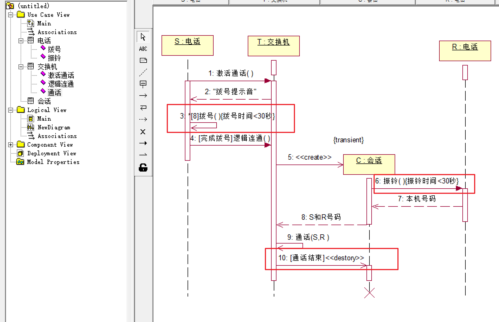

> 客服人员修改客户信息的用例剧本：
>
> 1. 客服人员进入客户信息界面；
> 2. 对象“客户信息界面”创建临时对象“客户信息控制器” ；
> 3. “客户信息控制器”调用对象“数据库管理器”的操作“获取所有客户信息”；
> 4. “数据库管理器”返回消息“所有客户信息”到对象“客户信息控制器”，“客户信息控制器”带参数调用“客户信息界面”的操作“信息显示”，显示所有客户信息；
> 5. 客服人员在客户信息界面中选择要修改的客户；
> 6. “客户信息界面”调用”数据库管理器”的操作“获取特定客户数据”；
> 7. “数据库管理器”返回消息“特定客户信息”到对象“客户信息界面”，“客户信息界面”自调用操作“信息显示”，显示特定客户信息；
> 8. 客服人员在客户信息界面中修改客户的数据；
> 9. 客户信息界面自调用操作“提示”，提示用户“是否确定更新数据”；
> 10. 客户确认后，“客户信息界面”调用“客户信息控制器”的操作“接收需更新的客户数据”；
> 11. “客户信息控制器”调用“数据库管理器”的操作“执行数据的更新”；
> 12. “数据库管理器”返回消息“更新后的所有客户信息”到“客户信息控制器” ；
> 13. “客户信息控制器”带参数调用“客户信息界面”的操作“信息显示”，将“更新后的所有客户信息” 显示到客户信息界面；
> 14. “客户信息控制器”自销毁。
>
> 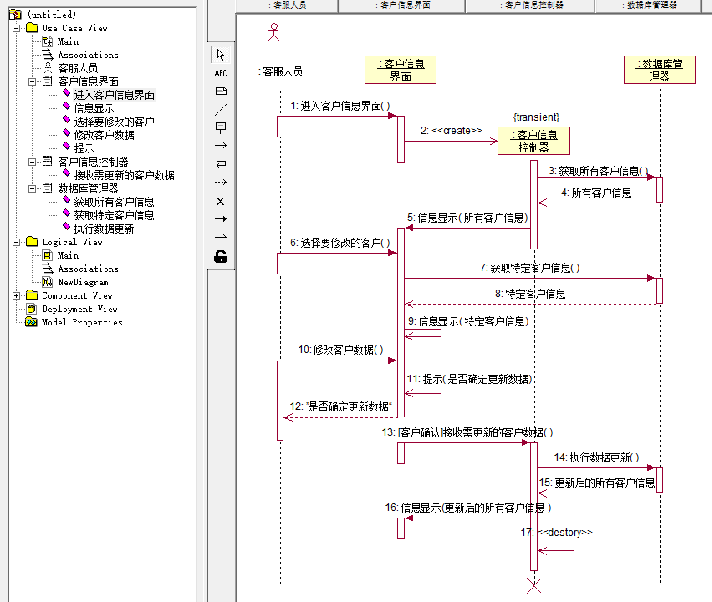 

###### 操作

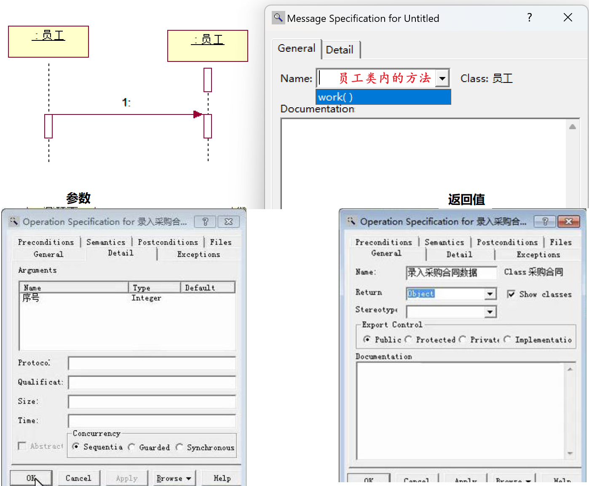 

###### 标记

| 消息标记      | 含义     |
| ------------- | -------- |
| `<<create>>`  | 创建对象 |
| `<<destory>>` | 销毁对象 |

##### 分支、从属流

- 分支：从同一点发出多个消息的并指向不同的对象，根据条件是否互斥，可以有条件和并行两种结构。

| 分支     | 说明                                                         |
| -------- | ------------------------------------------------------------ |
| 条件分支 | 多个消息的保安条件是互斥的，在一个特定的时刻，仅有一个消息的保安条件会得到满足，导致该消息的发送。 |
| 并发分支 | 多个消息的保安条件是互为相容的，在一个特定的时刻多个消息的保安条件都可能满足，则多个消息可能同时发送。 |

- 从属流：从同一点发出多个消息指向同一个对象的不同生命线。

> 1. 当x=2,y=-1时，有几个对象参与过交互？
> 2. 当x=-1,y=-1时，有几个对象参与过交互？
> 3. 当x=0,y=0时，整个交互过程共传递了多少条信息？
>
> 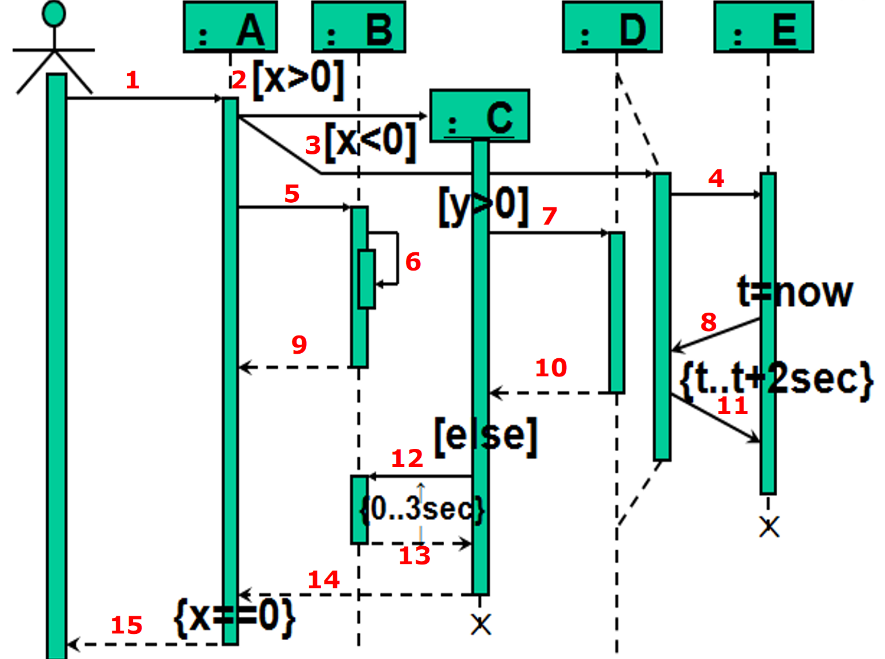 

> 修改采购合同剧本：
>
> - 对象“采购合同管理器” 用异步消息创建一个临时对象“采购合同” ；
> - 对象“采购合同管理器” 带参数“序号”调用“采购合同”对象的操作“录入采购合同数据” ；
> - 对象“采购合同”根据“序号”调用对象“采购合同数据库接口”的操作“提取采购合同” ；
> - 采购合同数据库接口返回“序号”对应的采购合同；
> - 采购合同对象调用自己的操作“修改合同数据”，修改完毕后，调用“采购合同数据库接口”的操作“存储采购合同” ；
> - “采购合同数据库接口”返回提示消息“存储成功” ；
> - “采购合同”对象返回提示消息“修改成功”给“采购合同管理器”；
> - “采购合同管理器”销毁临时对象“采购合同”。
>
>  

> 下面是一个客户在ATM机上的取款工作流程：
>
> 1. 客户在ATM对话框中点击选择取款功能选项；
> 2. ATM对话框自调用操作“显示信息”，提示用户插入IC卡，并创建读卡器临时管理对象；
> 3. 读卡器临时管理对象循环自调用IC卡检查操作，当读卡器有IC卡时，返回提示信息用户输入密码给ATM对话框；
> 4. ATM对话框自调用操作“显示信息”，提示客户输入自己的密码；
> 5. ATM对话框调用“后台数据管理”的操作“验证密码”，检查用户密码是否正确；
> 6. 如果密码正确，则系统显示用户账户上的剩余金额，并提示用户输入想要提取的金额；
>
> 7. ATM对话框自调用操作“显示信息”，提示客户账户余额及所需提取金额。用户输入提取金额后，ATM对话框调用“后台数据管理”的操作“检查数据合法性”，检查取款金额是否正确；
> 8. 若取款金额正确，ATM对话框调用“后台数据管理”的操作“更新账户余额”；带着参数“取款金额”调用“出钞设备”的操作“输出现金” 。
>
> - 参与者：客户
> - 交互对象：ATM对话框、读卡器临时管理对象、出钞设备、后台数据管理
>
> 

##### 交互框架

- 片段（Fragment）、交互片段（Interaction Fragment）：顺序图中的一个分区域，包含着该顺序图的局部内容。对于一个片段允许带有保安条件（Guard），当该条件为真时才执行该片段。 一个或多个片段可以由一个交互框架包围，在框架图形左上角的标题框中给出操作符，表明该交互框架中片段的处理方式。
- 组合片段：把二个或多个片段放在一个交互框架里，各片段的区域之间用一条虚线分隔。组合片段常用于表示交互中的条件选择、并发或引用情况。

| 片段 | 名称 | 说明                                                         |
| ---- | ---- | ------------------------------------------------------------ |
| alt  | 选择 | 有多重片段供选择，且必选其一，只有当其保安条件为真的片段才被执行。 |
| opt  | 任选 | 有多重片段供选择，只有当其保安条件为真的片段才被执行。       |
| par  | 并行 | 每个片段都并发执行                                           |
| loop | 循环 | 片段可重复执行，保安条件给出执行条件。                       |
| ref  | 引用 | 引用在其它图上定义的一个交互                                 |

 

### 状态机视图

- 状态机视图：通过对象的各种状态建立模型来描述对象随时间变化的动态行为。由描述对象状态的一组属性和描述对象变化的动作构成。状态机用状态图来表达。
  - 一个状态机由该对象的各种所处状态以及连接这些状态的符号组成。每个状态对一个对象在其 **生命周期** 中满足某种条件的一个时间段建模。当一个事件发生时，它会触发状态间的转换，导致对象从一种状态转化到另一新的状态。与转换相关的活动执行时，转换也同时发生。
- 对象：
  - 状态机视图以独立的对象为中心，通过不同对象间的相互交互作用来描述系统的行为。
  - 每个对象都拥有自己的状态，通过事件触发改变状态：对象被看作通过事件进行触发并做出相应的动作来与外界的其他对象进行通信的独立实体。
- 事件：任何影响对象状态变化的操作。事件表达了对象可以被使用操作，同时反映了对象状态的变化。
- 状态：状态是使用类的一组属性值来进行标识的，这组属性根据所发生不同的事件进行不同的反应，从而标志对象的不同状态。处于相同状态的对象对同一事件具有相同的反应，处于不同状态下的对象会通过不同的动作对同一事件作出不同的反应。

#### 状态图

- 状态图：描述一个对象在其生命周期内的动态行为。

1. 描述状态之间的转换顺序-->事件的执行顺序，避免事件顺序出错。
2. 描述了影响状态的因素，避免非法事件的进入。
3. 描述工作流的分支和汇合。

> 银行账户有三种状态：账户打开状态、透支状态、账户关闭状态。
>
> - 银行账户初始状态是“账户打开状态”，当“客户请求关闭”事件出现时，进入“账户关闭状态”，这是银行账户的终止状态。
> - 当“取款”事件出现，且账户满足“余额小于0”的条件时，银行账户从“账户打开状态”进入“透支状态”。
> - 当“存款”事件出现，且账户满足“余额大于0”的条件时，银行账户从“透支状态”进入“账户打开状态”。
> - 当“检查账户余额”出现，且账户满足“余额小于0且达30天以上”的条件时，银行账户从“透支状态”进入“账户关闭状态”。
>
> 

##### 状态机

- 状态机：展示状态和状态转换的图，描述一个对象或一个交互在其生命周期内响应事件所经历的动态序列。
- 状态机包含：状态、转换、事件、活动（动作）。 

##### 状态

- 状态：在对象的生命周期中满足某些条件、执行某些活动或等待某些事件时的一个条件或状态。
- 状态包括：名称、进入动作、退出动作、子状态、延迟事件。

| 状态     | 说明                                     |
| -------- | ---------------------------------------- |
| 初始状态 | 伪状态，无监护条件<br />只能作为转换的源 |
| 终止状态 | 可以存在多个<br />只能作为转换的目标     |

###### 子状态（组合）

| 子状态     | 特征   | 说明                                                         |
| ---------- | ------ | ------------------------------------------------------------ |
| 顺序子状态 | 顺序   | 一个组合状态对应的对象在其生命周期内的任何时刻只能处于一个子状态：<br />多个子状态之间互斥。 |
| 并发子状态 | 并发条 | 并发工作流的分支和汇合。                                     |

 

> 利用同步机制完善下图，该图是一张采购订单的状态图：
>
> 1. 在售状态是一个复合状态；
> 2. 商品检查和付款检查可以并发进行；
> 3. 付款检查通过后进入已付款状态，不通过进入拒绝状态；
> 4. 商品检查和付款检查都完成后才能进入办理订货状态，如果商品检查先完成，而付款检查还未完成，则商品检查进入等待状态，等到付款检查完成后，才一起进入办理订货状态；
> 5. 办理订货和已付款都完成后才能进入发货状态；
> 6. 在售状态下，用户可以随时取消订单，进入终止态，
>
> 

###### 历史状态

- 历史状态：伪状态（初始状态的一种构造型），记住从组合状态中退出时所处的子状态。

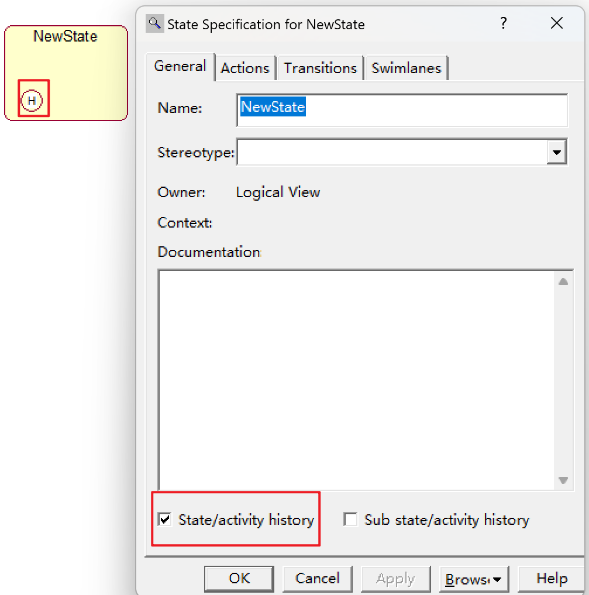 

##### 转移

###### 转移要素

- 转换：两个状态之间的关系：对象在一个状态中执行一定的动作，并在某个特定事件发生且某个特定条件满足时进入下一个状态。
- 转换包括：源状态、事件触发、监护条件、动作、目标状态。

 

> |      | 空<br />（指针值=0） | 半满<br />（0<指针值<1000） | 满<br />（指针值=1000） |
> | ---- | -------------------- | --------------------------- | ----------------------- |
> | 压入 | 可执行               | 可执行                      | 不可执行                |
> | 弹出 | 不可执行             | 可执行                      | 可执行                  |
>
> 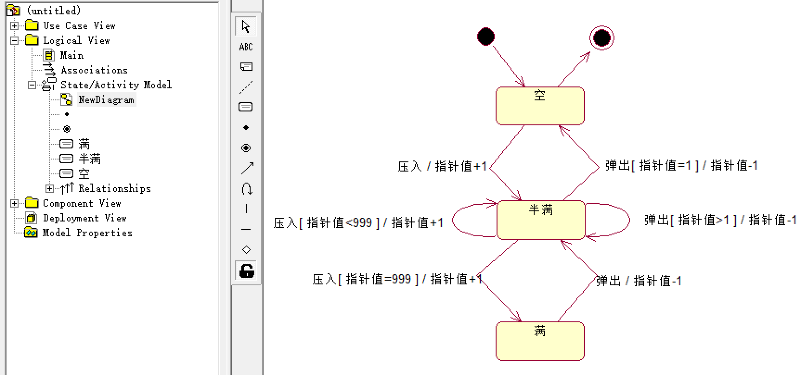

###### 转移类型

| 类型     | 说明                                    |
| -------- | --------------------------------------- |
| 内部转移 | 不导致状态改变<br>不执行entry、exit动作 |
| 外部转移 |                                         |
| 自转移   | 返回自身状态的转移                      |

| 类型     | 说明             |
| -------- | ---------------- |
| 完成转移 | 有触发器、无条件 |
| 条件转移 | 无触发器、有条件 |

##### 动作/活动

- 动作是原子的，活动是由动作组成的非原子的。

| 动作  | 名称     | 说明                                                         |
| ----- | -------- | ------------------------------------------------------------ |
| entry | 入口动作 | 状态的内部初始化、最优先且不可避开                           |
| exit  | 出口动作 | 退出状态时执行<br>内部活动异常中断                           |
| do    | 内部活动 | 存在外部转移时，do可能不会被执行<br>do结束 --> 触发转移<br>外部转移 --> 终止 |

  

##### 事件

| 类型     | 说明                                            |
| -------- | ----------------------------------------------- |
| 信号事件 | 异步、对象之间的通信                            |
| 调用事件 | 同步                                            |
| 变化事件 | When(布尔表达式)/动作<br>When:布尔表达式/动作   |
| 时间时间 | When(时间表达式)/动作<br>After(时间表达式)/动作 |

**变化事件和监护条件的区别**

- 变化事件：由系统连续测试事件。
- 监护条件：只在触发器事件触发时测试一次。如果监护条件为假，则转换不激活且事件被遗失，条件也不会再被测试。

> 用状态机图描述图书的状态变迁，图书状态如下：
>
> 1. 初始状态为预备流通状态，内部活动是编目；编目完成后从预备流通状态进入流通状态。
> 2. 流通状态是组合状态，包括：在库状态，已预约状态和已借出状态；初始态为在库状态；
> 3. 读者预约后，从在库状态进入已预约状态；取消预约或者超过预约日期时，回到在库状态。
> 4. 借书事件出现时，图书从在馆状态或已预约状态进入到已借出状态；还书事件出现时，回到在馆状态。
> 5. 丢失事件出现时，图书从流通状态进入退出流通状态。
> 6. 终止状态为退出流通状态，出口动作是删除编目信息。
>
> 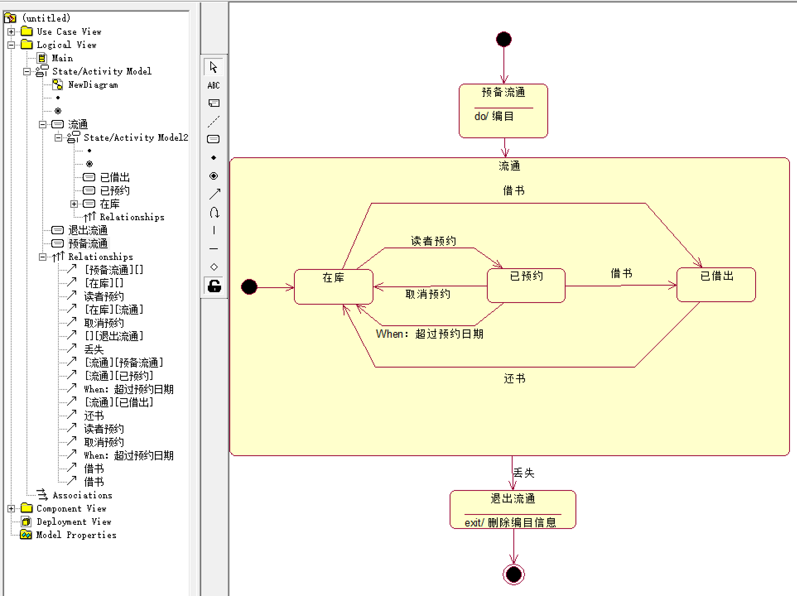 

> 用状态机图描述借阅者账户的状态变迁，借阅者账户状态如下：
>
> 1. 初始状态为新建状态，入口动作是账户初始化；开通账户事件出现时，进入可借状态。
> 2. 可借状态；借书事件出现时，如果借书数量达到最大可借数，则进入不可借状态，否则还是回到可借状态，借书数+1。
> 3. 不可借状态；还书事件出现时，回到可借状态，借书数-1。
> 4. 删除状态。不管账户处于何种状态，销号事件出现时，均进入删除状态，出口动作为删除账户信息。
>
> 

### 活动视图

- 活动视图是一种特殊形式的状态机视图，是状态机的一个变体，用来描述执行算法的工作流程中涉及的活动，通常用于对计算流程和工作流程建模。活动视图使用活动图来体现。
- 活动视图中的状态：表示计算过程中所处的各种状态。

**活动图**

- 活动图：活动图中包含了描述对象活动或动作的状态以及对这些状态的控制。
- 活动状态：活动图包含对象活动的状态，活动的状态表示命令执行过程中或工作流程中活动的运行。
  - 与等待某一个事件发生的一般等待状态不同，活动状态等待计算处理过程的完成，当活动完成的时候，执行流程才能进入活动图的下一个活动状态中去。当一个活动的前导活动完成时，活动图的完成转换被激发。活动状态通常没有明确表示出引起活动状态转换的事件，当出现闭包循环时，活动状态会异常终止。
- 动作状态：活动图也包含了对象的动作状态，它与活动状态有些类似，不同的是，动作状态是种原子活动操作并且当它们处于活动状态时不允许发生转换。
- 对状态的控制：这种控制包括对并发的控制等。并发线程表示能被系统中的不同对象和人并发执行的活动。在活动图中通常包含聚集和分叉等操作。在聚集关系中每个对象有着它们自己的线程，这些线程可并发执行。并发活动可以同时执行也可以顺序执行。活动图能够表达顺序流程控制还能够表达并发流程控制。
- 活动图不仅可以对事物进行建模，也可以对软件系统中的活动进行建模。活动图可以很好地帮助我们去理解系统高层活动的执行过程，并且在描述这些执行的过程中不需要去建立协作图所需的消息传送细节，可以简单地使用连接活动和对象流状态的关系流表示活动所需的输入/输出参数。

#### 活动图

- 活动图：描述系统行为，描述动作和动作导致对象状态改变的结果。（描述用例的具体行为）
- 动作：原子的。
- 活动：非原子的，由动作组成。
- 组合活动：包含内嵌活动/动作。

 

##### 分支与合并

- 分支：每条路径的监护条件互斥，各种可能。
- 合并：多个控制路径在此汇合。

 

##### 分叉与汇合

- 并发：在同一时间内，多个活动并行执行，在汇合处等待所有的分支都完成后再继续执行。

 

##### 泳道

- 泳道：为了对活动的职责进行组织而在活动图中将活动状态分为不同的组，明确表示活动由哪些对象执行。一个活动只能属于一个泳道。
- 每个泳道可能由一个或者多个类实施，类所执行的动作或拥有的状态按照发生的事件顺序自上而下的排列在泳道内。

##### 对象流

- 对象流：将对象作为输入或输出的控制流。在活动图中，对象流描述了动作或者活动与对象之间的关系，表示动作使用对象以及动作对对象的影响。
- 虚箭线：
   - 从活动（动作）状态出发指向对象，表示该动作创建或更新了对象流所指向的对象，该对象是动作的输出。
   - 从对象出发指向活动（动作）状态，表示该动作使用对象流所来源的对象，该对象是动作的输入。

 

### 物理视图

- 物理视图包含：实现视图（构件图）、部署视图（部署图）。
- 物理视图对应用自身的实现结构建模，提供了将系统中的类映射成物理构件和节点的机制。
- 逻辑方面需要发现和描述对象类、接口、协同、交互和状态机等事物，物理方面需要找出构件和节点。 
- 构件图描述软件的各个构件以及它们之间的关系，部署图描述硬件的各个构件以及它们之间的关系.

#### 实现视图（构件图）

- 构件是系统高层的可重用的组成部件：实现视图将系统中可重用的块包装成为具有可替代性的物理单元（构件）。
- 实现视图：构件、构件间的接口、依赖关系。
- 组件图(构件图)=构件（component）+接口（interface）＋关系（relationship） +端口（port）+连接器（connector）
- 构件图：描述各种软件构件之间的依赖关系

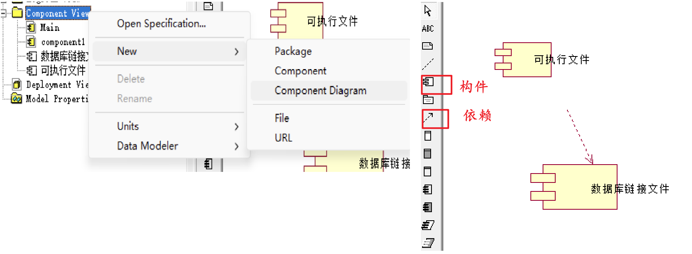 

> 某软件由构件“调度程序”、“计划程序”和“GUI”构成，其中构件“调度程序”实现接口“注册登记”、构件“计划程序”实现接口“更新”，并使用接口“注册登记”，构件“GUI”使用接口“更新”。根据以上信息绘制构件图。
>
> 

##### 构件（组件）

- 构件：系统中遵守一组接口且提供其实现的物理的、可替换的部分（物理实现单元）。构件能够完成独立功能，是软件系统的组成部分。
- 良好的构件不依赖于其他构件，而依赖于构件所支持的接口。构件提供接口的实现，一个构件可以实现一个或多个接口。 
- 构件代表了将系统中的类、接口等逻辑模型元素打包后形成的物理模块。

| 构件类型                 | 说明                                                 |
| :----------------------- | :--------------------------------------------------- |
| 基本构件                 | 系统中可执行的元素                                   |
| 包装构件<br>（扩充构件） | 对基本构件的扩展<br>一组相关的元素，即构件的命名空间 |

- 构件的命名空间：类、接口、构件、包、用况、依赖、制品。
- 构件的另一含义：可以用构件装配大粒度的构件，方法为把所复用的构件作为大粒度构件的成分，并把他们的请求和提供接口连接在一起。（组件包含组件、组拼大组件）

##### 接口

| 接口类型               | 说明                                                   |
| :--------------------- | :----------------------------------------------------- |
| 提供接口<br>（供接口） | 构件实现的接口<br>给其他构件提供服务的接口             |
| 请求接口<br>（需接口） | 构件使用的接口<br>构件向其他构件请求服务时要遵守的接口 |

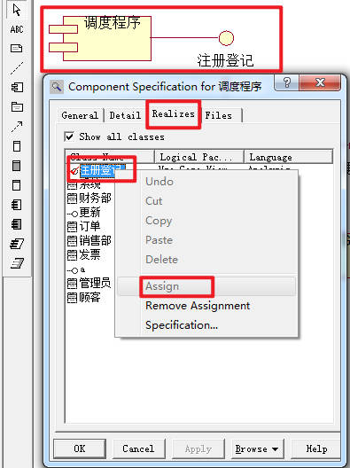 

##### 端口

- 端口：描述在构件和其环境之间、构件和其内部构件之间的一个交互点（被分装的构件和外界的交互点），所有进出构件的交互都要通过端口。
- 端口是构件的一部分，端口的实例随着其所属的构件的实例一起被创建和撤销。
- 端口和接口的关系：构件的通讯完全通过端口支持的接口来描述。

##### 连接器

- 连接器（连接件）：特点语境下两个部件之间、两个端口之间的通信关系。

###### 代理连接器

###### 组装连接器

###### 装配连接器

##### 关系

###### 实现关系

- 实现关系：组件与接口之间的联系，代表谁实现了该接口。

###### 依赖关系

- 依赖关系：组件使用了另一个组件的接口，依赖于另一个接口的存在。

 

#### 部署视图（部署图）

- 部署视图：表示运行时的计算资源（节点）的物理布置。
- 在运行时，节点包含构件和对象，构件和对象的分配可以是静态的，也可以在节点之间迁移。
- 如果含有依赖关系的构件实例放置在不同的节点上，部署视图可以展示出执行过程中的瓶颈。

- 部署图：对部署系统时涉及到的硬件进行建模。
- 一个系统模型只能有一个部署图。
- 标记符：节点、关联关系标记符，描述实际的计算机、设备、连接关系。

###### 目的

- 部署图的主要目的：硬件拓扑，代表如何在硬件组件上安装软件，描述了软件以何种方式与硬件交互以执行。

1. 设想系统的硬件拓扑。
2. 表示安装了软件组件的硬件组件。
3. 描述运行时节点的处理。

###### 用途

1. 为系统的网络和硬件拓扑建模。
2. 为分布式网络和系统建模。
3. 实施转发和逆向工程流程。
4. 为C/S系统的硬件详细信息建模。
5. 用于对嵌入式系统进行建模。

###### 原则

1. 找出所要绘图系统的节点，确定节点。
2. 找出节点间的通信联系。
3. 找出工作。
4. 绘制部署图，每个节点都有名称，写明节点间物理联系的名称。

- 涉及的参数：

1. 高性能
2. 可扩展性
3. 可维护性
4. 可移植性
5. 容易理解

##### 节点

- 节点：存在于运行期间的系统的物理元素，代表计算机资源（处理器、其他硬件设备），系统的构件可以配置在节点上。
- 节点实例

| 节点类型   | 说明                                                         |
| ---------- | ------------------------------------------------------------ |
| 处理器节点 | 本身具有计算能力且能执行各软件的节点<br />包含处理器的调度、进程。 |
| 设备节点   | 本身不具备处理能力的节点。                                   |

- 设备节点：`<<cdrom>>、<<cd-rom>>、<<computer>>、<<disk array>>、<<pc>>、<<pc client>>、<<pc server>>、<<secure>>、<<server>>、<<store>>、<<unix server>>、<<user pc>>`。

 

###### 进程、调度策略

| 调度策略                  | 说明                                                         |
| :------------------------ | ------------------------------------------------------------ |
| Preemptive 抢占式         | 默认，高优先级的进程可以抢占低优先级的进程。                 |
| Non preemptive 无优先方式 | 进程没有优先级，当前进程在执行完毕后再执行下一个进程。       |
| Cyclic 循环调度           | 进程循环控制，每个进程都有一定的时间，超过时间 或 执行完毕后交给下一个进程执行。 |
| Executive                 | 使用计算机算法控制进程调度                                   |
| Manual                    | 用户手动计划进程调度                                         |

 

##### 物件

- 物件（`<<artifact>>`）：软件开发过程中的产物，包括过程模型（用例图、设计图等）、源代码、可执行文件、设计文档、测试报告、需求模型、用户手册等。

##### 连接

- 连接：两个节点之间的硬件连接，连接通常是双向的，有网络协议。

> 假定系统的功能为允许用户通过Web对检索的商品进行扫描。更加详细的软硬件部署需求为：扫描仪通过PCI总线连接到网卡；网卡通过无线电波与Web服务器通信，Web服务器通过HTTP协议与客户计算机通信；将通信软件安装在Web服务器上，通过JDBC协议与数据库服务器连接，并使用专用数据库访问软件与数据库服务器通信；在客户计算机上安装浏览器软件，并在其上运行商品查询插件。按照以上软硬件部署需求绘制部署图。
>
>  


##### 节点容器

- 节点容器：包含其他节点的节点（组件、物件等）。

### 模型管理视图

- 模型管理视图是对模型自身组织进行的建模，是由自身的一系列模型元素构成的包所组成的模型。
- 包是操作模型内容、存取控制和配置控制的基本单元。
- 每一个模型元素包含或被包含于其他模型元素中：模型是从某一观点以一定的精确程度对系统所进行的完整描述。模型是一种特殊的包。一个包还可以包含其他的包。整个系统的静态模型实际上可看成是系统最大的包，它直接或间接包含了模型中的所有元素内容。
  - 子系统是另一种特殊的包。它代表了系统的一个部分，它有清晰的接口，这个接口可作为一个单独的构件来实现。任何大的系统都必须被分成几个小的单元，这使得人们可以一次只处理有限的信息，并且分别处理这些信息的工作组之间不会相互干扰。
- 模型管理由包及包之间的依赖组成。模型管理信息通常在类图中表达。

**组织层次结构--三层结构** 如 MVC

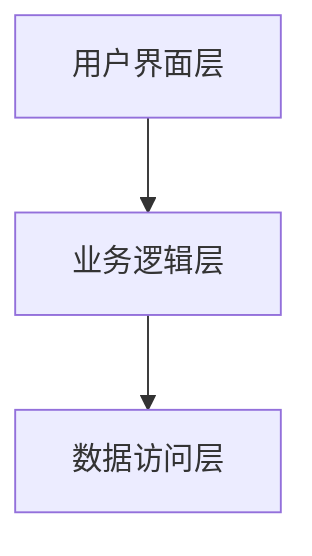
```mermaid
graph
用户界面层 --> 业务逻辑层 --> 数据访问层
```

- 用户界面层：用户交互。
- 业务逻辑层：系统的业务流程。
- 数据访问层：数据库交互。

#### 包图

- 包：将所有模型元素组织成各种功能/用途的模块，并控制包中元素的可见性、描述包之间的依赖关系。

- 包图由包之间的关系组成，描述系统的模块之间的依赖关系。

- 包是可以拥有任何模型元素的通用命名空间：每个建模元素必须在系统中唯一的命名空间进行声明，每个图必须被一个唯一确定的包所有。
- 包构成进行配置控制、存储、访问控制的基础。


| 可见性    | 符号 | 说明                       |
| --------- | ---- | -------------------------- |
| public    | #    | 对所有引入的包及其后代可见 |
| protected | +    | 只对该包的泛化可见         |
| private   | -    | 对包外元素完全不可见       |

- 包是不透明的：通常一个包不能访问另一个包的内容，只有被访问或引入依赖关系才能打开。

- 子系统 subSystem：具有单独说明和实现部分的包、对系统其他部分存在接口的连贯模型单元。

- 构造型 Stereotype

##### 关系

- 包的关系有：依赖、泛化。

###### 依赖

####### 包的依赖关系

- 包的依赖：两个包所包含的模型元素之间存在一个或多个依赖。
- 基用例依赖扩展用例，基用例依赖被包含用例。
- 包的循环依赖关系：如果把包理解成子系统，那么循环依赖的包意味着这两个子系统的联系是密切的，可能存在高耦合联系，从这个角度看包之间不应该存在有循环依赖的情况。但是，由于包的依赖联系没有传递性，因此，包之间的循环依赖并不完全等同于系统的高耦合联系，应该具体情况具体分析。

####### 引入关系 import

- 引入关系：包与包之间的一种存取依赖关系。引入指允许一个包的元素存取另一个包的公共部分。
- 包的输出：包的公共部分，即其可视性为“公共”的模型元素。包的输出只对另一个与它有引入关系的包才是可视的、可存取的。 

 

- 依赖中扩展和包含的体现：
  - 基用例依赖扩展用例。
  - 基用例依赖被包含用例。

> 系统中有四个包分别是：客户机、服务器、策略、GUI。
>
> - 客户机包中包含三个类：公共的“订货表”类和“追踪表”类，还有一个私有的“订货”类；
> - 策略包中包含两个类:公共的“订货规则”类和私有的“交易规则”类；
> - GUI包中包含三个类：公共的“窗口”类和“表格”类，保护的“事件处理”类；
> - 服务器包中包含两个类：公共的“数据库”类和“登录服务”类。
>
> 其中客户机包需要存取策略包中的“订货规则”类；策略包需要存取GUI包中的“窗口”和“表格”类。
> 根据以上描述绘制包图。
>
> 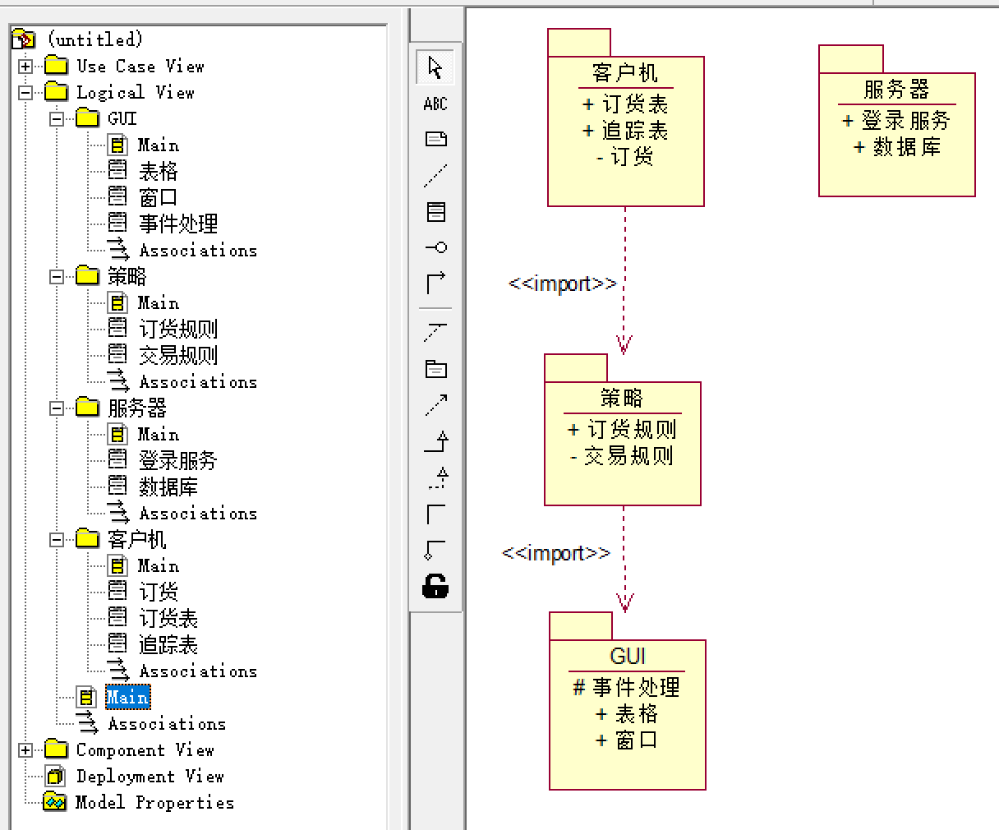i

> 每个职能部门由一个经理，0-2个副经理和1个以上的员工组成。每个职能部门承担多项工作任务或一项工作任务也可能由多个部门共同承担，工作任务可能是赢利、后勤保障、公关。一项工作任务需要使用一到多种资源，这些资源由设备、经费、技术方法组成。将以下对象类组织成包。
>
> 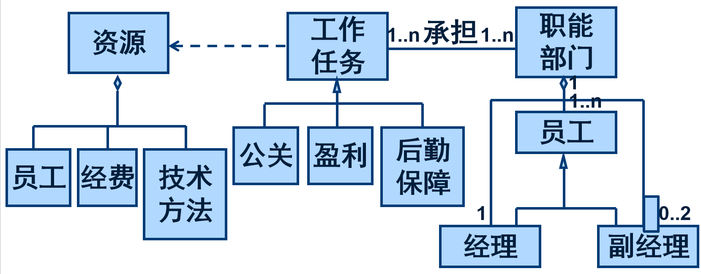 
>
> 

> 在学生管理系统中，系统的结构设计为三层架构，其中用户服务包中的类为获取数据、显示消息提供了可视化接口。数据服务包中的类负责对数据的存取、更新和维护等。业务服务包是用户服务包和数据服务包的桥梁，业务服务包中的类负责处理用户的请求，执行业务任务。用户服务包和业务服务包之间，业务服务包和数据服务包之间存在着引入依赖关系，用构造型“《import》”标识。根据以上要求，画出系统的包图。
>
>  

###### 泛化

- 泛化可以通过嵌套来实现。

###### 嵌套

- 包可以拥有其他包作为包内的元素，子包又可以拥有自己的子包。

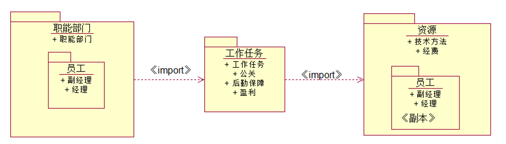 

## Rational Rose 

### 基本使用功能

#### 导入/导出模型

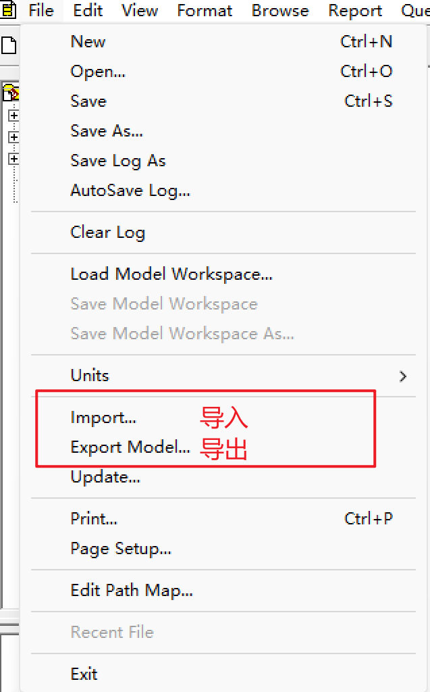 

#### 发布模型

- Tools --> Web Publisher

 

#### 控制单元

#### 模型集成器

### 视图模型

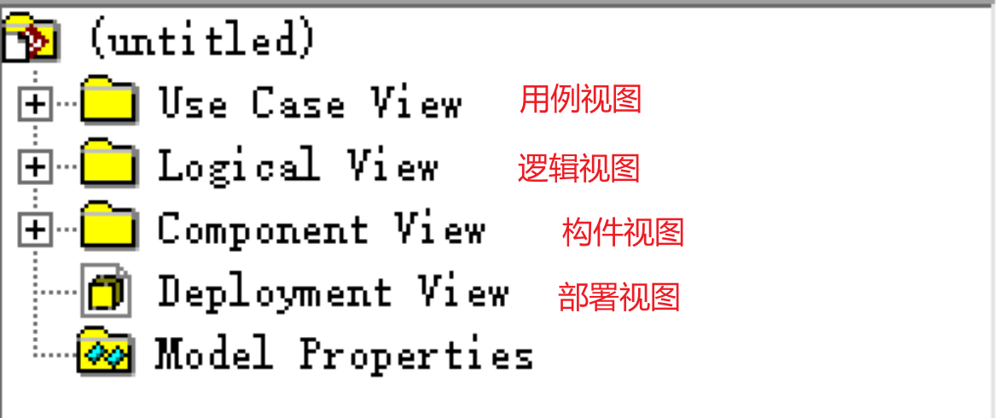 

#### 用例视图 Use Case View

- 用例视图关注系统功能的高级抽象，而不关注系统的具体实现方法。
- 用例视图包括了系统中所有参与者、用例、用例图；必要时可以添加：顺序图、协作图、活动图、类图等。

 

#### 逻辑视图 Logical View

- 逻辑视图关注系统如何实现用例中所描述的功能，主要是对系统功能性需求提供支持：在为用户提供服务方面，系统所应该提供的功能。
- 逻辑视图的模型元素：类、类工具、用例、接口、类图、用例图、协作图、顺序图、活动图、状态图等。

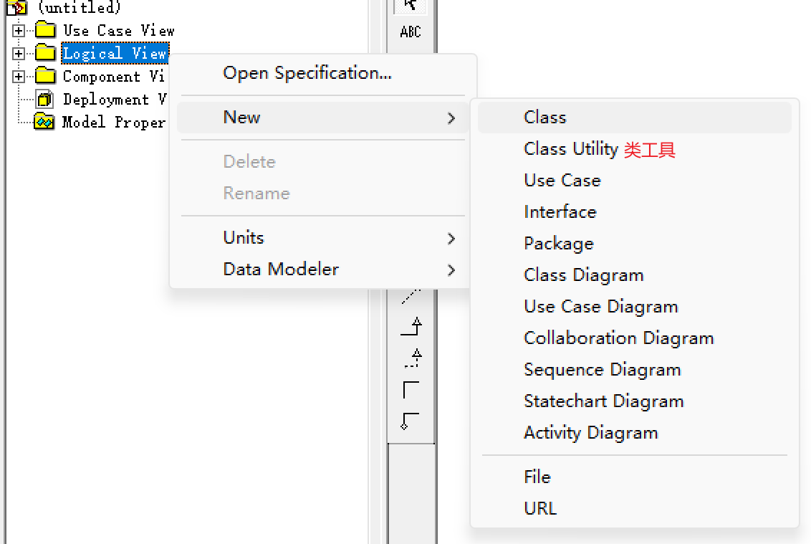 

#### 构件视图

#### 部署视图


# 设计模式

## 概述

### 设计原则

1. 单一职责原则（Single Responsibility）：一个类应该只负责一项职责。如果类的逻辑简单，则方法级别的单一职责原则是被允许的。
2. 开闭原则（Open Close Principle OCP）：对扩展开放，对修改关闭。

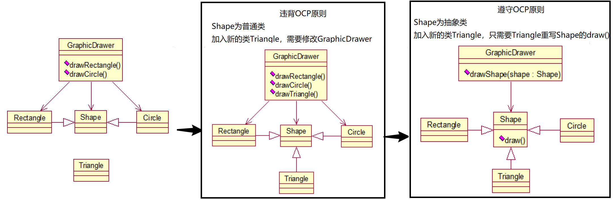

3. 里氏代换原则（Liskov Substitution Principle LSP）：任何基类可以出现的地方，子类一定可以出现。 继承复用，只有当衍生类可以替换掉基类，软件单位的功能不受到影响时，基类才能真正被复用，而衍生类也能够在基类的基础上增加新的行为。
   - 子类应避免改变较大的重写，否则子类和父类继承一个更加基础的类（此时关系应为组合、聚合、依赖）。
4. 依赖倒转原则（Dependence Inversion Principle）：高层模块不应该依赖低层模块，依赖于抽象而不依赖于具体。面向接口编程。
   1. 接口依赖传递：方法参数使用接口类型。
   2. 构造器依赖传递：成员变量使用接口类型。
   3. setter()依赖传递：成员变量使用接口类型。
5. 接口隔离原则（Interface Segregation Principle）：一个类对另一个类的依赖应该建立在最小接口上。


6. 迪米特法则（最少知道原则）（Demeter Principle）：对于被依赖的类，尽量将逻辑封装在类的内部，对外除提供public成员外，不泄漏任何信息。只与直接朋友通信、避免非直接朋友。减少不必要的依赖。

> 朋友关系：存在耦合关系的两个对象。
> 
> - 直接朋友：成员变量、方法参数、方法返回值中的类。
> 
> - 非直接朋友：局部变量中的类。

7. 合成复用原则（Composite Reuse Principle）：尽量使用组合、聚合，而不是继承。

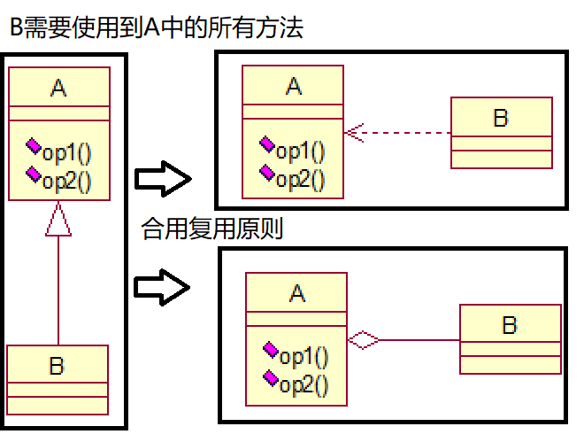 

### 设计模型类型

| 类别  | 模式                                                              |
| --- | --------------------------------------------------------------- |
| 创建型 | 工厂方法模式、抽象工厂模式、单例模式、建造者模式、原型模式                                   |
| 结构型 | 适配器模式、装饰器模式、代理模式、外观模式、桥接模式、组合模式、享元模式                            |
| 行为型 | 策略模式、模板方法模式、观察者模式、迭代子模式、责任链模式、命令模式、备忘录模式、状态模式、访问者模式、中介者模式、解释器模式 |

## 创建型

### 工厂模式 Factory

1. 编码时不能预见需要创建哪种类的实例。
2. 系统不应依赖于产品类型实例如何被创建、组合和表达的细节。

#### 简单工厂模式（静态工厂模式）

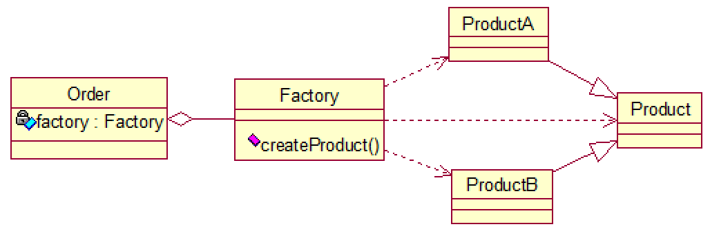 

```java
class Order{

    private Factory factory = new Factory();

    public Product getProduct(){
        return factory.createProduct();
    }
}

class Factory{
    public Product createProduct(){
        return true? new ProductB(): new ProductA();
    }
}

class Product{}
```

#### 工厂方法模式

- 抽象对抽象，具体对具体：定义创建对象的抽象方法，由子类决定要实例化的类。对象的实例化推迟到其子类。

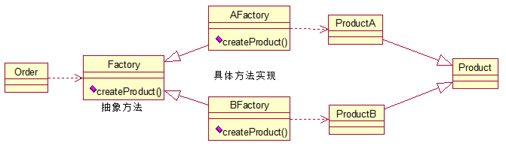 

```java
public interface FruitFactory {
    public Fruit makeFruit();
}

class AppleFactory implements FruitFactory {

    @Override
    public Fruit makeFruit() {
        return new Apple();
    }
}

class BananaFactory implements FruitFactory {

    @Override
    public Fruit makeFruit() {
        return new Banana();
    }
}

interface Fruit {}
class Apple implements Fruit {}
class Banana implements Fruit {}
```

#### 抽象工厂模式

- 抽象工厂模式：interface，创建相关/依赖的对象簇，而无需指明具体的类。
- 将工厂抽象成两层；抽象工厂、具体实现的工厂子类。每个具体工厂生产一个产品簇（相关/依赖的一系列产品），产品族内包含不同等级的产品。

> Intel、Amd分别为一个产品簇，而CPU、主板、硬盘等分别属于不同等级的产品。
> 
> - 产品有多个产品簇，而只消费其中某一簇的产品。
> - 同属于同一簇的产品必须一起使用。
> - 系统提供一个产品类的库，所有的产品以相同的接口出现。

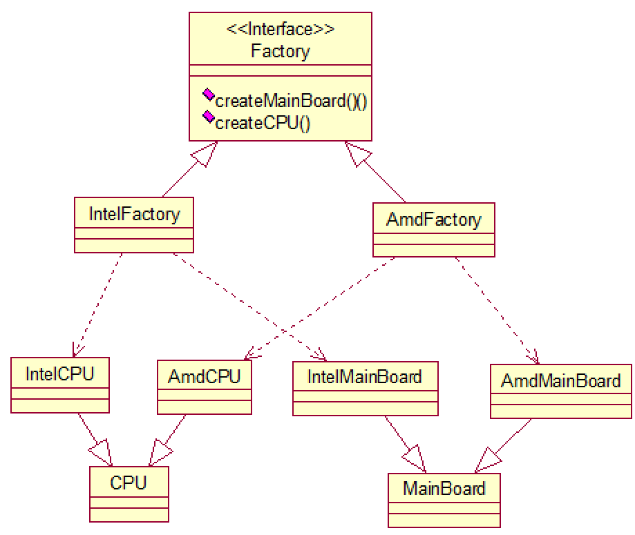 

- 工厂

```java
public interface ComputerFactory {

    CPU createCPU();

    MainBoard createMainBoard();
}

class IntelFactory implements ComputerFactory {

    @Override
    public CPU createCPU() {
        return new IntelCPU();
    }

    @Override
    public MainBoard createMainBoard() {
        return new IntelMainBoard();
    }
}

class AmdFactory implements ComputerFactory {

    @Override
    public CPU createCPU() {
        return new AmdCPU();
    }

    @Override
    public MainBoard createMainBoard() {
        return new AmdMainBoard();
    }
}
```

- 产品CPU

```java
public class CPU {}

class IntelCPU extends CPU {
    public static final int PORT = 1001;
}

class AmdCPU extends CPU {
    public static final int PORT = 1002;
}
```

- 产品MainBoard

```java
public interface MainBoard {}

class IntelMainBoard extends MainBoard {
    public static final int PORT = 1001;
}

class AmdMainBoard extends MainBoard {
    public static final int PORT = 1002;
}
```

- 客服端

```java
public class Client {
    public static void main(String[] args) {
        IntelFactory intelFactory = new IntelFactory();
        makeComputer(intelFactory);
    }

    public static void makeComputer(ComputerFactory factory) {
        if (factory instanceof IntelFactory) {
            IntelCPU cpu = (IntelCPU) factory.createCPU();
            IntelMainBoard mainBoard = (IntelMainBoard) factory.createMainBoard();
        }
        if (factory instanceof AmdFactory) {
            AmdCPU cpu = (AmdCPU) factory.createCPU();
            AmdMainBoard mainBoard = (AmdMainBoard) factory.createMainBoard();
        }
    }
}
```

### 单例模式 SingleTon

- 该类只能存在一个对象实例，且只提供一个获取其对象实例的方法。

| 单例方式  | 说明                                         |
| ----- | ------------------------------------------ |
| 饿汉式   | 静态常量、静态代码块                                 |
| 懒汉式   | 线程不安全<br />线程安全、同步方法<br />线程安全、同步代码块（双重检查） |
| 静态内部类 |                                            |
| 枚举    |                                            |

#### 饿汉式

1. 构造器私有化：private。

2. 类的内部创建对象：private static。

3. 向外暴露一个静态的公共方法：getInstance()。
- 类装载时完成实例化，避免线程同步问题；但没有实现Lazy Loading，可能造成内存浪费。

```java
public class Singleton {

    private static Singleton instance = new Singleton();

    private Singleton() {}

    public static Singleton getInstance() {
        return instance;
    }
}
```

```java
public class Singleton {

    private static Singleton instance;

    static{
        instance = new Singleton();
    }

    private Singleton() {}

    public static Singleton getInstance() {
        return instance;
    }
}
```

#### 懒汉式

- Lazy Loading
1. 线程不安全：

```java
public class LazySingleton {

    private static LazySingleton instance = null;

    private LazySingleton() {}

    public synchronized static LazySingleton getInstance() {
        if (instance == null) {
            instance = new LazySingleton();
        }
        return instance;
    }
}
```

2. 线程安全：同步方法，效率低

```java
public class LazySingleton {
    private static LazySingleton instance = null;

    private LazySingleton() {
    }

    public synchronized static LazySingleton getInstance() {
        if (instance == null) {
            instance = new LazySingleton();
        }
        return instance;
    }
}
```

3. 线程安全：同步代码块（双重检查）

```java
public class LazySingleton {
    private static LazySingleton instance = null;

    private LazySingleton() {
    }

    public static LazySingleton getInstance() {
        if (instance == null) {
            synchronized (LazySingleton.class) {
                if (instance == null) {
                    instance = new LazySingleton();
                }
            }
        }
        return instance;
    }
}
```

> 错误写法：可能有多个线程已经经过了判断，等待进入同步代码块，此时仍然会创建多个实例。
> 
> ```java
> if (instance == null) {
>     synchronized (LazySingleton.class) {
>         instance = new LazySingleton();
>     }
> }
> ```

#### 静态内部类

- Lazy loading：类装载机制：静态内部类在外部类被装载时不会被装载，而是在需要实例时才会装载。
- 由JVM保证线程安全：类的静态属性只会在第一次加载类时初始化。

```java
public class LazySingleton {
    private static class SingletonHolder{
        private static StaticSingleton instance = new StaticSingleton();
    }

    private LazySingleton(){}

    public static LazySingleton getInstance(){
        return SingletonHolder.instance;
    }
}
```

#### 枚举 enum

- 避免线程安全问题，防止反序列化重新创建新的对象。

```java
enum Singleton{
    INSTANCE;
}
```

### 建造者模式 Builder

- 建造者模式（生成器模式）：将复杂对象的建造过程抽象化，通过对该建造过程的不同实现构造不同的对象。

| 角色                    | 说明                                                                             |
| --------------------- | ------------------------------------------------------------------------------ |
| Product 产品            | 具体的产品                                                                          |
| Builder 抽象建造者         | 为产品对象的各个部件指定抽象接口。                                                              |
| ConcreteBuilder 具体建造者 | 实现各个部件的具体构造装配。                                                                 |
| Director 指导者          | 与客户端联系，并告诉建造者应该建造的产品，调用具体建造者中的方法。<br />1. 隔离客户与对象的生成过程。<br />2. 负责控制产品对象的生成过程。 |


| 建造者模式 | 说明                                                                                                                                                       |
| ----- | -------------------------------------------------------------------------------------------------------------------------------------------------------- |
| 优势    | 1. 客户不必知道产品内存组成的细节，将产品本身和产品的创建过程解耦，使得相同的创建过程可以产生不同的产品对象。<br/>2. 每个具体建造者都相对独立，用户使用不同的具体建造者可以得到不同的产品对象。<br/>3. 精细化控制产品的创建过程。<br/>4. OCP：增加新的具体建造者无需修改原有代码。 |
| 缺陷    | 1. 建造者模式产生的产品应该是组成成分相似的，不适用与产品之间差异性大的。<br/>2. 如果产品的内部变化复杂，需要定义较多具体建造者实现其变化。                                                                              |


```java
ProductABuilder productABuilder = new ProductABuilder();
Director director = new Director();
director.makeProduct(productABuilder);
Product productA = productABuilder.getProduct();
```

```java
public class Director {
    public void construct(Builder builder){ //传入建造者的具体实现
        builder.buildPartA();
        builder.buildPartB();
        builder.buildPartC();
    }
}

interface Builder {
    void buildPartA();
    void buildPartB();
    void buildPartC();
    Product getProduct();
}

class ProductABuilder implements Builder{
    Product productA = new Product();

    @Override
    public void buildPartA() {
        productA.setPartA("productA-partA");
    }

    @Override
    public void buildPartB() {
        productA.setPartB("productA-partB");
    }

    @Override
    public void buildPartC() {
        productA.setPartC("productA-partC");
    }

    @Override
    public Product getProduct() {
        return productA;
    }
}

public class Product {
    private String partA;
    private String partB;
    private String partC;
}
```

> StringBuilder#append()：
> 
> | 类/接口                  | 角色说明                                                                             |
> | --------------------- | -------------------------------------------------------------------------------- |
> | Appendable            | 抽象建造者                                                                            |
> | AbstractStringBuilder | 建造者                                                                              |
> | StringBuilder         | 指导者<br />具体建造者：建造方法由AbstractStringBuilder实现，StringBuilder继承AbstractStringBuilder |
> 
>  

| 比较     | 产品                           |
| ------ | ---------------------------- |
| 抽象工厂模式 | 产品簇<br />不关心构建过程，只关心是什么工厂生产的 |
| 建造者模式  | 指定蓝图建造产品<br />组装配零配件而产生新产品   |

### 原型模式 Prototype

- 原型模式：复制原型对象来创建更多同类型的对象，动态获取对象运行时的状态。
  
  - java.lang.Object提供clone()，需要实现Cloneable接口，使该类能够复制且具有复制的能力。
  - clone()减少资源的占用：对象拷贝时，不是使用构造器方法，而是从堆内存中以二进流的方式进行拷贝，重新分配一个内存块。

- 相似但不相同：通过复制方法创建的对象是新的对象，在内存中拥有新的地址，每个复制的对象相互独立。在对复制的对象修改时，不会影响原型对象。

 

- clone()：重写java.lang.Object#clone()，实现Cloneable接口（CloneNotSupportException ）。

- 对于任意对象obj：

```java
obj.clone() != obj;
obj.clone().getClass() == obj.getClass();
obj.clone().equals(obj) == true; 
```

| 拷贝方式 | 说明                                                  |
| ---- | --------------------------------------------------- |
| 浅拷贝  | 被拷贝对象的所有属性都和原型对象相同<br />其引用数据类型成员的地址仍是原来的地址：即没有被复制。 |
| 深拷贝  | 被拷贝对象的所有属性都和原型对象相同<br />其引用数据类型成员被赋予新的地址：即被复制。      |

> String：尽管没有实现Cloneable接口的clone()方法，但是可以看作基本数据类型一般被拷贝，而StringBuffer不行。

- 浅拷贝：

```java
Person person = new Person(1001, "Jac", new Pet("King"));
Person person1 = person.clone();

System.out.println(person.equals(person1)); //true
System.out.println(person == person1); //false
System.out.println(person.pet.equals(person1.pet)); //true
System.out.println(person.pet == person1.pet); //true  浅拷贝
```

```java
class Person implements Cloneable {
    private int id;
    private String name;
    public Pet pet;

    @Override
    protected Person clone() throws CloneNotSupportedException {
        return (Person) super.clone();
    }
}

class Pet {}
```

- 深拷贝：引用数据类型成员所属的类也重写clone()且实现Cloneable接口，当克隆对象调用其clone()时，其clone()内部也调用了该引用数据类型成员的clone()，对该成员进行克隆。

```java
Person person = new Person(1001, "Jac", new Pet("King"));
Person person1 = person.clone();

System.out.println(person.equals(person1)); //true
System.out.println(person == person1); //false
System.out.println(person.pet.equals(person1.pet)); //true
System.out.println(person.pet == person1.pet); //false  深拷贝
```

```java
class Person implements Cloneable {
    private int id;
    private String name;
    public Pet pet;

    @Override
    protected Person clone() throws CloneNotSupportedException {
        Person person = (Person) super.clone();
        person.pet = pet.clone();
        return person;
    }
}

class Pet implements Cloneable{
    @Override
    protected Pet clone() throws CloneNotSupportedException {
        return (Pet) super.clone();
    }
}
```

- 序列化深拷贝：

```java
public Person deepClone() {
    ByteArrayOutputStream bos = null;
    ObjectOutputStream oos = null;
    ByteArrayInputStream bis = null;
    ObjectInputStream ois = null;
    try {
        bos = new ByteArrayOutputStream();
        oos = new ObjectOutputStream(bos);
        oos.writeObject(this);
        bis = new ByteArrayInputStream(bos.toByteArray());
        ois = new ObjectInputStream(bis);
        return (Person) ois.readObject();
    } catch (Exception ex) {
        ex.printStackTrace();
        return null;
    } finally {
        try {
            bos.close();
            oos.close();
            bis.close();
            ois.close();
        }catch (IOException ex) {
            ex.printStackTrace();
        }
    }
}
```

## 结构型

### 适配器模式 Adapter

- 适配器模式（包装器 Wrapper）：（兼容性）当使用一个已经存在的类，其接口不符合要求时；创建一个可复用的类，与其他不相关的/不可预见的类协同工作，用来适配它们的父类接口。

 

| 类型                     | 关系  | Source | 说明                                          |
|:---------------------- |:--- |:------ | ------------------------------------------- |
| 类适配器模式                 | 继承  | 类      | 单一源适配，清晰                                    |
| 对象适配器模式                | 关联  | 对象     | 多源适配，但不太清晰                                  |
| 接口适配器模式<br />（默认适配器模式） | 实现  | 接口     | 只需实现一部分目标接口的方法。<br />抽象类实现接口，继承该抽象类，实现部分方法。 |


#### 类适配器模式

 

 

```jav
Phone phone = new Phone();
phone.charging(new VoltageAdapter());
```

```java
class Phone{
    public void charging(IVoltage5V iVoltage5V) {
        if(iVoltage5V.output5V() == 5) {
            System.out.println("正在充电...");
        } else if (iVoltage5V.output5V() > 5) {
            System.out.println("无法充电!!!");
        }
    }
}

interface IVoltage5V {
    int output5V();
}

class Voltage220V {
    public int output220V() {
        int src = 220;
        System.out.println("src");
        return src;
    }
}

class VoltageAdapter extends Voltage220V implements IVoltage5V {

    @Override
    public int output5V() {
        int srcV = output220V();
        int dstV = srcV / 44;
        return dstV;
    }
}
```

#### 对象适配器模式


```java
Phone phone = new Phone();
phone.charging(new VoltageAdapter(new Voltage220V()));
```

```java
class Phone{
    public void charging(IVoltage5V iVoltage5V) {
        if(iVoltage5V.output5V() == 5) {
            System.out.println("正在充电...");
        } else if (iVoltage5V.output5V() > 5) {
            System.out.println("无法充电!!!");
        }
    }
}

interface IVoltage5V {
    int output5V();
}

class Voltage220V {
    public int output220V() {
        int src = 220;
        System.out.println("src");
        return src;
    }
}

class VoltageAdapter extends Voltage220V implements IVoltage5V {

    private Voltage220V voltage220V;

    public VoltageAdapter(Voltage220V voltage220V){
        this.voltage220V = voltage220V;
    }

    @Override
    public int output5V() {
        int dstV = 0;
        if(null != voltage220V){
            int srcV = output220V();
            dstV = srcV / 44; 
        }
        return dstV;
    }
}
```

#### 接口适配器模式

 

```java
//Swing的事件监听器
new MouseListener() {
    ...
}
```

### 桥接模式 Bridge

- 桥接模式（柄体/接口模式）：抽象化与实现脱耦。多层继承的替代实现。

 

| 角色                             | 等级  |                                                       |
|:------------------------------ |:--- |:----------------------------------------------------- |
| 抽象化<br />Abstraction           | 抽象  | 抽象化给出的定义，并保存一个对实现化角色的引用<br />只给出基于底层操作的更高一层操作。        |
| 修正抽象化<br />RefinedAbstraction  | 抽象  | 扩展抽象化角色，改变和修正父类对抽象化的定义                                |
| 实现化<br />Implementor           | 实现  | 实现化角色的接口，不是具体的实现。<br />不一定与抽象化角色的接口定义相同。<br />只给出底层操作 |
| 具体实现化<br />ConcreteImplementor | 实现  | 对实现化角色的具体实现                                           |

- 抽象化等级结构中的方法通过向对应的实现化对象委派实现自己的功能。即抽象化角色可以通过向不同的实现化对象委派，而动态的转换自己的功能。


```java
//以SMS发送普通消息
AbstartMessage message = new CommonMessage(new MessageSMS());
message.sendMessage("信件内容", "Tom");
//以Email发送加急消息
message = new UrgentMessage(new MessageEmail());
message.sendMessage("信件内容", "Tom");
```

```java
abstract class AbstartMessage {

    MessageImplementor impl;

    public AbstartMessage(MessageImplementor impl) {
        this.impl = impl;
    }

    public void sendMessage(String message, String toUser) {
        this.impl.send(message, toUser);
    }
}

class CommonMessage extends AbstartMessage {

    public CommonMessage(MessageImplementor impl) {
        super(impl);
    }

    @Override
    public void sendMessage(String message, String toUser) {
        super.sendMessage(message, toUser);
    }
}

class UrgentMessage extends AbstartMessage {

    public UrgentMessage(MessageImplementor impl) {
        super(impl);
    }

    @Override
    public void sendMessage(String message, String toUser) {
        message = "加急!：" + message;
        super.sendMessage(message, toUser);
    }

    public void other() {//扩展新的功能}
}

interface MessageImplementor {
    public void send(String message, String toUser);
}

class MessageSMS implements MessageImplementor {
    @Override
    public void send(String message, String toUser) {
        System.out.println("SMS-[" + message + "]-TO-" + toUser);
    }
}

class MessageEmail implements MessageImplementor {
    @Override
    public void send(String message, String toUser) {
        System.out.println("Email-[" + message + "]-TO-" + toUser);
    }
}
```

### 装饰者模式 Decorator

- 装饰者模式：动态地将新功能附加到对象。

 

> IO流中的套接：
> 
> 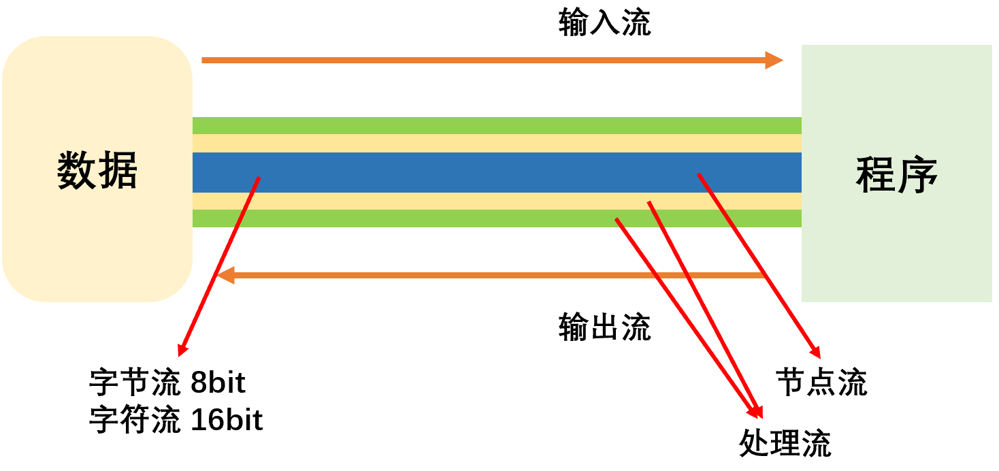 
> 
> 


```java
Drink drink = new Chocolate(new Latte());
System.out.println(drink.cost());
System.out.println(drink.getDescription());
```

```java
abstract class Drink{
    private double price;
    private String description;

    public abstract double cost();

    public void setPrice(double price){
        this.price = price;
    }

    public double getPrice(){
        return price;
    }

    public void setDescription(String description) {
        this.description = description;
    }

    public String getDescription(){
        return description;
    }
}

class Coffee  extends Drink {
    @Override
    public double cost() {
        return super.getPrice();
    }

}


class Latte extends Coffee{
    public Latte(){
        setPrice(100);
        setDescription("Latte Coffee");
    }
}

class Decorator extends Drink{
    private Drink drink;

    public Decorator(Drink drink){
        this.drink = drink;
    }

    public String getDescription() {
        return drink.getDescription() + "&&" + cost();
    }

    @Override
    public double cost() {
        return super.getPrice() + drink.cost();
    }
}

class Chocolate extends Decorator{

    public Chocolate(Drink drink){
        super(drink);
        setPrice(10);
        setDescription("Chocolate");
    }
}
```

### 组合模式 Composite

- 组合模式（合成模型模式）：将对象组合成树形结构以表示“整体-部分”的结构层次，对单个对象和组合对象的访问具有一致性。

 

| 类/接口      | 构件角色 | 说明                       |
| --------- | ---- | ------------------------ |
| Component | 抽象   | 共有的行为                    |
| Leaf      | 树叶   | 参加组合的原始对象的行为<br>没有下级的子对象 |
| Composite | 树枝   | 参加组合的有子对象的对象             |

1. 遍历组织机构、处理的对象具有树形结构时。
2. 要求较高的抽象性，节点和叶子相似。

#### 透明方式

- 不安全：此时的Leaf和Composite对象没有被区分。

| 角色   | 说明                                             |
| ---- | ---------------------------------------------- |
| 抽象构件 | 声明所有管理子类对象的方法：包括Leaf和Composite内的所有方法。          |
| 树叶构件 | 参加组合的原始对象的行为<br>没有下级的子对象<br>**具有管理子对象一般行为的方法** |
| 树枝构件 | 参加组合的有子对象的对象                                   |

#### 安全方式

- 只在Composite内声明管理子类对象的方法。

| 角色   | 说明                                    |
| ---- | ------------------------------------- |
| 抽象构件 | 声明所有管理子类对象的方法：包括Leaf和Composite内的所有方法。 |
| 树叶构件 | 参加组合的原始对象的行为<br>没有下级的子对象              |
| 树枝构件 | 参加组合的有子对象的对象<br>**具有管理子对象一般行为的方法**    |

```java
public interface Component{
    //返回自身实例
    Composite getComposite();
    //业务方法
    void sampleOperation();
}
```

```java
public class Composite implements Component {

    private Vector componentVector = new Vector();

    @Override
    public Composite getComposite() {
        return this;
    }

    @Override
    public void sampleOperation() {
        Enumeration enumeration = getChild();
        while (enumeration.hasMoreElements()) {
            ((Component) enumeration.nextElement()).sampleOperation();
        }
    }

    public void add(Component component) {
        componentVector.addElement(component);
    }

    public void remove(Component component) {
        componentVector.remove(component);
    }

    public Enumeration getChild() {
        return componentVector.elements();
    }
}
```

```java
public class Leaf implements Component{

    @Override
    public Composite getComposite() {
        return null;
    }

    @Override
    public void sampleOperation() {}
}
```

### 外观模式 Facade

- 外观模式（过程模式）：定义一个一致的接口，用以屏蔽内部子系统的细节，调用端只需要和该接口发生调用，而无需关心子系统的内部细节。
- 维护一个遗留的大型系统时，如果该系统难以维护和扩展，则考虑为新系统开发一个Facade类，提供遗留系统的比较清晰简单的接口，新系统和Facade类交互，提供复用性。 

   

 

```java
HomeTheaterFacade home = new HomeTheaterFacade();
home.ready();
home.play();
home.exit();
```

```java
public class  HomeTheaterFacade{
    private DVDPlayer dvdPlayer;
    private Popcorn popcorn;

    public HomeTheaterFacade(){
        dvdPlayer = DVDPlayer.getInstance();
        popcorn = Popcorn.getInstance();
    }

    public void ready(){
        dvdPlayer.on();
        popcorn.on();
        popcorn.work();
    }

    public void play(){
        dvdPlayer.play();
    }

    public void exit(){
        dvdPlayer.off();
        popcorn.off();
    }
}

class DVDPlayer{
    private static DVDPlayer instance = new DVDPlayer();

    public static DVDPlayer getInstance(){return instance;}

    public void on(){System.out.println("DVD on");}
    public void off(){System.out.println("DVD off");}
    public void play(){System.out.println("DVD play");}
}

class Popcorn{
    private static Popcorn instance = new Popcorn();

    public static Popcorn getInstance(){return instance;}

    public void on(){System.out.println("Popcorn on");}
    public void off(){System.out.println("Popcorn off");}
    public void work(){System.out.println("Popcorn work");} 
}
```

### 享元模式 Flyweight

- 享元模式（蝇量模式）：运用共享技术有效地支持大量细粒度的对象。
1. 解决重复对象的内存浪费问题：对象的状态大部分可以外部化时，将大量对象的创建改为从池中获取。
2. 池技术：StringTable、数据库连接池、缓冲池、SingletonObject。

 

| 对象的信息 | 说明                           | 示例：围棋      |
| ----- | ---------------------------- | ---------- |
| 内部状态  | 对象共享的信息，存储在享元对象内部且不随环境改变而关闭。 | 棋子的颜色（黑/白） |
| 外部状态  | 对象得以依赖的标记，随环境改变而改变、不可共享。     | 棋子在棋盘上的位置  |

- Integer#valueOf()的缓存技术（`-128~127`）：

```java
@IntrinsicCandidate
public static Integer valueOf(int i) {
    if (i >= IntegerCache.low && i <= IntegerCache.high)
        return IntegerCache.cache[i + (-IntegerCache.low)];
    return new Integer(i);
}

cache = archivedCache;
// range [-128, 127] must be interned (JLS7 5.1.7)
assert IntegerCache.high >= 127;
```

```java
Integer i1 = Integer.valueOf(127);
Integer i2 = Integer.valueOf(127);
System.put.println(i1 == i2); //true;

Integer j1 = new Integer(127);
Integer j2 = new Integer(127);
System.put.println(j1 == j2); //false;
System.put.println(i1 == j1); //false;
```

### 代理模式 Proxy

- 代理模式：通过代理对象访问目标对象，可扩展目标对象的功能。
  - 被代理对象：远程对象、创建开销大的对象、需要安全控制的对象。
1. 静态代理。
2. 动态代理
   1. JDK代理、接口代理。
   2. Cglib代理、子类代理。

 

#### 静态代理

- 静态代理：目标对象和代理对象一起实现相同的接口 或 继承相同的父类，代理对象通过调用相同的方法来调用目标对象的方法。
1. 在不改变目标对象的功能前提下，通过代理对象对目标功能扩展。
2. 代理对象需要和目标对象实现一样的接口，会产生多个代理类。
3. 一旦接口增加方法，目标对象和代理对象都需要维护。

 

```java
TeacherDaoProxy proxy = new TeacherDaoProxy(new TeacherDao());
proxy.teach();
```

```java
public interface TeacherDaoInterface{
    void teach();
}

class TeacherProxy implements TeacherDao{

    private TeacherDaoInterface target;

    public TeacherProxy(TeacherDaoInterface target){
        this.target = target;
    }

    public void teach(){
        System.out.println("代理开始...");
        target.teach();
        System.out.println("提交...");
    }
}

class TeacherDao implements TeacherDaoInterface{
    public void teach(){
        System.out.println("teach");
    }
}
```

#### JDK代理

- JDK代理：代理对象不需要实现接口，而目标对象需要实现接口。代理对象通过java.lang.reflect.Proxy生成，动态地在内存中构建代理对象。
1. 代理的类不能是final修饰的：javal.ang.IllegaArgumentException。
2. 目标对象的方法如果为final/static，则不会被拦截，不执行额外的扩展功能。 

```java
public static Object newProxyInstance(ClassLoader loader,
                                      Class<?>[] interfaces,
                                      InvocationHandler h)
```

| 参数                      | 说明                                       |
| ----------------------- | ---------------------------------------- |
| ClassLoader loader      | 指定当前目标对象的类加载器，获取加载器的方法固定。                |
| `Class<?>[] interfaces` | 目标对象实现的接口类型。                             |
| InvocationHandler h     | 事件处理：执行目标对象方法时，触发事件处理器方法。<br />传入目标对象方法。 |

```java
TeacherDaoInterface proxy = (TeacherDaoInterface)new ProxyFactory(new TeacherDao()).getProxy();
proxy.say();
proxy.teach();
System.out.println(proxy.getClass());//class $Proxy0
```

```java
public class ProxyFactory {

    private Object target;

    public ProxyFactory(TeacherDao target) {
        this.target = target;
    }

    public Object getProxy() {
        return Proxy.newProxyInstance(target.getClass().getClassLoader(),
                target.getClass().getInterfaces(),
                new InvocationHandler() {
                    @Override
                    public Object invoke(Object proxy, Method method, Object[] args) throws Throwable {
                        System.out.println("代理开始...");
                        Object returnVal = method.invoke(target, args);
                        System.out.println("提交...");
                        return returnVal;
                    }
                });
    }
}

interface TeacherDaoInterface {
    void teach();

    void say();
}

class TeacherDao implements TeacherDaoInterface {
    public void teach() {
        System.out.println("teach");
    }

    public void say() {
        System.out.println("say");
    }
}
```

#### Cglib代理

- Cglib代理（子类代理）：目标子类对象实现代理，在内存中创建子类对象来实现对目标对象功能扩展。不需要实现任何接口。
  
  - 代理的类不能是final修饰的。

- AOP编程选择代理模式：
1. 目标对象需要实现接口，用JDK代理。

2. 目标对象不需要实现接口，用Cglib代理。
- Cglib底层：字节码处理框架ASM转换字节码并生成新的类。

```java
class ProxyFactory implements MethodInterceptor{
    private Object target;

    public ProxyFactory(Object target){
        this.target = target;
    }

    public Object getProxy(){
        Enhancer enhancer = new Enhance();
        enhancer.setSuperclass(target.getClass());
        enhancer.setCallback(this);
        return enhancer.create();
    }

    @Override
    public Object intercept(Object o, Method method, Object[] objects, MethodProxy methodProxy) throws Throwable {
        System.out.println("cglib-代理开始...");
        Object re = method.invoke(target, objects);
        System.out.println("cglib-代理提交...");
        return re;
    }
}

class TeacherDao{
    public void teach() {
        System.out.println("teach");
    }

    public void say() {
        System.out.println("say");
    }
}
```

#### 变体

1. 防火墙代理：内网通过代理穿透防火墙，实现对公网的访问。
2. 缓存代理：请求资源时，先从缓存代理中获取，如果缓存代理中取不到，再去公网、数据库中获取。
3. 远程代理：将远程对象当作本地对象来调用。
4. 同步代理：多线程间同步工作。

## 行为型

### 模板方法模式 Template

- 模板方法模式：抽象类公开定义执行其方法的模板，子类按需重写方法实现，调用时仍然按抽象类中定义的模板执行。
1. 统一算法：父类的模板方法保证算法的结构不变，子类提供部分步骤的实现。某个过程需要执行一系列步骤，个别步骤的实现可能不同。
2. 模板方法通常使用final修饰，防止被子类重写。
3. 代码复用。

```java
Employee acc = new Account();
acc.exec();
```

```java
publlic abstract class Employee{

    //模板方法
    public final void exec(){
        prepare();
        work();
        complete();
    } 

    public void prepare(){
        System.out.println("准备...");
    }

    public abstract void work();

    public void complete(){
        System.out.println("完成...");
    }
}

class Account extends Employee{
    public void work(){
        System.out.println("会计计帐...");
    }
}
```

- 钩子方法：默认不执行任何行为的方法，子类按需选择覆盖。

```java
publlic abstract class Employee{

    //模板方法
    public final void exec(){
        prepare();
        if(leisure()) work();
        complete();
    }

    //钩子方法
    public boolean leisure(){
        return true;
    }

    public void prepare(){
        System.out.println("准备...");
    }

    public abstract void work();

    public void complete(){
        System.out.println("完成...");
    }
}

class Account extends Employee{
    public void work(){
        System.out.println("会计计帐...");
    }
}
```

> Spring IOC：AbstractApplicationContext#refresh()模板方法，部分代码
> 
> ```java
> this.postProcessBeanFactory(beanFactory);
> StartupStep beanPostProcess = this.applicationStartup.start("spring.context.beans.post-process");
> this.invokeBeanFactoryPostProcessors(beanFactory);
> this.registerBeanPostProcessors(beanFactory);
> beanPostProcess.end();
> this.initMessageSource();
> this.initApplicationEventMulticaster();
> this.onRefresh(); //钩子方法
> this.registerListeners();
> this.finishBeanFactoryInitialization(beanFactory);
> this.finishRefresh();
> ```
> 
>  

### 命令模式 Command

- 命令模式：将请求封装为对象，使用不同的参数表示不同的请求，且支持可撤销的操作。消除请求发送者和请求接收者之间的耦合。
1. 命令队列：可将命令对象存入队列，多线程执行。
2. 尽量避免系统中存在过多的具体命令类。

 


```java
LightReceiver lightReceiver = new LightReceiver();
RemoteController remoteController = new RemoteController();
remoteController.setCommands(0,new LightOnCommand(lightReceiver),new LightOffCommand(lightReceiver));
remoteController.onButtonWasPushed(0);
remoteController.offButtonWasPushed(0);
remoteController.undoButtonWasPushed();
```

```java
class RemoteController {
    Command[] onCommands;
    Command[] offCommands;
    Command undoCommand; //记录上一次操作，用于撤销

    public RemoteController() {
        onCommands = new Command[5];
        offCommands = new Command[5];

        for (int i = 0; i < 5; i++) {
            onCommands[i] = new NoCommand();
            offCommands[i] = new NoCommand();
        }
    }

    public void setCommands(int no, Command onCommand, Command offCommand) {
        onCommands[no] = onCommand;
        offCommands[no] = offCommand;
    }

    public void onButtonWasPushed(int no) {
        onCommands[no].execute();
        undoCommand = onCommands[no];
    }

    public void offButtonWasPushed(int no) {
        offCommands[no].execute();
        undoCommand = offCommands[no];
    }

    public void undoButtonWasPushed() {
        undoCommand.undo();
    }
}

interface Command {

    void execute();

    void undo();
}

class LightOnCommand implements Command {

    LightReceiver light;

    public LightOnCommand(LightReceiver light) {
        this.light = light;
    }

    @Override
    public void execute() {
        light.on();
    }

    @Override
    public void undo() {
        light.off();
    }
}

class LightOffCommand implements Command {

    LightReceiver light;

    public LightOffCommand(LightReceiver light) {
        this.light = light;
    }

    @Override
    public void execute() {
        light.off();
    }

    @Override
    public void undo() {
        light.on();
    }
}

class NoCommand implements Command {

    @Override
    public void execute() {
    }

    @Override
    public void undo() {
    }
}

class LightReceiver {

    public void on() {
        System.out.println("打开电灯");
    }

    public void off() {
        System.out.println("关闭电灯");
    }
}
```

### 访问者模式 Visitor

- 访问者模式：在被访问的类中加入一个对外提供接待访问者的接口。封装一些作用于某种数据结构的各元素的操作，可以在不改变数据结构的前提下，定义作用于这些元素的新操作。将数据结构和操作分离，解决数据结构和操作耦合性问题。
  - 较稳定的数据结构、经常变化的功能需求的系统。


| 访问者模式 | 说明                                                             |
| ----- | -------------------------------------------------------------- |
| 优势    | 1. 符合单一职责原则。<br />2. 统一功能，适用于数据结构相对稳定的系统。                      |
| 缺陷    | 1. 具体元素的细节向访问者公布，违背迪米特拉法制。<br />2. 违背依赖倒转原则，访问者依赖具体元素，而不是抽象元素。 |

- 双分派：得到执行的操作取决于请求的类型、两个接收者的类型。
  
  

```java
ObjectStructure objectStructure = new ObjectStructure();
objectStructure.attach(new AJudge());
objectStructure.attach(new Bjudge());
objectStructure.display(new Success());
```

```java
public class ObjectStructure {

    private List<Judge> judges = new LinkedList<>();

    public void attach(Judge j) {
        persons.add(j);
    }

    public void detach(Judge j) {
        persons.remove(j);
    }

    public void display(Evaluate evaluate) {
        for(Judge j: judgs) {
            j.accept(evaluate);
        }
    }
}

abstract class Judge{
    public abstract void accept(Evaluate evaluate);
}

class AJudge extends Judge{
    public void accept(Evaluate evaluate){
        evaluate.getAResult();
    }
}

abstract class Evaluate{
    public abstract void getAResult();
    public abstract void getBResult();
}

class Success extends Evaluate{
    public void getAResult(){
        System.out.println("A评委：评价为成功");
    }
    public void getBResult(){
        System.out.println("B评委：评价为成功");
    }
}
```

### 迭代器模式 Iterator

- 迭代器模式：遍历集合元素。
1. 提供统一的方法遍历对象，客户不必考虑集合的类型。
2. 隐藏集合的内部信息，客户遍历时只能获取遍历器。
3. 单一职责。
4. 每个集合对象都需要一个迭代器。

```java
public interface Iterator<E> {

    boolean hasNext();

    E next();

    default void remove() {
        throw new UnsupportedOperationException("remove");
    }

    default void forEachRemaining(Consumer<? super E> action) {
        Objects.requireNonNull(action);
        while (hasNext())
            action.accept(next());
    }
}
```

- Arrays内部类：ArrayItr

```java
public Iterator<E> iterator() {
    return new ArrayItr<>(a);
}
```

```java
private static class ArrayItr<E> implements Iterator<E> {
    private int cursor;
    private final E[] a;

    ArrayItr(E[] a) {
        this.a = a;
    }

    @Override
    public boolean hasNext() {
        return cursor < a.length;
    }

    @Override
    public E next() {
        int i = cursor;
        if (i >= a.length) {
            throw new NoSuchElementException();
        }
        cursor = i + 1;
        return a[i];
    }
}
```

### 观察者模式 Observer

- 观察者模式：以集合的方式管理用户（Observer），避免对核心类（Data）的修改。 


- java.util.Observable（相当于Subject）：已经实现核心方法，通过继承来实现观察者模式。

```java
@Deprecated(since="9")
public class Observable {
    private boolean changed = false;
    private Vector<Observer> obs;

    public Observable() {
        obs = new Vector<>();
    }

    public synchronized void addObserver(Observer o) {
        if (o == null)
            throw new NullPointerException();
        if (!obs.contains(o)) {
            obs.addElement(o);
        }
    }

    public synchronized void deleteObserver(Observer o) {
        obs.removeElement(o);
    }

    public void notifyObservers() {
        notifyObservers(null);
    }

    public void notifyObservers(Object arg) {
        Object[] arrLocal;

        synchronized (this) {
            if (!changed)
                return;
            arrLocal = obs.toArray();
            clearChanged();
        }
        for (int i = arrLocal.length-1; i>=0; i--)
            ((Observer)arrLocal[i]).update(this, arg);
    }

    public synchronized void deleteObservers() {
        obs.removeAllElements();
    }

    protected synchronized void setChanged() {
        changed = true;
    }

    protected synchronized void clearChanged() {
        changed = false;
    }

    public synchronized boolean hasChanged() {
        return changed;
    }

    public synchronized int countObservers() {
        return obs.size();
    }
}
```

 

```java
WeatherData data = new WeatherDate();
data.registryObserver(new CurrentConditions());
```

```java
interface Subject{

    void registryObserver(Observer observer);

    void removeObserver(Observer observer);

    void notifyObserver();
}

class WeatherData implements Subject{

    //现实中的数据
    private float temperature;
    private float pressure;
    private float humidity;

    private List<Observer> observers;

    public WeatherData(){
        observers = new ArrayList<Observer>();
    }

    public void registryObserver(Observer observer){
        observers.add(observer);
    }

    void remove(Observer observer){
        if(observers.contains(observer)) observers.remove(observer);
    }

    void notifyObserver(){
        for(int i = 0; i < observers.size(); i++){
            observers.get(i).update(temperature,pressure,humidity);
        }
    }
}

interface Observer{
    void update(float temperature, float pressure, float humidity);
}

class CurrentConditions implements Observer{

    //观察到的数据
    private float temperature;
    private float pressure;
    private float humidity;

    public void update(float temperature, float pressure, float humidity){
        this.temperature = temperature;
        this.pressure = pressure;
        this.humidity = humidity;
        display();
    }

    public void display(){
        System.out.println("CurrentConditions[" + temperature + "," + pressure + "," + humidity + "]");
    }
}
```

### 中介者模式 Mediator

- 中介者模式：使用一个中介对象来封装一系列的对象交互，使各个对象不需要显示地相互引用（松耦合），且可以独立地改变对象之间的交互。

 

1. 将网状结构分离为星型结构：避免多个类相互耦合而形成网状结构。
2. 减少类间依赖，降低耦合，符合迪米特原则。
3. 中介者承担主要责任。

### 备忘录模式 Memento

- 备忘录模式：在不破坏封装性的前提下，捕获一个对象的内部状态，并在该对象之外保存这个状态，之后可以将该对象恢复到原先保存的状态。


1. 可恢复状态的机制，回退至某个历史状态。
2. 信息封装，用户不需要关心状态的保存细节。
3. 需要保存状态的类的成员变量不应该过多，每次保存消耗一定的内存。 

### 解释器模式 Interpreter

- 解释器模式：给定一个语言（表达式），定义其文法的表示，并定义解释器，通过解释器来解释语句中的表达式。

- 可能会导致类膨胀、采用递归调用。


### 状态模式 State

- 状态模式：状态和行为一一对应，状态之间可相互转换。当一个对象的内在状态改变，允许改变其行为。（状态机）


### 策略模式 Strategy

- 策略模式：定义封装算法簇，使算法的变化独立于算法使用者。
1. 将变化的代码从不变中取出：行为类。每增加一个策略就要增加一个行为类。

2. 针对接口编程。

3. 使用组合/聚合替换继承。


> Comparator比较器接口相当于策略模式中的Strategy。

### 职责链模式 Chain of Responsibility

- 职责链模式（责任链模式）：请求的每个接收者都包含对下一个接收者的引用，如果当前接收者不能处理该请求，则将相同的请求传递给下一个接收者，直到该请求被处理。
1. 使用者不需要知道链的结构：职责链减少了其本身与处理逻辑之间的耦合，规范处理过程。
2. 设置阈值控制链的最大节点数量，减少对性能的影响。
3. 将请求和处理分离，解耦。

> JVM类加载器Classloader的双亲委派机制。


```java
PurchaseRequest request = new PurchaseRequest();

DepartmentApprover department = new DepartmentApprover();
CollegeApprover collegue = new CollegueApprover();
SchoolMasterApprover schoolMaster = new SchoolMasterApprover();
department.setNextApprover(collegue);
collegue.setNextApprover(schoolMaster);

department.processRequest(request);
```

```java
abstract class Approver{

    protected approver Approver;

    public void setNextApprover(Approver approver){
    this.approver = approver;
    }

    public abstract void processRequest(PurchaseRequest request);

}


class DepartmentApprover extends Approver{

    public void processRequest(PurchaseRequest request){
        if(request.num < 1000) System.out.println("处理完毕");
        else approver.processRequest(request);
    }

}

class PurchaseRequest{

    public int num;

}
```
# 多线程设计模式

## Single Threaded Execution

- Single Threaded Execution：对应于synchronized。

```java
package com.zjk.test;

import java.util.Random;
import java.util.concurrent.Semaphore;

public class ThreadTest {
    public static void main(String[] args) {
        Resource resource = new Resource(3);
        for (int i = 0; i < 10; i++) {
            new MyThread(resource).start();
        }
    }
}

class Resource {
    private final int permits;
    private final Semaphore semaphore;

    public Resource(int permits) {
        this.permits = permits;
        this.semaphore = new Semaphore(permits);
    }

    public void use() throws InterruptedException {
        semaphore.acquire();
        try {
            System.out.println(Thread.currentThread().getName() + " 开始使用：" + (permits - semaphore.availablePermits()));
            Thread.sleep(new Random(314159).nextInt(500));
            System.out.println(Thread.currentThread().getName() + " 结束使用：" + (permits - semaphore.availablePermits()));
        } finally {
            semaphore.release();
        }
    }
}

class MyThread extends Thread {
    private final Resource resource;

    public MyThread(Resource resource) {
        this.resource = resource;
    }

    @Override
    public void run() {
        try {
            while (true) {
                resource.use();
                Thread.sleep(new Random(314159).nextInt(3000));
            }
        } catch (InterruptedException ex) {

        }
    }
}
```

## Immutable

- Immutable：不可变性（final）。

> UML 
>
> `{concurrent}`：不用声明为synchronized也线程安全。
>
> `{frozen}`：final。

> Copy-On-Write：写时复制。

## Guarded Suspension


```java
while(守护条件){
    //如果不满足守护条件，则一直等待。
    wait();
}
//需要执行的代码。
```

- Guarded Suspension模式需要注意守护条件的失效，避免线程一直陷入while循环。

> Busy wait：Thread.yield()并不会释放锁，而wait()会释放；且该模式中的守护条件必须是 volatile。
>
> ```java
> while(守护条件){
> Thread.yield();
> }
> ```

## Balking

- Balking：守护条件不成立时，线程立即返回。

> interrupt()：通知线程中断。处于等待状态的线程会重新获取锁，并抛出InterruptedException。

> Guarded Timed：超时处理。
>
> 1. 异常通知。
>
> 2. 返回值通知。

## Producer-Consumer