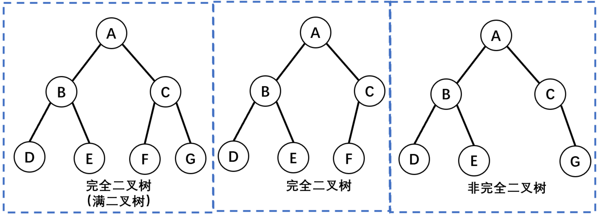
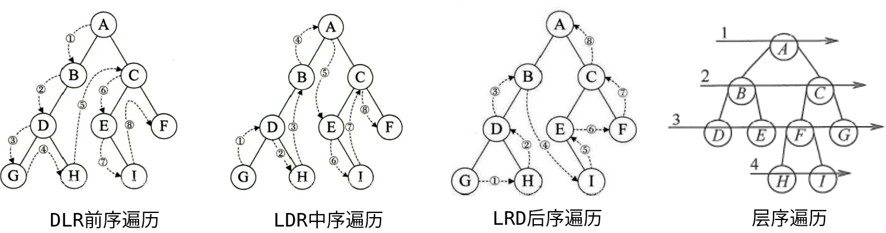

# 复杂度分析

- 算法：有限的操作序列。

- 算法的五大特性：有穷性、确定性、可行性、输入、输出。

- 好算法的目标要求：正确性、可读性、健壮性、高效率、低存储量。

| 算法复杂度           | 说明                   |
| -------------------- | ---------------------- |
| 时间复杂度<br />T(n) | 执行语句的总步数       |
| 空间复杂度<br />O(n) | 算法所需存储空间的量度 |

| 渐近符号 | 说明 |
| -------- | ---- |
| Θ        |      |
| O        |      |
| ω        |      |
| o        |      |

# 数据结构

## 线性结构

- 线性表（线性结构）：数据元素之间存在一对一的线性关系，包括数组、队列、链表、栈。

| 对比   |                     顺序表（数组）                      |                     链表                     |
| ------ | :-----------------------------------------------------: | :------------------------------------------: |
| 存储   |                        顺序存储                         |                   链式存储                   |
| 连续性 | 顺序表中的存储元素是连续的 <br />（一组连续的内存单位） |        链表中的存储元素不一定是连续的        |
| 元素   |                            -                            | 元素节点中存放数据元素以及相邻元素的地址信息 |

- 非线性结构：二维数组、多维数组、广义表、树、图。

### 数组 Array

- 数组（顺序表）：用一段地址连续的存储单元依次存储线性表的数据元素。

> 内存的碎片化问题。

- 设顺序表的每个元素占用m个存储单元，则第$a_i$个元素的存储地址为：（与第$a_1$个元素的存储位置关系）

$$
LOC(a_i) = LOC(a_1) + ( a_i - a_1 ) * m
$$

- 随机存取结构：只要确定了顺序表的起始地址（基地址），计算任意一个元素的存储地址的时间是相同的。

#### 稀疏数组

- 一个数组中大部分元素为０，或同一个值时（大多数的数据是重复的、无意义的），应该转换为稀疏数组。

- 稀疏数组记录数组一共有几行几列，有多少个不同的值，并把具有不同值的元素的行、列、值记录在一个小规模的数组。

  


### 链表 Link

- 链表：链式存储，以节点的方式存储，用一组任意的存储单元存放线性表，链表的各个节点不一定是连续存储，逻辑次序和物理次序不一定相同。

> **静态链表、动态链表**
>
> - 静态链表：数组存放链表。
> - 动态链表：额外创建expend()方法，动态扩展数组长度。

#### 单向链表

 

| 节点域 | 存储               |
| ------ | ------------------ |
| data   | 数据               |
| next   | 下一个节点的引用。 |

| 节点   | 说明                                                         |
| ------ | ------------------------------------------------------------ |
| 头节点 | 保存头引用。<br />第一个元素节点之前附加一个类型相同的节点。 |
| 头引用 | 指向头节点的存储地址。                                       |
| 尾节点 | 保存尾标志，最后一个节点。                                   |
| 尾标志 | 终端节点的引用域为空。                                       |

#### 双向链表

 

- 双向链表能够快速确定链表中的前驱节点（保存前驱节点的引用），可以实现当前节点的自我删除，适合频繁的插入删除操作。

> 单向链表需要上一个节点的配合才能实现删除当前节点。

#### 循环链表（约瑟夫环）

- 循环链表：将单链表的终端节点的引用域由空改为指向头节点引用，使得链表头尾相接。

 

> **Josephu 约瑟夫环**
> 设编号为1，2，… ，n的n个人围坐一圈，约定编号为k（1<=k<=n）的人从1开始报数，数到m 的那个人出列，它的下一位又从1开始报数，数到m的那个人又出列，依次类推，直到所有人出列为止，由此产生一个出队编号的序列。
### 栈 Stack

- 栈（Stack）：限制线性表中元素的插入和删除只能在线性表的同一端进行。先进后出（FILO）、后进先出（LIFO）。

| 结构           | 说明           |
| -------------- | -------------- |
| 栈顶（Top）    | 允许插入和删除 |
| 栈底（Bottom） | 固定           |


| 方法   | 操作           |
| ------ | -------------- |
| peek() | 查看栈顶元素   |
| pop()  | 弹出栈顶元素   |
| push() | 向栈中压入元素 |

> 顺序栈 SequentialStack
> 链栈 LinkedStack

#### 双端栈

 

- 两个顺序栈使用一个数组的两端分别存储（顺序栈单向延申）。栈一的栈顶top1为该数组的0下标开始，每次top1++存放新的元素。栈二的栈顶top2为该数组的length-1下标开始，每次top2--存放新的元素 。`top1 == top2 - 1`时，栈满。
- 两个栈相向增长，减少对数组空间的浪费，减少发生上溢的概率：最好一个栈增长时，另一个栈缩短。

```java
public class BothStack {
    char[] bothStack = new char[20];
    int top1 = 0; //stack1的栈顶
    int top2 = bothStack.length - 1; //stack2的栈顶

    public BothStack(int length) {
        bothStack = new char[length];
        this.top1 = 0; //stack1的栈顶
        this.top2 = bothStack.length - 1; //stack2的栈顶
    }

    public void push(char value, int type) {
        //判断是否栈满
        if (top1 == top2 - 1) {
            throw new RuntimeException("栈满");
        }

        //按不同的栈操作
        if (type == 1) {
            bothStack[top1++] = value;
        } else if (type == 2) {
            bothStack[top2--] = value;
        } else {
            throw new RuntimeException("未选择正确的栈");
        }
    }

    public char pop(int type) {
        //按不同的栈操作
        if (type == 1) {
            if (top1 == 0) {
                throw new RuntimeException("stack1栈空");
            }
            return bothStack[--top1];
        } else if (type == 2) {
            if (top1 == bothStack.length - 1) {
                throw new RuntimeException("stack2栈空");
            }
            return bothStack[++top2];
        } else {
            throw new RuntimeException("未选择正确的栈");
        }
    }
}
```

### 队列 Queue

- 队列：先入先出（FIFO）。

| 结构          | 说明                 |
| ------------- | -------------------- |
| 队头（front） | 队头元素的前一个位置 |
| 队尾（rear）  | 队尾元素位置         |

#### 顺序存储结构

##### 顺序队列

> 如果将队头固定在数组下标为0的位置：
>
> - 入队：对数组进行追加，T(n) = O(1)。
> - 出队：对数组下标为0的元素删除，T(n) = O(n)：需要向前移动n-1个元素。

 

- 顺序队列：rear、front属性的增长没有可逆的。

```java
public class ArrayQueue {
    private int maxSize; // 表示数组的最大容量
    private int front; // 队列头
    private int rear; // 队列尾
    private int[] arr; // 模拟队列

    // 创建队列的构造器
    public ArrayQueue(int maxSize) {
        this.maxSize = maxSize;
        arr = new int[maxSize];
        front = -1; // 指向队列头的前一个位置
        rear = -1; // 指向队列最后一个数据
    }

    // 判断队列是否满
    public boolean isFull() {
        return rear == maxSize - 1;
    }

    // 判断队列是否为空
    public boolean isEmpty() {
        return rear == front;
    }

    // 添加数据到队列
    public void addQueue(int value) {
        if (isFull()) {
            System.out.println("队列满！！！");
            return;
        }
        rear++; // rear后移
        arr[rear] = value;
    }

    // 获取队列的数据，出队列
    public int getQueue() {
        // 判断队列是否空
        if (isEmpty()) {
            // 通过抛出异常
            throw new RuntimeException("队列为空");
        }
        // front后移
        return arr[++front];
    }

    // 遍历
    public void showQueue() {
        if (isEmpty()) {
            System.out.println("队列空！！！");
            return;
        }
        for (int i : arr) {
            System.out.printf("arr[%d]=%d\n", i, arr[i]);
        }
    }

    // 显示队列的头，并不取出
    public int headQueue() {
        if (isEmpty()) {
            throw new RuntimeException("队列空！！！");
        }
        return arr[front];
    }
}
```

##### 循环队列

| 指针  | 说明                                       |
| ----- | ------------------------------------------ |
| front | 队头，初始值=0                             |
| rear  | 队尾，空出一个空间做为约定，rear的初始值=0 |

- 队满：$(rear+1) \% M = front \% M$。

- 队空：$rear==front$。

- 队中有效数据的个数：$(rear+M-front) \% M$。

- 循环增长：对rear和front的取模操作，解决假溢出。

  - `rear = (rear + 1) % maxSize;`

  - `front = (front + 1) % maxSize;`

> 假溢出：数组空间发生上溢，但数组的低端还有空闲空间。

```java
//使用数组模拟队列
public class CircleArrayQueue {
    private int M; // 表示数组的最大容量
    private int front; // 队列头
    private int rear; // 队列尾
    private int[] arr; // 模拟队列

    // 判断队列是否满
    public boolean isFull() {
        return (rear + 1) % M == front % M;
    }

    // 判断队列是否为空
    public boolean isEmpty() {
        return rear == front;
    }

    // 添加数据到队列
    public void addQueue(int value) {
        if (isFull()) {
            System.out.println("队列满！！！");
            return;
        }
        
        arr[rear] = value;
        // 将rear后移 考虑取模，防止数组越界
        rear = (rear + 1) % M;
    }

    // 获取队列的数据，出队列
    public int getQueue() {
        // 判断队列是否空
        if (isEmpty()) {
            // 通过抛出异常
            throw new RuntimeException("队列为空");
        }
        
        int value = arr[front];
        // front 后移
        front = (front + 1) % M;
        return value;
    }

    // 遍历 从front开始遍历
    public void showQueue() {
        if (isEmpty()) {
            System.out.println("队列空！！！");
            return;
        }

        // 求出当前队列有序数据的个数 (rear + M -front) % M
        // 在经过多次使用后，front的值很可能以及超过M，所以需要取模 int i = front % M
        for (int i = front % M; i < front + ((rear + M - front) % M); i++) {
            System.out.printf("arr[%d]=%d\n", i, arr[i]);
        }
    }

    // 显示队列的头，并不取出
    public int headQueue() {
        if (isEmpty()) {
            throw new RuntimeException("队列空！！！");
        }
        return arr[front];
    }
}
```

#### 链式存储结构

- 无序添加的单向链表。

 

```java
public class LinkedQueue<T> {

    private Node front; //队头
    private Node rear; //队尾

    public LinkedQueue() {
        front = rear = new Node();
    }

    /**
     * 判断队列空
     *
     * @return true-空
     */
    public boolean isEmpty() {
        return rear == front;
    }

    /**
     * 入队
     *
     * @param element 结点的数值域data
     */
    public void enQueue(T element) {
        Node node = new Node(element);
        rear.setNext(node);
        rear = node;
    }

    /**
     * 出队
     *
     * @return 出队结点的数值域data
     */
    public T deQueue() {
        if (isEmpty()) {
            throw new RuntimeException("队列空");
        }
        Node<T> headNode = front.getNext();
        front.setNext(headNode.getNext());
        if (headNode.getNext() == null)
            rear = front;
        return headNode.getData();
    }

    /**
     * 查看队头
     * @return 队头结点的数值域data
     */
    public T getHead() {
        if (isEmpty())
            throw new RuntimeException("队列空");
        Node<T> head = front.getNext();
        return head.getData();
    }
    
    class Node<T> {
        private T data;
        private Node next;

        public Node() {

        }

        public Node(T data) {
            this.data = data;
        }

        public T getData() {
            return data;
        }

        public void setData(T data) {
            this.data = data;
        }

        public Node getNext() {
            return next;
        }

        public void setNext(Node next) {
            this.next = next;
        }
    }
}
```

#### 双端队列

- 双端队列：允许在队列的两端进行插入和删除操作。

> 二进一出队列：允许在两端插入，但只允许在一端删除。
>
> 一进二出队列：只允许在一端插入，允许在两端删除。

## 散列结构

### 集合

### 映射

### BitMap

## 树

- 树是n个结点的有限集合。

1. 树有且只有一个根结点（一个结点也可以是树）。
2. 每个结点只有一个父结点。
3. 一个结点可以有多个子结点（子树）。

| 术语       | 说明                                                         |
| ---------- | ------------------------------------------------------------ |
| 度         | 结点的度：某结点拥有子树的个数。<br />树的度：各结点度的最大值。 |
| 结点       | 叶子结点（终端结点）：度为0的结点。 <br />分支结点：度不为0的结点。 |
|            | 孩子结点：某结点的子树的根结点。 <br />双亲结点。 <br />兄弟结点：具有同一个双亲的孩子结点。 |
| 祖先、子孙 | 若从结点x到结点y存在一条路径，则：<br />结点x是结点y的祖先；<br />结点y是结点x的子孙。 |
| 路径       | 路径长度：路径上经过的边数。                                 |
| 结点的层数 | 根结点的层数为1。                                            |
| 树的深度   | 树中所有结点的最大层数。                                     |
| 树的宽度   | 树中每一层结点个数的最大值。                                 |

1. 树中的结点数等于所有结点的度数加1。任意一棵树，若结点数量为n，则边的数量为n-1。
2. 度为m的树中第i层上至多有$m^{(i − 1)}$个结点（i >= 1）。
3. 高度为h的m叉树至多有$ \frac{(m^h-1)}{(m-1)}$个结点。
4. 具有n个结点的m叉树的最小高度为$\log^{n(m−1)+1}_m$。

### 结点结构

#### 双亲表示法

- 双亲表示法：假设以一组连续空间存储树的结点，同时在每个结点中，附设一个指示器指示其双亲结点到链表中的位置。

| 结构            | 说明                                                         |
| --------------- | ------------------------------------------------------------ |
| Node[] nodeList | 存储的连续空间，存放树的结点                                 |
| Node node       | 树结点<br />data：数据域<br />parent：指针域，指向该结点的双亲在nodeList中的下标 |

 

#### 孩子表示法

- 孩子表示法：把每个结点的孩子结点排列起来，以单链表作存储结构，则n个结点有n个孩子链表，如果是叶子结点则此单链表为空。然后n个头指针又组成一个线性表，采用顺序存储结构，存放进一个一维数组中。

| 结构                      | 说明                                                         |
| ------------------------- | ------------------------------------------------------------ |
| 表头数组 Head[] childList | 存放表头结点                                                 |
| 表头结点 Head             | data：数据域，存放孩子结点的数据信息 <br />firstChild：头指针域，指向存储该结点的孩子结点的头指针 |
| 孩子结点 Child            | child：孩子链表的孩子结点（表头数组中的索引）<br />next：指向该结点的下一个孩子结点的指针 |

  

#### 孩子兄弟表示法

 

### 二叉树

- 二叉树是有序树，有左右子树之分，一个结点最多有两个子结点。

| 二叉树     | 图示                                                         |
| ---------- | ------------------------------------------------------------ |
| 斜树       |  |
| 满二叉树   |  |
| 完全二叉树 |  |


1. 非空二叉树上的叶子结点（度为0）数等于度为2的结点数加1：$n_0 = n_2 + 1$。

> 设n为树的总结点数，$n_0$为度为0的结点数，$n_1$为度为1的结点数，$n_2$为度为2的结点数
> $$
> \begin{matrix}
> 结点：& n = n_0 + n_1 + n_2 \\
> 分支：& n - 1 = n_1 + 2 \times n_2
> \end{matrix}
> $$
> 分支：
>
> - 从进入的角度：只有根结点没有入边，故分支数为 n - 1。
> - 从出发的角度：度为2的结点发出2条分支，故$2n_2$；度为1的结点发出1条分支，故$n_1$。

2. 非空二叉树上第k层上至多有 $2^{k-1}，( k \ge 1 )$ 个结点。
3. 深度为k的二叉树至多有$2^k - 1，( k \ge 1 )$个结点。 

>- 至多：假设该树为满二叉树。
>
>- 二叉树第1层：只有一个根结点。

**满二叉树**

- 所有分支结点都存在左子树和右子树，且所有的叶子节点都处于最底层。（只有度为0和2的结点）满二叉树的每层都含有最多的结点，若高度为h，则有$2^h-1$个结点。
- 对满二叉树按层序编号，从根结点（编号1）自上而下，自左向右。对于编号为i的结点：若有双亲，则其双亲编号$\frac{i}{2}$；若有左孩子，则左孩子编号$2i$；若有右孩子，则右孩子编号$2i+1$。

**完全二叉树**

- 对一棵具有n个结点的二叉树按层序编号，编号为i的结点与（该二叉树同样深度的）满二叉树中编号为i的结点在二叉树中的位置完全相同。
1. 深度为k的完全二叉树在第k-1层是满二叉树。（$满二叉树 \subseteq 完全二叉树$
2. 叶子结点只可能在层次最大的两层上出现，且最大层次中的叶子结点都集中在该层左侧连续的位置。
3. 若有度为1的结点，则只可能有一个，且该结点只有左孩子而无右孩子。 
4. 按层序编号后，如果编号为i的结点为叶子结点或其只有左孩子，则编号大于i的结点均为叶子结点。
5. 若n为奇数，则每个分支结点都有左孩子和右孩子；若n为偶数，则编号最大（$\frac{n}{2}$）的分支结点只有左孩子，没有右孩子。

6. 具有n( n > 0 )个结点的完全二叉树的深度为$\lfloor \log_{2}^{n} \rfloor + 1$。

> 设具有n个结点的完全二叉树的深度为k：
> $$
> \begin{matrix}
> & 2^{k-1} \le n \lt 2^k \\
> 取对数：& k-1 \le \log_2^n \lt k \\
> 即：& \log_2^n \lt k \le \log_2^n + 1
> &
> \end{matrix}
> $$

7. 对完全二叉树按层序编号，对结点i则有以下关系:
   1. i > 1：结点i的双亲的编号为$\lfloor \frac{i}{2} \rfloor$，否则该结点为根结点。
      - i为偶数：双亲的左孩子。
      - i为奇数：双亲的右孩子。
   2. $2i \le n$：结点i 的左孩子编号为$2i$,，否则无左孩子。
   3. $2i+1 \le n$：结点i的右孩子编号为$2i + 1$，否则无右孩子。

 

> 

#### 二叉树遍历

| 遍历方式     | 说明                                                         |
| ------------ | ------------------------------------------------------------ |
| 先序遍历 DLR |  |
| 中序遍历 LDR |  |
| 后序遍历 LRD |  |
| 层次遍历     |  |

```java
void DLRTree(BinarySortTreeNode node) {
    if (node != null) {
        treeNodeData(node);//输出
        DLRTree(node.left);
        DLRTree(node.right);
    }
}

void LDRTree(BinarySortTreeNode node) {
    if (node != null) {
        LDRTree(node.left);
        treeNodeData(node);//输出
        LDRTree(node.right);
    }
}

void LRDTree(BinarySortTreeNode node) {
    if (node != null) {
        LRDTree(node.left);
        LRDTree(node.right);
        treeNodeData(node);//输出
    }
}

public void levelTree(BinarySortTreeNode node) {
    //需要使用队列辅助
    BinarySortTreeNode curNode;
    BinarySortTreeNode[] nodeQuery = new BinarySortTreeNode[MAXLEN];
    int head = 0, tail = 0;

    //先判断树是否为空
    if (node != null) {
        tail = (tail + 1) % MAXLEN;
        nodeQuery[tail] = node;
    }
    while (head != tail) {
        head = (head + 1) % MAXLEN;
        curNode = nodeQuery[head];

        treeNodeData(curNode);//输出

        //如果当前结点存在子树
        if (curNode.left != null) {
            tail = (tail + 1) % MAXLEN;
            nodeQuery[tail] = curNode.left;
        }
        if (curNode.right != null) {
            tail = (tail + 1) % MAXLEN;
            nodeQuery[tail] = curNode.right;
        }
    }
}
```

##### 二叉树的确定

- 先序排列（DLR）、后序排列（LRD）：确定各层级的根结点。
- 中序排列（LDR）：确定结点的左右子树之分。

> 求先序序列( ABCDEFGHI)和中序序列( BCAEDGHFI）所确定的二叉树：
>
> 1. 图a：
>
>    1. 由先序遍历：确定第一层的根结点为A；
>
>    2. 在1.1的基础上，由中序遍历确定BC为A的左子树一侧，而EDGHFI为A的右子树一侧。
>
>     
>
> 2. 图b：
>
>    1. 在图a的基础上，由先序遍历确定：
>       - B是A的左子树、即C的双亲结点。
>       - D是A的右子树、即EFGHI的双亲/祖先结点。
>    2. 在2.1的基础上，由中序遍历确定：
>       - C是B的右子树。
>       - E是D的左子树，GHFI在D的右子树一侧。
>
>     
>
> 3. 图c：
>
>    1. 在图b的基础上，由先序遍历确定：
>       - F是D的右子树、即GHI的双亲/祖先结点。
>    2. 在3.1的基础上，由中序遍历确定：
>       - GH在F的左子树一侧。
>       - I是F的右子树。
>
>     
>
>    3. 最后确定H是G的右子树。
>
>  

### 森林

- 森林是m棵互不相交的树的集合。

**树转为二叉树**

1. 为树中的所有相邻的兄弟结点之间加线。
2. 保留根结点和第一个子结点的连线，去除根结点与其他子结点的连线。
3. 层次调整：
   - 树的前序遍历等于二叉树的前序遍历
   - 树的后序遍历等于二叉树的中序遍历

**森林转二叉树**

1. 将森林的每棵树转为二叉树。
2. 第一棵二叉树保持不变，从第二棵二叉树开始，移除将后一棵二叉树的根结点作为前一棵二叉树的根结点的右子树。
3. 层次调整：
   - 森林的前序遍历等于二叉树的前序遍历
   - 森林的后序遍历等于二叉树的中序遍历

- 森林中树的兄弟结点--->二叉树中父结点的左孩子的右孩子结点、或左孩子的孩子的孩子结点。

**二叉树转树/森林**

1. 若该结点是其父结点的左结点，则将其右结点、右结点的子右结点……与其父结点相连。
2. 删除二叉树中所有的父结点与右结点的连线。
3. 层次调整。

### 二叉排序树

- 从任意结点开始，左子树结点值总比右子树值要小（`左子树结点值<根结点值<右子树结点值`），中序遍历（LDR）可以得到一组有序（从小到大）的数值。

### 平衡二叉树

- 平衡二叉树上任一结点的左子树和右子树的深度之差不超过1。
- 平衡因子BF：将二叉树上结点的左子树深度减去右子树深度的值。只要二叉树上有一个结点的平衡因子的绝对值大于1，则该二叉树就是不平衡的

#### 最小不平衡子树

- 在平衡二叉树的构造过程中以距离插入结点最近的且平衡因子绝对值大于1的结点为根的子树。

- 扁担原理：将根结点（支撑点）从A改为B。

```java
Node temp = root; //暂存A结点
root = root.left; //将B结点（A结点的左子树）设为根结点
temp.left = root.right; //将A结点的左子树设为B结点的右子树
root.right = temp; //将A结点设为B结点的右子树
```

| 平衡调整 | 说明                                                         |
| -------- | ------------------------------------------------------------ |
| LL型     | 新插入的结点在结点A的左子树的左子树上。<br /> |
| RR型     |  |
| LR型     | 两次旋转操作，先左旋转后右旋转。先将A结点的左孩子B的右子树的根结点C向左上旋转提升到B结点的位置（即进行一次RR平衡旋转(左单旋转)），然后再把该C结点向右上旋转提升到A结点的位置（即进行一次LL平衡旋转(右单旋转)）。<br /> |
| RL型     | 两次旋转操作，先右旋转后左旋转。先将A结点的右孩子B的左子树的根结点C向右上旋转提升到B结点的位置（即进行一次LL平衡旋转(右单旋转)），然后再把该C结点向左上旋转提升到A结点的位置（即进行一次RR平衡旋转(左单旋转)）。<br /> |

### 最优二叉树（哈夫曼树）

- 二叉树的带权路径长度WPL：从根结点到各个叶子结点的路径长度与相应叶子结点权值的乘积之和：

$$
WPL = \sum_{i=1}^nw_il_i
$$

- 哈夫曼树：带权路径长度最小的二叉树。
   - 使权值越大的叶子结点越靠近根结点，且不存在度为1的结点。 

1. 由给定的n个权值的{$w_1,w_2,_w_3,...,w_n$}，构成n棵只有根结点的二叉树集合F={$T_1,T_2,..,T_n$}，其中每棵二叉树$T_i$中只有一个带权为$w_i$的根结点，其左右子树均为空。
2. 在二叉树集合F中选取两棵根结点的值最小的树，作为左右子树以构造一棵新的二叉树，新二叉树的根结点的权值为这两棵二叉树的权值之和。
3. 在二叉树集合F中删除这两棵二叉树，并将新得到的二叉树加入到集合F中。
4. 重复2、3步，直至集合F中只剩下一棵二叉树，即为哈夫曼树。

```java
public class HuffmanTree {
    private HuffmanTreeNode root;
    List<HuffmanTreeNode> nodes;

    public HuffmanTree() {
        this.nodes = null;
    }

    public HuffmanTree(List<HuffmanTreeNode> nodes) {
        this.nodes = nodes;
    }

    public void createTree() {
        Queue<HuffmanTreeNode> queue = new PriorityQueue<>(new Comparator<HuffmanTreeNode>() {
            @Override
            public int compare(HuffmanTreeNode o1, HuffmanTreeNode o2) {
                return o1.value - o2.value;
            }
        });
        queue.addAll(nodes);

        while (!queue.isEmpty()) {
            HuffmanTreeNode n1 = queue.poll();
            HuffmanTreeNode n2 = queue.poll();
            HuffmanTreeNode parent = new HuffmanTreeNode(n1.value + n2.value, n1, n2);
            if (queue.isEmpty()) {
                root = parent;
                return;
            }
            queue.add(parent);
        }
    }

    public int getWeight() {
        Queue<HuffmanTreeNode> queue = new ArrayDeque<>();
        queue.add(root);
        int weight = 0;
        while (!queue.isEmpty()) {
            HuffmanTreeNode curNode = queue.poll();
            if (curNode.left != null) {
                curNode.left.deep = curNode.deep + 1;
                curNode.right.deep = curNode.deep + 1;
                queue.add(curNode.left);
                queue.add(curNode.right);
            } else {
                weight += curNode.deep * curNode.value;
            }
        }
        return weight;
    }
}

class HuffmanTreeNode {
    int value;
    HuffmanTreeNode left;
    HuffmanTreeNode right;
    int deep;

    public HuffmanTreeNode(int value) {
        this.value = value;
        this.deep = 0;
    }

    public HuffmanTreeNode(int value, HuffmanTreeNode left, HuffmanTreeNode right) {
        this.value = value;
        this.left = left;
        this.right = right;
    }
}
```

#### 哈夫曼编码

- 哈夫曼编码：通过数据出现的频率来分配权重，并由该权重来构建哈夫曼树。
  - 0和1究竟是表示左子树还是右子树没有明确规定。左、右孩子结点的顺序是任意的，所以构造出的哈夫曼树并不唯一，但各哈夫曼树的带权路径长度WPL相同且为最优。此外，如有若干权值相同的结点，则构造出的哈夫曼树更可能不同，但WPL必然相同且是最优的。


>有一段文字内容为“ BADCADFEED”要网络传输给别人：
>
>1. 如果使用二进制数据表示：
>
> 
>
>- 这样按照固定长度编码编码后就是“001000011010000011101100100011“，按每3位来译码。
>
>2. 使用哈夫曼树时：
>
>- 假设六个字母的频率为A 27,B 8,C 15,D 15,E 30,F 5；按权值百分比来分配，并重新按照赫夫曼树来规划它们。
>- 左图为构造赫夫曼树的过程的权值显示。右图为将权值左分支改为0，右分支改为1后的赫夫曼树
>
> 
>
>- 原编码二进制串: 000011000011101100100011 (共 30个字符)
>- 新编码二进制串: 10100101010111100(共25个字符)
>- 数据被压缩，节省了空间。

- 前缀编码：不等长编码必须满足任一个字符的编码都不是另一个字符的编码的前缀。
  - 可以得出一个小结论：哈夫曼编码的字符在哈夫曼树中的位置只能是叶子结点、叶子结点一定代表哈夫曼编码的字符。即：$n_0 = 哈夫曼编码的字符数$。

> 非法的哈夫曼编码：不满足前缀编码的：{ 0, 00, 01, 10, 11}。
>
>  
>
> - 其中：0代表的字符是00、01的字符编码的前缀，故不满足前缀编码。

```java
package tree;

import java.util.PriorityQueue;

public class HuffmanCode {

    public static void main(String[] args) {
        HuffmanCode huffmanCode = new HuffmanCode();
        PriorityQueue<Node> queue = new PriorityQueue<>();
        queue.add(new Node(15, 'D'));
        queue.add(new Node(27, 'A'));
        queue.add(new Node(5, 'F'));
        queue.add(new Node(8, 'B'));
        queue.add(new Node(15, 'C'));
        queue.add(new Node(30, 'E'));
        huffmanCode.init(queue);
        huffmanCode.DLR(huffmanCode.root);

    }

    Node root;

    /**
     * 依据传入PriorityQueue的Data的weight值来创建哈夫曼树
     *
     * @param queue 创建哈夫曼树的结点
     */
    public void init(PriorityQueue<Node> queue) {
        //只要queue非空就继续添加
        while (!queue.isEmpty()) {
            Node left = queue.poll();
            Node right = queue.poll();
            //父结点
            Node parent = new Node(left, right, left.weight + right.weight);
            //如果队列中没有结点
            if (queue.isEmpty()) {
                root = parent;
                return;
            }
            //将当前的父结点加入到Queue中重新排序
            queue.add(parent);
        }
    }

    public void DLR(Node node) {
        if (node != null) {
            System.out.print(node.characteristic);
            DLR(node.left);
            DLR(node.right);
        }
    }

    //将哈夫曼树变为二进制串
//    public String unCoding() {
        //1.获得编码的顺序
        //2.
//    }
}

class Node implements Comparable {
    Node left;
    Node right;
    int weight; //频率百分比 权值
    char characteristic;

    public Node() {
    }

    public Node(Node left, Node right, int weight) {
        this.left = left;
        this.right = right;
        this.weight = weight;
    }

    public Node(int weight, char characteristic) {
        this.weight = weight;
        this.characteristic = characteristic;
    }

    @Override
    public int compareTo(Object o) {
        if (!(o instanceof Node))
            throw new RuntimeException("不是同一个类型");

        Node node = (Node) o;
        return this.weight - node.weight;
    }
}
```

### 字典树（前缀树）

- 字典树（Trie树、前缀树）利用字符串的公共前缀来减少查询时间，最大限度地减少无谓的字符串比较，查询效率比哈希树高。首先看单词的第一个字母是不是在字典的第一层。如果不在，说明字典树里没有该单词；如果在，就在该字母的孩子结点里找是不是有单词的第二个字母，没有说明没有该单词，有的话用同样的方法继续查找。

> 典型用于统计、排序、和保存大量字符串，经常被搜索引擎系统用于文本词频统计。

1. 根结点不包含字符，除了根结点每个结点都只包含一个字符。（为了能够包括所有字符串）
2. 从根结点到目标结点所经过的所有字符都串起来目标结点对应的字符串。
3. 每个结点的子结点字符不同，使得每个单词、字符都是唯一的。

 


```java
class Trie {
    private TrieNode root;

    public Trie() {
        root = new TrieNode();
        root.worldEnd = false;
    }

    public void insert(String word) {
        TrieNode node = root;
        for (int i = 0; i < word.length(); i++) {
            Character character = word.charAt(i);
            //如果当前结点没有包含相关的后缀，则设置并获取该字符
            if (!node.childdren.containsKey(character)) {
                node.childdren.put(character, new TrieNode());
            }
            node = node.childdren.get(character);
        }
        node.worldEnd = true;
    }

    //全词匹配
    public boolean search(String word) {
        TrieNode node = root;
        boolean found = true;
        for (int i = 0; i < word.length(); i++) {
            Character character = word.charAt(i);
            if (!node.childdren.containsKey(character)) {
                return false;
            }
            node = node.childdren.get(character);
        }
        return found && node.worldEnd;
    }

    //前缀匹配
    public boolean starWith(String prefix) {
        TrieNode node = root;
        boolean found = true;
        for (int i = 0; i < prefix.length(); i++) {
            Character character = prefix.charAt(i);
            if (!node.childdren.containsKey(character)) {
                return false;
            }
            node = node.childdren.get(character);
        }
        return found;
    }
}

class TrieNode {
    Map<Character, TrieNode> childdren;
    boolean worldEnd;

    public TrieNode() {
        childdren = new HashMap<>();
        worldEnd = false;
    }
}
```

### 线索二叉树

### B树

#### B-tree

#### B+tree

#### B*tree

### 红黑树

## 图

- 图(Graph)是由 **顶点的有穷非空集合V ( G )** 和顶点之间 **边的集合E ( G )** 组成：G = ( V , E ) 。

> G表示图，V是图G中顶点的集合，E是图G中边的集合。

| 结构   | 说明                 |
| ------ | -------------------- |
| 顶点 V |                      |
| 边 E   | 边可以有方向（关系） |
| 路径   | 一组顶点和边的组合   |

| 图的类型 | 说明                                                         |
| -------- | ------------------------------------------------------------ |
| 有向图   | 边是有方向的，E中的元素是有序的<br /> |
| 无向图   | 边是没有方向的，E中的元素是无序的                            |

| 图类型 | 说明                                                         |
| ------ | ------------------------------------------------------------ |
| 简单图 | 不存在重复边<br />不存在顶点到自身的边                       |
| 多重图 | 图中某两个结点之间的边数多于一条<br />允许顶点通过同一条边和自己关联（即存在自环和平行）<br /> |

| 完全图<br />（简单完全图） | 说明                                                         |
| -------------------------- | ------------------------------------------------------------ |
| 无向完全图                 | 任意两个顶点之间都存在边。<br />n个顶点，$\frac{n(n-1)}{2}$条边。 |
| 有向完全图                 | 任意两个顶点之间都存在互为相反的两条弧。<br />n个顶点，$n(n-1)$条边。<br /> |

- 子图：设G(V,E)、G'(V',E')，V'是V的子集，E'是E的子集，则G'是G的子图。并非V和E的任何子集都能构成G的子图，有可能不是图，即E的子集中的某些边关联的顶点可能不在这个V的子集中。
- 若有满足V(G')=V(G)，则称该子图为G的生成子图。

| 图相关     | 说明                                                         |
| ---------- | ------------------------------------------------------------ |
| 邻接、依附 | 对于任意两个顶点$v_i、v_j$，若存在边$(v_i，v_j)$<br />无向图，顶点$v_i、v_j$互为邻接点（adjacent）。<br />有向图，顶点$v_i$邻接到顶点$v_j$（顶点$v_j$是顶点$v_i$的邻接点），且弧$<v_i，v_j>$依附于顶点$v_i、v_j$。 |
| 度         | 无向图，顶点v的度：依附于该顶点的边的条数（$TD(v)_{无向图} = 2E$）。 |
| 入度、出度 | 有向图，入度(弧头)：以顶点v为终点的有向边的数目：$ID(v)$。 出度(弧尾)：以顶点v为起点的有向边的数目：$OD(v)$。<br /> |
| 权、网     | 权重：在一个图中，每条边都可以标上具有某种含义的数值。<br />网：带权图。 |
| 路径       | 顶点Vp到顶点Vq之间的一条路径：（$ V_p,V_{i1},...,V_{im},V_{q} $）。<br />路径长度：路径上边的数目。<br />简单路径：在路径序列中，顶点不重复出现的路径。 |
| 回路（环） | 第一个顶点和最后一个顶点相同的路径。<br />若一个图有n个顶点，并且有大于n-1条边，则此图一定有环。<br />简单回路：除第一个顶点和最后一个顶点外，其余顶点不重复出现的回路。 |
| 距离       | 从顶点u出发到顶点v的最短路径的长度。<br />若从u到v根本不存在路径，则记该距离为无穷。 |

> 有向树：一个顶点的入度为0，其余顶点的入度均为1的有向图。

- 稀疏图的判断条件：$|E| < |V|\log_2^{|V|}$。

| 连通                     |                                                              |
| ------------------------ | ------------------------------------------------------------ |
| 连通图<br />（无向图）   | 连通：无向图中，若从顶点v到顶点w有路径存在。 <br />连通图：若图G中任意两个顶点都是连通的，则称图G为连通图，否则称为非连通图。若一个图有n个顶点，并且边数小于n − 1，则此图必是非连通图。<br />连通分量：极大连通子图是无向图的连通分量，要求该连通子图包含其所有的边。<br />极小连通子图：既要保持图连通又要使得边数最少的子图。<br /> |
| 强连通图<br />（有向图） | 强连通：有向图中，若从顶点v到顶点w、从顶点w到顶点v都有路径存在。<br />强连通图：图中任意两个顶点都是强连通的。<br />强连通分量：有向图的极大强连通子图。 |

| 连通子图                       | 说明                                                         |
| ------------------------------ | ------------------------------------------------------------ |
| 极大连通子图<br />（连通分量） | 1. 连通图只有一个极大连通子图，就是它本身。<br/>2. 非连通图有多个极大连通子图。<br/>   - 非连通图的极大连通子图叫做连通分量，每个分量都是一个连通图。<br/>3. 如果此时加入任何一个不在 图的点集 中的点都会导致它不再连通。 |
| 极小连通子图<br />（生成树）   | 1. 连通图的生成树是包含图中全部顶点的一个极小连通子图，而同一个连通图可以有不同的生成树。（极小连通子图只存在于连通图中）（只要能连通图的所有顶点而又不产生回路的任何子图都是它的生成树）<br/>2. 若图中顶点数为n，则它的生成树含有n-1条边，若砍去它的一条边，则会变成非连通图，若加上一条边则会形成一个回路。<br />3. 生成森林：在非连通图中，连通分量的生成树构成了非连通图的生成森林。 |

### 图的实现

#### 邻接表

- 边表：对图G中的每个顶点V建立一个单链表，第i个单链表中的结点表示依附于顶点$V_i$的边。
  - 出边表：对于有向图：是以$V_i$为尾的弧。

| 结点       | 域                                                           |
| ---------- | ------------------------------------------------------------ |
| 顶点表结点 | data：顶点域 <br />firstarc：指向第一条邻接边的指针域        |
| 边表结点   | adjvex：邻接点域<br />nextarc：指向下一条邻接边的指针域 <br />weight：权值信息的数据域 |

 

 

1. 所需的存储空间：（稀疏图：采用邻接表以节省存储空间）
   - 无向图：$O(|V|+2|E|)$。
   - 有向图：$O(∣V∣+∣E∣)$。
2. 找出顶点的所有邻边：
   - 邻接表：只需要读取该结点的邻接表。
   - 邻接矩阵：需要扫描一行，花费的时间为$O(n)$。

> 若要确定给定的两个顶点间是否存在边：
>
> - 邻接矩阵中可以立刻查到。
> - 邻接表中则需要在相应结点对应的边表中查找另一结点，效率较低。

3. 有向图的邻接表：求一个给定顶点的出度只需计算其邻接表中的结点个数，但求其顶点的入度则需要遍历全部的邻接表。
   - 逆邻接表：加速求解给定顶点的入度。
4. 图的邻接表表示并不唯一，因为在每个顶点对应的单链表中，各边结点的链接次序可以是任意的，它取决于建立邻接表的算法及边的输入次序。

```java
/**
 * 1. 定义一个Node[] 数组，用来存放这几条链表
 * 2. 每个链表的头存放在该数组中，并且链表中的每一个结点均是表示和头结点存在边（而不是路径）
**/
public class AdjacencyList {

    class VexNode {
        public char data; //数值
        public EdgeNode firstEdge = null; //边
    }

    class EdgeNode {
        public EdgeNode preEdge = null; //前一个边
        public EdgeNode nextEdge = null; //后一个边
        public VexNode vex = null; //终点

    }

    private VexNode[] list = new VexNode[5];

    public void init(int nodeNumber) {}
}
```

##### 十字链表

- 将邻接表（以入边连接）和逆邻接表（以出边连接）结合。

**结构为：**

- 顶点表结点结构为：数据域data、入边表头指针firstIn、出边表头指针firstOut
- 边表结点结构为：弧起点在顶点表的下标tailVex、弧终点在顶点表的下标headVex、入边表指针域headLink（指向终点相同的下一条边）、出边表指针域tailLink（指向启点相同的下一条边）、权值域weight（可选）

 

```java
public class CrossLinkedList {
    //顶点表结点
    class VexNode {
        int data;
        EdgeNode firstIn;
        EdgeNode firstOut;
    }

    //边表结点
    class EdgeNode {
        VexNode tailVex;
        VexNode headVex;
        EdgeNode headLink;
        EdgeNode tailLink;
        int weight = -1; //权值
    }

    VexNode[] list = null; //存放顶点的数组

    public void creat(int number) {}
}
```

##### 邻接多重表

 

 

```java
public class DoubelLinkedList {
    class VexNode {
        int data;
        EdgeNode firstOut;
    }

    class EdgeNode {
        VexNode headVex;
        VexNode tailVex;
        EdgeNode headLink;
        EdgeNode tailLink;
    }

    VexNode[] list = null;

    public void create(int number) {}
}
```

#### 邻接矩阵

- 邻接矩阵(Adjacency Matrix) ：一个一维数组存储图中顶点信息，一个二维数组(邻接矩阵)存储图中的边或弧的信息。

 

```java
class GraphMatrix {
    static final int MAXNUM = 20; //最大顶点数
    static final int MAXVALUE = 65535; //权值总和最大值
    char[] vertex = new char[MAXNUM];//保存顶点数据
    int graphType; //图的类型：0无向图，1有向图
    int vertexNum; //顶点数量
    int edgeNum; //边数量
    int[][] edgeWeight = new int[MAXNUM][MAXNUM];//保存顶点的边信息
    int[] isTrav = new int[MAXNUM];//遍历标识
}
```

##### 边集数组

| 边集数组（一维数组） | 说明                                                         |
| -------------------- | ------------------------------------------------------------ |
| 顶点数组             | 存储顶点的信息                                               |
| 边数组               | 存储边的信息<br />每个数据元素由一条边的起点下标(begin)、 终点下标(end)和权(weight)组成 |


 

##### 关联矩阵

### 图的遍历

| 图的表示 | 说明                                                         |
| -------- | ------------------------------------------------------------ |
| 邻接矩阵 | 图的邻接矩阵表示是唯一的<br />基于邻接矩阵的遍历所得到的DFS序列和BFS序列是唯一的。 |
| 邻接表   | 若边的输入次序不同，生成的邻接表也不同<br />基于邻接表的遍历所得到的DFS序列和BFS序列是不唯一的。 |

#### DFS 深度优先遍历

| DFS实现  |                                                              |
| -------- | ------------------------------------------------------------ |
| 邻接矩阵 | $T(n) = O(n^2)$：二维数组，要查找每个顶点的邻接点需要访问矩阵中的所有元素。<br />$S(n) = O(V)$ |
| 邻接表   | $T(n) = O(n+e)$：找邻接点所需的时间取决于顶点和边的数量。<br />$S(n) = O(V)$ |

- 深度优先搜索会产生一棵深度优先生成树：对连通图调用DFS才能产生深度优先生成树，否则产生的将是深度优先生成森林。

```
1. 首先访问图中某一起始顶点v，然后由v出发，访问与v邻接且未被访问的任一顶点w，再访问与w邻接且未被访问的任一顶点…重复上述过程。
2. 当不能再继续向下访问时，依次退回到最近被访问的顶点，若它还有邻接顶点未被访问过，则从该点开始继续上述搜索过程，直至图中所有顶点均被访问过为止。
```

```java
class GraphMatrix {
    static final int MAXNUM = 20; //最大顶点数
    static final int MAXVALUE = 65535; //权值总和最大值
    char[] vertex = new char[MAXNUM];//保存顶点
    int[][] edgeWeight = new int[MAXNUM][MAXNUM];//保存边信息
    int graphType; //图的类型：0无向图，1有向图
    int vertexNum; //顶点数量
    int edgeNum; //边数量
    int[] isTrav = new int[MAXNUM];//遍历标识
}

/**
    * 深度遍历
    *
    * @param graphMatrix
    * @param n           从第n个结点开始
    */
public static void deepTraOne(GraphMatrix graphMatrix, int n) {
    //清除之前遍历的标识
    for (int i = 0; i < graphMatrix.vertexNum; i++) {
        graphMatrix.isTrav[i] = 0;
    }

    graphMatrix.isTrav[n] = 1; //标记该顶点已处理
    System.out.printf("->%c", graphMatrix.vertex[n]);

    //处理结点
    for (int i = 0; i < graphMatrix.vertexNum; i++) {
        if (graphMatrix.edgeWeight[n][i] != GraphMatrix.MAXVALUE && graphMatrix.isTrav[n] == 0) {
            deepTraOne(graphMatrix, i);
        }
    }
}

/**
    * 深度优先遍历
    *
    * @param graphMatrix
    */
public static void deepTraGraph(GraphMatrix graphMatrix) {
    //清除之前遍历的标识
    for (int i = 0; i < graphMatrix.vertexNum; i++) {
        graphMatrix.isTrav[i] = 0;
    }

    System.out.print("深度优先遍历结点：");
    for (int i = 0; i < graphMatrix.vertexNum; i++) {
        if (graphMatrix.isTrav[i] == 0) {
            deepTraOne(graphMatrix, i); //调用深度遍历
        }
    }
    System.out.println();
}
```

#### BFS 广度优先遍历

| BFS实现  | 分层查找，辅助队列记忆正在访问的顶点的下一个顶点             |
| -------- | ------------------------------------------------------------ |
| 邻接表   | $T(n) = O(n+e)$、$S(n) = O(n)$<br />每个顶点均需搜索一次、或入队一次， 在搜索任一顶点的邻接点时，每条边至少访问一次。 |
| 邻接矩阵 | $T(n) = O(n^2)$<br />查找每个顶点的邻接点所需的时间为$O(n)$。 |

```java
class Graph {
    int vexNumber = 10; //默认10个顶点
    int[] vex = new int[vexNumber]; //顶点
    int[][] edge = new int[vexNumber][vexNumber];//边 z表示无权值（初始值）
    int z = Integer.MAX_VALUE; //无权值的表示
    boolean[] isTraced = new boolean[vexNumber]; //标识遍历过的
}
//对于邻接表
public static void bfs(Graphic graph){
    Queue<int> queue = new Queue<>();
    //初始化
    for(int i = 0; i < graph.isTraced.lenth; i++){  
        graph.isTraced[i] = fasle;
    }
    for(int i =0; i < graph.vexNumber; i++){
        if(!graph.isTraced[i]){
            graph.isTraced[i] = true;//标识为处理
            queque.add(graph.vex[i]);
        }
    }
}
```

### 查询模式

| 查询模式 | 说明                                                         |
| -------- | ------------------------------------------------------------ |
| 离散查询 | 面向元数据的查询。                                           |
| 关联查询 | 从某个顶点（或多个顶点）出发，通过对边、点以及各自的属性来过滤，返回相关联的数据集。 |

> 元数据：具有唯一ID定位的最小颗粒。在图中通常认为顶点和边是元数据。

#### 最小生成树

- 最小生成树：极小的连通子图，生成的树形不唯一（e>n-1），但权值之和一定是最小值。
- 假设G(V, E)是一个带权连通无向图，U是顶点集V的一个非空子集。若$(u,v)$是一条具有最小权值的边，其中$u \in U，v \in V-U$，则必存在一棵包含边$(u, v)$的最小生成树。

##### Kruskal算法

| 算法 | Kruskal                                                      |
| ---- | ------------------------------------------------------------ |
| 思想 | Kruskal算法调度的单位是边（边集数组）：所有边能小则小。<br />并查集（不相交集合）判断两点是否在同一集合。 |
| T(n) | 对n个顶点，e条边的图：$T(n)=O(e\log_2^e)$，适用于求稀疏网的最小生成树。 |
| 图解 | 将连通网中所有的边按照权值大小做升序排序，从权值最小的边开始选择，只要此边不和已选择的边一起构成环路，就可以选择它组成最小生成树。<br /> |

```java
/**
     * 打印输出最小生成树
     *
     * @param vertexes 顶点数组
     * @param edges    边集数组
     */
public static void kruskal(int[] vertexes, EdgeArrayNode[] edges) {
    int from, to;
    int[] parent = new int[vertexes.length];
    for (int i = 0; i < vertexes.length; i++) {
        parent[i] = -1;
    }

    for (int i = 0, j = 0; j < edges.length && i < edges.length; i++) {
        EdgeArrayNode node = edges[i];
        from = findRoot(parent, node.getFrom());
        to = findRoot(parent, node.getTo());
        if (from != to) {
            System.out.printf("第%d条边：%d-%d：%d\n",
                              j, vertexes[node.getFrom()], vertexes[node.getTo()], node.getWeight());
            parent[to] = from;
            j++;
        }
    }
}

/**
     * 获取该顶点对应子树的根结点
     *
     * @param parent      顶点的父结点数组
     * @param vertexIndex 顶点下标
     * @return 根结点
     */
private static int findRoot(int[] parent, int vertexIndex) {
    int root = vertexIndex;
    while (parent[root] > -1) {
        root = parent[root];
    }
    return root;

}
```

##### Prim算法

| 算法   | Prim                                                         |
| ------ | ------------------------------------------------------------ |
| 思想   | 从已知扩散寻找最小。                                         |
| T(n)   | $T(n)=O(n^2)$                                                |
| 生成树 | $G=(V,E)$，最小生成树：$T=\{U,TE\}$，初始状态：$U=\{v\}(v \in V)、TE=\{\}$。<br /> |
| 图解   |                |

| 结构               | 说明                 |
| ------------------ | -------------------- |
| int[] adjVexes     | 当前最短边邻接点数组 |
| int[] lowCostEdges | 当前最短边数组       |

```java
/**
     * 输出打印最小生成树
     *
     * @param startVexIndex 作为起始点的顶点位置
     * @param adjMatrix     邻接矩阵
     * @param vexes         顶点数组
     **/
public static void prim(int startVexIndex, int[][] adjMatrix, int[] vexes) {
    int VEX_NUMBER = vexes.length;
    int[] adjVexes = new int[VEX_NUMBER];
    int[] lowCostEdges = new int[VEX_NUMBER];

    //初始化
    for (int i = 0; i < VEX_NUMBER; i++) {
        lowCostEdges[i] = adjMatrix[startVexIndex][i];
        adjVexes[i] = startVexIndex;
    }

    for (int i = 1; i < VEX_NUMBER; i++) {
        int minIndex = getMin(lowCostEdges); //获取最短边邻接点
        //输出打印最小生成树的边
        System.out.printf("第%d条边：%d--%d：%d\n",
                          i, adjVexes[minIndex], vexes[minIndex], lowCostEdges[minIndex]);
        lowCostEdges[minIndex] = 0; //minIndex加入U

        for (int j = 0; j < VEX_NUMBER; j++) {
            //如果有更小的边，则替换之。
            if (adjMatrix[j][minIndex] < lowCostEdges[j]) {
                lowCostEdges[j] = adjMatrix[j][minIndex];
                adjVexes[j] = minIndex;
            }
        }
    }
}

/**
     * 返回边数组中权值最小的边的邻接点的位置
     *
     * @param edges 边数组
     * @return index 边数组下标对应其在顶点数组中的顶点的位置
     **/
public static int getMin(int[] edges) {
    int min = Integer.MAX_VALUE;
    int index = -1;
    for (int i = 0; i < edges.length; i++) {
        if (edges[i] == 0) //在U内的跳过
            continue;
        if (min > edges[i]) {
            min = edges[i];
            index = i;
        }
    }
    return index;
}
```

#### 最短路径

##### Dijkstra算法

- Dijkstra算法：固定一个顶点作为源结点，然后找到该顶点到图中所有其它结点的最短路径，产生一个最短路径树。每次取出未访问结点中距离最小的，用该结点更新其他结点的距离。

> 绝大多数的Dijkstra 算法不能有效处理带有负权边的图。

> Dijkstra：求单源最短路径，每计算一个点需要对这个点从新更新距离。
>
> Prim：直接找已知点的邻边最小加入，不用更新距离。

##### Floyd算法

| 算法 | Floyd                                                        |
| ---- | ------------------------------------------------------------ |
| 思想 | 以每个点为中转站，刷新所有入度和出度的距离。                 |
| 说明 | 遍历每一个顶点-->遍历点的每一个入度-->遍历点的出度。 <br />如果以该点为中转站的距离更短，就刷新距离。 |
| 图解 |  |

```
1. 以A为中转站，刷新所有出度和入度的距离：有BD两点既是A的入度也是A的出度
   - BA + AD > BD
   - DA + AB > DB
   - 因此不刷新距离，A点不作为BD两点的中转站
2. 以B为中转站，刷新所有入度和出度的距离：有ADC三点的出入度。
   - AB + BC < AC (AC为Z无穷大)：
   - 故刷新距离为：将AB+BC的值赋给AC：distance[0][2] = distance[0][1] + distance[1][2]
   - 刷新最短路径：AC的距离引入中转站B：path[0][2] = 1 (1代表B在graph的下标)
   - AB + BD > AD 
   - 故刷新距离为：将AB+BD的值赋给AD：distance[0][3] = distance[0][1] + distance[1][3]
   - 刷新最短路径：AD的距离引入中转站B：path[0][3] = 1
   - 以此类推。。。
```

```java
int[][] distance;//存放每个点到其他点的最短距离
int[][] path;//存储每个点到其他点的最短距离的路径（存放中转站）

public void floyd(int[][] graph) {
    final int Z = Integer.MAX_VALUE;
    //初始化
    distance = graph;
    path = new int[graph.length][graph.length];
    for (int i = 0; i < graph.length; i++) {
        for (int j = 0; j < graph.length; j++) {
            path[i][j] = j;
        }
    }
    //对每个点设置中转站测试
    for (int i = 0; i < graph.length; i++) {
        //出度
        for (int j = 0; j < graph.length; j++) {
            //入度
            for (int k = 0; k < graph[j].length; k++) {
                if (graph[j][i] != Z && graph[i][k] != Z) {
                    int newDistance = graph[j][k] + graph[i][k];
                    if (newDistance < graph[j][k]) {
                        //刷新距离
                        graph[j][k] = newDistance;
                        //刷新路径
                        path[j][k] = i;
                    }
                }
            }
        }
    }
}
```

#### K邻查询 K-Hop

- K-Hop：从某个顶点出发，查找和该顶点最短路径距离为K跳的所有不重复的顶点集合。

### 有向无环图 DAG

- 一个有向无环图可以有一个或多个拓扑排序序列。

#### AOV网

- AOV网：顶点表示活动，弧表示活动之间的优先关系（依赖关系）的有向无环图。

##### 拓扑排序 TopSort

- 拓扑排序用来判断AOV网中是否存在回路。

> **拓扑序列**：用来排序具有依赖关系的任务。
>
> -  满足偏序关系的顶点序列（具有依赖关系的一组任务）：若从顶点Vi到顶点Vj有一条路径，则在顶点序列中Vi必在Vj之前。（如工业流程中：在作业A之前必须要完成作业B，以此类推）

```
1. 从AOV网中选择一个没有前驱的顶点（入度为0的顶点）并且输出。
2. 从AOV网中删去该顶点，并且删除所有以该顶点为尾（出度）的弧。
3. 重复以上，直到全部顶点被输出（没有回路）、或AOV网不存在没有前驱的点（存在回路）。
```

| 存储结构（邻接表） | 说明                                                         |
| ------------------ | ------------------------------------------------------------ |
| Vex[] vexList      | 顶点表                                                       |
| vexNum             | 顶点数量                                                     |
| Vex                | value：数据域<br />firstEdge：边集链表<br />in ：入度域（计算顶点中的入度，如果为0则加入到拓扑排序操作中）。 |
| Edge               | nextVex：入度顶点<br />next：指针域，指向另一条边            |

```
1. 栈stack初始化，计数器count初始化
2. 扫描顶点表vexList，将入度为0的顶点压栈
3. 当栈非空时，循环
   1. curVex=栈顶元素出栈；输出栈顶curVex；count++
   2. 对顶点curVex的每条边edge的nextVex执行：
      1. 将nextVex中的入度减1
      2. 如果该nextVex中的入度为0则入栈
4. if(count < vexNum) 输出有回路的信息
```


#### AOE网

- AOE网：表示工程的带权有向图中，用顶点表示事件、有向边表示活动、边上的权值表示完成该活动的开销（如完成活动所需的时间）。
  - 源点：入度为0的顶点，整个工程的开始点。
  - 终点（汇点）：出度为0的顶点，整个过程的结束点。


- 只有在进入某顶点的所有活动都结束，该顶点代表的事件才能发生。
- 只有在某顶点所代表的事件发生后，从该顶点出发的各活动才能开始。

> 一个具有5个活动（边）、4个事件（顶点）的AOE网：
>
> - 顶点v0~v4分别表示一个事件。
> - 弧`<v0,v1>,<v0,v2>,<v1,v2>,<v1,v3>,<v2,v3>`分别表示一个活动。
>
> 

##### 关键路径

| 概念     | 说明                                                         |
| -------- | ------------------------------------------------------------ |
| 关键路径 | 从源点到汇点具有最大长度的路径（关键活动所在的路径）。       |
| 关键活动 | 在关键路径上的活动（边）（`el[i] = ee[i]的活动`）。<br />活动的时间余量：`el[i] - ee[i]`。 |
| 路径长度 | 路径上各个活动所持续的时间之和。                             |

| 发生时间 | 事件                                                         | 活动                         |
| -------- | ------------------------------------------------------------ | ---------------------------- |
| 最早     | `ve[0] = 0`<br />`ve[k] = max{ve[j] + len<vj,vk>}，(<vj,vk>∈p[k])` | `ee[i] = ve[k]`              |
| 最晚     | `vl[k] = vl[j] - len<vk,vj>`                                 | `el[i] = vl[j] - len<vk,vj>` |

> 只有事件vk发生，从vk出发的活动`<vk,vj>`才能开始。

```
//对于有n个顶点，e条弧的有向带权图。
1. 令ve[0]=0，按拓扑序列求其余各顶点的最早发生时间ve[i]
2. 如果得到的拓扑序列中顶点个数小于AOE网中的顶点数，则说明网中存在回路，不能求关键路径，算法终止；否则执行步骤3.
3. 令vl[n-1] = ve[n-1]，按逆拓扑有效求其余各顶点的最迟发生时间vl[i]
4. 求每条边的最早开始时间ee[i]和最迟开始时间el[i]
5. 若某条边ai满足条件ee[i]=el[i]，则a[i]为关键活动
```

# 查找算法

**平均查找长度**
$$
ALG=\sum^n_{i=1}P_iC_i
$$

> 二分查找的平均查找长度：长度为12的有序表采用顺序存储结构，在等概率的条件下：
>
>  
>
> - 查找成功：
>
> $$
> (1*2 + 2*2 + 3 * 4 + 4*5) \div 12 = \frac{37}{12}
> $$
>
> - 查找失败：
>
> $$
> (3 * 3 + 4 * 10) \div 13  = \frac{49}{13}
> $$

## 顺序查找

```java
public static int search(int arr[],int data){
    for(int i = 0;i < arr.length;i++){
        if(arr[i] == data){
            return i;
        }
    }
    return -1;
}
```

## 二分查找

- 二分查找要求有序的线性结构，需要先排序。

```java
public static int search(int[] arr, int data, int start, int end) {
    //先进行排序
    Arrays.sort(arr);
    int mid;
    while (start <= end) {
        mid = (start + end) / 2;
        if(arr[mid]==data){
            return mid;
        }else if (arr[mid] > data){
            end = mid -1;
        } else {
            start = mid +1;
        }
    }
    return -1;
}
```

# 排序算法  

| 排序算法 | 平均时间复杂度 | 最好           | 最坏           | 空间复杂度   | 稳定性 |
| -------- | -------------- | -------------- | -------------- | ------------ | ------ |
| 冒泡排序 | $O(n^2)$       | $O(n)$         | $O(n^2)$       | $O(1)$       | 稳定   |
| 快速排序 | $O(n\log_2^n)$ | $O(n\log_2^n)$ | $O(n^2)$       | $O(log_2^n)$ | 不稳定 |
| 插入排序 | $O(n^2)$       | $O(n)$         | $O(n^2)$       | $O(1)$       | 稳定   |
| 希尔排序 | $O(n^{1.3})$   | $O(n)$         | $O(n\log_2^n)$ | $O(1)$       | 不稳定 |
| 选择排序 | $O(n^2)$       | $O(n^2)$       | $O(n^2)$       | $O(1)$       | 不稳定 |
| 堆排序   | $O(n\log_2^n)$ | $O(n\log_2^n)$ | $O(n\log_2^n)$ | $O(1)$       | 不稳定 |
| 归并排序 | $O(n\log_2^n)$ | $O(n\log_2^n)$ | $O(n\log_2^n)$ | $O(n)$       | 稳定   |
| 桶排序   | $O(n+k)$       | $O(n+k)$       | $O(n+k)$       | $O(n+k)$     | 稳定   |
| 计数排序 | $O(n+k)$       | $O(n+k)$       | $O(n+k)$       | $O(k)$       | 稳定   |
| 基数排序 | $O(nk)$        | $O(nk)$        | $O(nk)$        | $O(n+k)$     | 稳定   |

## 交换类

### 冒泡排序

| 排序                 | 冒泡排序                                                     |
| -------------------- | ------------------------------------------------------------ |
| 思想                 | 从前往后把大元素往后调（或 从后向前把小元素往前调）,最后一个数只能换一次位置。 |
| 时间复杂度<br />T(n) | 平均：$O(n^2)$<br />最好：$O(n)$<br />最坏：$O(n^2)$         |
| 空间复杂度<br />O(n) | $O(1)$                                                       |
| 稳定性               | 稳定                                                         |
| 图解                 |    |

```java
public void bubblingSort(double[] arr) {
    for (int i = 0; i < arr.length; i++) {
        for (int j = 0; j < i; j++) {
            if (arr[j] > arr[j + 1]) {
                double temp = arr[j];
                arr[j] = arr[j + 1];
                arr[j + 1] = temp;
            }
        }
    }
    for (int i = 0; i < arr.length; i++) {
        System.out.println(arr[i]);
    }
}
```

### 快速排序

| 排序                 | 快速排序                                                     |
| -------------------- | ------------------------------------------------------------ |
| 思想                 | 1. 将序列变成两个部分：序列左边全部小于一个数，序列右面全部大于一个数。<br />2. 递归，将左、右序列各自排序。 |
| 时间复杂度<br />T(n) | 平均：$O(n\log_2^n)$<br />最好：$O(n\log_2^n)$<br />最坏：$O(n^2)$ |
| 空间复杂度<br />O(n) | $O(log_2^n)$                                                 |
| 稳定性               | 不稳定                                                       |
| 图解                 |                                                              |

```java
public static void quick(int[] arr, int left, int right) {
    //选择排序的范围 下标
    int low = left;
    int high = right;

    //判断是否到达停止条件，是否越界
    if (low > high) {
        return;
    }

    int point = arr[low]; //额外空间，要求左边都小于他，同时右边都大于

    //完成一轮大小互换：将小于point的都放在左边，大于的放在右边
    while (low < high) {
        //找到的第一个小于point的则退出循环，并将该数覆盖arr[low]，即目前point所在的位置。
        //否则继续查找。
        while (low < high && arr[high] >= point) {
            high--;
        }
        arr[low] = arr[high];
        //找到的第一个大于point的则退出循环，并将该数覆盖arr[high]（此时的arr[high]在被覆盖前已经覆盖了之前的arr[low]）。
        //否则继续查找。
        while (low < high && arr[low] <= point) {
            low++;
        }
        arr[high] = arr[low];
    }

    //重置
    arr[low] = point;

    //将一轮大小互换之后的，继续按point分段再次排序，直到达到停止条件。 
    quick(arr, left, low - 1);
    quick(arr, low + 1, right);
}
```

## 插入类

### 直接插入排序

| 排序                 | 直接插入排序                                                 |
| -------------------- | ------------------------------------------------------------ |
| 思想                 | 选取当前位置（该位置前的都有序）插入到前面合适的位置。<br />循环不变式。 |
| 时间复杂度<br />T(n) | 平均：$O(n^2)$<br />最好：$O(n)$<br />最坏：$O(n^2)$         |
| 空间复杂度<br />O(n) | $O(1)$                                                       |
| 稳定性               | 稳定                                                         |
| 图解                 |  |

```java
public static void directInsert(int[] arr) {
    int temp = 0;
    for (int i = 0; i < arr.length; i++) { //排序的位置
        temp = arr[i];
        for (int j = i - 1; j >= 0; j--) { //一轮排序
            if (arr[j] > temp) {
                arr[j + 1] = arr[i];
                arr[j] = temp;
            } else {
                break;
            }
        }
    }
}
```

### 希尔排序

| 排序                 | 希尔排序                                                     |
| -------------------- | ------------------------------------------------------------ |
| 思想                 | 首先将序列非线性分割，按照某个数取模，各组分别进行直接插入排序。<br />每次插入都会使得序列变得更加有序，代价越来越小。<br />数据量和有序性：使得序列前后之间小的尽量在前面，大的尽量在后面，进行若干次的分组别计算，最后一组即是一趟完整的直接插入排序。 |
| 时间复杂度<br />T(n) | 平均：$O(n^{1.3})$<br />最好：$O(n)$<br />最坏：$O(n\log_2^n)$ |
| 空间复杂度<br />O(n) | $O(1)$                                                       |
| 稳定性               | 不稳定                                                       |
| 图解                 |  |

```java
public class HillTest {
    public static void hill(int[] arr) {
        for (int i = arr.length; i >= 1; i /= 2) { //分组排序
            for (int j = i; j < arr.length; j++) { 
                for (int k = j - i; k >= 0; k -= i) { //k和i之间保证始终相差i的倍数
                    if (arr[k] > arr[i]) {
                        int temp = arr[i];
                        arr[i] = arr[k];
                        arr[k] = temp;
                    }
                }
            }
        }
    }
}
```

## 选择类

### 简单选择排序

| 排序                 | 简单选择排序                                                 |
| -------------------- | ------------------------------------------------------------ |
| 思想                 | 1. 首先在未排序序列中找到最小（大）元素，存放到排序序列的起始位置。<br/>2. 再从剩余未排序元素中继续寻找最小（大）元素，放到已排序序列的末尾。<br/>3. 以此类推，直到所有元素均排序完毕。 |
| 时间复杂度<br />T(n) | 平均：$O(n^2)$<br />最好：$O(n^2)$<br />最坏：$O(n^2)$       |
| 空间复杂度<br />O(n) | $O(1)$                                                       |
| 稳定性               | 不稳定                                                       |
| 图解                 |                                                              |

```java
public static void selectSort(int[] arr) {
    for (int i = 0; i < arr.length; i++) {
        int minIndex = i; //最小值相应的索引
        for (int j = i + 1; j < arr.length; j++) {
            if (arr[j] < arr[minIndex]) {
                minIndex = j;
            }
        }
        if (minIndex != i) {
            int temp = arr[minIndex];
            arr[minIndex] = arr[i];
            arr[i] = temp;
        }
    }
}
```

### 堆排序

> | 堆     | 说明                                                   |
> | ------ | ------------------------------------------------------ |
> | 大根堆 | 堆的最大值在根节点，所有节点的值都大于其孩子节点的值。 |
> | 小根堆 | 堆的最小值在根节点，所有节点的值都小于其孩子节点的值。 |
>
> 

| 排序                 | 堆排序                                                       |
| -------------------- | ------------------------------------------------------------ |
| 思想                 | 建堆，从下往上、从第一个非叶子节点开始判断交换下移。<br />下移的节点需要再次和其下移之后的节点判断交换下移，直到不下移。 |
| 时间复杂度<br />T(n) | 平均：$O(n\log_2^n)$<br />最好：$O(n\log_2^n)$<br />最坏：$O(n\log_2^n)$ |
| 空间复杂度<br />O(n) | $O(1)$                                                       |
| 稳定性               | 不稳定                                                       |
| 图解                 |       |

```java
public class HeadSortDemo {

    public static void shiftDown(int[] arr, int curIndex, int length) {
        //获取子结点的坐标
        int leftIndex = curIndex * 2 + 1;
        int rightIndex = curIndex * 2 + 2;
        //比较结点大小并交换：使得右子结点>左子结点>当前结点 小根堆
        //因为是使用数组储存，所以下标为0~length-1
        if (leftIndex >= length) {//判断是否超过范围，即当前结点是否为叶子结点
            return;
        } else if (rightIndex < length && arr[rightIndex] < arr[curIndex] && arr[rightIndex] < arr[leftIndex]) { //判断是否存在右子结点，以及比较结点大小
            int temp = arr[rightIndex];
            arr[rightIndex] = arr[curIndex];
            arr[curIndex] = temp;
            shiftDown(arr, rightIndex, length);
        } else if (arr[leftIndex] < arr[curIndex]) {
            int temp = arr[leftIndex];
            arr[leftIndex] = arr[curIndex];
            arr[curIndex] = temp;
            shiftDown(arr, leftIndex, length);
        }
    }

    public static void createHeap(int[] arr) {
        //排序为小根堆
        for (int i = arr.length / 2; i >= 0; i--) {
            //arr.length / 2 堆的非叶子结点数 = 堆的总长度 / 2
            shiftDown(arr, i, arr.length);
        }
    }

    public static void heapSort(int arr[]) {
        int[] tempArr = new int[arr.length]; //临时存放结果的空数组
        createHeap(arr);
        //将（小根堆）堆顶元素放入tempArr，依次将末尾元素置为堆顶
        for (int i = 0; i < arr.length; i++) {
            tempArr[i] = arr[0];
            arr[0] = arr[arr.length - 1 - i];
            shiftDown(arr, 0, arr.length - i);
        }
        //将排序好的结果放入arr中
        for (int i = 0; i < arr.length; i++) {
            arr[i] = tempArr[i];
        }
        System.out.println("堆排序：" + Arrays.toString(arr));
    }
}
```

## 归并排序

| 排序                 | 归并排序                                                     |
| -------------------- | ------------------------------------------------------------ |
| 思想                 | 基于分治进行归并：二路归并、多路归并。<br />非递归：局部—>整体。<br />递归：整体—>局部—>整体。 |
| 时间复杂度<br />T(n) | 平均：$O(n\log_2^n)$<br />最好：$O(n\log_2^n)$<br />最坏：$O(n\log_2^n)$ |
| 空间复杂度<br />O(n) | $O(n)$                                                       |
| 稳定性               | 稳定                                                         |
| 图解                 |  |

```java
public static void mergeSort(int[] arr, int left, int right) {
    int mid = (left + right) / 2; //分为左右两个区间进行分治
    if (left < right) {
        mergeSort(arr, left, mid); //处理左区间
        mergeSort(arr, mid + 1, right); //处理右区间
        merge(arr, left, mid, right); //合并
    }
}

public static void merge(int[] arr, int left, int mid, int right) {
    int leftIndex = left, rightIndex = mid + 1; //分别对mid左边和右边进行处理
    int[] tempArr = new int[right - left + 1]; //临时存放的空数组
    int tempIndex = 0;
    //进行排序，从小到大
    while (leftIndex <= mid && rightIndex <= right) {
        if (arr[leftIndex] <= arr[rightIndex]) {
            tempArr[tempIndex++] = arr[leftIndex++];
        } else {
            tempArr[tempIndex++] = arr[rightIndex++];
        }
    }
    //对剩下越界的分别进行赋值，加入到tempArr的末尾
    while (leftIndex <= mid) {
        tempArr[tempIndex++] = arr[leftIndex++];
    }
    while (rightIndex <= right) {
        tempArr[tempIndex++] = arr[rightIndex++];
    }
    //将排序好的tempArr重新赋值给arr相应下标范围
    for (int i = 0; i < tempIndex; i++) {
        arr[left + i] = tempArr[i];
    }
}
```

## 桶类

### 桶排序

| 排序                 | 桶排序                                                       |
| -------------------- | ------------------------------------------------------------ |
| 思想                 | 空间换取时间，将待排序的序列分到若干个桶中，每个桶内的元素再进行个别排序。<br />1. 对排序元素进行整除，放入相应的桶中，选择的除数应尽量使各个桶内的元素数量均匀。<br/><br/>2. 对各个桶内部选择排序算法进行排序。<br/><br/>3. 按桶的顺序将各个排序之后的桶合并。 |
| 时间复杂度<br />T(n) | 平均：$O(n+k)$<br />最好：$O(n+k)$<br />最坏：$O(n+k)$       |
| 空间复杂度<br />O(n) | $O(n+k)$                                                     |
| 稳定性               | 稳定                                                         |
| 图解                 |  |

> 假设每个桶内部使用的排序算法为快速排序：
>
> - 每个桶内的时间复杂度：$T(n)=\frac{n}{m} \log_2^{\frac{n}{m}}$。
>
> - m个桶的总时间复杂度为`m * (n/m)log(n/m)`=`n (log n-log m)`.
> - 最终桶排序的时间复杂度为：`O(n)+O(n*(log n- log m))`=`O(n+n*(log n -log m))` 其中m为桶的个数。我们有时也会写成O(n+c),其中c=n*(log n -log m);

```java
public static void bucketSort(int[] arr) {
    List[] bukects = new ArrayList[5]; //使用5个桶 List
    //初始化桶
    for (int i = 0; i < bukects.length; i++) {
        bukects[i] = new ArrayList<Integer>();
    }
    //将待排序序列放入桶中
    for (int i = 0; i < arr.length; i++) {
        int index = arr[i] / 10; // 入桶的规则
        bukects[index].add(arr[i]);
    }
    //每个桶内部排序
    for (int i = 0; i < bukects.length; i++) {
        bukects[i].sort(null); //快排
        for (int j = 0; j < bukects[i].size(); j++) {
            System.out.println(bukects[i].get(j) + " ");
        }
    }
}
```

### 计数排序

| 排序                 | 计数排序                                                     |
| -------------------- | ------------------------------------------------------------ |
| 思想                 | 牺牲空间换取时间<br />适用于数据范围波动不是很大，数据相对比较集中。 |
| 时间复杂度<br />T(n) | 平均：$Ο(n+k)$<br />最好：$Ο(n+k)$<br />最坏：$Ο(n+k)$       |
| 空间复杂度<br />O(n) | $O(k)$                                                       |
| 稳定性               | 稳定                                                         |
| 图解                 |    |

```java
public static void count(int[] arr) {
    //存放最小值和最大值
    int min = Integer.MAX_VALUE, max = Integer.MIN_VALUE;
    for (int i = 0; i < arr.length; i++) {
        if (arr[i] < min) {
            min = arr[i];
        }
        if (arr[i] > max) {
            max = arr[i];
        }

    }
    //桶内计数：count[] 内存放的是该数存在的次数
    int count[] = new int[max - min + 1]; //计算出桶的数量为：max - min + 1；对每个数放一个桶
    for (int i = 0; i < arr.length; i++) {
        count[arr[i] - min]++; //相应下标的数的个数增加
    }
    //将计数排序的放入arr原数组
    int index = 0; //放入arr时的下标
    for (int i = 0; i < count.length; i++) {
        while (count[i]-- > 0) { //存在1个以上的该数，则依次取出放入原数组arr
            arr[index++] = i + min; //
        }
    }
}
```

### 基数排序（卡片排序）

| 排序                 | 基数排序                                                     |
| -------------------- | ------------------------------------------------------------ |
| 思想                 | 基数排序多次利用计数排序，并不是将一个整体分配到一个桶中，而是将自身拆分成一个个组成的元素，每个元素分别顺序分配放入桶中、顺序收集，并对每个位置都进行过分配、收集。<br />（基数排序并不需要交换，也不需要比较，就是多次分配、收集得到结果。 ）<br />保证和相同位进行比较：MSD（最高位优先 Most Significant Digit first）、LSD（最低位优先 Least Significant Digit first）。<br /> |
| 时间复杂度<br />T(n) | 平均：$O(nk)$<br />最好：$O(nk)$<br />最坏：$O(nk)$          |
| 空间复杂度<br />O(n) | $O(n+k)$                                                     |
| 稳定性               | 稳定                                                         |
| 图解                 |  |

# 贪心算法

- 局部最优解，即：整个问题的最优解一定由在贪心策略中存在的子问题的最优解得来的时候使用贪心算法。贪心算法不是对所有问题都能得到整体最优解，选择的贪心策略必须具备无后效性（某个状态以后的过程不会影响以前的状态，只与当前状态有关）。

1. 建立数学模型来描述问题。
2. 把求解的问题分成若干个子问题。
3. 对每一子问题求解，得到子问题的局部最优解。
4. 把子问题的解局部最优解合成原来解问题的一个解。

# 分治策略

| 分治策略步骤    | 说明                                         |
| --------------- | -------------------------------------------- |
| 分（Divide）    | 将问题划分为若干规模较小、形式相同的子问题。 |
| 治（Conquer）   | 递归求解，若问题规模够小，则直接求解。       |
| 合并（Combine） | 子问题的解构建原问题的解。                   |

> 最大子数组。

## 递归式

- 递归在于对子问题的处理。不在意具体操作，只关心初始条件、结束条件、上下层的变化关系。

> 递归式是自己调用自己，可以被栈替代。（递归利用栈实现，可能导致栈溢出）

| 复杂度计算 | 说明                                                         |
| ---------- | ------------------------------------------------------------ |
| 代入法     | 假定一个界                                                   |
| 递归树法   | 树的结点表示不同层次的递归调用代价                           |
| 主方法     | $T(n) = aT(n/b) + f(n)$<br />a个子问题、每个子问题的规模为原问题的1/b、分解和合并共花费f(n) |

# 概率算法

1. 将问题转化为相应的几何图形，其面积S，计算其占面积S的部分面积S1。
2. 向几何图形中随机散点，统计S和S1中的点数，从而得到结果。
3. 若未达到所需的精度，则继续执行步骤2的操作；到达则输出。

>1. 数值概率算法
>2. 蒙特卡罗算法
>3. 拉斯维加斯算法
>4. 舍伍德算法

## 蒙特卡罗Π算法

1. 均匀撒点：使用Math.random()获取`0~1`的伪随机数坐标[x,y]。
2. 区域判断：距离坐标原点的距离小于等于1，`x*x + y*y<=1`

```java
public static double getPI(int n) {
    double x, y; //坐标
    int sum = 0; //在区域内的次数
    for (int i = 0; i < n; i++) {
        x = Math.random();
        y = Math.random();
        //圆形公式：x^2 + y^2 = 1
        if (x * x + y * y <= 1) {
            sum++;
        }
    }
    //因为是1/4的扇形区域[0~1]，需要乘以4
    return 4.0 * sum / n;
}
```
