# 栈、队列

1. 一个栈的入栈序列为1、2、3、...、n，其出栈序列为p1、p2、p3、...、pn。若p2=3，则p3可能取值的个数为（），可能的出栈序列个数为（）。

    
答案

    n-1、C(2n,n)/(n+1)

    
解析

    一个入栈顺序可以确定的出栈序列的个数为：C(2n,n)/(n+1) （卡特兰数）

2. 循环队列存放在一维数组A[0...M-1]中，end1指向队头元素，end2指向队尾元素的后一个位置。假设队列两端均可进行入队和出队操作，队列中最多可容纳M-1个元素。初始时为空。下列判断队空和队满的条件正确的是（）。
   1. 队空：end1 == end2；队满：end1 == (end2 + 1) mod M。
   2. 队空：end1 == end2；队满：end2 == (end1 + 1) mod (M - 1)。
   3. 队空：end1 == (end1 + 1) mod M；队满：end1 == (end2 + 1) mod M。
   4. 队空：end1 == (end2 + 1) mod M；队满：ende == (end1 + 1) mod (M - 1）。

    
答案

    1

3. 已知循环队列存储在一维数组A[0..n-1]中，且队列非空时，front和rear分别指向队头元素、队尾元素。若初始时队列为空，且要求第1个进入对队列的元素存放在A[0]，则初始时front和rear的值分别是（）。

    
答案

    0、n-1

# 树

1. 已知一棵有2011个结点的树，其叶子结点个数为116，该树对应的二叉树中无右孩子的结点个数是（）。

答案

    1896

2. 高度为h（h>0）的满二叉树的森林由（）棵树组成。

    
答案

    h

    
解析

    二叉树转森林： 
    <ol>
        <li>若该结点是其父结点的左结点，则将其右结点、右结点的子右结点……与其父结点相连。</li>
        <li>删除二叉树中所有的父结点与右结点的连线。</li>
    </ol>

3. 一棵124个叶子结点的完全二叉树，最多有（）个结点。

    
答案

    248

    
解析

    n0 = n2 + 1  
    <ul>
        <li>度为0的结点（叶子结点）：124</li>
        <li>度为2的结点 = 124 -1 = 123</li>
        <li>度为1的结点：1。对于完全二叉树，最多结点的情况下，最后一个叶子结点的父结点只有一个叶子结点。</li>
    </ul>

4. 若一棵二叉树的前序遍历和后序遍历序列分别为：1、2、3、4和4、3、2、1，则该二叉树的中序遍历不可能是（）。
- 1、2、3、4
- 2、3、4、1
- 3、2、4、1
- 4、3、2、1

    
答案

    3、2、4、1

    
解析

    穷举

5. 先序序列为a、b、c、d的不同二叉树的个数（）。

    
答案

    14

    
解析

    以先序序列入栈，出栈的序列必为中序序列 
    一个入栈顺序可以确定的出栈序列的个数为：C(2n,n)/(n+1) （卡特兰数） 
    当n=4时，结果为14

6. 求先序序列( ABCDEFGHI)和中序序列( BCAEDGHFI）所确定的二叉树。
7. 将森林F转换为对应的二叉树T，F中叶子结点的个数为（）。

    
答案

    T中左孩子结点指针为空的结点个数

8. 设F是一个森林，有n个非终端结点，B是F转换后的二叉树，则B中右指针域为空的结点为（）个。

    
答案

    n+1

    
解析

9. 若森林F有15条边，25个结点，则F包含的树的个数是（）。

    
答案

    10

    
解析

        树的边数 = 结点数 - 1。 
    F包含的树的个数为：25 - 15 = 10

10. 将森林转为对应的二叉树，若在二叉树中，结点u是结点v的父结点的父结点，则原来的森林中，u和v可能的关系是（）。 

    
答案

    父子结点、兄弟结点

    
解析

    森林转二叉树： 
    <ol>
        <li>将森林的每棵树转为二叉树。
            <ol>
                <li>为树中的所有相邻的兄弟结点之间加线。</li>
                <li>保留根结点和第一个子结点的连线，去除根结点与其他子结点的连线。</li>
            </ol>
        </li>
        <li>第一棵二叉树保持不变，从第二棵二叉树开始，移除将后一棵二叉树的根结点作为前一棵二叉树的根结点的右子树。</li>
    </ol>

11. 权值为3、6、7、2、5的叶子结点生成一棵哈夫曼树，其带权路径长度为（）。

    
答案

    51

    
解析

    WPL = (2 + 3) * 3 + (5 + 6 + 7) * 2 = 51  
    

# 图

1. 若无向图G=(V,E)中含有7个顶点，要保证图G在任何情况下都是连通的，则需要的边数量最少是（）。

    
答案

    16

    
解析

    <ul>
        <li>为保证图G在任何情况下都是连通的且边数最少：对于有7个顶点的图，需要保证6个顶点中任意两个顶点间都有边存在，此时再增加一条边，7个顶点就一定是连通的。
        </li>   
        <li>因此，6个顶点的无向完全图上增加一个边和对应的一个顶点就满足题目的条件。</li>
        <li>n个顶点的无向完全图，边数= n * (n - 1)  / 2。</li>
        <li>故边数量：6 * 5 / 2 + 1 = 16</li>
    </ul>

2. 已知无向图G含有16条边，其中度为4的顶点个数为3，度为3的顶点个数为4，其他顶点的度均小于3。图G所含的顶点个数至少是（）。

    
答案

    11

    
解析

    <ul>
        <li>无向图G含有16条边，则其顶点的度数总和为16 * 2 = 32。</li>
        <li>其中剩余的顶点的度数总和为：32 - 4 * 3 - 3 * 4 = 8。</li>
        <li>若顶点数最少，则剩余顶点的度数均为2，故剩余顶点的个数为：8 / 2 = 4。</li>
        <li>故图G中所含的顶点个数至少是：3 + 4 + 4 = 11</li>
    </ul>

3. 若一个具有n个顶点、e条边的无向图是一个森林，则该森林中必有（）棵树。

    
答案

    n-e

    
解析

    假设有x棵树，在这些树中加入x-1条边，使其成为一棵树。由树的边数=结点数-1；则：n - 1 = e + x - 1。即：x = n - e。 

4. 设有向图G=(V,E)，顶点集合 V = {$V_0,V_1,V_2,V_3$}，边的集合 E = {$<V_0,V_1>,<V_0,V_2>,<V_0,V_3>,<V_0,V_3>$}。若从顶点$V_0$开始对图进行深度优先搜索遍历，则可能得到的不同遍历序列个数为（）。

    
答案

    5

    
解析

    深度优先搜索遍历：
    <ol>
        <li>首先访问图中某一起始顶点v，然后由v出发，访问与v邻接且未被访问的任一顶点w，再访问与w邻接且未被访问的任一顶点…重复上述过程。</li>
        <li>当不能再继续向下访问时，依次退回到最近被访问的顶点，若它还有邻接顶点未被访问过，则从该点开始继续上述搜索过程，直至图中所有顶点均被访问过为止。</li>
    </ol>
    图G中V0和V3的边只存在&lt V0,V3 &gt ，则遍历V0时，如果V3没有被遍历，V0之后必定遍历V3。

# 查找

1. 下列中，不能构成折半查找中关键字的比较序列的是（）。
   1. 500、200、450、180
   2. 500、450、200、180
   3. 180、500、200、450
   4. 180、200、500、450

    
答案

    1

2. 对表长为n的有序表进行折半查找，其判定树的高度为（）。

    
答案

    ceil(log2n+1)

3. 当n足够大时，对按值排序的顺序表进行折半查找，在查找概率相等的情况下，其查找成功的平均查找长度为（）。

    
答案

    log2n+1-1

    
解析

    对于具有n个结点的有序表（若恰好构成一个深度为h的满二叉树）：h = floor(log2n+1)，假设表中每个元素的查找概率相等，即：Pi = 1/n，则有序表在折半查找成功时的平均查找长度为ASL成功 = sumni=1(PiCi) = sumni=1(1/n * i * 2i-1) = (n+1)/n * log2n+1 - 1 

4. 对一个长度为50 的有序表解析折半查找，最多比较（）次就能查找到该元素。

    
答案

    6

# 排序
