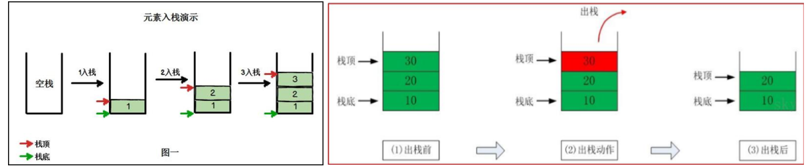
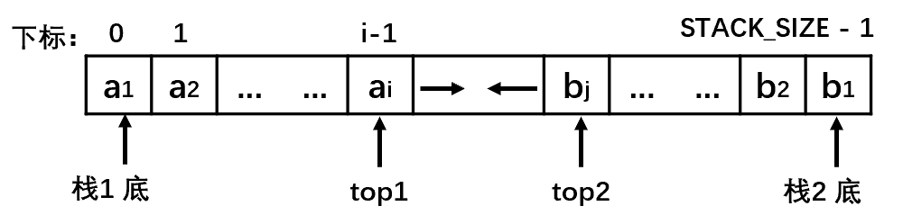

# 栈

## 逻辑结构

- FILO、LIFO：先进后出，后进先出。
- 栈(stack)：限制线性表中元素的插入和删除只能在线性表的同一端进行。

| 名词         | 说明                 |
| ------------ | -------------------- |
| 栈顶(Top)    | 允许插入和删除的一端 |
| 栈底(Bottom) | 固定的一端           |



## 存储结构和实现

### 顺序栈 SequentialStack

```java
public class ArrayStack {
    private int maxSize; //栈的大小
    private int[] stack; //数组 模拟栈，存放数据
    private int top = -1; //栈顶 初始化-1

    public ArrayStack(int maXSize) {
        this.maxSize = maXSize;
        stack = new int[maxSize];
    }

    //栈满
    public boolean isFull() {
        return top == maxSize - 1;
    }

    //栈空
    public boolean isEmpty() {
        return top == -1;
    }

    //压栈push
    public void push(int value) {
        //判断是否栈满
        if (isFull()) {
            System.out.println("栈满");
            return;
        }

        stack[++top] = value;
    }

    //弹栈pop
    public int pop() {
        //判断栈是否空
        if (isEmpty()) {
            throw new RuntimeException("栈空");
        }

        return stack[top--];
    }
    
    //查看栈顶 peek
    public int peek(){
        if(isEmpty()){
            throw new RuntimeException("栈空");
        }
        
        return sta
    }

    //遍历栈，从top栈顶开始
    public void show() {
        //判断栈是否空
        if (isEmpty()) {
            System.out.println("栈空");
            return;
        }

        for (int i = top; i >= 0; i--) {
            System.out.println("stack[" + i + "] = " + stack[i]);
        }
    }
}
```

### 链栈 LinkedStack


## 两栈共享空间

 

- 利用顺序栈单向延申的特性，使用一个数组来存放两个栈。
  - 栈一的栈顶top1为该数组的0下标开始，每次top1++存放新的元素。
  - 栈二的栈顶top2为该数组的length-1下标开始，每次top--存放新的元素 。
- 两个栈相向增长，减少对数组空间的浪费，减少发生上溢的概率：最好一个栈增长时，另一个栈缩短。
- 满栈：top1 == top2 - 1
- 设置变量type来区分操作两个栈。

```java
public class BothStack {
    char[] bothStack = new char[20];
    int top1 = 0; //stack1的栈顶
    int top2 = bothStack.length - 1; //stack2的栈顶

    public BothStack(int length) {
        bothStack = new char[length];
        this.top1 = 0; //stack1的栈顶
        this.top2 = bothStack.length - 1; //stack2的栈顶
    }

    public void push(char value, int type) {
        //判断是否栈满
        if (top1 == top2 - 1) {
            throw new RuntimeException("栈满");
        }

        //按不同的栈操作
        if (type == 1) {
            bothStack[top1++] = value;
        } else if (type == 2) {
            bothStack[top2--] = value;
        } else {
            throw new RuntimeException("未选择正确的栈");
        }
    }

    public char pop(int type) {
        //按不同的栈操作
        if (type == 1) {
            if (top1 == 0) {
                throw new RuntimeException("stack1栈空");
            }
            return bothStack[--top1];
        } else if (type == 2) {
            if (top1 == bothStack.length - 1) {
                throw new RuntimeException("stack2栈空");
            }
            return bothStack[++top2];
        } else {
            throw new RuntimeException("未选择正确的栈");
        }
    }
}
```

## 数学计算

### 综合计算器 中缀表达式

 

```java
package stack;

public class CalculatorTest {
    public static void main(String[] args) {
        String expression = "30+6*3-2";
        //创建数字栈和符号栈
        NumberStack numberStack = new NumberStack(10);
        OperatorStack operatorStack = new OperatorStack(10);
        //定义需要的相关变量
        int index = 0; // 用于扫描
        int num1 = 0;
        int num2 = 0;
        int operator = 0;
        int result = 0;
        char temp = ' '; //将每次扫描的char保存到temp
        String keepNumber = ""; //用于拼接多位数

        //while循环扫描expression
        while (true) {
            //依次得到expression中的每个字符
            temp = expression.substring(index, index + 1).charAt(0);
            //判断temp是数字还是符号,进行相应的处理
            if (operatorStack.isOperator(temp)) { //如果是符号
                //判断当前符号栈是否为空
                if (operatorStack.isEmpty()) { //空：直接入栈
                    operatorStack.push(temp);
                } else { //非空：如果当前符号栈中有符号，比较优先级
                    //如果当前的运算符的优先级<=当前栈中的运算符，则pop两个数字和一个运算符进行计算
                    if (operatorStack.priority(temp) <= operatorStack.priority(operatorStack.peek())) {
                        num1 = numberStack.pop();
                        num2 = numberStack.pop();
                        result = operatorStack.calculate(num1, num2, operatorStack.pop());
                        //将计算的结果入栈
                        numberStack.push(result);
                        //将当前的运算符入栈
                        operatorStack.push(temp);
                    } else {//如果当前的运算符的优先级>当前栈中的运算符,则将当前的压入栈
                        operatorStack.push(temp);
                    }
                }
            } else { //如果是数，直接入数栈
                keepNumber += temp;
                //判断是否为表达式最后一位，最后一位则直接入栈
                if (index == expression.length() - 1) {
                    numberStack.push(temp - 48); //注意ASCII码的对应
                } else {
                    //判断下一个字符是否为数字，如果是数字则继续扫描，如果是运算符则入栈。
                    if (operatorStack.isOperator(expression.substring(index + 1, index + 2).charAt(0))) {
                        //如果后一位是运算符，则入栈
                        numberStack.push(Integer.parseInt(keepNumber));
                        //清空keepNumer
                        keepNumber ="";
                    }
                }
            }
            //让index+1，并判断是否扫描到expression最后
            index++;
            if (index >= expression.length()) {
                break;
            }
        }
        //当表达式扫描完毕，顺序的从数栈和符号栈中pop出相应的数和符号
        while (true) {
            //如果符号栈为空，则为计算到最后结果，此时数字栈中只有一个数（结果）
            if (operatorStack.isEmpty()) {
                break;
            }
            num1 = numberStack.pop();
            num2 = numberStack.pop();
            //
            result = operatorStack.calculate(num1, num2, operatorStack.pop());
            numberStack.push(result);
        }
        System.out.println(numberStack.pop());
    }
}

class NumberStack {
    private int maxSize; //栈的大小
    private int[] stack; //数组 模拟栈，存放数据
    private int top = -1; //栈顶 初始化-1

    public NumberStack(int maXSize) {
        this.maxSize = maXSize;
        stack = new int[maxSize];
    }

    //栈满
    public boolean isFull() {
        return top == maxSize - 1;
    }

    //栈空
    public boolean isEmpty() {
        return top == -1;
    }

    //压栈push
    public void push(int value) {
        //判断是否栈满
        if (isFull()) {
            System.out.println("栈满");
            return;
        }

        stack[++top] = value;
    }

    //弹栈pop
    public int pop() {
        //判断栈是否空
        if (isEmpty()) {
            throw new RuntimeException("栈空");
        }

        return stack[top--];
    }

    //遍历栈，从top栈顶开始
    public void show() {
        //判断栈是否空
        if (isEmpty()) {
            System.out.println("栈空");
            return;
        }

        for (int i = top; i >= 0; i--) {
            System.out.println("stack[" + i + "] = " + stack[i]);
        }
    }
}

class OperatorStack {
    private int maxSize; //栈的大小
    private int[] stack; //数组 模拟栈，存放数据
    private int top = -1; //栈顶 初始化-1

    public OperatorStack(int maXSize) {
        this.maxSize = maXSize;
        stack = new int[maxSize];
    }

    //栈满
    public boolean isFull() {
        return top == maxSize - 1;
    }

    //栈空
    public boolean isEmpty() {
        return top == -1;
    }

    //压栈push
    public void push(int value) {
        //判断是否栈满
        if (isFull()) {
            System.out.println("栈满");
            return;
        }

        stack[++top] = value;
    }

    //弹栈pop
    public int pop() {
        //判断栈是否空
        if (isEmpty()) {
            throw new RuntimeException("栈空");
        }

        return stack[top--];
    }

    //遍历栈，从top栈顶开始
    public void show() {
        //判断栈是否空
        if (isEmpty()) {
            System.out.println("栈空");
            return;
        }

        for (int i = top; i >= 0; i--) {
            System.out.println("stack[" + i + "] = " + stack[i]);
        }
    }

    //返回运算符的优先级 使用数字表示，数字越大，优先级越高
    public int priority(int operator) {
        //假定只有+-*/
        if (operator == '*' || operator == '/') {
            return 1;
        } else if (operator == '+' || operator == '-') {
            return 0;
        } else {
            return -1;
        }
    }

    //判断是否为运算符
    public boolean isOperator(char operator) {
        return operator == '+' || operator == '-' || operator == '*' || operator == '/';
    }

    //计算方法
    public int calculate(int num1, int num2, int operator) {
        int result = 0; //存放计算的结果
        switch (operator) {
            case '+':
                result = num1 + num2;
                break;
            case '-': //注意这里的顺序,因为是后进先出
                result = num2 - num1;
                break;
            case '*':
                result = num1 * num2;
                break;
            case '/': //注意这里的顺序,因为是后进先出
                result = num2 / num1;
                break;
            default:
                break;
        }
        return result;
    }

    //返回当前栈顶的值，但并非pop
    public int peek() {
        return stack[top];
    }
}
```

### 中缀、前缀、后缀表达式

#### 中缀表达式

- 一般转后缀

#### 前缀表达式 波兰表达式

- 前缀表达式的运算符位于操作数之前

**前缀表达式的计算机求值**

- 从右至左扫描表达式，遇到数字时，将数字压入堆栈，遇到运算符时，弹出栈顶的两个数，用运算符对它们做相应的计算（栈顶元素 和 次顶元素），并将结果入栈；重复上述过程直到表达式最左端，最后运算得出的值即为表达式的结果

 

#### 后缀表达式 逆波兰表达式

- 后缀表达式又称逆波兰表达式,与前缀表达式相似，只是运算符位于操作数之后

 

#### 逆波兰计算器 后缀表达式

 

```java
package stack;

import java.util.ArrayList;
import java.util.List;
import java.util.Stack;

public class PolandNotation {
    public static void main(String[] args) {
        //先定义一个逆波兰表达式
        //4+(5+6)*2 --> 5 6 + 2 * 4 +
        String suffixExpression = "5 6 + 2 * 4 + ";
        //1.先放入ArrayList中
        //2.将ArrayList传递给方法，遍历ArrayList配合栈完成计算
        List<String> rpnList = getListString(suffixExpression);
        System.out.println(calculate(rpnList));
    }

    //将一个逆波兰表达式，依次将数字和运算符放入ArrayList
    public static List<String> getListString(String suffixExpression) {
        String[] split = suffixExpression.split(" ");
        List<String> list = new ArrayList<>();
        for (String str : split) {
            list.add(str);
        }
        return list;
    }

    //完成对逆波兰表达式的运算
    public static int calculate(List<String> list) {
        //创建栈,一个栈即可
        Stack<String> stack = new Stack<>();
        //遍历list
        for (String str : list) {
            //使用正则表达式，取出数
            if (str.matches("\\d+")) { //可以匹配多位数
                //入栈
                stack.push(str);
            } else { //如果是运算符
                //pop两个数，并运算，再入栈
                int num2 = Integer.parseInt(stack.pop());
                int num1 = Integer.parseInt(stack.pop());
                int result = 0;
                if (str.equals("+")) {
                    result = num1 + num2;
                } else if (str.equals("-")) {
                    result = num1 - num2;
                } else if (str.equals("*")) {
                    result = num1 * num2;
                } else if (str.equals("/")) {
                    result = num1 / num2;
                } else {
                    throw new RuntimeException("运算符有误");
                }
                //把计算结果入栈
                stack.push("" + result);
            }
        }
        //最后pop运算结果
        return Integer.parseInt(stack.pop());
    }
}
```

### 中缀转后缀

 
 

```java
//将中缀表达式转为对应的List
public static List<String> toInfixExpression(String infixExpression) {
    //定义List存放中缀表达式对应的内容
    List<String> list = new ArrayList<>();
    int index = 0; //指针，用于遍历中缀表达式
    String keepNumber; //多位数的拼接
    char temp; //遍历到的每个字符
    do {
        //如果非数字，则加入list //ASCII码 0~9对应68~57
        if ((temp = infixExpression.charAt(index)) < 48 || (temp = infixExpression.charAt(index)) > 57) {
            list.add("" + temp);
            index++;
        } else { //如果是数字，则拼接
            keepNumber = "";
            while (index < infixExpression.length() && (temp = infixExpression.charAt(index)) >= 48 && (temp = infixExpression.charAt(index)) <= 57) {
                keepNumber += temp;
                index++;
            }
            list.add(keepNumber);
        }
    } while (index < infixExpression.length());
    return list;
}

//将一个中缀表达式对应的List转换成后缀表达式, 放入到List中
public static List<String> parseSuffixExpressionList(List<String> infixList) {
    //定义两个栈 符号栈和中间结果的存储栈
    Stack<String> operatorStack = new Stack<>();
    //直接使用List<String> 替换中间结果的存储栈
//        Stack<String> numberStack = new Stack<>();
    List<String> resultList = new ArrayList<>();

    //遍历infixList
    for (String str : infixList) {
        //如果是数字，加入resultList
        if (str.matches("\\d+")) {
            resultList.add(str);
        } else if (str.equals("(")) { //左括号"("直接压入operatorStack
            operatorStack.push(str);
        } else if (str.equals(")")) {
            //如果是右括号")"，则依次pop出operatorStack中的运算符，并压入resultList,直到遇到左括号"("为止
            while (!operatorStack.peek().equals("(")) {
                resultList.add(operatorStack.pop());
            }
            operatorStack.pop(); //将 "(" 弹出，消除小括号
        } else {
            //当str的优先级<=operator栈顶的运算符的优先级，弹出operator中的运算符并加入到resultList中，再次转到与operatorStack新的运算符比较
            while (operatorStack.size() != 0 && Operation.getValue(operatorStack.peek()) >= Operation.getValue(str)) {
                resultList.add(operatorStack.pop());
            }
            //将str压入栈
            operatorStack.push(str);
        }
    }

    //将operatorStack中剩余的运算符依次弹出，并加入resultList
    while (operatorStack.size() != 0) {
        resultList.add(operatorStack.pop());
    }
    return resultList;
}


class Operation {
    private static int ADD = 1;
    private static int SUB = 1;
    private static int MUL = 2;
    private static int DIV = 2;

    //返回运算符的优先级
    public static int getValue(String operation) {
        int result;
        switch (operation) {
            case "+":
                result = ADD;
                break;
            case "-":
                result = SUB;
                break;
            case "*":
                result = MUL;
                break;
            case "/":
                result = DIV;
                break;
            default:
//                throw new RuntimeException("不存在该运算符");
                result = 0;
        }

        return result;
    }
}
```

# 队列

## 逻辑结构

- 先入先出（FIFO）的原则。

| 名词          | 说明                 |
| ------------- | -------------------- |
| 队头（front） | 队头元素的前一个位置 |
| 队尾（rear）  | 队尾元素位置         |

## 存储结构和实现

### 顺序存储结构

#### 顺序队列

> 如果将队头固定在数组下标为0的位置：
>
> - 入队：对数组进行追加，T(n) = O(1)。
> - 出队：对数组下标为0的元素删除，T(n) = O(n)：需要向前移动n-1个元素。

 

- 顺序队列：rear、front属性的增长没有可逆的。

 

```java
public class ArrayQueue {
    private int maxSize; // 表示数组的最大容量
    private int front; // 队列头
    private int rear; // 队列尾
    private int[] arr; // 模拟队列

    // 创建队列的构造器
    public ArrayQueue(int maxSize) {
        this.maxSize = maxSize;
        arr = new int[maxSize];
        front = -1; // 指向队列头的前一个位置
        rear = -1; // 指向队列最后一个数据
    }

    // 判断队列是否满
    public boolean isFull() {
        return rear == maxSize - 1;
    }

    // 判断队列是否为空
    public boolean isEmpty() {
        return rear == front;
    }

    // 添加数据到队列
    public void addQueue(int value) {
        if (isFull()) {
            System.out.println("队列满！！！");
            return;
        }
        rear++; // rear后移
        arr[rear] = value;
    }

    // 获取队列的数据，出队列
    public int getQueue() {
        // 判断队列是否空
        if (isEmpty()) {
            // 通过抛出异常
            throw new RuntimeException("队列为空");
        }
        // front后移
        return arr[++front];
    }

    // 遍历
    public void showQueue() {
        if (isEmpty()) {
            System.out.println("队列空！！！");
            return;
        }
        for (int i : arr) {
            System.out.printf("arr[%d]=%d\n", i, arr[i]);
        }
    }

    // 显示队列的头，并不取出
    public int headQueue() {
        if (isEmpty()) {
            throw new RuntimeException("队列空！！！");
        }
        return arr[front];
    }
}
```

#### 循环队列

| 指针  | 说明                                       |
| ----- | ------------------------------------------ |
| front | 队头，初始值=0                             |
| rear  | 队尾，空出一个空间做为约定，rear的初始值=0 |

- 队满：$(rear+1) \% M = front \% M$。

- 队空：$rear==front$。

- 队中有效数据的个数：$(rear+M-front) \% M$。

- 循环增长：对rear和front的取模操作，解决假溢出。

  - `rear = (rear + 1) % maxSize;`

  - `front = (front + 1) % maxSize;`

> 假溢出：数组空间发生上溢，但数组的低端还有空闲空间。

```java
//使用数组模拟队列
public class CircleArrayQueue {
    private int M; // 表示数组的最大容量
    private int front; // 队列头
    private int rear; // 队列尾
    private int[] arr; // 模拟队列

    // 判断队列是否满
    public boolean isFull() {
        return (rear + 1) % M == front % M;
    }

    // 判断队列是否为空
    public boolean isEmpty() {
        return rear == front;
    }

    // 添加数据到队列
    public void addQueue(int value) {
        if (isFull()) {
            System.out.println("队列满！！！");
            return;
        }
        
        arr[rear] = value;
        // 将rear后移 考虑取模，防止数组越界
        rear = (rear + 1) % M;
    }

    // 获取队列的数据，出队列
    public int getQueue() {
        // 判断队列是否空
        if (isEmpty()) {
            // 通过抛出异常
            throw new RuntimeException("队列为空");
        }
        
        int value = arr[front];
        // front 后移
        front = (front + 1) % M;
        return value;
    }

    // 遍历 从front开始遍历
    public void showQueue() {
        if (isEmpty()) {
            System.out.println("队列空！！！");
            return;
        }

        // 求出当前队列有序数据的个数 (rear + M -front) % M
        // 在经过多次使用后，front的值很可能以及超过M，所以需要取模 int i = front % M
        for (int i = front % M; i < front + ((rear + M - front) % M); i++) {
            System.out.printf("arr[%d]=%d\n", i, arr[i]);
        }
    }

    // 显示队列的头，并不取出
    public int headQueue() {
        if (isEmpty()) {
            throw new RuntimeException("队列空！！！");
        }
        return arr[front];
    }
}
```

### 链存储结构

- 无序添加的单向链表。

 

```java
public class LinkedQueue<T> {

    private Node front; //队头
    private Node rear; //队尾

    public LinkedQueue() {
        front = rear = new Node();
    }

    /**
     * 判断队列空
     *
     * @return true-空
     */
    public boolean isEmpty() {
        return rear == front;
    }

    /**
     * 入队
     *
     * @param element 结点的数值域data
     */
    public void enQueue(T element) {
        Node node = new Node(element);
        rear.setNext(node);
        rear = node;
    }

    /**
     * 出队
     *
     * @return 出队结点的数值域data
     */
    public T deQueue() {
        if (isEmpty()) {
            throw new RuntimeException("队列空");
        }
        Node<T> headNode = front.getNext();
        front.setNext(headNode.getNext());
        if (headNode.getNext() == null)
            rear = front;
        return headNode.getData();
    }

    /**
     * 查看队头
     * @return 队头结点的数值域data
     */
    public T getHead() {
        if (isEmpty())
            throw new RuntimeException("队列空");
        Node<T> head = front.getNext();
        return head.getData();
    }
    
    class Node<T> {
        private T data;
        private Node next;

        public Node() {

        }

        public Node(T data) {
            this.data = data;
        }

        public T getData() {
            return data;
        }

        public void setData(T data) {
            this.data = data;
        }

        public Node getNext() {
            return next;
        }

        public void setNext(Node next) {
            this.next = next;
        }
    }
}
```

## 双端队列

- 双端队列：允许在队列的两端进行插入和删除操作。

> 二进一出队列：允许在两端插入，但只允许在一端删除。
>
> 一进二出队列：只允许在一端插入，允许在两端删除。

