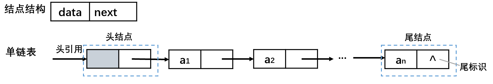
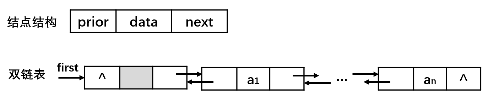

# 概述

**线性结构**

- 数组、队列、链表、栈。
- 数据元素之间存在一对一的线性关系。

|                   顺序表(数组)                    |                     链表                     |
| :-----------------------------------------------: | :------------------------------------------: |
|                     顺序存储                      |                   链式存储                   |
| 顺序表中的存储元素是连续的 （一组连续的内存单位） |        链表中的存储元素不一定是连续的        |
|                         -                         | 元素节点中存放数据元素以及相邻元素的地址信息 |

**非线性结构**

- 二维数组，多维数组，广义表，树结构，图结构。

# 顺序表（数组）

## 概述

- 顺序表：用一段地址连续的存储单元依次存储线性表的数据元素。
  - 内存的碎片化问题。
- 设顺序表的每个元素占用m个存储单元，则第$a_i$个元素的存储地址为：（与第$a_1$个元素的存储位置关系）

$$
LOC(a_i) = LOC(a_1) + ( a_i - a_1 ) * m
$$

- 随机存取结构：只要确定了顺序表的起始地址（基地址），计算任意一个元素的存储地址的时间是相同的。

## 基本运算

### 按值查找

### 插入

### 删除

# 链表

## 存储结构

- 链表：以节点的方式存储，是链式存储，用一组任意的存储单元存放线性表。
- 链表的每个节点包含data域，next域：指向下一个节点。
- 链表的各个节点不一定是连续存储，逻辑次序和物理次序不一定相同。

 

- 头结点：在第一个元素结点之前附加一个类型相同的结点。
- 头引用：指向第一个结点的存储地址。
- 尾标志：终端结点的引用域为空。

## 链表实现

### 单链表


```java
//定义SingleLinkedList 进行管理HeroNode
public class SingleLinkedList {
    // 先初始化一个头节点，不存放具体的数据
    // head不能改变
    private final HeroNode head = new HeroNode(0, "", "");

    // 添加一个数据到单向链表
    // 当不考虑编号的顺序时：
    // 1. 找到当前链表的最后节点
    // 2. 将最后节点的next域指向新的节点
    public void add(HeroNode heroNode) {
        HeroNode temp = head;
        // 遍历链表，使temp指向最后的节点
        while (true) {
            if (temp.next == null) {
                break;
            }
            // 如果没有找到最后，则将temp后移一位
            temp = temp.next;
        }
        // 使最后一个节点的next指向新的节点
        temp.next = heroNode;
    }

    // 显示链表 遍历
    public void list() {
        // 判断链表是否为空
        if (head.next == null) {
            System.out.println("链表null");
            return;
        }
        HeroNode temp = head.next;
        while (true) {
            // 判断是否到链表最后
            if (temp == null) {
                break;
            }
            // 输出节点的信息
            System.out.println(temp);
            // 将temp后移一位
            temp = temp.next;
        }
    }

    // 有序添加
    // 根据排名no 插入到指定的排名（位置）
    // 如果有这个no则添加失败
    public void addByOrder(HeroNode heroNode) {
        // 由单向链表的特性：temp是位于添加位置的前一个节点，否则插入失败
        HeroNode temp = head;
        boolean flag = false; // flag标志添加的编号是否存在，默认为false；
        while (true) {
            if (temp.next == null) { // 表明temp已经到链表的最后
                break;
            }
            if (temp.next.no > heroNode.no) { // 如果找到合适的排名no
                break;
            } else if (temp.next.no == heroNode.no) { // 如果要插入的heroNode的编号已经存在
                flag = true; // 说明编号存在
                break;
            }
            temp = temp.next; // temp后移一位
        }
        if (flag) { // 判断能否插入
            System.out.println("待插入的用户的编号已经存在！插入失败\n" + heroNode.no);
            return;
        }
        // 插入到链表中，temp的后面
        heroNode.next = temp.next;
        temp.next = heroNode;
    }

    // 修改节点的信息，根据编号排名no来修改（该属性不能修改）
    public void update(HeroNode heroNode) {
        // 判断链表是否为空
        if (head.next == null) {
            System.out.println("链表null");
            return;
        }
        HeroNode temp = head.next;
        boolean flag = false; // 判断是否找到该节点
        while (true) {
            if (temp == null) { // 达到链表的末尾
                break;
            }
            if (temp.no == heroNode.no) { // 找到对应的排名no
                flag = true;
                break;
            }
            temp = temp.next;
        }
        // 根据flag 判断是否找到要修改的节点
        if (flag) {
            temp.name = heroNode.name;
            temp.nickName = heroNode.nickName;
        } else {
            System.out.printf("未找到当前节点%d", heroNode.no);
        }
    }

    // 删除节点
    // 1. head节点不能改变，需要temp节点找到带删除节点的前一个节点
    // 2. 在比较时，是temp.next.no和需要删除节点heroNode.no比较
    public void delete(int no) {
        HeroNode temp = head;
        boolean flag = false; // 是否找到待删除节点
        while (true) {
            if (temp.next == null) {
                break;
            }
            if (temp.next.no == no) { // 找到待删除节点
                flag = true;
                break;
            }
            temp = temp.next;
        }
        // 判断flag
        if (flag) { // 找到
            // 可以删除
            temp.next = temp.next.next;
        } else {
            System.out.println("要删除的节点不存在");
        }
    }
}

//定义HeroNode 每个HeroNode的对象就是一个节点
class HeroNode {
    // data域
    public int no;
    public String name;
    public String nickName;
    // next域
    public HeroNode next;

    public HeroNode(int no, String name, String nickName) {
        this.no = no;
        this.name = name;
        this.nickName = nickName;
    }

    @Override
    public String toString() {
        return "HeroNode [no=" + no + ", name=" + name + ", nickName=" + nickName + "]";
    }
}
```

### 双链表

 

- 快速确定链表中的前驱结点：在单链表的结点中增加引用其前驱结点的引用域（prior域）。
- 双向链表可以实现当前结点的自我删除，而单向链表需要上一个结点的配合才能实现删除当前节点。

```java
public class BidirectionalLinkedList {
    private Node head = new Node(0, " ");

    //有序添加
    public void addByOrder(Node newNode) {
        //判断链表是否空
        if (head.next == null) {
            head.next = newNode;
            newNode.pre = head;
            return;
        }
        Node current = head; //当前节点
        boolean isExist = false; //判断是否存在
        while (true) {
            if (current.next == null) { //到达链表尾部
                break;
            } else if (current.next.no == newNode.no) { //如果已经存在
                isExist = true;
                break;
            } else if (current.next.no > newNode.no) { //找到合适的位置
                break;
            }
            current = current.next;
        }
        if (isExist) { //如果已经存在
            System.out.println("该节点已经存在");
            return;
        }
        //添加
        newNode.next = current.next;
        newNode.pre = current;
        if (current.next != null) { //如果current的next不为null
            current.next.pre = newNode;
        }
        current.next = newNode;
    }

    //尾部追加
    public void tailAdd(Node newNode) {
        //先找最后一个节点
        Node current = head;
        while (true) {
            if (current.next == null) {
                break;
            }
            current = current.next;
        }
        //添加操作
        current.next = newNode;
        newNode.pre = current;
    }

    //遍历
    public void show() {
        if (head.next == null) { //判断链表是否空
            System.out.println("null");
            return;
        }

        Node current = head.next;
        while (true) {
            System.out.println(current);
            if ((current = current.next) == null) {
                break;
            }
        }
    }

    //更新 根据no来更新
    public void update(Node newNode) {
        if (head.next == null) { //判断链表是否空
            System.out.println("null");
            return;
        }

        Node current = head.next;
        boolean isExist = false; //判断是否存在匹配的节点
        while (true) {
            if (current == null) { //到达链表尾部
                break;
            }
            if (current.no == newNode.no) {
                isExist = true;
                break;
            }
            current = current.next;
        }
        //更新操作
        if (isExist) {
            current.name = newNode.name;
            System.out.println("Updated !");
        } else {
            System.out.println("not find");
        }
    }

    //删除 按照no来删除
    public void delete(int no) {
        if (head == null) { //判断链表是否空
            System.out.println("null");
            return;
        }

        Node current = head.next;
        boolean isExist = false;
        while (true) {
            if (current == null) {//到达链表尾部
                break;
            } else if (current.no == no) {
                isExist = true;
                break;
            }
            current = current.next;
        }
        if (isExist) {
        //自我删除
            if (current.next != null) { //判断current的next是否为null
                current.next.pre = current.pre;
            }
            current.pre.next = current.next;
            System.out.println("Deleted !");
        } else {
            System.out.println("not find");
        }
    }
}

class Node {
    protected int no;
    protected String name;

    protected Node pre; //指向前一个节点
    protected Node next; //指向后一个节点

    public Node(int no, String name) {
        this.no = no;
        this.name = name;
    }

    @Override
    public String toString() {
        return "no=" + no + "\tname=" + name;
    }
}
```

### 循环链表（约瑟夫环）

#### 循环链表

- 循环链表：将单链表的终端节点的引用域由空改为指向头结点引用，使得链表头尾相接。

 

#### Josephu 约瑟夫环 

- Josephu  问题为：设编号为1，2，… ，n的n个人围坐一圈，约定编号为k（1<=k<=n）的人从1开始报数，数到m 的那个人出列，它的下一位又从1开始报数，数到m的那个人又出列，依次类推，直到所有人出列为止，由此产生一个出队编号的序列。
- 用一个不带头结点的循环链表来处理Josephu 问题：先构成一个有n个结点的单循环链表，然后由k结点起从1开始计数，计到m时，对应结点从链表中删除，然后再从被删除结点的下一个结点又从1开始计数，直到最后一个结点从链表中删除算法结束。

1. 在第一次添加时，用第一个节点就替代head头节点。
2. 将单链表的最后一个节点的next指向第一个节点。
3. 环形链表中只有一个节点的时候停止返回，即node.next=node的时候。
4. 计数时，可以使用取余等操作避免不必要的循环。注意：走的次数是否越界。

```java
package linkedList;

public class Josephu {
    public static void main(String[] args) {
        RingLinkedList list = new RingLinkedList();
        list.count(10, 0, 40);
    }
}

class RingLinkedList {
    protected RingNode first;
    int number; //用于遍历

    //创建环型链表
    public RingNode create(int number) {
        if (number < 1) { //判断是否合法
            throw new RuntimeException("输入的个数不合法");
        }
        first = new RingNode(0);
        RingNode temp = first;
        for (int i = 1; i < number; i++) {
            temp.next = new RingNode(i);
            temp = temp.next;
        }
        //形成闭环
        temp.next = first;

        //用于遍历
        this.number = number;
        return temp;
    }

    //计数
    public void count(int createNumber, int startIndex, int countNumber) {
        //判断创建的节点数量和开始的计数是否合法
        if (startIndex > createNumber - 1) {
            System.out.println("开始的节点位置" + startIndex + "大于所有节点的数量" + createNumber);
            return;
        }

        //创建链表
        //获得当前节点的前一位，以用来作为删除节点的前一位
        RingNode preNode = this.create(createNumber);
        //获得开始的节点
        RingNode current = first;
        for (int i = 0; i < startIndex; i++) {
            preNode = current;
            current = current.next;
        }


        int curCount; //记录每次的取余的计数，优化。
        int nodeNumber = createNumber; //记录当前的剩余节点数，优化。
        //开始计数
        while (current.next != current) {
            curCount = countNumber % nodeNumber--;
            for (int i = 0; i < curCount; i++) {
                preNode = current;
                current = current.next;
            }
            //删除当前节点
            System.out.println("删除的节点：" + current);
            preNode.next = current.next;
            //还给原先被删除节点的下一位
            current = preNode.next;
        }
        System.out.println("最后一位: " + current);
    }
}

class RingNode {
    protected int no;
    protected RingNode next;

    public RingNode(int no) {
        this.no = no;
    }

    @Override
    public String toString() {
        return "RingNode{" +
                "no=" + no +
                '}';
    }
}
```

```java
package linkedList;

public class Josephu2 {
    public static void main(String[] args) {
        Josephu2 josephu = new Josephu2();
        josephu.count(40, 3);
    }

    class Node {
        public Node next;
        public int number;

        public Node(int number) {
            this.number = number;
        }

        public String toString() {
            return "Node[" + number + "]";
        }

    }

    Node first = new Node(0);

    public void count(int number, int count) {
        //创建环
        Node temp = first;
        for (int i = 1; i < number; i++) {
            temp.next = new Node(i);
            temp = temp.next;
        }
        temp.next = first;
        //报数杀人
        temp = first;
        while (temp.next != temp) { //不需要equals，只要判断地址相同就可以
            for (int i = 0; i < count; i++) {
                temp = temp.next;
                if (i == count - 2) { //数到要杀的人的前一个
                    Node t = temp;
                    temp.next = temp.next.next;
                    t.next = temp.next;
                    break;
                }
            }
        }
        System.out.println("存活：" + temp);
    }
}
```

## 静态链表和动态链表

- 静态链表：使用数组存放链表。
- 动态链表：额外创建expend()方法，动态扩展数组长度。

```java
public class StaticLinkDemo {
    public static void main(String[] args) {
        StaticLink staticLink = new StaticLink();

        staticLink.add(new StaticLinkNode(8));
        staticLink.add(new StaticLinkNode(3));
        staticLink.add(new StaticLinkNode(6));
        staticLink.add(new StaticLinkNode(4));
        staticLink.prinkLink();
    }
}

class StaticLink {
    StaticLinkNode[] link = null; //储存静态链表数组
    int curFree = 1; //当前空闲的位置
    int avail = 0; //0下标空闲
    int MAX_LENGTH = 8;

    //创建
    public StaticLink() {
        link = new StaticLinkNode[MAX_LENGTH];
    }

    public StaticLink(int length) {
        MAX_LENGTH = length;
        link = new StaticLinkNode[MAX_LENGTH];
    }

    //添加
    public void add(StaticLinkNode node) {
        //如果link的长度到达最大值，则扩展1倍长度
        if (curFree > link.length - 1) {
            extend();
        }
        node.setNext(curFree); //设置node的下一个结点
        link[curFree++] = node;
    }

    //扩展
    public void extend() {
        MAX_LENGTH *= 2;
        StaticLinkNode[] tempLink = new StaticLinkNode[MAX_LENGTH];
        System.arraycopy(tempLink, 0, link, 0, link.length);
        link = tempLink;
    }

    //打印
    public void prinkLink() {
        for (int i = 1; i < curFree; i++) {
            System.out.print(link[i] + ",");
        }
    }
}

class StaticLinkNode {
    int value;
    int next;

    public StaticLinkNode(int value) {
        this.value = value;
    }

    public int getValue() {
        return value;
    }

    public void setValue(int value) {
        this.value = value;
    }

    public int getNext() {
        return next;
    }

    public void setNext(int next) {
        this.next = next;
    }

    @Override
    public String toString() {
        return "StaticLinkNode{" +
                "value=" + value +
                ", next=" + next +
                '}';
    }
}
```

```java
package linkedList;

import java.util.LinkedList;

public class StaticLinkedListDemo {
    public static void main(String[] args) {
        StaticLinkedList listA = new StaticLinkedList();
        int la[] = {
                2, 3, 5, 8, 9, 6, 7
        };
        for (int i = 0; i < la.length; i++) {
            listA.add(la[i]);
        }
        listA.delete(6);
        listA.delete(0);

        listA.insert(3, 88);
        listA.insert(3, 78);
        for (int i = 0; i < listA.getLength(); i++) {
            System.out.println(listA.get(i));
        }
    }
}

class StaticLinkedList {
    private StaticLinkedNode[] linkedList = null; //静态链表的存放数组
    private int MAX_SIZE = 4; //该数组的储存大小
    private int curFree = 0; //当前空闲的位置
    private int size = 1;

    //返回该链表的长度
    public int getLength() {
        return size - 1;
    }

    public StaticLinkedList() {
        linkedList = new StaticLinkedNode[MAX_SIZE];
        for (int i = 0; i < linkedList.length; i++) {
            linkedList[i] = new StaticLinkedNode();
            linkedList[i].data = -1;
            linkedList[i].cur = i + 1;
        }
        curFree = 1; //当前空闲结点从1开始，0号位的结点设置为空，不存放数据
    }

    //添加
    public void add(int data) {
        if (size < linkedList.length) {
            linkedList[curFree].data = data;
            curFree = linkedList[curFree].cur;
            size++;
        } else {
            addLinkSpace();
            linkedList[curFree].data = data;
            curFree = linkedList[curFree].cur;
            size++;
        }
    }

    //获取指定索引的数据
    public int get(int index) {
        if (index > size - 1 && index < 0) {
            throw new RuntimeException("数组越界");
        } else {
            return linkedList[index + 1].data;
            //因为多了一个空的头节点，所以index+1
        }
    }

    //删除
    public void delete(int index) {
        index++; //因为空的头节点的存在
        if (index < 1 || index >= size) {
            throw new RuntimeException("删除的下标不合法");
        } else if (index == size - 1) {
            size--;
            linkedList = (StaticLinkedNode[]) getTrueIndex(linkedList, size);
        } else {
            int i = 0;
            while (index != linkedList[i].cur) {
                i++;
            }
            int j = 0;
            while (curFree != linkedList[j].cur) {
                j++;
            }
            linkedList[i].cur = linkedList[index].cur;
            linkedList[j].cur = index;
            linkedList[index].cur = curFree;
            curFree = index;
            size--;
            linkedList = (StaticLinkedNode[]) getTrueIndex(linkedList, size);
        }
    }

    //插入
    public void insert(int index, int data) {
        //这里加1的原因是因为链表的第0位为空节点，这里设置的头节点为空
        index = index + 1;
        if (size < linkedList.length) {
            if (index > size && index < 0)
                System.out.println("数组越界，超出数组长度");
            else if (index == size) {
                linkedList[curFree].data = data;
                curFree = linkedList[curFree].cur;
                size++;
            } else {
                //未按逻辑顺序排序而插入数据的写法，因为未排序，则当前索引的上个节点的索引不一定是当前索引减1
                int i = 0;
                while (index != linkedList[i].cur) {
                    i++;
                }
                int j = 0;
                while (curFree != linkedList[j].cur) {
                    j++;
                }
                linkedList[i].cur = curFree;
                linkedList[j].cur = linkedList[curFree].cur;
                linkedList[curFree].data = data;
                linkedList[curFree].cur = index;
                curFree = linkedList[j].cur;
                size++;
                //每次插入后将链表按逻辑顺序重新排序，是为了方便输出查看。
                linkedList = (StaticLinkedNode[]) getTrueIndex(linkedList, size);
            }
        } else {
            addLinkSpace();
            insert(index, data);
        }
    }

    //按照逻辑顺序来重新排列链表
    public Object getTrueIndex(StaticLinkedNode[] linkedList, int size) {
        StaticLinkedNode[] linkedNodes = new StaticLinkedNode[linkedList.length];
        int k = 0;
        for (int i = 0; i < linkedList.length; i++) {
            linkedNodes[i] = new StaticLinkedNode();
            linkedNodes[i].data = linkedList[k].data;
            k = linkedList[k].cur;
            linkedNodes[i].cur = i + 1;
        }
        //在删除之后，curFree不一定是最后一位
        curFree = size;
        return linkedNodes;
    }

    //扩展链表长度
    public void addLinkSpace() {
        MAX_SIZE += 8;
        StaticLinkedNode[] linkedNodes = linkedList;
        linkedList = new StaticLinkedNode[MAX_SIZE];
        System.arraycopy(linkedNodes, 0, linkedList, 0, linkedNodes.length);
        for (int i = linkedNodes.length; i < MAX_SIZE; i++) {
            linkedList[i] = new StaticLinkedNode();
            linkedList[i].data = -1;
            linkedList[i].cur = i + 1;
        }
        curFree = linkedNodes.length;
    }
}

class StaticLinkedNode {
    int data;
    int cur;
}
```
