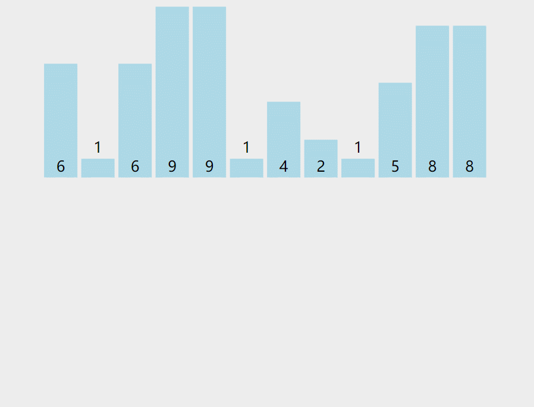
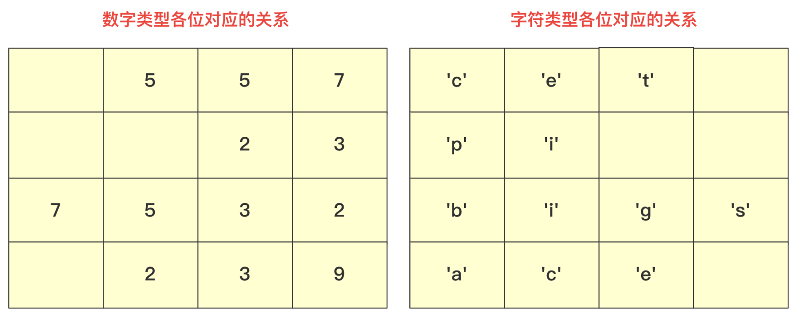
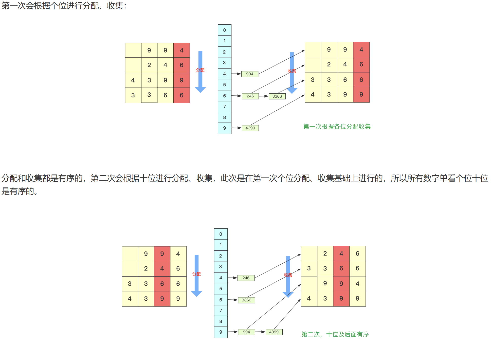

# 排序简述

  

| 排序算法 | 平均时间复杂度 | 最好           | 最坏           | 空间复杂度   | 稳定性 |
| -------- | -------------- | -------------- | -------------- | ------------ | ------ |
| 冒泡排序 | $O(n^2)$       | $O(n)$         | $O(n^2)$       | $O(1)$       | 稳定   |
| 快速排序 | $O(n\log_2^n)$ | $O(n\log_2^n)$ | $O(n^2)$       | $O(log_2^n)$ | 不稳定 |
| 插入排序 | $O(n^2)$       | $O(n)$         | $O(n^2)$       | $O(1)$       | 稳定   |
| 希尔排序 | $O(n^{1.3})$   | $O(n)$         | $O(n\log_2^n)$ | $O(1)$       | 不稳定 |
| 选择排序 | $O(n^2)$       | $O(n^2)$       | $O(n^2)$       | $O(1)$       | 不稳定 |
| 堆排序   | $O(n\log_2^n)$ | $O(n\log_2^n)$ | $O(n\log_2^n)$ | $O(1)$       | 不稳定 |
| 归并排序 | $O(n\log_2^n)$ | $O(n\log_2^n)$ | $O(n\log_2^n)$ | $O(n)$       | 稳定   |
| 桶排序   | $O(n+k)$       | $O(n+k)$       | $O(n+k)$       | $O(n+k)$     | 稳定   |
| 计数排序 | $O(n+k)$       | $O(n+k)$       | $O(n+k)$       | $O(k)$       | 稳定   |
| 基数排序 | $O(nk)$        | $O(nk)$        | $O(nk)$        | $O(n+k)$     | 稳定   |

# 交换类

## 冒泡排序

- 冒泡排序：从前往后把大元素往后调（或 从后向前把小元素往前调）。
- 时间复杂度：$T(n)=O(n^2)$。

  

- 缺点：一般最后一个数只能换一次位置。

```java
package sort;

public class BubblingDemo {
    public static void main(String[] args) {
        double[] arr = {2, 3, 1};
        BubblingDemo bubblingDemo = new BubblingDemo();
        bubblingDemo.bubblingSort(arr); //2,1,3
    }

    public void bubblingSort(double[] arr) {
        for (int i = 0; i < arr.length; i++) {
            for (int j = 0; j < i; j++) {
                if (arr[j] > arr[j + 1]) {
                    double temp = arr[j];
                    arr[j] = arr[j + 1];
                    arr[j + 1] = temp;
                }
            }
        }
        for (int i = 0; i < arr.length; i++) {
            System.out.println(arr[i]);
        }
    }
}
```

## 快速排序

### 基本快排

1. 将序列变成两个部分：序列左边全部小于一个数，序列右面全部大于一个数。这个数在这个序列中是可以随机取的，通常取最左边的那个数。
2. 然后，利用递归的思想再将左序列当成一个完整的序列再进行排序，同样把序列的右侧也当成一个完整的序列进行排序。

  
  
  

```java
package sort;

public class QuickSortDemo {
    public static void main(String[] args) {
        int[] arr = {2, 9, 2, 3, 7, 11, 4};
        quick(arr, 0, arr.length - 1);
        for (int i : arr) {
            System.out.println(i);
        }
    }

    public static void quick(int[] arr, int left, int right) {
        //选择排序的范围 下标
        int low = left;
        int high = right;

        //判断是否到达停止条件，是否越界
        if (low > high) {
            return;
        }

        int point = arr[low]; //额外空间，要求左边都小于他，同时右边都大于

        //完成一轮大小互换：将小于point的都放在左边，大于的放在右边
        while (low < high) {
            //找到的第一个小于point的则退出循环，并将该数覆盖arr[low]，即目前point所在的位置。
            //否则继续查找。
            while (low < high && arr[high] >= point) {
                high--;
            }
            arr[low] = arr[high];
            //找到的第一个大于point的则退出循环，并将该数覆盖arr[high]（此时的arr[high]在被覆盖前已经覆盖了之前的arr[low]）。
            //否则继续查找。
            while (low < high && arr[low] <= point) {
                low++;
            }
            arr[high] = arr[low];
        }

        //重置
        arr[low] = point;

        //将一轮大小互换之后的，继续按point分段再次排序，直到达到停止条件。 
        quick(arr, left, low - 1);
        quick(arr, low + 1, right);
    }
}
```

### 双轴快排

- 单轴很多时候可能会遇到较差的情况就是当前元素可能是最大的或者最小的，这样子元素就没有被划分区间，快排的递推T(n)=T(n-1)+O(n)从而为O(n^2).
- 双轴就是选取两个主元素理想将区间划为3部分，这样不仅每次能够确定元素个数增多为2个，划分的区间由原来的两个变成三个，最坏最坏的情况就是左右同大小并且都是最大或者最小，但这样的概率相比一个最大或者最小还是低很多，所以双轴快排的优化力度还是挺大的。

**比privot1小的在privot1左侧，比privot2大的在privot2右侧，在privot1和privot2之间的在中间。**

  

**k交换过程**

  
  

**收尾工作**

  

```java
package sort;

public class DoubleQuickSortDemo {
    public static void main(String[] args) {
        int[] arr = {2, 3, 4, 56, 72, 1, 2, 4, 3, 21};
        doubleQuick(arr, 0, arr.length - 1);
        for (int i : arr) {
            System.out.println(i);
        }
    }

    public static void doubleQuick(int arr[], int start, int end) {
        //非法参数直接停止
        if (start > end) {
            return;
        }

        //使picot1储存最左边的值，pivot2储存最右边的值，同时保证pivot1<pivot2。
        if (arr[start] > arr[end]) {
            swap(arr, start, end);
        }
        int pivot1 = arr[start];
        int pivot2 = arr[end];

        int left = start;
        int right = end;
        int k = left + 1;
        while (k < right) {
            if (arr[k] <= pivot1) {//左侧交换
                swap(arr, ++left, k++);
            } else if (arr[k] <= pivot2) { //中间值则跳过
                k++;
            } else { //右侧交换
                // 如果大于pivot2则继续查找，直到k
                while (arr[right] >= pivot2) {
                    if (right-- == k) {
                        break;
                    }
                }
                //如果超限，则停止
                if (k >= right) {
                    break;
                }
                //小于pivot2的与k位置互换
                swap(arr, k, right);
            }

            //
            swap(arr, start, left);
            swap(arr, end, right);

            //分段排序
            doubleQuick(arr, start, left - 1);
            doubleQuick(arr, left + 1, right - 1);
            doubleQuick(arr, right + 1, end);
        }
    }

    public static void swap(int[] arr, int i, int j) {
        int temp = arr[i];
        arr[i] = arr[j];
        arr[j] = temp;
    }
}
```

# 插入类

## 直接插入排序

- 时间复杂度$T(n) = O(n^2)$：遍历比较每次$O(n)$，交换每次$O(n)$。

  

```java
package sort;

public class DirectSortDemo {
    public static void main(String[] args) {
        int[] arr = {1, 6, 3, 2, 3, 4};
        directInsert(arr);
        for (int i : arr) {
            System.out.println(i);
        }
    }

    public static void directInsert(int[] arr) {
        int temp = 0;
        for (int i = 0; i < arr.length; i++) { //排序的位置
            temp = arr[i];
            for (int j = i - 1; j >= 0; j--) { //一轮排序
                if (arr[j] > temp) {
                    arr[j + 1] = arr[i];
                    arr[j] = temp;
                } else {
                    break;
                }
            }
        }
    }
}
```

## 希尔排序

- 数据量和有序性：使得序列前后之间小的尽量在前面，大的尽量在后面，进行若干次的分组别计算，最后一组即是一趟完整的直接插入排序。
- 希尔排序：首先将序列分割(非线性分割)，按照某个数取模，各组分别进行直接插入排序。每次插入都会使得序列变得更加有序，代价越来越小。
- 最坏情况下：时间复杂度：$T(n)=O(n\log_2^n)$。 

  

```java
public class HillTest {
    public static void hill(int[] arr) {
        for (int i = arr.length; i >= 1; i /= 2) { //分组排序
            for (int j = i; j < arr.length; j++) { 
                for (int k = j - i; k >= 0; k -= i) { //k和i之间保证始终相差i的倍数
                    if (arr[k] > arr[i]) {
                        int temp = arr[i];
                        arr[i] = arr[k];
                        arr[k] = temp;
                    }
                }
            }
        }
    }
}
```

# 选择类

## 简单选择排序

1. 首先在未排序序列中找到最小（大）元素，存放到排序序列的起始位置。
2. 再从剩余未排序元素中继续寻找最小（大）元素，放到已排序序列的末尾。
3. 以此类推，直到所有元素均排序完毕。

- 时间复杂度为：$T(n)=O(n^2)$。

```java
public static void selectSort(int[] arr) {
    for (int i = 0; i < arr.length; i++) {
        int minIndex = i; //最小值相应的索引
        for (int j = i + 1; j < arr.length; j++) {
            if (arr[j] < arr[minIndex]) {
                minIndex = j;
            }
        }
        if (minIndex != i) {
            int temp = arr[minIndex];
            arr[minIndex] = arr[i];
            arr[i] = temp;
        }
    }
}
```

## 堆排序

  

  
  

```java
package sort;

import java.util.Arrays;

public class HeadSortDemo {
    public static void main(String[] args) {
        heapSort(new int[]{1, 2, 9, 5, 7, 2, 34, 24, 0, 5, 3, 2});
    }

    public static void shiftDown(int[] arr, int curIndex, int length) {
        //获取子结点的坐标
        int leftIndex = curIndex * 2 + 1;
        int rightIndex = curIndex * 2 + 2;
        //比较结点大小并交换：使得右子结点>左子结点>当前结点 小根堆
        //因为是使用数组储存，所以下标为0~length-1
        if (leftIndex >= length) {//判断是否超过范围，即当前结点是否为叶子结点
            return;
        } else if (rightIndex < length && arr[rightIndex] < arr[curIndex] && arr[rightIndex] < arr[leftIndex]) { //判断是否存在右子结点，以及比较结点大小
            int temp = arr[rightIndex];
            arr[rightIndex] = arr[curIndex];
            arr[curIndex] = temp;
            shiftDown(arr, rightIndex, length);
        } else if (arr[leftIndex] < arr[curIndex]) {
            int temp = arr[leftIndex];
            arr[leftIndex] = arr[curIndex];
            arr[curIndex] = temp;
            shiftDown(arr, leftIndex, length);
        }
    }

    public static void createHeap(int[] arr) {
        //排序为小根堆
        for (int i = arr.length / 2; i >= 0; i--) {
            //arr.length / 2 堆的非叶子结点数 = 堆的总长度 / 2
            shiftDown(arr, i, arr.length);
        }
    }

    public static void heapSort(int arr[]) {
        int[] tempArr = new int[arr.length]; //临时存放结果的空数组
        createHeap(arr);
        //将（小根堆）堆顶元素放入tempArr，依次将末尾元素置为堆顶
        for (int i = 0; i < arr.length; i++) {
            tempArr[i] = arr[0];
            arr[0] = arr[arr.length - 1 - i];
            shiftDown(arr, 0, arr.length - i);
        }
        //将排序好的结果放入arr中
        for (int i = 0; i < arr.length; i++) {
            arr[i] = tempArr[i];
        }
        System.out.println("堆排序：" + Arrays.toString(arr));
    }
}
```

# 归并排序 Meger

## 基本实现

- 时间复杂度$T(n)=O(n\log_2^n)$。
- 归并排序：基于分治进行归并：二路归并、多路归并。
   - 非递归：局部—>整体。
   - 递归：整体—>局部—>整体。 
- 求序列中的逆序数个数：归并排序、树状数组。


  

```java
public static void mergeSort(int[] arr, int left, int right) {
    int mid = (left + right) / 2; //分为左右两个区间进行分治
    if (left < right) {
        mergeSort(arr, left, mid); //处理左区间
        mergeSort(arr, mid + 1, right); //处理右区间
        merge(arr, left, mid, right); //合并
    }
}

public static void merge(int[] arr, int left, int mid, int right) {
    int leftIndex = left, rightIndex = mid + 1; //分别对mid左边和右边进行处理
    int[] tempArr = new int[right - left + 1]; //临时存放的空数组
    int tempIndex = 0;
    //进行排序，从小到大
    while (leftIndex <= mid && rightIndex <= right) {
        if (arr[leftIndex] <= arr[rightIndex]) {
            tempArr[tempIndex++] = arr[leftIndex++];
        } else {
            tempArr[tempIndex++] = arr[rightIndex++];
        }
    }
    //对剩下越界的分别进行赋值，加入到tempArr的末尾
    while (leftIndex <= mid) {
        tempArr[tempIndex++] = arr[leftIndex++];
    }
    while (rightIndex <= right) {
        tempArr[tempIndex++] = arr[rightIndex++];
    }
    //将排序好的tempArr重新赋值给arr相应下标范围
    for (int i = 0; i < tempIndex; i++) {
        arr[left + i] = tempArr[i];
    }
}
```

## 逆序数

- 在数组中的两个数字，如果前面一个数字大于后面的数字，则这两个数字组成一个逆序对
   - 比如`3 2 1`.看3 ，有2 1在后面，看2 有1在后面有`3`个逆序数 
- 变化过程只需要注意一些相对变化即可也就是把每个归并的过程逆序数发生变化进行累加，那么最终有序的那个序列为止得到的就是整个序列的逆序数
   - 可以发现每次归并过程中，当且仅当右侧的数提前放到左侧，而左侧还未放置的个数就是该元素减少的逆序个数
   
```java
package sort;

import java.util.Arrays;

public class InversionNumberDemo {
    public static void main(String[] args) {
        int[] arr = {2,8,1,3,7,4,5,0};
        InversionNumberDemo inversionNumberDemo = new InversionNumberDemo();
        System.out.println(inversionNumberDemo.getInversionNumber(arr, 0, arr.length - 1));
        System.out.println(Arrays.toString(arr));
    }

    public int getInversionNumber(int[] arr, int left, int right) {
        if (left > right && right < 2) {
            return 0;
        }

        int mid = (left + right) / 2;
        int countAll = 0, countLeft = 0, countRight = 0;

        if (left < right) {
            countLeft += getInversionNumber(arr, left, mid);
            countRight += getInversionNumber(arr, mid + 1, right);
            countAll += merge(arr, left, mid, right);
        }
        return countAll + countLeft + countRight;
    }

    public int merge(int[] arr, int left, int mid, int right) {
        int count = 0;
        int leftIndex = left, rightIndex = mid + 1;
        int[] tempArr = new int[right - left + 1];
        int tempIndex = 0;

        while (leftIndex <= mid && rightIndex <= right) {
            if (arr[leftIndex] < arr[rightIndex]) {
                tempArr[tempIndex++] = arr[leftIndex++];
            } else if (arr[leftIndex] == arr[rightIndex]) {
                tempArr[tempIndex] = arr[rightIndex++];
                count += mid - leftIndex;
            } else {
                tempArr[tempIndex++] = arr[rightIndex++];
                count += mid - leftIndex + 1;
            }
        }

        while (leftIndex <= mid) {
            tempArr[tempIndex++] = arr[leftIndex++];
        }
        while (rightIndex <= right) {
            tempArr[tempIndex++] = arr[rightIndex++];
        }

        for (int i = 0; i < tempArr.length; i++) {
            arr[left + i] = tempArr[i];
        }
        return count;
    }
}
```

# 桶类

## 桶排序

- 桶排序：用空间换取时间，将待排序的序列分到若干个桶中，每个桶内的元素再进行个别排序。 

1. 对排序元素进行整除，放入相应的桶中，选择的除数应尽量使各个桶内的元素数量均匀。

2. 对各个桶内部选择排序算法进行排序。

3. 按桶的顺序将各个排序之后的桶合并。

   

> 假设每个桶内部使用的排序算法为快速排序：
>
> - 每个桶内的时间复杂度：$T(n)=\frac{n}{m} \log_2^{\frac{n}{m}}$。
>
> - m个桶的总时间复杂度为`m * (n/m)log(n/m)`=`n (log n-log m)`.
> - 最终桶排序的时间复杂度为：`O(n)+O(n*(log n- log m))`=`O(n+n*(log n -log m))` 其中m为桶的个数。我们有时也会写成O(n+c),其中c=n*(log n -log m);

```java
public static void bucketSort(int[] arr) {
    List[] bukects = new ArrayList[5]; //使用5个桶 List
    //初始化桶
    for (int i = 0; i < bukects.length; i++) {
        bukects[i] = new ArrayList<Integer>();
    }
    //将待排序序列放入桶中
    for (int i = 0; i < arr.length; i++) {
        int index = arr[i] / 10; // 入桶的规则
        bukects[index].add(arr[i]);
    }
    //每个桶内部排序
    for (int i = 0; i < bukects.length; i++) {
        bukects[i].sort(null); //快排
        for (int j = 0; j < bukects[i].size(); j++) {
            System.out.println(bukects[i].get(j) + " ");
        }
    }
}
```

## 计数排序

- 计数排序：牺牲空间换取时间，对一定范围内的整数排序时，时间复杂度为$T(n)=Ο(n+k)$，（k是整数的范围）。当$O(k)>O(n\log_2^n)$的时候其效率反而不如基于比较的排序（基于比较的排序的时间复杂度在理论上的下限是$T(n)=O(n\log_2^n)$）。
- 当数据范围波动不是很大，数据相对比较集中，即最大值和最小值相差不大的。

  

```java
public static void count(int[] arr) {
    //存放最小值和最大值
    int min = Integer.MAX_VALUE, max = Integer.MIN_VALUE;
    for (int i = 0; i < arr.length; i++) {
        if (arr[i] < min) {
            min = arr[i];
        }
        if (arr[i] > max) {
            max = arr[i];
        }

    }
    //桶内计数：count[] 内存放的是该数存在的次数
    int count[] = new int[max - min + 1]; //计算出桶的数量为：max - min + 1；对每个数放一个桶
    for (int i = 0; i < arr.length; i++) {
        count[arr[i] - min]++; //相应下标的数的个数增加
    }
    //将计数排序的放入arr原数组
    int index = 0; //放入arr时的下标
    for (int i = 0; i < count.length; i++) {
        while (count[i]-- > 0) { //存在1个以上的该数，则依次取出放入原数组arr
            arr[index++] = i + min; //
        }
    }
}
```

## 基数排序

- 基数排序（卡片排序）：多次利用计数排序，基数排序并不是将一个整体分配到一个桶中，而是将自身拆分成一个个组成的元素，每个元素分别顺序分配放入桶中、顺序收集。从前往后（或从后往前）对每个位置都进行过分配、收集后。
- MSD：最高位优先(Most Significant Digit first)，从左往右。
- LSD：最低位优先(Least Significant Digit first)，从右往左。
- 要保证和相同位进行比较:
  - 如果是int等数字类型需要保证从右往左(从低位到高位)保证对齐
  - 如果是字符类型的话需要从左往右(从高位到低位)保证对齐。


  

- 一方面基数排序可能很多时候处理的是字符型的数据，不方便放入某个桶中，另一方面如果数字很大，不方便直接放入桶中。并且基数排序并不需要交换，也不需要比较，就是多次分配、收集得到结果。

  
  

### 数字类型

- 无论是最高位优先法还是最低位优先法进行遍历需要保证数字各位、十位、百位等对齐，这里我使用最低位优先法从个位开始向上。
- 数字类型的基数排序需要十个桶(0-9)，如果使用二维数组，第一维度长度为10表示十个数字，第二个维度为数组长度，用来存储数字(因为最坏情况可能当前位数字一样)，浪费内存空间极其严重。可以使用List或者Queue替代，这里就用List了。
- 具体实现要先找到最大值确定最高多少位，用来进行遍历时候确认。
- 收集的时候借助一个自增参数遍历收集。
- 每次收集完毕十个桶(bucket)需要清空待下次收集。

```java
package sort;

import java.util.ArrayList;
import java.util.Arrays;
import java.util.List;

public class CardinalSortDemo {
    public static void main(String[] args) {
        int[] arr = {1,2,34,342,3423,34,23,34,12,4445,234};
        cardinal(arr);
        System.out.println(Arrays.toString(arr));
    }
    public static void cardinal(int[] arr) {
        //桶
        List<Integer>[] bukects = new ArrayList[10]; //0~9
        for (int i = 0; i < bukects.length; i++) {
            bukects[i] = new ArrayList<Integer>();
        }

        int max = Integer.MIN_VALUE; //最大值 用于确定while循环的最大次数
        for (int i = 0; i < arr.length; i++) {
            if (arr[i] > max) {
                max = arr[i];
            }
        }
        int divideNum = 1; //分割对应位的数字 1、10、100、...
        while (max > 0) {
            for (int i = 0; i < arr.length; i++) {
                bukects[(arr[i] / divideNum) % 10].add(arr[i]);
            }
            divideNum *= 10; //计算位数
            max /= 10; //计算循环次数
            int index = 0;
            for (int i = 0; i < bukects.length; i++) {
                for (int j = 0; j < bukects[i].size(); j++) {
                    arr[index++] = bukects[i].get(j);
                }
                bukects[i].clear(); //清空，等待下个位的数字使用
            }
        }
    }
}
```

### 等长字符串

```java
package sort;

import java.util.ArrayList;
import java.util.Arrays;
import java.util.List;

public class CardinalSortEqualStringDemo {
    public static void main(String[] args) {
        String[] arr = {"asda", "hscs", "1122", "+12s", "aacs"};
        cardinal(arr);
        System.out.println(Arrays.toString(arr));
    }

    public static void cardinal(String[] arr) {
        List<String>[] buckets = new ArrayList[128]; //ASCII码对应
        for (int i = 0; i < buckets.length; i++) {
            buckets[i] = new ArrayList<>();
        }
        int length = arr[0].length(); //等长字符串
        int temp = length;
        while (length > 0) {
            for (int i = 0; i < arr.length; i++) {
                buckets[arr[i].charAt(temp - length)].add(arr[i]);
            }
            int index = 0;
            for (int i = 0; i < buckets.length; i++) {
                for (int j = 0; j < buckets[i].size(); j++) {
                    arr[index++] = buckets[i].get(j);
                }
                buckets[i].clear();
            }
            length--;
        }
    }
}
```

#### 空间优化

### 非等长字符串

  
  

```java
package sort;

import java.util.ArrayList;
import java.util.Arrays;
import java.util.List;

public class CardinalSortStringDemo {
    public static void main(String[] args) {
        String[] arr = {"asda", "23wad", "asxcs", "sad", "dvea", "=d", "bs"};
        cardinal(arr);
        System.out.println(Arrays.toString(arr));
    }

    public static void cardinal(String[] arr) {
        int maxLength = -1; //最长的字符串
        for (String str : arr) {
            if (maxLength < str.length())
                maxLength = str.length();
        }
        //先进行一次按长度的基数排序
        List<String>[] lengthBuckets = new ArrayList[maxLength + 1]; //由长度分桶
        for (int i = 0; i < lengthBuckets.length; i++) {
            lengthBuckets[i] = new ArrayList<String>();
        }
        for (String str : arr) {
            lengthBuckets[str.length()].add(str);
        }
        int index = 0;
        for (List<String> lengthBucket : lengthBuckets) {
            for (String str : lengthBucket) {
                arr[index++] = str;
            }
        }
        //重新利用字符来装桶 此时的arr已经按照长度从短到长排序
        List<String>[] wordBuckets = new ArrayList[128]; //由字符来分桶
        for (int i = 0; i < wordBuckets.length; i++) {
            wordBuckets[i] = new ArrayList<String>();
        }
        int startIndex = arr.length;
        for (int i = maxLength; i > 0; i--) {//按照长度进行相应的等长字符基数排序
            startIndex -= lengthBuckets[i].size(); //确定循环的次数
            for (int j = startIndex; j < arr.length; j++) {
                wordBuckets[arr[j].charAt(i - 1)].add(arr[j]);
            }
            index = startIndex;
            for (List<String> wordBucket : wordBuckets) {
                for (String str : wordBucket) {
                    arr[index++] = str;
                }
                wordBucket.clear();
            }
        }
    }
}
```