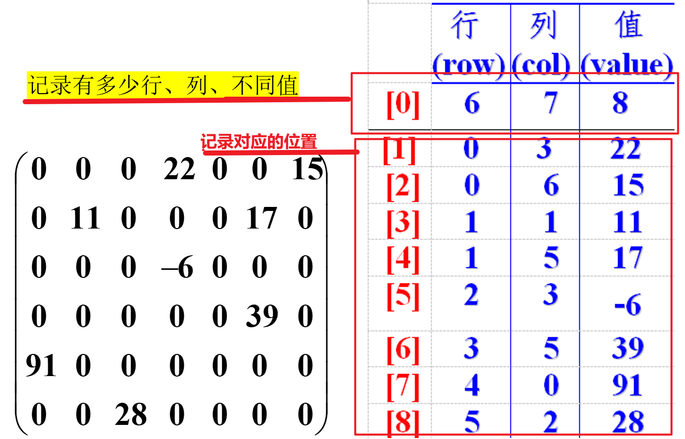

# 稀疏数组

当一个数组中大部分元素为０，或者为同一个值的数组时，此时大多数的数据是重复的、无意义的，可以使用稀疏数组来保存该数组。

**处理方法**

- 记录数组一共有几行几列，有多少个不同的值，并把具有不同值的元素的行列及值记录在一个小规模的数组中

  

  

```java
package com.study01;

public class SparseArray {

    public static void main(String[] args) {
        // 原始的二维数组 11*11 （棋盘）
        // 0 没有棋子 ； 1 白子 ；2 黑子
        int[][] chessboardArr = new int[11][11];
        chessboardArr[1][1] = 1;
        chessboardArr[5][4] = 2;
        for (int[] chessArr : chessboardArr) {
            for (int chess : chessArr) {
                System.out.print(chess + "\t");
            }
            System.out.println();
        }

        // 转为稀疏数组：
        // 1. 先遍历二维数组，得到非大量重复的元素个数
        int sum = 0;
        for (int[] chessArr : chessboardArr) {
            for (int chess : chessArr) {
                if (chess != 0) {
                    sum++;
                }
            }
        }
        // 2. 创建对应的稀疏数组，第一行留给统计行、列、不同值元素个数
        int[][] sparseArray = new int[sum + 1][3];
        sparseArray[0][0] = chessboardArr.length;
        sparseArray[0][1] = chessboardArr[0].length;
        sparseArray[0][2] = sum;
        int counter = 1;
        // 3. 给稀疏数组赋值
        for (int i = 0; i < chessboardArr.length; i++) {
            for (int j = 0; j < chessboardArr[i].length; j++) {
                if (chessboardArr[i][j] != 0) {
                    sparseArray[counter][0] = i;
                    sparseArray[counter][1] = j;
                    sparseArray[counter][2] = chessboardArr[i][j];
                    counter++;
                }
            }
        }

        for (int[] chessArr : sparseArray) {
            for (int chess : chessArr) {
                System.out.print(chess + "\t");
            }
            System.out.println();
        }

        // 稀疏数组-->原始二维数组
        // 1. 先读取稀疏数组的第一行，创建原始二维数组
        int[][] newChessboardArr = new int[sparseArray[0][0]][sparseArray[0][1]];
        // 2. 读取稀疏数组后几行的数据，并赋给原始二维数组 （如果需要可以先赋重复的、无意义的值）
        for (int i = 1; i < sparseArray.length; i++) {
            newChessboardArr[sparseArray[i][0]][sparseArray[i][1]] = sparseArray[i][2];
        }

        for (int[] chessArr : newChessboardArr) {
            for (int chess : chessArr) {
                System.out.print(chess + "\t");
            }
            System.out.println();
        }
    }

}
```
