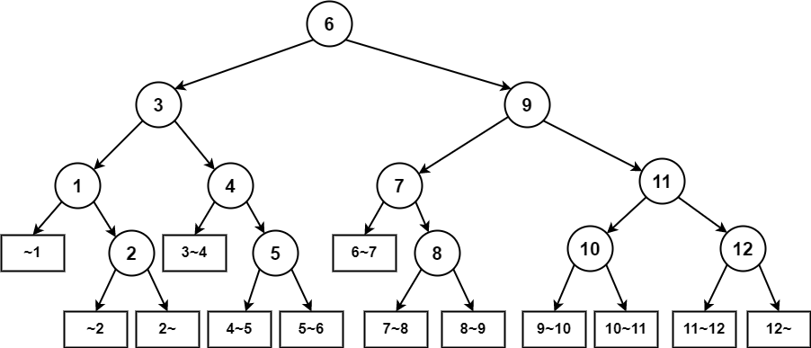

# 平均查找长度

$$
ALG=\sum^n_{i=1}P_iC_i
$$

> 二分查找的平均查找长度：长度为12的有序表采用顺序存储结构，在等概率的条件下：
>
>  
>
> - 查找成功：
>
> $$
> (1*2 + 2*2 + 3 * 4 + 4*5) \div 12 = \frac{37}{12}
> $$
>
> - 查找失败：
>
> $$
> (3 * 3 + 4 * 10) \div 13  = \frac{49}{13}
> $$

# 顺序查找

```java
public static int search(int arr[],int data){
    for(int i = 0;i < arr.length;i++){
        if(arr[i] == data){
            return i;
        }
    }
    return -1;
}
```

# 二分查找

- 要求有序的线性结构，需要先排序

```java
package search;

import java.util.Arrays;

public class halfSearchDemo {
    public static void main(String[] args) {
        int[] arr = new int[]{1, 2, 24, 34, 23, 12, 5, 45, 23, 13, 34, 12, 34, 78, 567, 23, 4, 5, 23};
        System.out.println(arr[search(arr, 78, 0, arr.length - 1)]);
    }

    public static int search(int[] arr, int data, int start, int end) {
        //先进行排序
        Arrays.sort(arr);
        int mid;
        while (start <= end) {
            mid = (start + end) / 2;
            if(arr[mid]==data){
                return mid;
            }else if (arr[mid] > data){
                end = mid -1;
            } else {
                start = mid +1;
            }
        }
        return -1;
    }
}
```

```java
package search;

import java.util.Arrays;

public class halfSearchDemo {
    public static void main(String[] args) {
        int[] arr = new int[]{1, 2, 24,34,23,12,5,45,23,13,34,12,34,78,567,23, 4, 5, 23};
        System.out.println(arr[search(arr, 78, 0, arr.length - 1)]);
    }

    public static int search(int[] arr, int data, int start, int end) {
        if(start >= end && arr[start] != data){
            return -1;
        }

        //先进行排序
        Arrays.sort(arr);
        int mid = (start + end) / 2;
        if (arr[mid] == data) {
            return mid;
        } else {
            if (arr[mid] >data) {
                return search(arr, data, start, mid);
            } else {
                return search(arr, data, mid + 1, end);
            }
        }
    }
}
```

# 数据结构中的查找