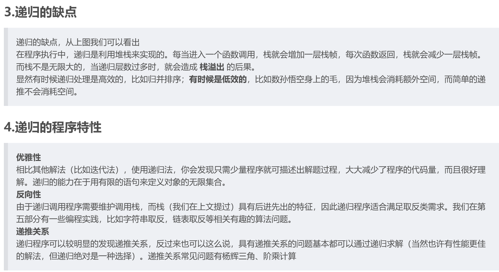
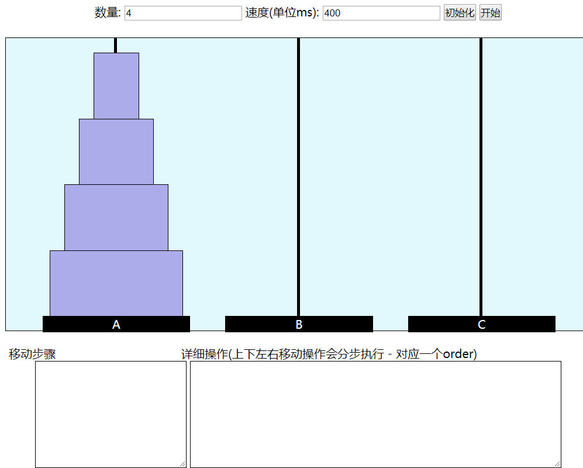

# 递归简述

**重点：对子问题的处理**

- 递归是自己调用自己
- 递归通常不在意具体操作，只关心**初始条件**、**结束条件**和**上下层的变化关系**。
- 递归函数需要有**临界停止点(结束条件)**，即递归不能无限制的执行下去。通常这个点为必须经过的一个数。
- 递归可以被栈替代。有些递归可以优化。比如遇到重复性的可以借助空间内存记录而减少递归的次数

  

# 阶乘

```java
public static int factorial(int num) {
    if (num == 0) {
        return 1;
    }else{
        return num * factorial(--num);
    }
}
```

# 斐波那契数列

- 求斐波那契的公式为：`F[n]=F[n-1]+F[n-2](n>=3,F[1]=1,F[2]=1)`

```java
public static int fibonacci(int num) {
    if (num <= 2) {
        return -1;
    } else {
        return fibonacci(num - 1) + factorial(num - 2);
    }
}
```

# 兔子产仔

- 如果一对两个月大的兔子以后每一个月都可以生一对小兔子，而一对新生的兔子出生两个月后才可以生小兔子。也就是说，1月份出生，3月份才可产仔。那么假定一年内没有发生兔子死亡事件，那么1年后共有多少对兔子呢？

1. 第一个月：1 1对小兔子
2. 第二个月：1 1对中兔子
3. 第三个月：2 1对大兔子 1对小兔子 
4. 第四个月：3 1对大兔子 1对中兔子 1对小兔子
5. 第五个月：5 2对大兔子 1对中兔子 2对小兔子
6. 第六个月：8 3对大兔子 2对中兔子 3对小兔子
7. 第六个月：13 5对大兔子 3对中兔子 5对小兔子
8. 。。。

- 函数关系为：F(n) = F(n-1) + F(n-2)

```java
package recursion;

public class RabbitBirth {
    public static void main(String[] args) {
        System.out.println(birth(12));
    }
    public static int birth(int n) { //n 月份
        if (n == 1 || n == 2) {
            return 1;
        }
        return birth(n - 1) + birth(n - 2);
    }
}
```

# 汉诺塔

[汉诺塔.](https://www.cnblogs.com/dmego/p/5965835.html#:~:text=汉诺塔（又称河内塔）问题是源于印度一个古老传说的益智玩具。.%20大梵天创造世界的时候做了三根金刚石柱子，在一根柱子上从下往上按照大小顺序摞着64片黄金圆盘。.%20大梵天命令婆罗门把圆盘从下面开始按大小顺序重新摆放在另一根柱子上。.%20并且规定，在小圆盘上不能放大圆盘，在三根柱子之间一次只能移动一个圆盘。.%20二．抽象为数学问题：.%20如下图所示，从左到右有A、B、C三根柱子，其中A柱子上面有从小叠到大的n个圆盘，现要求将A柱子上的圆盘移到C柱子上去，期间只有一个原则：一次只能移到一个盘子且大盘子不能在小盘子上面，求移动的步骤和移动的次数.%20解：（1）n%20%3D%3D,sum%20%3D%201%20次.%20%282%29%20n%20%3D%3D%202.)

  

- 在经典汉诺塔问题中，有 3 根柱子及 N 个不同大小的穿孔圆盘，盘子可以滑入任意一根柱子。一开始，所有盘子自上而下按升序依次套在第一根柱子上(即每一个盘子只能放在更大的盘子上面)。移动圆盘时受到以下限制:
  - (1) 每次只能移动一个盘子;
  - (2) 盘子只能从柱子顶端滑出移到下一根柱子;
  - (3) 盘子只能叠在比它大的盘子上。
- 请编写程序，用栈将所有盘子从第一根柱子移到最后一根柱子

**解**

- n = 1 时，直接把盘子从 A 移到 C；
- n > 1 时，
  - 先把上面 n - 1 个盘子从 A 移到 B（子问题，递归）；
  - 再将最大的盘子从 A 移到 C；
  - 再将 B 上 n - 1 个盘子从 B 移到 C（子问题，递归）

```java
class Solution {
    public void hanota(List<Integer> A, List<Integer> B, List<Integer> C) {
        movePlate(A.size(), A, B, C);
    }

    private void movePlate(int size, List<Integer> a, List<Integer> b, List<Integer> c){
        if(size == 1){ //到达最后一个
            int val = a.remove(a.size() - 1);
            c.add(val);
            return;
        }

        movePlate(size - 1, a, c, b);  //子问题：
        c.add(a.remove(a.size() - 1)); //
        movePlate(size - 1 , b, a, c); //子问题：
    }
}
```

- 错解：违背小盘子只能在大盘子上

```java
public class FactorialTest {
    public static void main(String args[]) {
        List<Integer> A = new ArrayList<Integer>();
        List<Integer> B = new ArrayList<Integer>();
        List<Integer> C = new ArrayList<Integer>();
        for (int i = 0; i < 10; i++) {
            A.add(i);
        }
        System.out.println(A);
        hannotTower(A, B, C, 1);
        System.out.println(B);
        System.out.println(C.toString());
    }

    public static void hannotTower(List<Integer> A, List<Integer> B, List<Integer> C, int key) {
        //当A的长度为1时，即停止
        if (A.size() == 0) {
            return;
        }
        //初始化C
        if (key-- > 0) {
            C.add(A.remove(A.size() - 1));
        }
        //当C的底盘大于A的顶时，直接将A的顶放入C，
        //否则将C的全部放入B，再将A的放入C，然后将B的再放入C
        move(A, B, C);
        hannotTower(A, B, C, key);
    }

    public static void move(List<Integer> A, List<Integer> B, List<Integer> C) {
        if (C.get(0) > A.get(A.size() - 1)) {
            C.add(A.remove(A.size() - 1));
        } else {
            while (C.size() > 0) {
                B.add(C.remove(C.size() - 1));
            }
            C.add(A.remove(A.size() - 1));
            while (B.size() > 0) {
                C.add(B.remove(B.size() - 1));
            }
        }
    }
}
```