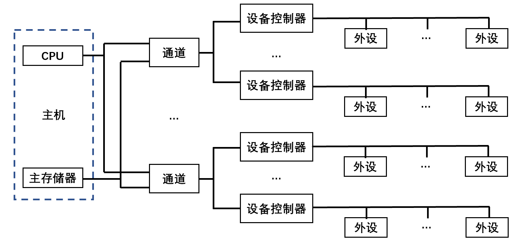

# 概论

## 冯·诺依曼体系

### 存储程序概念

- 存储程序概念：指令驱动+存储。指令、数据都在存储器中。

1. 计算机硬件系统：运算器、存储器、控制器、输入设备、输出设备。
2. 指令、数据以同等地位存于存储器，按地址寻访。
2. 指令、数据均用二进制代码。
2. 指令由操作码、地址码组成。
3. 指令在存储器中按顺序存放。
3. 以运算器为中心，IO设备与存储器之间的数据传送通过运算器完成。

### 硬件组成

 

### 存储器设计思想

#### 冯·诺依曼结构

 	

- 指令和数据混合存储在同一个存储器中：指令地址和数据地址执行同一个存储的不同物理位置，指令和数据的宽度相同。
- CPU和共享存储器间的信息交换：不能同时取指令和取操作数，且存储器的存取速度远低于CPU运算速度。

#### 哈弗结构

 

- 指令存储在程序存储器（PM)，数据存储在数据存储器（DM）：指令和数据可以有不同的数据宽度。
- 分离的程序总线和数据总线允许同时获取指令字和操作数而互不干扰：在一个机器周期内可以同时准备好指令和操作数，本条指令执行时可以预先读取下一条指令。

## 层次结构

 

## 性能指标

### 机器字长

- 字长：参与运算的数的基本位数：由加法器、寄存器的位数决定。
- 字长越长，精度越高。
- 字节（Byte）：
  - 1 B = 8 bit
  - 1 PB = 1024 TB 
  - 1 TB = 1024 GB 
  - 1 GB = 1024 MB 
  - 1 MB = 1024 KB 
  - 1 KB = 1024 B 

### 数据通路宽度

- 数据通路宽度：数据总线一次所能并行传送信息的位数。

### 存储容量

- 存储器容量：主存容量、辅存容量。
  - 主存容量：主存中存放二进制代码的总位数。

> 字节编址：以字节数表示存储容量。

- MAR（存储器地址寄存器）：存储单元个数。
- MDR（存储器数据寄存器）：存储字长。

$$
存储容量 = 存储单元个数 \times 存储字长 = 2 ^ {MAR位数} \times MDR位数 （Byte）
$$

### 运算速度

#### 吞吐量和响应时间

- 吞吐量：系统单位时间内处理请求的数量。
- 响应时间：系统对请求做出响应的时间 = CPU时间 + 等待时间。

#### 主频和CPU时钟周期

- CPU主频（时钟频率）：在CPU内数字脉冲信号振荡的速度。
- CPU时钟周期：CPU主频的倒数，CPU中最小的时间元素，每个动作至少需要一个时钟周期。

#### CPI

- CPI：每条指令执行所用的时钟周期数。
- IPC：每个时钟周期执行的指令数。 

$$
IPC = \frac{1}{CPI}
$$

#### CPU执行时间

$$
CPU执行时间 = \frac{CPU时钟周期数}{时钟频率} = \frac{指令数 \times CPI}{时钟频率}
$$

#### MIPS和MFLOPS

- MIPS：每秒执行多少百万条指令。

$$
MIPS = \frac{指令条数}{执行时间 \times 10^6} = 主频 \times IPC
$$

- MFLOPS：每秒执行多少百万次浮点运算。

$$
MFLOPS = \frac{浮点操作次数}{执行时间 \times 10^6}
$$

# 系统总线

## 基本概念

- 系统部件间的互连方式：分散连接、总线连接。

| 互连方式 | 说明                           |
| -------- | ------------------------------ |
| 分散连接 | 各部件之间使用单独的连线       |
| 总线连接 | 各部件连接到一组公共信息传输线 |

- 总线（Bus）：连接多个部件的信息传输线，是各部件共享的传输介质。
- 在同一时刻内，只允许有一个部件向总线发送信息，而多个部件可以同时从总线接受相同的信息。
- 总线实际上由许多传输线、通路组成。每条线可以一位一位地传输二进制代码，若干条传输线可以同时传输若各位二进制代码。

## 总线分类

- 按数据传送方式：并行传输总线、串行传输总线。
  - 并行传输总线按传输数据宽度：8位、16位、32位、64位等。
- 按使用范围：计算机总线、测控总线、网络通信总线等。
- 按连接部件：片内总线、系统总线、通信总线。

### 片内总线

- 片内总线：芯片内部的总线。CPU芯片内部、寄存器与寄存器之间、寄存器与ALU之间等。

### 系统总线

- 系统总线（板级总线：一块电路板上各芯片间的连接）：CPU、主存、I/O设备（I/O接口）各大部件（通常安放在各个插件板上）之间的信息传输线。

| 按传送信息的不同 | 方向                                           | 传输                         | 位数                     |
| ---------------- | ---------------------------------------------- | ---------------------------- | ------------------------ |
| 数据总线         | 双方向                                         | 读入/输出数据                | 与机械字长、存储字长有关 |
| 地址总线         | 单方向                                         | CPU向主存/外设传输地址信息   | 与存储单元个数有关       |
| 控制总线         | 单方向：对任一控制线 双方向：对控制线总体 | 控制信号 监视各部件状态 |                          |

#### 数据总线

- 数据总线：传输各功能部件之间的数据信息，是双向传输总线。
- 数据总线的位数（数据总线宽度）：位数与机械字长、存储字长有关，一般为8位、16位、32位。

> 如果数据总线地宽度为8位，指令字长位16位，则CPU在取指阶段必须2次访问主存。

#### 地址总线

- 地址总线：指出数据总线上的 源数据、目的数据 在主存单元或I/O设备的地址。由CPU输出，单向传输。

> 从存储器读取一个数据，CPU要将此数据所在存储单元的地址送到地址线。
>
> 某数据经I/O设备输出时，CPU将数据送到数据总线、将该输出设备的地址送到地址总线。

- 地址的位数（MAR位数）与存储单元个数有关。

> 地址线为20根，则对应的存储单元个数为 $2^{20}$ 。

#### 控制总线

- 控制总线：发出各种控制信号的传输线。

> 数据总线、地址总线都是被挂在总线上的所有部件共享的，如何使各部件能在不同时刻占有总线使用权，需要依靠控制总线完成。

- 监视各部件状态。

> 查询设备处于“忙”或“闲”，是否出错等。

- 对任一控制线，其传输是单向的；而对控制总线总体，可认为是双向的。

> - 单向：存储器读/写命令或I/O设备读/写命令都是由CPU发出的。
>
> - 双向：对CPU而言，控制信号既有输出也有输入。当某设备准备就绪时，便向CPU发出中断请求；当某部件需要获得总线使用权时，也向CPU发送总线请求。

| 控制信号 | 说明                                       |
| -------- | ------------------------------------------ |
| 时钟     | 同步各种操作                               |
| 复位     | 初始化所有部件                             |
| 总线请求 | 某部件需获得总线使用权                     |
| 总线允许 | 部件已获得控制权                           |
| 中断请求 | 某部件提出中断请求                         |
| 中断响应 | 中断请求已被接收                           |
| 存储器写 | 将数据总线上的数据写至存储器的指定地址单元 |
| 存储器读 | 将指定存储单元中的数据读到数据总线         |
| I/O读    | 从指定的I/O端口将数据读到数据总线          |
| I/O写    | 将数据总线上的数据输出到指定的I/O端口内    |
| 传输响应 | 数据已被接收、已将数据送至数据总线         |

### 通信总线

| 通信总线 | 串行通信                                                     | 并行通信                                                     |
| -------- | ------------------------------------------------------------ | ------------------------------------------------------------ |
| 传输方式 | 数据在单条1位宽的传输线上，一位一位地按顺序分时传送。        | 数据在多条1位宽的传输线上，同时由源传送到目的地。            |
| 应用场景 | 适宜远距离的数据传输，从几十米至数千千米，可以利用现有的电话网络实现远程通信，费用低。 | 适宜近距离的数据传输，通常小于30m，在短距离内并行数据传输速率比串行高；但逻辑器件价格趋低，通信线路费用趋高 |

> **1字节的数据：**
>
> - 串行通信：1条传输线分8次由低位到高位按顺序逐位传输。
> - 并行通信：8条并行传输线同时由源传送到目的地。

## 总线特性和性能指标

### 总线特性

- 机械特性：总线在机械连接方式上的一些性能。
- 电气特性：总线的每一根传输线上信号的传递方向和有效的电平范围。

> **信号**
>
> - 输出信号：CPU发出的信号。
> - 输入信号：送入CPU的信号。
>
> **电平**
>
> - TTL电平定义：
>   - 高电平：1。
>   - 低电平：0。
> - RS-232：
>   - 高电平（高于+3V）：0。
>   - 低电平（低于-3V）：1。
>   - 额外电平信号：-10V、+10V左右。

- 功能特性：总线中每条传输线的功能。
- 时间特性：每条总线上的各种信号相互存在一种有效时序的关系。

### 总线性能指标

- 总线宽度：数据总线的根数，bit 位。
- 总线带宽：单位时间内总线上传输数据的位数，MBps。

$$
总线带宽（MBps） = 总线工作频率（MHz） \times 总线宽度（B）
$$

- 时钟同步/异步：总线上的数据与时钟同步/异步工作的总线。
- 总线复用：一条信号线分时传送两种信号。
- 信号线数：地址总线+数据总线+控制总线 的总线数。
- 总线控制方式：突发工作、自动配置、仲裁方式、逻辑方式、计数方式等。
- 负载能力（驱动能力）：当总线接上负载后，总线输入输出的逻辑电平是否能保持载正常的额定范围内。

## 总线标准

### ISA

- ISA总线（AT总线）：独立于CPU的总线时钟，不支持多台具有申请总线控制权的设备。所有数据传送必须通过CPU或DMA接口管理。
- ISA总线时钟频率为8MHz，最大传输率为16MBps，数据线为16位，地址线位24位。

### EISA

- EISA总线：与ISA完全兼容，从CPU分离总线控制权。
- EISA总线时钟频率为8MHz，最大传输率为33MBps，数据线为32位，地址线位32位，扩充DMA访问范围达$2^{32}$。

### VESA

- 局部总线：系统外为两个以上模块提供的高速传输信息通道。

- VESA总线（VL-BUS）：采用CPU的时钟频率达33MHz，数据线为32位，可扩展至64位，配有局部控制器，最大传输速率达133MBps。
- 通过局部总线控制器，将高速I/O设备直接挂在CPU上，实现CPU与高速I/O设备之间的高速数据交换。

### PCI

1. 高性能：PCI总线不依附于某个具体处理器的局部总线，与CPU时钟频率无关。自身采用33MHz和66MHz的总线时钟，数据线为32位，可扩展到64位，传输速率132MBps~528MBps。支持突发工作方式。
2. 良好的兼容性：PCI总线部件和插件接口相对于处理器是独立的。PCI和ISA、EISA均可兼容。
3. 即插即用（Plug and Play）。
4. 多主设备。
5. 与处理器和存储器子系统完全并行操作：PCI总线通过PCI桥路与CPU相连，多级缓冲。
6. 数据和地址奇偶校验。
7. 电压标准：5V、3.3V。
8. 可扩充性好。
9. 软件兼容性好。
10. 多路复用。

### AGP

- AGP（Accelerated Graphics Port 加速图形接口）：显卡专用的局部总线。

### RS-232C

- 载波电话。

### USB

1. 即插即用。
2. 连接能力。
3. 数据传输率。
4. 标准统一。
5. 连接电缆轻巧，电源体积缩小。
6. 生命力强。

## 总线结构

**单总线结构**

 

**多总线结构**

 

**系统连接** 主机、通道、设备控制器、外部设备。

- 通道：承担I/O操作管理的主要部件。
  - 较小的系统：设备控制器和外设合并、通道和CPU合并。
  - 较大的系统：单独设置通道部件、或将通道发展为外围处理机。

## 总线控制

### 判优控制（仲裁逻辑）

- 按对总线有无控制功能分为： 主设备、从设备。

| 模块（设备） | 说明                                               |
| ------------ | -------------------------------------------------- |
| 主设备       | 对总线有控制权 启动总线上的消息传送           |
| 从设备       | 对总线没有控制权 只能响应主设备发来的总线命令 |

- 多个主设备同时使用主线时：由总线控制器的判优、仲裁逻辑确定，只有获得总线使用权的主设备才能开始传送数据。

| 总线判优控制 | 说明                                    | 细分                                           |
| ------------ | --------------------------------------- | ---------------------------------------------- |
| 集中式       | 控制逻辑集中在一处                      | 链式查询 计数器定时查询 独立请求方式 |
| 分布式       | 控制逻辑分散在与总线连接的各个部件/设备 |                                                |

| 集中式总线判优控制 | 确定总线使用权的控制线数量 |
| ------------------ | -------------------------- |
| 链式查询           | 2                          |
| 计数器定时查询     | $\log _2 ^n$               |
| 独立请求方式       | 2n                         |

#### 链式查询

- 链式查询：总线同意BG信号串行地从一个I/O接口送到下一个I/O接口。如果BG到达的接口有总线请求BR信号，BG信号就不再往下传，即该接口获得总线使用权，并建立总线忙BS信号，表示其占用了总线。

 

1. 离总线最近的设备具有最高的优先级。优先级别低的设备很难获得请求。

2. 只需几根线即可按一定优先次序实现总线控制，易扩充设备。

3. 对电路故障敏感。

#### 计数器定时查询

- 计数器定时查询：总线控制部件接到BR的总线请求信号后，在总线未被使用时，总线控制部件中的计数器开始计数，并通过设备地址线，向各设备发出一组地址信号。当某个请求占用总线的设备地址和计数值一致时，获得总线使用权，并终止计数查询。

- 设备的优先级由计数方式决定：
  1. 从0开始计数：固定优先次序，设备的优先级按0..n的顺序降序排列。
  2. 从上次计数的终止点开始（循环）：设备的优先级相同。
  3. 计数器初始值改由程序设置。

#### 独立请求方式

- 独立请求方式：每台设备均有一对总线请求线BR$_i$和总线同意线BG$_i$。当设备要求使用总线时，便发出该设备的请求信号。总线控制部件中有一排电路，根据优先次序确定响应哪台设备的请求。

- 响应速度快、优先次序控制灵活，控制线数量多、总线控制复杂。

### 通信控制

- 通信控制：以获得总线使用权的先后顺序分时占用总线。
- 总线周期：完成一次总线操作的时间。

1. 申请分配阶段：主设备提出总线申请，由总线仲裁机制决定下一传输周期的总线使用权授予某一申请者。
2. 寻址阶段：获得总线使用权的主设备通过总线发出本次要访问的从设备地址、有关命令，启动参与本次传输的从设备。
3. 传数阶段：主设备和从设备进行数据交换，数据从源模块发出，经数据总线流入目标模块。
4. 结束阶段：主设备相关信息均从系统总线撤除，让出总线使用权。

- 通信控制方式：同步通信、异步通信、半同步通信、分离式通信。

#### 同步通信

- 同步通信：通信双方统一时标控制数据传送。
  - 时标：通常由CPU的总线控制部件发出送到总线的所有部件；或由各个部件各自的时序发生器发出。
  - 必须由总线控制部件发出的时钟信号对时标进行同步。

- 总线传输周期：连接在总线上的两个部件完成一次完整且可靠的信息传输时间，包含4个时钟周期（$T_1、T_2、T_3、T_4$）。

| 传输周期 | 读命令                           | 写命令                                                       |
| -------- | -------------------------------- | ------------------------------------------------------------ |
| T1       | 主模块发地址                     | 主模块发地址                                                 |
| T1.5     |                                  | 主模块提供数据                                               |
| T2       | 主模块提供数据                   | 主模块发出写命令，从模块接收到命令后，必须在规定时间内将数据总线上的数据写到地址总线指明的单元。 |
| T3       | 从模块提供数据                   |                                                              |
| T4       | 主模块撤销读命令，从模块撤销数据 | 主模块撤销写命令、数据等信号                                 |

- 规定明确、统一，模块间的配合简单一致。

1. 主、从模块时间配合属于强制性同步：必须在规定时间内完成规定的要求。
2. 对所有从模块使用同一限时，必须按最慢速度的部件来设计公共时钟。

- 同步通信中：总线传输周期越短、数据线的位数越多，直接影响总线的数据传输率。

> 假定总线的时钟频率为100MHz，总线传输周期为4个时钟周期，总线宽度为32位。
>
> 1. 求总线的数据传输率。
>
> 1个时钟周期 = 1 / 100MHz = 0.01 us
>
> 总线传输周期 = 4 `*` 0.01 us = 0.04 us
>
> 总线宽度 = 32 bit = 4 B
>
> 故：总线数据传输率 = 4 B / 0.04 us = 100 MBps
>
> 2. 提高1倍数据传输率的措施。
>
> （1） 在不改变总线时钟频率的前提下，将总线宽度改为64位。
>
> （2）在不改变总线宽度的前提下，将总线时钟频率改为200MHz。 

#### 异步通信

- 异步通信：应答方式，允许各模块速度不一致，没有公共的时钟标准。
  - 应答方式（握手方式）：主模块发出请求信号（request）后，一直等待从模块反馈回来响应信号（acknowledge）后才开始通信。主、从模块之间存在两条应答线（握手信号线 Handshaking）。

| 应答方式 |  |
| -------- | ------------------------------------------------------------ |
| 不互锁   | 主模块发出请求信号后，不必等待接到从模块的回答信号，而是经过一段时间，确认从模块已收到请求信号后，便撤销其请求信号（不互锁）。 从模块接收到请求信号后，在条件允许时发出回答信号，且经过一段时间（不同设备的时间长度不同）确认主模块已收到回答信号后，自动撤销回答信号（不互锁）。 |
| 半互锁   | 主模块发出请求信号后，必须待接到从模块的回答信号后再撤销其请求信号（互锁）。 从模块接收到请求信号后，发出回答信号，但不必等待获知主模块的请求信号已撤销，而是隔一段时间后自动撤销其回答信号（不互锁）。 |
| 全互锁   | 主模块发出请求信号后，必须待接到从模块的回答信号后再撤销其请求信号（互锁）。 从模块接收到请求信号后，发出回答信号，必须获知主模块的请求信号已撤销后，再撤销其回答信号（互锁）。 |

- 异步通信可用于并行传送、串行传送。
- 异步串行通信：

1. 为保证被传输的字符，约定字符格式：1个起始位（低电平）、5~8个数据位、1个奇偶校验位、1/1.5/2个终止位（高电平）。
2. 传送时，起始位后紧跟要传送字符的最低位，每个字符的结束为高电平的终止位。起始位至终止位构成1帧，两帧之间的间隔可以是任意长度的。

 

- 异步串行通信的数据传送速率：
  - 波特率（bps 位/秒）：单位时间内传送二进制数据的位数。
  - 比特率（bps 位/秒）：单位时间内传送有效二进制数据的位数。

> 异步串行系统中，假设每秒传输120个数据帧，其字符格式规定包含1个起始位、7个数据位、1个奇检验位、1个终止位。求波特率、比特率。
>
> 题中1个数据帧包含 1 + 7 + 1 + 1 = 10 位
>
> 波特率：10 `*` 120 bit  / 1 s = 1200 bps
>
> 比特率：7 `*` 120 bit / 1 s = 840 bps

> 画图说明异步串行传输方式发送十六机制数据95H。字符格式：1位起始位、8位数据位、1位偶检验位、1位终止位。
>
> 95H转为十进制：9 `*` $16^1$  + 5 `*` $16^0$ = 149 = $2^7 + 2^4 + 2^2 + 2^0$
>
> 149转为二进制：10010101
>
> 从低位到高位传送字符：10010101-->10101001
>
>  

#### 半同步通信

- 半同步通信：保留同步通信的基本特点、且可以像异步通信允许不同速度的模块和谐工作。
  - 增设等待响应信号线（$\overline{WAIT}$），采用插入时钟（等待）周期的措施来协调通信双方的配合。

| 时钟周期（T） | 说明                                                   |
| ------------- | ------------------------------------------------------ |
| T1            | 主模块发出地址信息                                     |
| T2            | 主模块发出命令                                         |
| Tw            | $\overline{WAIT}$为低电平时：进入等待，Tw宽度和T一致。 |
| T3            | 从模块提供数据                                         |
| T4            | 主模块撤销读命令，从模块撤销数据                       |

1. 如果从模块工作速度较慢，无法在T3时刻提供数据，则必须在T3到来之前通知主模块，给出$\overline{WAIT}$信号。
2. 如果主模块测得$\overline{WAIT}$为低电平，则插入一个等待周期Tw，不立即从数据线上取数。
3. 如果主模块在下一个时钟周期到来时又测得$\overline{WAIT}$为低电平，则重复第2步，继续等待。
4. 直到主模块测得$\overline{WAIT}$为高电平，主模块就将下一个时钟周期当作正常周期T3，即时获取数据。
5. T4结束传输。

#### 分离式通信

> 命令传输周期中，除申请主线阶段外，其余主要的时间花费：
>
> 1. 主模块通过传输总线向从模块发送地址和命令。
> 2. 从模块按照命令进行读数据的必要准备。
> 3. 从模块经数据总线向主模块提供数据。
>
> - 其中第2项，系统总线在从模块内部读数据过程中并无实质性的信息传输，处于空闲状态。分离式通信解决该消极等待。

- 分离式通信：将一个传输周期（总线周期）分解为两个子周期，且每个模块都是主模块。
  - 第一个子周期：A模块在获得总线使用权后，将命令、地址以及其他有关信息（主模块编号等）发到系统总线，经总线传输后，由有关的B模块接收。A模块发送完这些信息就立即放弃总线使用权。
  - 第二个子周期：B模块收到A模块发来的有关命令信号后，经选择、译码、读取等一系列内部操作，将A模块所需的数据准备号，便由模块B申请申请总线使用权，一旦获准，B模块便将A模块的编号、B模块的地址、A模块所需的数据等一系列信息送到总线，供A模块接收。

1. 各模块欲占用总线使用权必须提出申请。
2. 在得到总线使用权后，主模块在限定的时间内向对方发送信息，采用同步方式传输，不再等待对方的回答信号。
3. 各模块在准备数据的过程中都不占用总线，使总线可接受其他模块的请求。
4. 总线被占用时都在做有效工作（发送命令、传送数据），不存在空闲等待时间，充分利用总线的有效占用，实现了总线在多个主、从模块间进行信息交叉重叠并行式传送。

# 存储器

## 概述

### 存储器分类

 

| 存储介质     | 特点：能寄存“0”、“1”两种代码，并能区别两种状态的物质/元器件  |
| ------------ | ------------------------------------------------------------ |
| 半导体存储器 | 存储元件由半导体器件组成的存储器。 <table><tr><td>优点</td><td>体积小、功耗小、存取时间短。</td></tr><tr><td>缺点</td><td>易失性存储器：电源消失时，所存储信息也消失。</td></tr></table> <table><tr><td>双极型（TTL）</td><td>高速。</td></tr><tr><td>MOS</td><td>高集成度、制造简单、成本低廉、功耗小。</td></tr></table> |
| 磁表面存储器 | 在金属/塑料基体表面涂一层磁性材料作为记录介质，工作时，磁场随载磁体高速运转，用磁头在磁层上进行读/写操作。 按磁体形状不同：磁盘、磁带、磁鼓（很少采用）。 非易失性：磁表面物质具有矩形磁滞回线特性，按其剩磁状态的不同区分“0”、“1”，且剩磁状态不容易丢失。 |
| 磁芯存储器   | 磁芯：由硬磁材料制成的环状元件，在磁芯中穿有驱动线（通电流）和读出线进行读写操作。 不易失的永久记忆存储器。 体积大、工艺复杂、功耗太大。（几乎不采用，被半导体存储器替代） |
| 光盘存储器   | 应用激光在记录介质（磁光材料）上进行读/写的存储器。 非易失性。 密度高、耐用性好、可靠性高、可互换性强。（用于计算机系统） |

| 存取方式                                    | 特点                                                         |
| ------------------------------------------- | ------------------------------------------------------------ |
| 随机存储器（RAM） Random Access Memory | 可读/写存储器。 存储器的任何一个存储单元的内容都可以随机存取，存取时间与存储单元的物理位置无关。 <table><tr><td>存储信息原理的不同</td><td>说明</td></tr><tr><td>静态RAM</td><td>以触发器原理寄存信息</td></tr><tr><td>动态RAM</td><td>以电容放电原理寄存信息</td></tr></table> |
| 只读存储器（ROM） Read Only Memory     | 只能将存储内容读出，而不能重新写入。 存放固定不变的数据。 与RAM共同作为主存的一部分，统一构成主存的地址域。 发展：掩模型只读存储器（MROM）、可编程只读存储器（PROM）、可擦除可编程只读存储器（EPROM）、电可擦除可编程只读存储器（EEPROM）。 |
| 串行访问存储器                              | 对存储单元进行读/写操作时，需按其物理位置的先后顺序寻找地址。信息所处位置不同，读/写时间不同。 <table><tr><td>类型</td><td>访问方式</td></tr><tr><td>顺序存取存储器（磁带）</td><td>读/写时必须从介质的始端开始按顺序寻找信息</td></tr><tr><td>直接存取存储器（磁盘）</td><td>首先直接指出该存储器中的某个小区域（磁道）（直接访问），再按顺序寻访，直到找到位置。</td></tr></table> |

| 作用               | 特点                                                         |
| ------------------ | ------------------------------------------------------------ |
| 主存储器（主存）   | 可以和CPU直接交换信息。 速度快、容量小、单位价格高。    |
| 辅助存储器（辅存） | 作为主存的后援存储器，存放当前暂时不用的程序和数据。 不能与CPU直接交换信息。 速度慢、容量大、单位价格低。 |
| 缓存存储器         | 于两个速度不同的部件之间起缓冲作用。                         |

### 缓存-主存-辅存三级存储系统

- 存储器的主要性能指标：速度、容量、每位价格（位价）。
  - 速度越高、位价就越高；容量越大，速度必越低，位价就越低。

 

 

#### 缓存-主存

- 缓存-主存层次：解决CPU和主存速度不匹配的问题。缓存的速度比主存的高，将CPU近期要使用的信息调入缓存，CPU便可直接从缓存获取信息，提高访存速度。由于缓存的容量小，需要不断地将主存的内容调入缓存，使缓存中原有的信息被替换。
- 缓存-主存之间的数据调动是由硬件自动完成的，对程序员透明。

#### 主存-辅存

- 主存-辅存层次：解决存储系统容量问题。辅存的速度比主存低，而且不能直接和CPU交换信息，但辅存的容量大于主存，可存放大量暂时未使用到的信息。当CPU需要使用到这些信息时，将辅存的内容调入主存，供CPU直接访问。
- 缓存-主存之间的数据调动是由硬件和操作系统共同完成的。

> - 虚拟存储系统：编程的地址范围与虚拟存储器的地址空间相对应。
>   - 逻辑地址转换为物理地址由硬件和操作系统共同完成，对程序员透明。
>
> | 指令地址                                     | 说明                                                 |
> | -------------------------------------------- | ---------------------------------------------------- |
> | 虚拟地址 （虚地址、虚存地址、逻辑地址） | 编程时大于实际主存空间的可用地址空间，实际并不存在。 |
> | 物理地址                                     | 主存的实际地址，程序执行过程中真正访问的地址。       |
>
> - 当虚地址的内容在主存时，机器可直接使用；若虚地址的内容不在主存，则必须将此虚地址的内容传递到主存的合适单元，再被机器使用。

## 主存储器

### 概述

#### 主存基本组成

 

#### 主存、CPU读写过程

- 从存储器读出某一信息字时：

1. 首先由CPU将该字的地址送到MAR，经地址总线送至主存，然后发出读命令。
2. 主存接到读命令后，得知需要该地址单元的内容读出，完成读操作，将该单元的内容读至数据总线。
3. 由CPU决定该信息由MDR送至何处。

- 向主存存入一个信息字时：

1. 首先CPU将该字所在主存单元的地址经MAR送至地址总线，并将信息字送入MDR，之后向主存发出写命令。
2. 主存接到写命令后，将数据总线上的信息写入对应地址总线指出的主存单元内。

#### 存储单元地址的分配

- 主存各存储单元的空间位置由单元地址号表示，地址总线指出存储单元地址号，根据该地址可读出/写入一个存储字。

> 不同的机器存储字长不同，但都是8的倍数：通常使用8位二进制数表示一个字节，以满足字符处理需要。

- 字寻址、字节寻址。

#### 技术指标

- 主存的主要技术指标：存储容量、存储速度。

##### 存储容量

- 存储容量：主存能存放二进制代码的总位数。

$$
\tag{位数}
存储容量 = 存储单元个数 \times 存储字长
$$

$$
\tag{字节总数}
存储容量= 存储单元个数 \times 存储字长/8
$$

> 某机器内存的存储容量为256MB，则按字节寻址的地址线位数对应28位。

##### 存储速度

- 存储速度：由存取时间、存取周期表示。
- 存取时间（存储器的访问时间 Memory Access Time）：启动一次存储器操作（读/写）到完成该操作所需要的全部时间。

| 存取时间 | 说明                                                         |
| -------- | ------------------------------------------------------------ |
| 读出时间 | 从存储器接收到有效地址开始，到产生有效输出所需的全部时间。   |
| 写入时间 | 从存储器接收到有效地址开始，到数据写入被选中单元为止所需的全部时间。 |

- 存取周期（Memory Cycle Time）：存储器进行连续两次独立的存储器操作所需的最小间隔时间。
  - 存取周期通常大于存取时间。

> 现代MOS型存储器的存取周期可达到100ns
>
> 双极型TTL存储器的存取周期接近于10ns

##### 存储器带宽

- 存储器带宽：单位时间内存储器存取的信息量（字/秒、字节/秒、位/秒），与存取周期密切相关，衡量数据传输率。

> 若存储器的存取周期为500ms，每个存取周期可访问16位，则其带宽为32M bit/s

- 提高存储器带宽的措施：

1. 缩短存取周期。
2. 增加存储字长，使每个存取周期可读/写更多的二进制位数。
3. 增加存储体。

### 半导体存储芯片

- 半导体存储芯片：超大规模集成电路制造工艺，一个芯片内集成具有记忆功能的存储矩阵、译码驱动电路、读/写电路等。

| 基本结构  | 说明                                                         |
| --------- | ------------------------------------------------------------ |
| 译码驱动  | 将地址总线送来的地址信号翻译成对应存储单元的选择信号， 该信号在读/写电路的配合下完成对被选中单元的读/写操作。 |
| 读/写单元 | 读出放大器、写入电路：完成读/写操作。                        |

- 存储芯片通过地址总线、数据总线、控制总线与外部连接。

 

- 地址线和数据线的位数共同反映存储芯片的容量。

| 类型   | 输入 | 位数                                                |
| ------ | ---- | --------------------------------------------------- |
| 地址线 | 单向 | 位数与芯片容量有关                                  |
| 数据线 | 双向 | 位数与芯片可读出/写入的数据位数有关、与芯片容量有关 |

> 地址线10根，数据线4根：芯片容量为$2^{10}*4 = 4K$位。
>
> 地址线14根，数据线1根：芯片容量为$2^{14}*1 = 16K$位。

- 不同存储芯片的读/写控制线、片选线可以不同。

| 控制线      | 作用                                                         |
| ----------- | ------------------------------------------------------------ |
| 读/写控制线 | 决定芯片进行读/写操作                                        |
| 片选线      | 选择存储芯片 半导体存储器由多个芯片组成，通过片选信号来确定被选中的芯片。 |

> 一个64K`*`8位的存储器，可由32片16K`*`1位的存储芯片组成：每次读出一个存储字时，只需选中8片。
>
> 

- 译码驱动方式：线选法、重合法。

### 随机存取存储器

- 随机存取存储器按其存储信息的原理分为：静态RAM、动态RAM。

#### 静态RAM（SRAM）

##### 基本单元电路

- 存储器的基本单元电路：存储器中用于存储“0”、“1”代码的电路。

 

#### 动态RAM（DRAM）

# 数据的机器层次表示

## 无符号数、有符号数

- 无符号数：寄存器的位数反映表示范围。
- 有符号数：分为数值和符号两部分，最高位表示符号。

## 机器数

- 真值：带符号（+、-）的数。
- 机器数：符号数字化（用0、1表示符号）的数，按机器的字长补足位数（补0）。

$$
2^{4} = 10000 \\
2^{-4} = 0.0001
$$

### 原码

- 最高位为符号位：0正数、1负数。

$$
[X]_原 = 
\begin{cases}
X & 0 \le X < 1 \\
1-X = 1+|x| & -1 < X \le 0
\end{cases} 
\tag{纯小数}
$$

$$
[X]_原 = 
\begin{cases}
X & 0 \le X < 2^n \\
2^n - X = 2^n + |X| & -2^n < X \le 0
\end{cases} 
\tag{纯整数}
$$

- 真值0有两种表示：（5位寄存器）

$$
[+0]_原 = 00000\\
[-0]_原 = 10000
$$

### 反码

- 符号：最高位，不进行取反。
- 数值：
  - 正数：与原码相同
  - 负数：对原码的数值取反。

$$
[X]_反 = 
\begin{cases}
X & 0 \le X < 1 \\
(2 - 2^{-n}) + X & -1 < X \le 0
\end{cases}
\space (mod \space 2-2^{-n})
\tag{纯小数}
$$

$$
[X]_反 = 
\begin{cases}
X & 0 \le X < 2^n \\
(2^{n+1} - 1) + X & -2^n < X \le 0
\end{cases}
\space (mod \space 2{n+1} - 1)
\tag{纯整数}
$$

- 真值0的两种表示：（5位）

$$
[+0]_反 = 00000\\
[-0]_反 = 11111
$$

### 补码

**补数** 补码的原理：使负数通过与其同余的整数来表示。

- 模 M：计算器的容量。
- 同余：整数A和B在以M为模时相等：A = B (mod M).。
  - 5 = 17 (mode 12)、-2 = 10 (mod 12)。
- 同余的两个数具有互补关系：通过与负数等价的正数来表示。
  - 9 - 5 = 9 + (-5) = 9 + (12 - 5) = 4 (mod 12)。

$$
[X]_补 = 
\begin{cases}
X & 0 \le X < 1 \\
2 + X = 2 - |X| & -1 \le X < 0
\end{cases} 
\space (mod \space 2)
\tag{纯小数}
$$

$$
[X]_补 = 
\begin{cases}
X & 0 \le X < 2^n \\
2^{n+1} + X = 2^{n+1} - |X| & -2^n \le X < 0
\end{cases}
\space (mod \space 2^{n+1})
\tag{纯整数}
$$

- 真值0只有一种表示：（5位）

$$
[+0]_补 = [-0]_补 = 00000
$$

**补码**

- 符号：最高位，不进行取反。
- 数值：
  - 正数：与原码相同
  - 负数：对原码的数值取反，且在最低位+1。（在反码的基础上+1）

**补码的优点**

1. 简化计算机中的加减运算：无需讨论符号，只需将它们的补码相加，然后将和的补码转换为原码即可。
2. 避免原码和反码中存在的数值范围不连续的问题：在补码中，正数和负数的范围是相连续的。
3. 有效地使用计算机内存，并且在处理负数时，与其他进制相比，可以省略接口符、标志位等特征，从而减少硬件开销。

### 移码

- 偏置值

$$
[X_移] = 偏置值 + X
$$

**移码的特点**

1. 最高位（符号位）：0负数、1正数。
2. 直观反应真值大小：
    - 移码全0：最小负数
    - 移码全1：最大正数
3. $[+0]_移 = [-0]_移 = 10000000$
4. 无符号数：移码将真值映射到正数域。
5. 同一数值的移码和补码：只有符号位相反。

### 三种机器数的转换、比较

$$
\tag{5位寄存器}
\begin{align}
&[-1101]_原 = 11101 \\
&[-1101]_补 = 10011 \\
&[-1101]_反 = 10010
\end{align}
$$

1. 对于正数，等于真值本身；对于负数不同表示。

2. 最高位都是符号位：

   - 原码：符号位和数值位分开处理。

   - 补码和反码：符号位和数值位一起参与运算。

3. 对于真值0的表示：

   - 原码、反码：两种表示。

   - 补码只有一种表示。

4. 正负数表示范围：

   - 原码、反码：正负数表示的范围相对0对称。
   - 补码：负数表示范围较正数的大，能多表示一个绝对值最大的负数： $ -2^n 或 -1 $ 。

## 定点表示、浮点表示

### 定点表示法

- 所有数据的小数点位置固定不变：
  - 定点小数（纯小数）：小数点隐含在最高有效数位之前、符号位之后。
  - 定点整数（纯整数）：小数点隐含在最低有效数位之后。
- 参加运算的数和结果都必须保证落在该定点数所能表示的数值范围，否则溢出。

#### 定点小数

#### 定点整数

### 浮点表示法

$$
N = M \times r^E
$$

- r：浮点数阶码的底，通常r=2，在浮点数中隐含。
- E：阶码 Exponent，纯整数（移码/补码）。浮点数的指数部分，数量级、小数点的位置。
- M：尾数 Mantissa，纯小数（原码/补码）。浮点数的小数部分，精度。

 

### 尾数基数 r

**对浮点数的影响**

- r增大：

1. 可表示数的范围增大
2. 可表示数的个数增加
3. 数在数轴上的分布密度越稀疏
4. 可表示数的精度下降
5. 降低因尾数右移导致的运算精度损失
6. 使运算中移位的次数减少，提高运算速度

### 浮点数规格化

- 规格化：规定尾数的最高数位必须是一个有效值。
- 浮点数的表示形式不唯一：需要找到规格化浮点数。

**规格化浮点数 M的绝对值范围**

$$
\frac{1}{r} \le |M| < 1
$$

### IEEE 754 标准浮点数

# 指令系统结构

