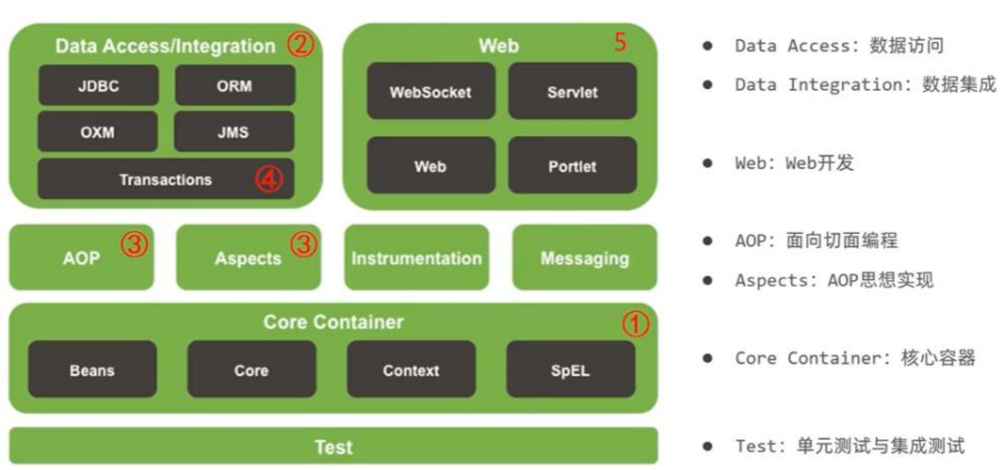
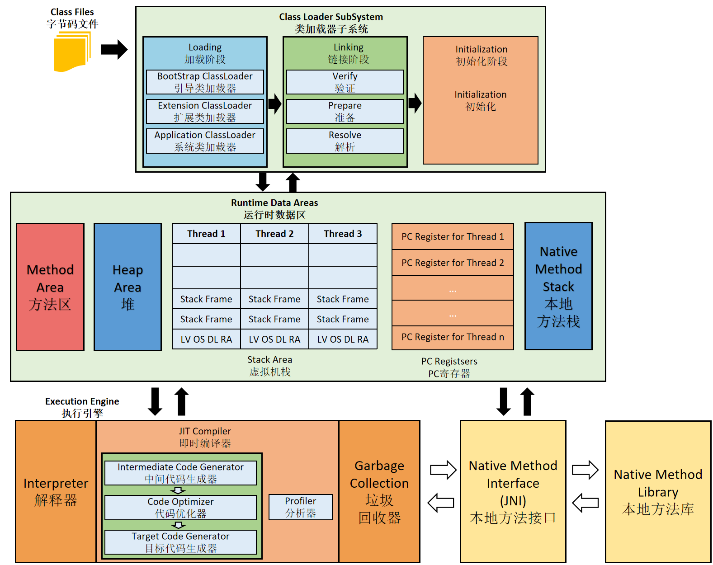

# Java

## Java基础

### 基础卷

[配置与简述](./Books/Java/配置与简述.md)

[基础语法](./Books/Java/基础语法.md)

[OOP 面向对象编程](./Books/Java/OOP.md)

[enum 枚举](./Books/Java/enum.md)

[Exception 异常处理](./Books/Java/Exception.md)

[Collection/Map 集合](./Books/Java/集合.md)

[Object 根父类](./Books/Java/Object.md)

[包装类](./Books/Java/包装类.md)

[String 字符串](./Books/JVM/StringTable.md)

[System 系统](./Books/Java/System.md)

[Math 数学相关](./Books/Java/Math.md)

[Comparator 比较器](./Books/Java/Comparator.md)

[Pattern 正则](./Books/Java/Pattern.md)

[日期时间API](./Books/Java/Date.md)

[format 格式化 ](./Books/Java/format.md)

### 高级卷

[泛型](./Books/Java/泛型.md)

[reflect 反射](./Books/Java/reflect.md)

[@interface Annotation 注解](./Books/Java/Annotation.md)

[Lamdba 对象表达式](./Books/Java/Lambda.md)

[Stream 流](./Books/Java/Stream.md)

[IO 输入/输出](./Books/Java/IO.md)

[JDBC](./Books/Java/JDBC.md)

[Socket 网络](./Books/Java/Socket.md)

[Junit 单元测试](./Books/Java/单元测试.md)

## [JavaWeb（Servlet）](./Books/Java/Servlet.md)

## 环境与构建工具

### [Git](./Books/BuildTools/Git.md)

### [Maven](./Books/BuildTools/Maven.md)

### [Gradle](./Books/BuildTools/Gradle.md)

### [Docker](./Books/BuildTools/Docker.md)

```shell
# mysql5.7启动
docker run -it --name mysql5.7 \
-p 3306:3306 \
-e MYSQL_ROOT_PASSWORD=root \
-e MYSQL_UNIX_SOCKET=/tmp/mysql.sock \
-d mysql:5.7
```

## JUC 并发编程

[Thread 线程类](./Books/Java/Thread.md)

[Unsafe](./Books/Java/Unsafe.md)

[Atomic\* 原子操作](./Books/Java/Atomic.md)

[ThreadLocalRandom](./Books/Java/ThreadLocalRandom.md)

## Spring



| 基本思想                     | 名词         | 说明                                                     |
| ---------------------------- | ------------ | -------------------------------------------------------- |
| [IoC](./Books/Spring/IOC.md) | 控制反转     | 将创造Bean的权利交给Spring进行管理                       |
| [DI](./Books/Spring/IOC.md)  | 依赖注入     | 某个Bean的完整创建依赖于其他Bean（或普通参数）的注入。   |
| [AOP](./Books/Spring/AOP.md) | 面向切面编程 | 横向抽取方法（属性、对象等）思想，组装成一个功能性切面。 |

### Spring MVC

[WebMvcConfigurer 配置](./Books/Spring/WebMvcConfigurer.md)

[Controller 控制器](./Books/Spring/Controller.md)

[Model 模型](./Books/Spring/Model.md)

[View 视图](./Books/Spring/View.md)

### Spring Boot

| Initializr结构                                               | 说明                                           |
| ------------------------------------------------------------ | ---------------------------------------------- |
| [@SpringBootApplication](./Books/Spring/SpringBootApplication.md) | SpringBoot启动类。<br />默认所在包为扫描路径。 |
| /static                                                      | 静态资源                                       |
| /templates                                                   | 模板文件                                       |
| application.properties<br />application.yml                  | 配置文件                                       |

- Starter依赖管理：Spring对依赖包的集中描述。本身不包含库代码，而是传递性地拉取其他库。

```xml
spring-boot-starter
```

- [Spring DevTools](./Books/Spring/DevTools.md)：Spring开发环境工具，应用部署后DevTools禁用自身。

#### [配置属性](./Books/Spring/properties.md)

 

#### [Lombok](./Books/Spring/Lombok.md)

- Lombok：编译期自动生成类的方法（@Data）。（生成jar、war时自动剔除Lombok）

> IDE中需要安装相应的Lombok插件。

```xml
<groupId>org.projectlombok</groupId>
<artifactId>lombok</artifactId>
```

```xml
<build>
    <plugins>
        <plugin>
            <groupId>org.springframework.boot</groupId>
            <artifactId>spring-boot-maven-plugin</artifactId>
            <configuration>
                <excludes>
                    <exclude>
                        <groupId>org.projectlombok</groupId>
                        <artifactId>lombok</artifactId>
                    </exclude>
                </excludes>
            </configuration>
        </plugin>
    </plugins>
</build>
```

#### 视图模板库

- pom.xml中存在对应模板库依赖（Thymeleaf等）时，Spring Boot会探测到对应视图模板库并配置相应的Bean（Thymeleaf Bean等）。在`/classpath:/templates（src/main/resources/tempaltes）`编写模板即可。
- 控制器不能带有`@ResponseBody、@RestController`，由Controller方法的String返回值（视图名）进行页面跳转。

> @ResponseBody、@RestController（@Controller+@ResponseBody）返回值作为响应内容，而不是视图名。

- 模板缓存，模板默认只有第一次使用时解析，防止每次请求时多余的模板解析（对生产友好、不利于开发）。

> Spring Boot Devtools默认禁用模板缓存（应用部署后DevTools禁用自身）。

| 模板                                     | application.yml启用/禁用缓存属性（默认true） |
| ---------------------------------------- | -------------------------------------------- |
| FreeMarker                               | spring.freemarker.cache                      |
| Groovy Templates                         | spring.groovy.template.cache                 |
| Mustache                                 | spring.mustache.cache                        |
| [Thymeleaf](./Books/Spring/Thymeleaf.md) | spring.thymeleaf.cache                       |

- 前端数据封装实体类，需要将HTML元素的name属性赋值为需要封装的对象的属性名。

#### [validation 校验（JSR-303）](./Books/Spring/validation.md)

```xml
<groupId>org.springframwork.boot</groupId>
<artifactId>spring-boot-starter-validation</artifactId>
```

### Spring Data

```xml
<!--H2DB 嵌入式-->
<groupId>com.h2database</groupId>
<artifactId>h2</artifactId>
<scope>runtime</scope>
```

[JDBC](./Books/Spring/JDBC.md)

[Cassandra](./Books/Spring/Cassandra.md)

[MongoDB](./Books/Spring/MongoDB.md)

#### ORM框架

- ORM（Object Relation Mapping）对象注解映射关系。

##### [JPA](./Books/Spring/JPA.md)

```xml
<groupId>org.springframework.boot</groupId>
<artifactId>spring-boot-starter-data-jpa</artifactId>
```

##### [MyBatis](./Books/Spring/MyBatis.md)

#### [Spring Data REST](./Books/Spring/SpringDataREST.md)

```xml
<groupId>org.springframework.boot</groupId>
<artifactId>spring-boot-starter-data-rest</artifactId>
```

### [Spring Security](./Books/Spring/SpringSecurity.md)

## JVM（HotSpot VM）

 

| 指令集架构 | 架构模型说明                                                 |
| ---------- | ------------------------------------------------------------ |
| 基于栈     | 1. 设计、实现更简单：适用资源受限的系统。<br/>2. 跨平台性：不需要硬件支持，可移植性好。<br/>3. 指令集小：零地址指令方式分配：大部分指令是零地址指令，执行过程依赖于操作栈。 |
| 基于寄存器 | 1. 性能优秀，执行高效。<br/>2. 完全依赖硬件，可移植性差。<br/>3. 操作需要的指令少：通常以一地址指令、二地址指令、三地址指令为主。 |

| 生命周期 | 虚拟机阶段说明                                               |
| -------- | ------------------------------------------------------------ |
| 启动     | 引导类加载器（Bootstrap calss loader）创建（由虚拟机具体实现指定的）初始类（initial class）。 |
| 执行     | 执行Java程序：执行的是Java虚拟机的进程。                     |
| 退出     | 1.程序正常执行结束。<br />2.程序在执行过程中异常、错误。<br />3.操作系统出错。<br />4.线程调用Runtime类、System类：exit()、halt()；且Java安全管理器也允许本次调用。<br />5.JNI加载、卸载JVM。 |

### 内存

[运行时数据区 Runtime Data Areas](./Books/JVM/RuntimeDataAreas.md)

[本地方法接口 JNI](./Books/JVM/JNI.md)

[对象实例化](./Books/JVM/对象实例化.md)

[直接内存 DirectMemory](./Books/JVM/DirectMemory.md)

[执行引擎 ExecutionEngine](./Books/JVM/ExecutionEngine.md)

[字符串常量池 StringTable](./Books/JVM/StringTable.md)

### GC 垃圾回收

> 哪些内存需要回收？什么时候回收？如何回收？
>
> 早期的垃圾回收，内存泄漏问题。：一处内存区间由于程序员编码的问题而忘记被回收，就会产生内存泄漏，垃圾对象永远无法被清除，随着系统运行时间的不断增长，垃圾对象所耗内存可能持续上升，直到内存溢出并造成应用程序崩溃。 

- GC工作的区域：Java堆、方法区。  频繁收集Young区、较少收集Old区、基本不动Perm区/Metaspase。

#### [GC算法](./Books/JVM/GC算法.md)

#### 垃圾收集器

[垃圾回收器概述](./Books/JVM/垃圾回收器概述.md)

[Serial、Serial Old GC](./Books/JVM/Serial.md)

[ParNew GC、Parallel Scavenge GC、Parallel Old GC](./Books/JVM/Parallel.md)

[CMS GC](./Books/JVM/GMS.md)

[G1 GC](./Books/JVM/G1.md)

### 字节码和类的加载

[\.class 字节码文件](./Books/JVM/classFile.md)

[字节码指令集](./Books/JVM/字节码指令集.md)

[类的加载过程](./Books/JVM/类的加载过程.md)

[类加载器 ClassLoader](./Books/JVM/ClassLoader.md)

## Java性能优化

| 性能评价指标  | 说明                                 |
| ------------- | ------------------------------------ |
| 停顿/响应时间 | -                                    |
| 吞吐量        | 单位时间内完成的工作量               |
| 并发数        | 同一时刻，对服务器有实际交互的请求数 |
| 内存占用      | Java堆区所占内存                     |

### 检测分析工具

| [JDK工具](./Books/Java性能优化/JDK工具.md) | 说明        |
| ------------------------------------------ | ----------- |
| jps                                        | 进程查看    |
| jstat                                      | 进程信息    |
| jinfo                                      | 参数信息    |
| jmap                                       | Heap Dump   |
| jstat                                      | Thread Dump |
| jcmd                                       | 多功能      |

```shell
# 指定Dump文件位置（不指定该参数，则默认当前目录），需要搭配以下命令
-XX:HeapDumpPath=<file>

# 出现OOM后自动输出堆存储文件
-XX:+HeapDumpOnOutOfMemoryError

# FullGC之前自动输出堆存储文件
-XX:+HeapDumpBeforeFullGC
```

- Visual VM
- MAT（Memory Analyzer Tool）：Java堆内存分析器，查找内存泄漏和内存消耗情况。

### OQL

[JVM参数](./Books/Java性能优化/JVM参数.md)

[GC日志](./Books/Java性能优化/GC日志.md)

[OOM](./Books/Java性能优化/OOM.md)

> - Jprofiler启动项设置，解决分辨率不匹配问题
>
> ```shell
> if [ "$has_space_options" = "true" ]; then
> $INSTALL4J_JAVA_PREFIX exec "$app_java_home/bin/java" -server "-splash:$app_home/.install4j/s_1jq1qhc.png" "-Dsun.java2d.noddraw=true" "-Dsun.java2d.uiScale=2" "-Djava.net.preferIPv4Stack=true" "$vmov_1" "$vmov_2" "$vmov_3" "$vmov_4" "$vmov_5" $INSTALL4J_ADD_VM_PARAMS "$quoted_specific_0" "$quoted_specific_1" -classpath "$local_classpath" install4j.com.jprofiler.frontend.FrontendApplication  "$@"
> return_code=$?
> else
> $INSTALL4J_JAVA_PREFIX exec "$app_java_home/bin/java" -server "-splash:$app_home/.install4j/s_1jq1qhc.png" "-Dsun.java2d.uiScale=2" "-Djava.net.preferIPv4Stack=true" $INSTALL4J_ADD_VM_PARAMS "$quoted_specific_0" "$quoted_specific_1" -classpath "$local_classpath" install4j.com.jprofiler.frontend.FrontendApplication  "$@"
> return_code=$?
> fi
> ```
>
> ```
> "-Dsun.java2d.uiScale=2"
> ```

# C

# 算法

## 数据结构

[线性结构](./Books/Arithmetic/线性结构.md)

[树](./Books/Arithmetic/树.md)

[图](./Books/Arithmetic/Graph.md)

## 算法

[算法复杂度](./Books/Arithmetic/算法复杂度.md)

[查找算法](./Books/Arithmetic/查找算法.md)

[排序算法](./Books/Arithmetic/排序算法.md)

[贪心算法](./Books/Arithmetic/贪心算法.md)

[分治策略](./Books/Arithmetic/分治策略.md)

[概率算法](./Books/Arithmetic/概率算法.md)

## UML

- UML：可视化的面向对象的统一建模语言，软件开发过程中的分析设计阶段使用、支持面向对象、独立与软件的实现。

[基本元素](./Books/Arithmetic/基本元素.md)

[关系元素](./Books/Arithmetic/关系元素.md)

[视图和图](./Books/Arithmetic/视图和图.md)

[静态视图](./Books/Arithmetic/静态视图.md)

[用例视图](./Books/Arithmetic/用例视图.md)

[状态机视图](./Books/Arithmetic/状态机视图.md)

[活动视图](./Books/Arithmetic/活动视图.md)

[物理视图](./Books/Arithmetic/物理视图.md)

[模型管理视图](./Books/Arithmetic/模型管理视图.md)

[Rational Rose](./Books/Arithmetic/Rational_Rose.md)

## 设计模式

[设计原则](./Books/Arithmetic/设计原则.md)

### 创建型

[工厂模式](./Books/Arithmetic/Foctory.md)

[单例模式](./Books/Arithmetic/SingleTon.md)

[建造者模式](./Books/Arithmetic/Builder.md)

### 结构型

[适配器模式 Adapter](./Books/Arithmetic/Adapter.md)

[桥接模式 Bridge](./Books/Arithmetic/Bridge.md)

[装饰者模式 Decorator](./Books/Arithmetic/Decorator.md)

[组合模式 Composite](./Books/Arithmetic/Composite.md)

[外观模式 Facade](./Books/Arithmetic/Facade.md)

[享元模式 Flyweight](./Books/Arithmetic/Flyweight.md)

[代理模式 Proxy](./Books/Arithmetic/Proxy.md)

### 行为型

[模板方法模式 Template](./Books/Arithmetic/Template.md)

[命令模式 Command](./Books/Arithmetic/Command.md)

[访问者模式 Visitor](./Books/Arithmetic/Visitor.md)

[迭代器模式 Iterator](./Books/Arithmetic/Iterator.md)

[观察者模式 Observer](./Books/Arithmetic/Observer.md)

[中介者模式 Mediator](./Books/Arithmetic/Mediator.md)

[备忘录模式 Memento](./Books/Arithmetic/Memento.md)

[解释器模式 Interpreter](./Books/Arithmetic/Interpreter.md)

[状态模式 State](./Books/Arithmetic/State.md)

[策略模式 Strategy](./Books/Arithmetic/Strategy.md)

[职责链模式 Chain of Responsibility](./Books/Arithmetic/ChainOfResponsibility.md)

## [多线程设计模式](../Books/Arithmetic/多线程设计模式.md)

# Linux

[Vim](./Books/Linux/Vim.md)

[基本服务与管理](./Books/Linux/基本服务与管理.md)

[服务器配置](./Books/Linux/服务器配置.md)

[系统功能与监测](./Books/Linux/系统功能与监测.md)

[Shell](./Books/Linux/Shell.md)

[Kernel](./Books/Linux/Kernel.md)

# [前端](./Books/前端/前端.md)

>**W3C标准** 网页主要由以下三个部分：
>
>1. 结构：HTML
>2. 表现：CSS
>3. 行为：Javascript

## [HTML](./Books/前端/HTML.md)

- HTML（超文本标记语言）是解释型的标记语言，标签不区分大小写，且浏览器是容错的。后缀.html、.htm。

## [CSS](./Books/前端/CSS.md)

## [JS](./Books/前端/JS.md)

### [AJAX](./Books/前端/AJAX.md)

- AJAX（Asynchronous JavaScript And XML）：异步的JavaScript和XML。

| AJAX作用             | 说明                                                         |
| -------------------- | ------------------------------------------------------------ |
| 与服务器进行数据交换 | 给服务器发送请求，服务器将数据直接响应回给浏览器。<br />AJAX和服务器进行通信，以达到使用 HTML+AJAX来替换JSP页面。 |
| 异步交互             | 不重新加载整个页面的情况下，与服务器交换数据并更新部分网页的技术 |

 

### [Vue](./Books/前端/Vue.md)

# 数据库

## SQL

### 基本SQL

[SQL概念与事务](./Books/SQL/SQL概念与事务.md)

[权限管理](./Books/SQL/权限管理.md)

[数据类型](./Books/SQL数据类型.md)

[CRUD](./Books/SQL/CRUD.md)
[Table](./Books/SQL/Table.md)

[View](./Books/SQL/View.md)

[子查询](./Books/SQL/子查询.md)

[Join 连接](./Books/SQL/Join.md)

[组函数](./Books/SQL/Group.md)

[Sequence 序列](./Books/SQL/Sequence.md)

[Index 索引](./Books/SQL/Index.md)

[Synonym 同义词](./Books/SQL/Synonym.md)

[Cursor 游标](./Books/SQL/Cursor.md)

[子程序](./Books/SQL/ProcedureAndFunction.md)

[Trigger 触发器](./Books/SQL/Trigger.md)

### 扩展SQL

[扩展SQL基本语法](./Books/SQL/扩展SQL.md)

[组合数据类型](./Books/SQL/组合数据类型.md)

[异常处理](./Books/SQL/Exception.md)

[批量绑定](./Books/SQL/bulk.md)

[PL/SQL软件包](./Books/SQL/package.md)

[程序使用权限](./Books/SQL/程序使用权限.md)

[自治事务](./Books/SQL/自治事务.md)

[外部语言例程](./Books/SQL/外部语言例程.md)

[源码导出与加密](./Books/SQL/源码导出与加密.md)

## NoSQL

### MongoDB

[SQL to MongoDB Mapping Chart](./Books/NoSQL/MongoDB/SQL_to_MongoDB_Mapping.md)

### [Cassandra](./Books/NoSQL/Cassandra.md)

### Redis

[数据结构与编码](./Books/NoSQL/Redis/数据结构与编码.md)

# 计算机

## 组成原理

[组成原理概述](./Books/Computer/组成原理概述.md)

[系统总线](./Books/Computer/系统总线.md)

[数据的表示](./Books/Computer/数据的表示.md)

[存储器](./Books/Computer/Memory.md)

## 网络结构

# [Android](./Books/Android/Android.md)

