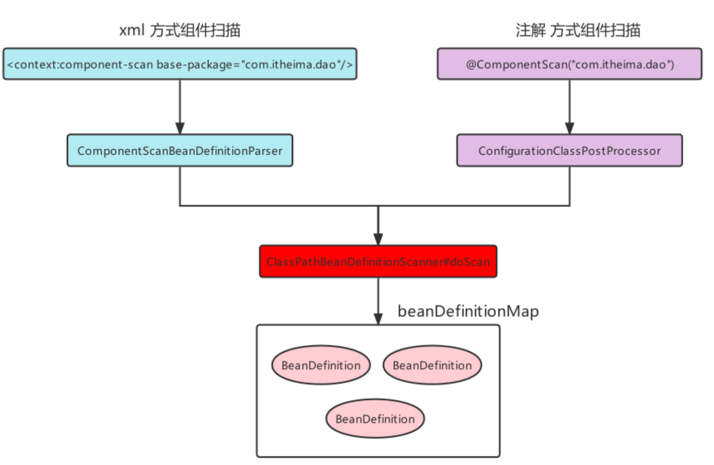

# @Configuration 配置类

| 名称     | 配置类 SpringConfig.class          | 配置文件 beans.xml             |
| -------- | ---------------------------------- | ------------------------------ |
| 配置方式 | @Configuration                     | `<beans>`                      |
| 容器     | AnnotationConfigApplicationContext | ClassPathXmlApplicationContext |

```java
@Configuration
public class ApplicationContextConfig {}
```

  

```java
//注解方式加载配置文件
AnnotationConfigApplicationContext applicationContext =  new AnnotationConfigApplicationContext(ApplicationContextConfig.class);
```

## @Profile 环境切换

| 注解 | @Profile                                                     |
| ---- | ------------------------------------------------------------ |
| 位置 | 类、方法                                                     |
| 作用 | 标注当前产生的Bean从属于哪个环境。<br />没有被@Profile标注的，都是默认处于激活的环境中。 |

> 只有激活了当前环境，被标注的Bean才能被注册到Spring容器里。
> 不指定环境的Bean，任何环境下都能注册到Spring容器里。

```java
@Repository("userDao")
@Profile("test")
public class UserDaoImpl implements UserDao{}

@Component
public class OtherBean {
    @Bean("service")
    @Profile("test")
    public UserService userService(@Qualifier("userServiceImpl") UserService userService) {
        return userService;
    }
}
```

| 激活环境 | 语句                                                         |
| -------- | ------------------------------------------------------------ |
| JVM      | ` -Dspring.profiles.active=环境名`                           |
| 代码     | `System.setProperty("spring.profiles.active","环境名")`<br />必须在创建Spring容器前。 |

- 默认激活最外层的`<beans>`；如果激活了子级的`<beans>`，则其父级也被激活。即：如果激活了最内层的`<beans>`则依次向外激活直到最外层的`<beans>`也被激活。（向外扩散激活）
- 如果外层和内存的`<beans>`存在相同id或class的`<bean>`，在二者都被激活的情况下，如果是getBean(id)或getBean(class)会出错。

## @Import 导入配置类

> 第三方框架与Spring整合注解方式很多是靠@Import注解完成的。

| 注解     | @Import                                                      |
| -------- | ------------------------------------------------------------ |
| 位置     | 配置类                                                       |
| 作用     | 加载其他配置类                                               |
| 导入类型 | 普通的配置类<br />实现ImportSelector接口的类<br />实现ImportBeanDefinitionRegistrar接口的类 |

```java
@Configuration
@ComponentScan
@PropertySource("classpath:jdbc.properties")
@Import(OtherConfig.class)
public class ApplicationContextConfig {}
```

### ImportSelect接口实现类

```java
public interface ImportSelector {
    //封装了需要被注册到Spring容器中的Bean的全限定名
    String[] selectImports(AnnotationMetadata importingClassMetadata);

    @Nullable
    default Predicate<String> getExclusionFilter() {
        return null;
    }
}
```

| 方法               | public String[] selectImports(AnnotationMetadata importingClassMetadata) |
| ------------------ | ------------------------------------------------------------ |
| AnnotationMetadata | 注解的媒体数据（当前@Import标注类上的其他注解(@Configuration等)的元信息）。 |
| String[]           | 封装需要被注册到Spring容器中的Bean的全限定名。<br />全限定名在该数组内的类即使没有被@Component标注，也会被注册到Spring容器中，以全限定名为beanName。而已经被@Component标注的，按@Component注解来注册。 |

```java
public class MyImportSelector implements ImportSelector {
    @Override
    public String[] selectImports(AnnotationMetadata importingClassMetadata) {
        Map<String, Object> annotationAttributes = importingClassMetadata.getAnnotationAttributes(ComponentScan.class.getName());
        //根据其他注解的属性名来获取信息：如@ComponenetScan的@AliasFor("basePackages")
        String[] basePackages = (String[]) annotationAttributes.get("basePackages");
        for (String page : basePackages) {
            System.out.println(page);
        }

        //返回的数组封装了需要被注册到Spring容器中的Bean的全限定名
        //全限定名在该数组内的类：即使没有被@Component标注解，也会被注册到Spring容器中，以全限定名为beanName
        //被@Component标注的，按@Component注解来注册
        return new String[]{OtherBean.class.getName()}; //com.zjk.beans.OtherBean
    }


    @Override
    public Predicate<String> getExclusionFilter() {
        return ImportSelector.super.getExclusionFilter();
    }
}
```

```java
@Configuration
@ComponentScan("com.zjk")
@Import(MyImportSelector.class)
@MapperScan("com.zjk.mapper")
@PropertySource("classpath:jdbc.properties")
public class ApplicationContextConfig {
    ...
}
```

```java
public class OtherBean {}
```

### ImportBeanDefinitionRegistrar接口实现类

- @Import导入实现ImportBeanDefinitionRegistrar接口的类，其**registerBeanDefinitions()** 方法会被自动调用，在该方法内可以注册BeanDefinition。

```java
public interface ImportBeanDefinitionRegistrar {
    default void registerBeanDefinitions(AnnotationMetadata importingClassMetadata, BeanDefinitionRegistry registry, BeanNameGenerator importBeanNameGenerator) {
        this.registerBeanDefinitions(importingClassMetadata, registry);
    }

    default void registerBeanDefinitions(AnnotationMetadata importingClassMetadata, BeanDefinitionRegistry registry) {
    }
}
```

```java
public class MyImportBeanDefinitionRegistrar implements ImportBeanDefinitionRegistrar {
    @Override
    public void registerBeanDefinitions(AnnotationMetadata importingClassMetadata, BeanDefinitionRegistry registry) {
        //注册BeanDefinition
        //1.创建RootBeanDefinition
        BeanDefinition beanDefinition = new RootBeanDefinition();
        beanDefinition.setBeanClassName(OtherBean.class.getName());
        //2.注册到BeanDefinitionMapper
        registry.registerBeanDefinition("OtherBean",beanDefinition);
    }
}
```

```java
@Configuration
@ComponentScan("com.zjk")
@Import({MyImportSelector.class, MyImportBeanDefinitionRegistrar.class})
@MapperScan("com.zjk.mapper")
@PropertySource("classpath:jdbc.properties")
public class ApplicationContextConfig {...}
```

## @ComponentScan 组件扫描

| 注解 | @ComponentScan                                               |
| ---- | ------------------------------------------------------------ |
| 位置 | 配置类                                                       |
| 作用 | 指定一个或多个包名：扫描指定包及其子包下标记的类。<br />不配置包名：扫描当前@ComponentScan标注类所在包及其子包下的类。 |
| 扫描 | 精确范围。<br />过滤器：excludeFilters、includeFilgters。    |

```java
@Configuration
@ComponentScan("com.zjk")
public class ApplicationContextConfig {
}
```

```java
@Configuration
@ComponentScan({"com.zjk.service","com.zjk.dao"})
public class ApplicationContextConfig {
}
```

| 过滤器          | 说明                                 |
| --------------- | ------------------------------------ |
| excludeFilters  | 设置扫描加载bean时，排除的过滤规则。 |
| includeFilgters | 加载指定的bean。                     |

| type属性        | 过滤                      |
| :-------------- | :------------------------ |
| ANNOTATION      | 注解                      |
| ASSIGNABLE_TYPE | 指定的类型                |
| ASPECTJ         | Aspectj表达式（基本不用） |
| REGEX           | 正则表达式                |
| CUSTOM          | 自定义规则                |

```java
@ComponentScan(value = "com.zjk",
        excludeFilters = @ComponentScan.Filter(
                type = FilterType.ANNOTATION, //指定注解类型的Bean
                classes = Controller.class //排除指定注解的Bean
        )
)
```

  

- component-scan是一个context命名空间下的自定义标签，要找到对应的命名空间处理器（NamespaceHandler）和解析器，查看spring-context包下的spring.handlers文件。将标注的@Component的类生成的对应的BeanDefiition进行注册。

```xml
<context:conponent-scan base-package="com.zjk"></context>
```


- AnnotationConfigApplicationContext在进行创建时，内部调用了如下代码，该工具注册了几个Bean后处理器。

```java
AnnotationConfigUtils.registerAnnotationConfigProcessors(this.registry)
```

- 其中，ConfigurationClassPostProcessor 是一个 BeanDefinitionRegistryPostProcessor，经过一系列源码调用，最终也被指定到了ClassPathBeanDefinitionScanner 的doScan 方法（与xml方式最终终点一致）。

  

      

## @PropertySource properties资源加载

| 注解 | @PropertySource            |
| ---- | -------------------------- |
| 位置 | 配置类                     |
| 作用 | 加载外部properties资源配置 |

```java
@Configuration
@ComponentScan
@PropertySource({"classpath:jdbc.properties","classpath:xxx.properties"})
public class ApplicationContextConfig {}
```

## @Primary 同类型注入优先

| 注解 | @Primary                                           |
| ---- | -------------------------------------------------- |
| 位置 | 类                                                 |
| 作用 | 标注相同类型的Bean优先被使用权。                   |
| 说明 | 搭配@Component/@Bean使用，标注该Bean的优先级更高。 |

> 通过类型获取Bean（getBean(class)）、@Autowired根据类型进行注入时，会选用优先级更高的Bean。
>
> @Qualifier指定名称注入，而不是优先级。

```java
@Repository
@Primary
public class UserDaoImpl implements UserDao{}
```

```java
@Bean
@Primary
public UserDao getUserDao01(){return new UserDaoImpl();}
```

# Bean

## 工厂实例化

| 实例化方式                       | 说明                                                         |
| -------------------------------- | ------------------------------------------------------------ |
| 静态工厂<br />（factory-method） | 配置一个工厂Bean，提供一个静态方法用于生产Bean实例，而不需要配置被生产的Bean。 |
| 实例工厂<br />（@Bean）          | 工厂对象调用非静态方法，先配置工厂Bean，再配置目标Bean。<br />实例化Bean对象时，先实例化工厂Bean对象，再通过工厂Bean对象调用getXxx()来获取Bean对象。 |
| FactoryBean接口                  | 延迟实例化Bean。                                             |

## @Bean 实例工厂

| 注解 | @Bean    |
| ---- | -------- |
| 位置 | 工厂方法 |
| 作用 | 。       |
| 说明 |          |

 

```java
@Component
public class OtherBean {
    @Bean
    public DruidDataSource dataSource(@Value("${jdbc.url}") String url,
                                      @Value("${jdbc.username}") String userName,
                                      @Value("1234") String password) {
        DruidDataSource dataSource = new DruidDataSource();
        dataSource.setUrl(url);
        dataSource.setUsername(userName);
        dataSource.setPassword(password);
        return dataSource;
    }

    @Bean
    public UserDao userDao(UserDaoImpl userDao){
        return userDao;
    }

    @Bean
    //@Autowired 可以省略@Autowired 
    public UserDao userService(@Qualifier("userDaoImpl2") UserDao dao) {
        //由于UserDao类型的Bean实例存在多个，需要使用@Qualifier指定注入的beanName
        return dao;
    }
}
```

## FactoryBean接口

```java
// 实现FactoryBean接口，再交给Spring管理即可
public interface FactoryBean<T> {
    String OBJECT_TYPE_ATTRIBUTE = "factoryBeanObjectType";
    T getObject() throws Exception; //获得实例对象方法
    Class<?> getObjectType(); //获得实例对象类型方法
    default boolean isSingleton() {
        return true;
    }
}
```

- Spring容器创建时，FactoryBean被实例化并存储到singletonObjects中，但getObject() 方法尚未被执行，UserDaoImpl也没被实例化，当首次用到UserDaoImpl时，才调用getObject() 。此工厂方式产生的Bean实例不会存储到singletonObjects中，而是存储到factoryBeanObjectCache中，之后每次使用到userDao都从该缓存池中获取同一个userDao实例。

   

```java
@Component
public class UserDaoFactoryBean implements FactoryBean<UserDao> {

    @Override
    public UserDao getObject() throws Exception {
        return new UserDaoImpl();
    }

    @Override
    public Class<?> getObjectType() {
        return UserDao.class;
    }

    @Override
    public boolean isSingleton() {
        return FactoryBean.super.isSingleton();
    }
}
```

