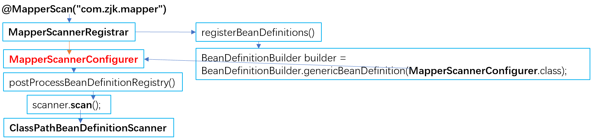

# 基础Mybatis

- [MyBatis](https://mybatis.net.cn)是持久层（DAO）框架、ORM框架。

>**持久层：负责将数据保持到数据库。**
>
>JavaEE三层架构：表现层、业务层、持久层。

```java
SqlSessionFactory sqlSessionFactory = new SqlSessionFactoryBuild()
    .build(Resources.getResourceAsStream("mybatis-config.xml")); //读取Mybatis配置文件
SqlSesison sqlSession = sqlSessionFactory.openSession();

UserMapper userMapper = sqlSession.getMapper(UserMapper.class);
List<User> userList = userMapper.selectAllUser();

sqlSession.close();
```

- Mybatis的基本执行流程：

1. 读取主配置文件mybatis-config.xml，获得运行环境和数据库连接。
2. 加载SQL映射文件Mapper.xml。
3. 根据主配置文件，SqlSessionFactoryBuild对象创建SqlSessionFactory对象。
4. 由SqlSessionFactory对象创建SqlSession对象，通过SqlSession对象进行CRUD操作（或者通过代理开发sqlSession.getMapper()进行CRUP操作的调用）。
5. Executor接口操作数据库。
6. 对输入参数进行映射，在执行SQL语句前，将输入的Java对象映射到SQL语句中。
7. 将输出结果映射为Java对象。 

## 配置文件 mybatis-config.xml

<table>
    <tr>
        <th width="10%">configuration</th>
        <th width="90%" colspan="3">配置</th>
    </tr>
    <tr>
        <td>properties</td>
        <td colspan="3">属性</td>
    </tr>
    <tr>
        <td>setting</td>
        <td colspan="3">设置</td>
    </tr>
    <tr>
        <td>typeAliases</td>
        <td colspan="3">类型别名</td>
    </tr>
    <tr>
        <td>typeHandlers</td>
        <td colspan="3">类型处理器</td>
    </tr>
    <tr>
        <td>objectFactory</td>
        <td colspan="3">对象工厂</td>
    </tr>
    <tr>
        <td>plugins</td>
        <td colspan="3">插件</td>
    </tr>
    <tr>
        <td rowspan="4">enviroments</td>
        <td colspan="3">环境配置</td>
    </tr>
    <tr>
        <td width="10%" rowspan="3">environment</td>
        <td colspan="2">环境变量</td>
    </tr>
    <tr>
        <td width="10%">transactionManager</td>
        <td>事务管理器</td>
    </tr>
    <tr>
        <td>dataSource</td>
        <td>数据源</td>
    </tr>
    <tr>
        <td>databaseIdProvider</td>
        <td colspan="3">数据库厂商标识</td>
    </tr>
    <tr>
        <td colspan="3">mappers</td>
        <td colspan="3">映射器</td>
    </tr>
</table>

## mapper.xml SQL映射文件

### resultMap 字段-属性映射

- resultMap：字段名称与属性名称的映射，解决字段名称和实体类属性名称不一致的问题；若数据库表的字段名称和实体类的属性名称不一样，则不能自动封装数据。

```xml
<mapper namespace="com.zjk.mapper.BrandMapper">
    
    <!--<resultMap id="resultMap的ID" type="对应类型">-->
    <resultMap id="brandResultMap" type="brand">
        <!--<result column="表中的列名" property="对应类型的相应属性名"/>-->
        <result column="brand_name" property="brandName"></result>
        <result column="company_name" property="companyName"></result>
    </resultMap>
    
    <!--<select id="findAll" resultMap="resultMap的ID">-->
    <select id="findAll" resultMap="brandResultMap">
        select *
        from tb_brand;
    </select>
</mapper>
```

### 参数传递

- Mybatis提供了ParamNameResolver类来进行参数封装，Mybatis接口方法中可以接收各种各样的参数，MyBatis底层对这些参数进行不同的封装处理方式。

| 参数占位符 | 说明                                                     |
| ---------- | -------------------------------------------------------- |
| `#{}`      | 相当于预编译语句的`?`，参数传递时使用：`#{id}`           |
| `${}`      | 拼接SQL语句，存在SQL注入问题，表名或列名不固定时可以使用 |

> 参数类型 parameterType 可以忽略

| 特殊字符 | 说明                   |
| -------- | ---------------------- |
| 转义字符 | `&lt;`、`=`、`<`等     |
| CDATA区  | `<![CDATA[特殊字符]]>` |

```xml
<select id="selectByIdIn" resultMap="brandResultMap">
    SELECT *
    FROM tb_brand
    WHERE id <![CDATA[ <= ]]> #{id};
</select>
```

#### 单个形参传递

<table>
    <tr>
        <th width="15%">方法参数类型</th>
        <th width="85%" colspan="2">传递方式</th>
    </tr>
    <tr>
        <td width="15%"><span name="单个形参传递普通实体类">普通实体类</span></td>
        <td colspan="2">直接使用，属性名和sql参数占位符名称相一致即可</td>
    </tr>
    <tr>
        <td><span name="单个形参传递Map">Map</span></td>
        <td colspan="2">直接使用，属性名和sql参数占位符名称相一致即可</td>
    </tr>
    <tr>
        <td rowspan="5" width="15%">线性结构</td>
        <td colspan="2">封装为Map集合（相当于多参数方式接收单个参数）</td>
    </tr>
    <tr>
        <td colspan="2"><code>map.put("arg0", collection/list/数组); </code></td>
    </tr>
    <tr>
        <td width="15%">Collection</td>
        <td width="70%"><code>map.put("collection", collection/list);</code></td>
    </tr>
    <tr>
        <td>List</td>
        <td><code>map.put("list", list);</code></td>
    </tr>
    <tr>
        <td>数组</td>
        <td><code>map.put("array", 数组);</code></td>
    </tr>
    <tr>
        <td>普通类型</td>
        <td colspan="2">（String、基本数据类型等）直接使用</td>
    </tr>
</table>

#### 多个形参传递

<table>
    <tr>
        <th width="15%">方法参数类型</th>
        <th width="85%" colspan="2">传递方式</th>
    </tr>
    <tr>
        <td>@Param</td>
        <td colspan="2"><code>@Param("sql参数占位符名称")</code> 散装参数，指定每个方法参数对应SQL映射文件中的参数</td>
    </tr>
    <tr>
        <td><a href="#单个形参传递普通实体类">对象类型</a></td>
        <td colspan="2">传入设置好相应属性的对象，对象属性的名称必须和sql参数占位符内的名称一一对应（resultMap）</td>
    </tr>
    <tr>
        <td rowspan="4"><a href="单个形参传递Map">Map</a></td>
        <td colspan="2">传入一个Map（sql参数-属性值）</td>
    </tr>
    <tr>
        <td width="10%">key</td>
        <td width="75%">sql参数占位符的参数名，默认从arg0和param1作为key分别开始存放值</td>
    </tr>
    <tr>
        <td>value</td>
        <td>传入的属性值</td>
    </tr>
    <tr>
        <td colspan="2">可使用@Param替换Map集合中默认的arg键名：<br /><code>返回值类型 方法名(@Param("id") 参数类型 参数1, @Param("name") 参数类型 参数2)</code></td>
    </tr>
</table>


```java
// 散装参数 @Param("")
List<Brand> selectByCondition(@Param("status") int status, @Param("brandName") String brandName, @Param("companyName") String companyName);

// 对象参数
List<Brand> selectByCondition(Brand brand);

// map集合参数
List<Brand> selectByCondition(Map map);
```

```java
// 此时修改后的键名为：param1\~n、id、name（arg<n>被替换）
map.put("id", 值1);
map.put("name", 值2);
map.put("param1", 值1);
map.put("param2", 值2);
```

### [动态 SQL](https://mybatis.net.cn/dynamic-sql.html)

- 动态 SQL：sql语句会随用户输入或外界条件的变化而变化。

#### if 条件判断

```xml
<if test="逻辑表达式"> <!--该逻辑表达式中的变量为#{}内的参数名称-->
    部分sql语句
</if>
```

#### choose 单项选择

- choose：只会有一个满足条件的部分sql语句生效，当所有when的条件都满足时，只会选择第一个满足的when。（case\-when）

```xml
<choose>
    <when test="逻辑表达式">
        部分sql语句
    </when>
    <when test="逻辑表达式">
        部分sql语句
    </when>
    <otherwise><!--可省略该部分-->
        部分sql语句
    </otherwise>
</choose>
```

```xml
<select id="selectByConditionSingle" resultMap="brandResultMap">
    SELECT *
    FROM tb_brand
    WHERE
    <choose>
        <when test="status != null">
            status = #{status}
        </when>
        <when test="companyName != null and companyName != ''">
            company_name like #{companyName}
        </when>
        <when test="brandName != null and brandName != ''">
            brand_name like #{brandName}
        </when>
        <otherwise>
            1 = 1
        </otherwise>
    </choose>
</select>
```

#### foreach 循环

```xml
<!--collection 传入的数组 | item 数组内的属性 | separator 分隔符 | open\close 开始\结束符-->
<foreach collection="ids" item="id" separator="," open="(" close=")">
    #{id}
</foreach>
```

- mapper.xml配置

```xml
<delete id="deleteByIds">
    DELETE FROM tb_brand
    WHERE id IN
    <foreach collection="ids" item="id" separator="," open="(" close=")">
        #{id}
    </foreach>
</delete>
```

- mapper接口

```java
int deleteByIds(@Param("ids") int[] ids); 
// MyBatis默认将数组参数封装为一个Map集合，默认为array = 数组
// 可以通过@Param("新的key")的方式来将array修改为新的key，在<foreach>中的collection使用
```

#### where 谓词替代

- `<where>`替代sql语句中的WHERE子句：if（条件判断）通常搭配`<where>`来避免不满足条件而造成一些特殊sql语句的报错；或者`WHERE 1 = 1` 作为WHERE语句的第一条，避免第一条WHERE子句的特殊性。
- `<where>`只会在子元素返回任何内容的情况下才插入 “WHERE” 子句，如果允许插入的第一个 “WHERE” 子句的开头为 “AND” 或 “OR”，则`<where>`会将这些不合法的 “AND” 或 “OR” 去除。

```xml
<select id="selectByCondition" resultMap="brandResultMap">
    SELECT *
    FROM tb_brand
    <where>
        <if test="status != null">
            status = #{status}
        </if>
        <if test="brandName != null and brandName != ''">
            AND brand_name like #{brandName}
        </if>
        <if test="companyName != null and companyName != ''">
            AND company_name like #{companyName}
        </if>
    </where>
</select>
```

#### set 动态更新

- `<set>`可以用于动态包含需要更新的列，忽略其它不更新的列

#### trim 自定义标签

- `<where>`的自定义类型`<trim>`

```xml
<trim prefix="WHERE" prefixOverrides="AND | OR ">
    
</trim>
```

- `<set>`的自定义类型`<trim>`

```xml
<trim prefix="SET" suffixOverrides=",">
    
</trim>
```

## Mapper映射接口

- 配置Mybatis映射的基本流程：

1. 定义与SQL映射文件同名的Mapper接口，并将Mapper接口和SQL映射文件分别放置在java和resources中对应的mapper目录（`classpath*:/mapper/**/*.xml`）
2. 设置SQL映射文件的nameSpace属性为Mapper接口全限定名。
3. 在Mapper接口中定义方法，方法名就是SQL映射文件中sql语句的id ，并保持参数类型和返回值类型一致。
4. 通过SqlSession对象的`getMapper(UserMapper.class)`方法来获取Mapper接口的对象，进行查询操作。

```java
UserMapper userMapper = sqlSession.getMapper(UserMapper.class);
List<User> list = userMapper.findAlL(); 
```

```xml
<!--SQL映射文件：mapper/UserMapper.xml-->
<mapper namespace="com.zjk.mapper.UserMapper">  
    <select id="findAll" resultType="com.zjk.pojo.User">
        SELECT *
        FROM tb_user;
    </select>
</mapper>   
```

```java
package com.zjk.mapper;

public interface UserMapper {
    public List<User> findAll(); //该方法名为SQL映射文件中对应的id
}
```

# Spring-Mybatis

## @MapperScan 映射扫描

- Spring可以通过Java配置类的方式来实现Mybatis配置文件的相同功能。

| 注解 | @MapperScan                                               |
| ---- | --------------------------------------------------------- |
| 位置 | 配置类                                                    |
| 作用 | 指明需要扫描的Mapper在哪个包下（MapperScannerConfigurer） |

```java
@Configuration
@ComponentScan("com.zjk")
@Import(OtherConfig.class)
@MapperScan("com.zjk.mapper")
@PropertySource("classpath:jdbc.properties")
public class ApplicationContextConfig {
    @Bean("dataSource")
    public DataSource dataSource(@Value("${jdbc.url}") String url,
                                 @Value("${jdbc.username") String username,
                                 @Value("${jdbc.password}") String password) {
        DruidDataSource dataSource = new DruidDataSource();
        dataSource.setUrl(url);
        dataSource.setUsername(username);
        dataSource.setPassword(password);
        return dataSource;
    }

    @Bean("sqlSessionFactoryBean")
    public SqlSessionFactoryBean sqlSessionFactoryBean(DataSource dataSource){
        SqlSessionFactoryBean sqlSessionFactoryBean = new SqlSessionFactoryBean();
        sqlSessionFactoryBean.setDataSource(dataSource);
        return sqlSessionFactoryBean;
    }

}
```

- @MapperScan的扫描原理：

```java
@Retention(RetentionPolicy.RUNTIME)
@Target({ElementType.TYPE})
@Documented
@Import({MapperScannerRegistrar.class})
@Repeatable(MapperScans.class)
public @interface MapperScan {
    String[] value() default {};
    String[] basePackages() default {};
    Class<?>[] basePackageClasses() default {};
    Class<? extends Annotation> annotationClass() default Annotation.class;
    // ... ...
}
```

1. @MapperScan通过MapperScannerRegistrar来加载MapperScannerConfigurer（`@Import({MapperScannerRegistrar.class})`）
2. MapperScannerRegistrar实现了ImportBeanDefinitionRegistrar接口，Spring会自动调用registerBeanDefinitions方法，该方法中又注册MapperScannerConfigurer类
3. MapperScannerConfigurer类扫描Mapper、向容器中注册Mapper对应的MapperFactoryBean

```java
public class MapperScannerRegistrar implements ImportBeanDefinitionRegistrar, 
ResourceLoaderAware {
    //默认执行registerBeanDefinitions方法
    void registerBeanDefinitions(AnnotationMetadata annoMeta, AnnotationAttributes annoAttrs, 
                                 BeanDefinitionRegistry registry, String beanName) {
        BeanDefinitionBuilder builder = 
            BeanDefinitionBuilder.genericBeanDefinition(MapperScannerConfigurer.class);
        //... 省略其他代码 ...
        //注册BeanDefinition
        registry.registerBeanDefinition(beanName, builder.getBeanDefinition());
    }
}
```

   

# [Mybatis-Plus](https://baomidou.com)

```xml
<groupId>com.baomidou</groupId>
<artifactId>mybatis-plus</artifactId>
<version>3.5.3.2</version>
```

> 任何能使用MyBatis进行 CRUD, 并且支持标准 SQL 的数据库。

 

## [Mybatis-Plus注解](https://baomidou.com/pages/223848/)

## 核心功能

### 代码生成器

- Mybatis-Plus代码生成器：默认使用元数据查询方式（DefaultQuery ）来生成代码，依赖数据库厂商驱动（通用接口）来读取元数据的方式。

```xml
<groupId>com.baomidou</groupId>
<artifactId>mybatis-plus-generator</artifactId>
```

### CRUD接口

| CRUD接口   | 说明                                  |
| ---------- | ------------------------------------- |
| BaseMapper | 通用CRUD接口，定义了大部分的SQL语句。 |
| IService   | 自定义CRUD接口。                      |

```java
public interface UserService extends IService{}
public class UserServiceImpl extends ServiceImpl<UserMapper, User> implements UserService{}
```

| CURD表达式条件参数                                        | 说明                                   |
| --------------------------------------------------------- | -------------------------------------- |
| \<T\> entity                                              | 对应的pojo类型。                       |
| Map\<String, Object\>  columnMap                          | key：字段<br />value：值               |
| Serializable id                                           | 主键 ID                                |
| Collection<? extends Serializable> idList                 | 主键 ID 列表。                         |
| Wrapper\<T\> queryWrapper<br />Wrapper\<T\> updateWrapper | 查询条件构造器。<br />更新条件构造器。 |
| IPage\<T\> page                                           | 分页查询条件。                         |
