- 函数式编程（functional programming，FP）：“是”什么，而非“做”什么

1. 只返回结果，且无（非故意的）副作用。例如对传入的变量进行修改的副作用等。
2. 引用透明，即独立且确定的。输出只受传入的参数的影响，而不受外界任何因素的影响；且相同的参数得到相同的结果。
3. 代换模型，任何函数调用或引用透明的表达式都可以直接使用对应的结果值来代替。
4. 高层次的抽象与重用。

- 函数定义域（源集）与陪域（目标集）：定义域内的所有元素都必须在陪域内有且仅有一个对应元素（对陪域没有限制）；在定义域里存在对应元素的陪域元素集被称为函数的像（image of the function）

 