# Thread 线程

- 一个进程中有多个线程，多个线程共享进程的堆和方法区，每个线程独立拥有程序计数器和栈。
- 线程是占用CPU执行的基本单位，CPU使用时间片轮转的方式让线程轮询占用，而线程的程序计数器记录当前线程让出CPU时的执行地址。只有执行Java代码时，程序计数器才记录下一条指令的地址，否则记录undefined地址（如native方法）。


 

## 线程创建与运行

- 每个线程都是通过某个特定Thread对象的run()方法来完成操作的，把run()方法的主体称为线程体。

- 调用start()方法启动线程，线程体run()方法由JVM调用（OS的CPU调度决定），如果直接调用run()方法则没有启动线程。一个线程对象只能调用一次start()方法启动，如果重复调用了，则将抛出“IllegalThreadStateException”。

### Thread

```java
MyThread myThread = new MyThread();
myThread.start();
```

```java
public class MyThread extends Thread{
    @Override
    public void run() {
        System.out.println(getName() + " is Running ...");
    }
}
```

### Runnable

```java
Thread runnableTask = new Thread(new RunnableTask());
runnableTask.start();
```

```java
public class RunnableTask implements Runnable{

    @Override
    public void run() {
        System.out.println(Thread.currentThread().getName() + " is Running...");
    }
}
```

### FutureTask

```java
FutureTask<String> futureTask = new FutureTask<>(new CallableTask());
Thread futureTaskThread = new Thread(futureTask);
futureTaskThread.start();
try {
    String result = futureTask.get();
    System.out.println(result);
} catch (InterruptedException e) {
    throw new RuntimeException(e);
} catch (ExecutionException e) {
    throw new RuntimeException(e);
}
```

```java
public class CallableTask implements Callable<String> {
    @Override
    public String call() throws Exception {
        return "Call ...";
    }
}
```

## 线程等待与通知

- java.lang.Object中编写了wait()、notify()、notifyAll()方法。


### wait(..) 线程等待

- 线程调用共享资源/监视器锁的wait()方法时，该线程会进入阻塞状态，并释放当前持有的监视器锁，直到以下事件发生：

1. notified：其他线程调用了该共享变量的notify()/notifyAll()方法；
2. interrupted：其他线程调用了该线程的interrupt()方法，该线程抛出InterruptedException后返回；
3. timing out：若wait(..)方法的参数不为0，则超时后自动唤醒，wait()实际调用wait(0)，一直等待；
4. spurious wakeup：虚假唤醒（应该避免）。

- 若线程调用监视器锁的wait()方法时，还没有获得该监视器锁，则抛出IllegalMonitorStateException。
- 线程调用共享资源的wait()方法后，只会释放该共享资源的锁，若该线程还持有其他共享资源的锁，则不会释放其他共享资源的锁。

```java
sychronized(obj){
    while(<conditions>){ //避免虚假唤醒
        obj.wait();
    }
}
```

### notify()/notifyAll() 唤醒线程

- 线程调用共享资源的notify()方法后，随机唤醒一个在该共享变量上调用wait(..)方法而挂起的线程。而notifyAll()会唤醒所有在该共享资源上由于调用wait(..)而挂起的线程集，此时，其他没有竞争到监视器锁的线程会等待拥有监视器锁的线程释放监视器锁，之后再次竞争监视器锁，而不需要再次notify()/notifyAll()来唤醒。
- 被唤醒的线程必须还要获取了共享资源的监视器锁后，才可以从wait(..)方法返回并继续执行。

## 等待线程终止 join(..)

- 当A线程在main线程内使用join(..)时，main线程要先等待A线程终止或超过等待时间之后，才能继续执行，且main线程仍然持有监视器锁。join()实际调用join(0)，一直等待完成。

```java
public final synchronized void join(long millis) throws InterruptedException { ... }
//join()执行时，main线程获取监视器锁（A线程本身）（join()由synchronized修饰）
while (isAlive()) {
    wait(0); //此时，main线程释放这一个监视器锁（A线程本身）并阻塞。
}
//JVM内ensure_join(this);中的lock.notify_all(thread);来唤醒main线程
```

```java
public void static main(String[] args){ 
    Thread A = new MyThread();

    A.start();

    System.out.println("wait util MyThread is Ok");

    try {
        A.join(); //由main线程执行A.join()
    }catch (Exception ex){
        ex.printStackTrace();
    }

    System.out.println("end when MyThread is Ok");
}
```

## 线程睡眠 sleep(..)

- 线程执行sleep(..)方法之后，暂时让出指定时间的执行权（不参与CPU调度），但仍然持有监视器锁。超时后，线程正常返回，并处于就绪状态。

## 线程让步 yield()

- 线程执行yield()方法之后，向调度器提示该线程愿意放弃CPU使用权。此时，该线程让出CPU使用权，处于就绪状态，由调度器从线程就绪队列中获取一个线程优先级最高的线程（也可能调度到该线程）来获取CPU使用权。

## 线程中断 interrupt(..)

- 线程中断是线程间的一种协作模式，设置线程的中断标志（interrupted）并不能直接终止线程的执行，而是由被中断的线程根据中断状态自行处理。

1. 除非当前线程正在中断自身（始终允许），否则将调用此线程的 checkAccess 方法，这可能会导致引发SecurityException。

2. 如果线程在调用wait(..)、join(..)、sleep(..)方法时被阻止，则其中断状态将被清除，并将收到InterruptedException。
3. 如果线程在InterruptibleChannel的IO操作中被阻塞，则通道将关闭，线程的中断状态将被设置，并且线程将收到 java.nio.channels.ClosedByInterruptException。
4. 如果线程在java.nio.channels.Selector中被阻塞，则设置该线程的中断状态，并立即从选择操作返回（可能具有非零值）
5. 如果上述条件均不成立，则将设置此线程的中断状态。（中断非活动线程不需要产生任何影响）

```java
private volatile boolean interrupted; //线程的中断标志

public void interrupt() {
    if (this != Thread.currentThread()) {
        checkAccess();

        // thread may be blocked in an I/O operation
        synchronized (blockerLock) {
            Interruptible b = blocker;
            if (b != null) {
                interrupted = true;
                interrupt0();  // inform VM of interrupt
                b.interrupt(this);
                return;
            }
        }
    }
    interrupted = true;
    // inform VM of interrupt
    interrupt0();
}

//返回线程的中断标志，并重置中断标志为false
public static boolean interrupted() {
    Thread t = currentThread();
    boolean interrupted = t.interrupted;
    if (interrupted) {
        t.interrupted = false;
        clearInterruptEvent();
    }
    return interrupted;
}

//返回线程的中断标志
public boolean isInterrupted() {
    return interrupted;
}
```

## 线程死锁

 

- 死锁的发生需要满足以下4个必要条件：

1. 互斥：线程对持有的资源的使用是排他的。
2. 请求并持有：线程已经持有资源，但提出了新的资源请求。
3. 不可剥夺：线程持有的资源只能由线程自己释放。
4. 环路等待：发生死锁时，必然存在线程\-\-资源的环形链。

- 死锁发生的条件中，只有"请求并持有"、"环路等待"可以被破坏。保持资源申请的有序性原则，即可避免死锁。

## 守护线程与用户线程

| 线程类型           | 区别                                                         |
| ------------------ | ------------------------------------------------------------ |
| 守护线程（deamon） | 最后一个非守护线程结束后，JVM会正常退出，而不管当前是否有守护线程正在执行 |
| 用户线程（user）   | 只要有一个用户线程还没结束，正常情况下，JVM就不会退出        |

- main线程运行结束之后，JVM会自动启动DestroyJavaVM线程，该线程等待所有用户线程结束后终止JVM进程。

- 若在线程启动（start）前调用setDeamon(true)，则将该线程设置为守护线程。

# ThreadLocal

- ThreadLocal（线程本地变量），每个访问该变量的线程都会拥有（复制）该变量的一个独立副本（地址都是一样的），每个线程对该变量的操作只影响自己的副本。

1. 首先，检查当前线程的ThreadLocalMap中是否已经存在该对象。如果存在，则直接返回对应的值。
2. 如果不存在，则查找父线程的ThreadLocalMap，直到找到该对象或者到达根线程（即主线程）。
3. 如果仍然没有找到该对象，则根据ThreadLocal对象的初始值来返回对应的值。

 


```java
//Thread的构造器中：
if (inheritThreadLocals && parent.inheritableThreadLocals != null)
    this.inheritableThreadLocals =
        ThreadLocal.createInheritedMap(parent.inheritableThreadLocals);
//只要父线程中有inheritThreadLocals，则子线程的inheritThreadLocals就一定不为null
```

# volatile关键字

1. 内存可见性：当一个线程修改了volatile变量的值，该变量的新值会立即被写回主内存，并通知其他线程所修改的值。其他线程读取该变量的值时会从主内存中重新加载，而不是从线程私有的缓存中读取。
2. 禁止指令重排序：编译器和处理器不会对volatile变量的读写操作进行指令重排序，保证了操作的顺序性。

3. 并不能保证原子性：如果一个操作依赖于变量的当前值，并且在多个线程之间进行修改，volatile仍然无法保证线程安全。
